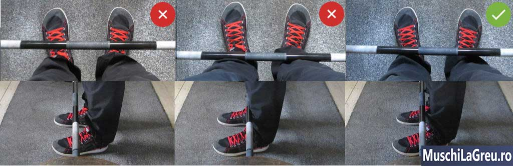
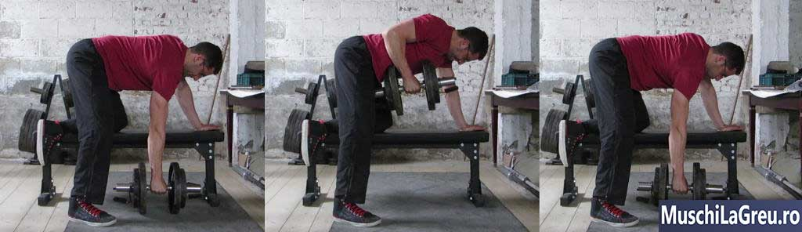

## Cum sa faci „Barbell Row”(Ramat cu bara) corect: Ghidul complet

.jpg>)
_Cum sa faci Barbell Row(Ramat cu bara) corect: ridicati bara de pe jos pana la piept, in timp ce sunteti aplecati_

Iata cum sa faceti Ramat cu bara in mod adecvat

1. Stati cu gleznele sub bara (postura medie)

2. Aplecati-va si apucati bara (palmele in jos, cu prindere medie)

3. Deblocati genunchii in timp ce va mentineti soldurile ridicate

4. Ridicati-va pieptul si indreptati-va spatele

5. Ridicati bara spre partea inferioara a pieptului

Lasati bara pe podea. Respirati. Indreptati-va spatele, inspirati adanc si tineti-va respiratia cateva momente. Apoi repetati exercitiul. Barbell Row, 5 seturi a cate 5 ridicari de bara.

Exercitiul compus Ramat cu bara(Barbell Row) antreneaza intreg corpul. Lucreaza atat partea superioara, cat si cea inferioara a spatelui, soldurile si bratele. Formeaza un spate mai puternic si musculos, dar si bicepsi mai mari. Ramat cu bara(Barbell Row)este unul dintre cele mai eficiente exercitii pe care le puteti face ca sa va imbunatatiti genoflexiunile, ridicatul de greutati pe banca si cel din picioare.

Pentru a evita durerea de spate, mentineti partea inferioara a acestuia relaxata. Nu il incordati, caci discurile coloanei vertebrale vor fi sub presiune. Nu tine bara in aer intre ture, caci spatele va va obosi si incorda. Lasati bara pe podea intre ture. Nu va incordati partea inferioara a spatelui inainte de a incepe urmatoarea tura de Barbell Row.

Este foarte usor sa gresiti exercitiul Barbell Row. Puteti ridica greutati mai mari, folosindu-va de solduri. Insa partea superioara a spatelui ar trebui sa fie cea mai lucrata. Daca trunchiul vi se ridica prea sus fata de linia orizontala, greutatea este prea mare. Ridicati greutati ca sa lucrati partea superioara, nu soldurile. Exercitiul Barbell Row nu se aseamana cu ridicarea obisnuita a greutatilor.

Acesta este ghidul complet pentru realizarea exercitiului Barbell Row.

Cuprins

   <ul class="contents-ul">
      <li style="list-style:none;">
         <a style="font-size:16px;" href="#introducere"> 1 Introducere</a>
         <ul style="list-style:none; margin-top:0; margin-bottom:0;">
            <li style="list-style:none; margin-bottom:0;"><a style="font-size:16px;" href="#Cum-se-realizeaza-Barbell-Row">1.1 Cum se realizeaza Barbell Row</a></li>
            <li style="list-style:none; margin-bottom:0;"><a style="font-size:16px;" href="#Pozitia-Barbell-Row-">1.2 Pozitia Barbell Row 101</a></li>
            <li style="list-style:none; margin-bottom:0;"><a style="font-size:16px;" href="#Muschii-lucrati">1.3 Muschii lucrati</a></li>
            <li style="list-style:none; margin-bottom:0;"><a style="font-size:16px;" href="#Protejarea-portiunii-inferioare-a-spatelui">1.4 Protejarea portiunii inferioare a spatelui</a></li>
            <li style="list-style:none; margin-bottom:0;"><a style="font-size:16px;" href="#Videoclipuri-cu-Barbell-Row">1.5 Videoclipuri cu Barbell Row</a></li>
         </ul>
      </li>
      <li style="list-style:none;">
         <a style="font-size:16px;" href="#Tehnica-Barbell-Row">2. Tehnica Barbell Row</a>
         <ul style="list-style:none; margin-top:0; margin-bottom:0;">
            <li style="list-style:none; margin-bottom:0;"><a style="font-size:16px;" href="#Postura">2.1 Postura</a></li>
            <li style="list-style:none; margin-bottom:0;"><a style="font-size:16px;" href="#Picioarele">2.2 Picioarele</a></li>
            <li style="list-style:none; margin-bottom:0;"><a style="font-size:16px;" href="#Prinderea">2.3 Prinderea</a></li>
            <li style="list-style:none; margin-bottom:0;"><a style="font-size:16px;" href="#Latimea-prinderii">2.4 Latimea prinderii</a></li>
            <li style="list-style:none; margin-bottom:0;"><a style="font-size:16px;" href="#Incheieturile">2.5 Incheieturile</a></li>
            <li style="list-style:none; margin-bottom:0;"><a style="font-size:16px;" href="#Coatele">2.6 Coatele</a></li>
            <li style="list-style:none; margin-bottom:0;"><a style="font-size:16px;" href="#Trunchi">2.7 Trunchi</a></li>
            <li style="list-style:none; margin-bottom:0;"><a style="font-size:16px;" href="#Partea-inferioara-a-spatelui">2.8 Partea inferioara a spatelui</a></li>
            <li style="list-style:none; margin-bottom:0;"><a style="font-size:16px;" href="#Genunchii">2.9 Genunchii</a></li>
            <li style="list-style:none; margin-bottom:0;"><a style="font-size:16px;" href="#Solduri">2.10 Solduri</a></li>
            <li style="list-style:none; margin-bottom:0;"><a style="font-size:16px;" href="#Piept">2.11 Piept</a></li>
            <li style="list-style:none; margin-bottom:0;"><a style="font-size:16px;" href="#Umeri">2.12 Umeri</a></li>
            <li style="list-style:none; margin-bottom:0;"><a style="font-size:16px;" href="#Cap">2.13 Cap</a></li>
            <li style="list-style:none; margin-bottom:0;"><a style="font-size:16px;" href="#Urcarea">2.14 Urcarea</a></li>
            <li style="list-style:none; margin-bottom:0;"><a style="font-size:16px;" href="#Coborarea">2.15 Coborarea</a></li>
            <li style="list-style:none; margin-bottom:0;"><a style="font-size:16px;" href="#Respiratia">2.16 Respiratia</a></li>
            <li style="list-style:none; margin-bottom:0;"><a style="font-size:16px;" href="#Intre-Repetari">2.17 Intre Repetari</a></li>
         </ul>
      </li>
      <li style="list-style:none;">
         <a style="font-size:16px;" href="#Probleme-comune">3. Probleme comune</a>
         <ul style="list-style:none; margin-top:0; margin-bottom:0;">
            <li style="list-style:none; margin-bottom:0;"><a style="font-size:16px;" href="#Durere-de-spate-inferioara">3.1 Durere de spate inferioara</a></li>
            <li style="list-style:none; margin-bottom:0;"><a style="font-size:16px;" href="#Lovirea-genunchiilor">3.2 Lovirea genunchiilor</a></li>
            <li style="list-style:none; margin-bottom:0;"><a style="font-size:16px;" href="#Trisarea">3.3 Trisarea</a></li>
         </ul>
      </li>
      <li style="list-style:none;">
         <a style="font-size:16px;" href="#Variatii-Barbell-Row">4. Variatii Barbell Row</a>
         <ul style="list-style:none; margin-top:0; margin-bottom:0;">
            <li style="list-style:none; margin-bottom:0;"><a style="font-size:16px;" href="#Pendlay-Rows">4.1 Pendlay Rows</a></li>
            <li style="list-style:none; margin-bottom:0;"><a style="font-size:16px;" href="#Yates-Rows">4.2 Yates Rows</a></li>
            <li style="list-style:none; margin-bottom:0;"><a style="font-size:16px;" href="#T-Bar-Rows">4.3 T-Bar Rows</a></li>
            <li style="list-style:none; margin-bottom:0;"><a style="font-size:16px;" href="#Machine-Rows">4.4 Machine Rows</a></li>
            <li style="list-style:none; margin-bottom:0;"><a style="font-size:16px;" href="#Dumbbell-Rows">4.5 Dumbbell Rows</a></li>
            <li style="list-style:none; margin-bottom:0;"><a style="font-size:16px;" href="#Inverted-Rows-(inversate)">4.6 Inverted Rows (inversate)</a></li>
         </ul>
      </li>
      <li style="list-style:none;">
         <a style="font-size:16px;" href="#Barbell-Row-vs-Cleans-Power">5.0 Barbell Row vs Cleans Power</a>
         <ul style="list-style:none; margin-top:0; margin-bottom:0;">
            <li style="list-style:none; margin-bottom:0;"><a style="font-size:16px;" href="#Barbell-Row-sunt-mai-sigure-decar-Power-Cleans">5.1 Barbell Row sunt mai sigure decar Power Cleans</a></li>
            <li style="list-style:none; margin-bottom:0;"><a style="font-size:16px;" href="#Forma-corecta-pe-Barbell-Rows-este-mai-usoara-decat-Power-Cleans">5.2 Forma corecta pe Barbell Rows este mai usoara decat Power Cleans</a></li>
            <li style="list-style:none; margin-bottom:0;"><a style="font-size:16px;" href="#Cele-mai-multe-sali-de-sport-nu-au-echipament-pentru-Power-Clean">5.3 Cele mai multe sali de sport nu au echipament pentru Power Clean</a></li>
            <li style="list-style:none; margin-bottom:0;"><a style="font-size:16px;" href="#Barbell-Rows-construiesc-mai-mult-muschiul-corpului-superior">5.4 Barbell Rows construiesc mai mult muschiul corpului superior</a></li>
            <li style="list-style:none; margin-bottom:0;"><a style="font-size:16px;" href="#Exista-modalitati-mai-usoare-de-a-construi-explozivitate">5.5 Exista modalitati mai usoare de a construi explozivitate</a></li>
            <li style="list-style:none; margin-bottom:0;"><a style="font-size:16px;" href="#Power-Clean-ul-nu-va-va-imbunatati-Deadlifts-ul">5.6 Power Clean-ul nu va va imbunatati Deadlifts-ul</a></li>
            <li style="list-style:none; margin-bottom:0;"><a style="font-size:16px;" href="#Atunci-fara-Power-Clean?">5.7 Atunci fara Power Clean?</a></li>
         </ul>
      </li>
   </ul>

## Introducere

## Cum se realizeaza Barbell Row

.jpg>)
_Cum se realizeaza Barbell Row. Bara sta pe podea la fiecare inceput de tura. Se intoarce pe podea dupa fiecare tura._

Barbell Row se incepe cu bara pe podea. Si bara se intoare la podea dupa fiecare tura. Nu veti tine bara suspendata in aer intre repetitii (acelea sunt [Yates-Rows](#Yates-Rows)). Ridicati de pe podea ca sa aveti spatele relaxat, sa puteti respira si sa va folositi muschii soldurilor. Forma corecta a Barbell Row este asemanatoare cu Deadlift. Fiecare repetitie incepe si se termina pe podea. Aici este metoda coprecta de a face Barbell Row in 5 pasi:

1. Mergeti la bara. Stati cu talpile sub bara, nu o atingeti cu gleznele. Stati aplecati, cu varfurile degetelor inainte.
2. Apucati bara. Folositi o Priza de lungime medie. Mai ingust decat la Bench Press si mai larg decat la Deadlift
3. Deblocati genunchii. Stati cu soldurile mai ridicate decat la Deadlift. Indoiti-va genunchii si tineti-i in spate, incat sa nu ii loviti cu bara
4. Ridicati-va pieptul. Indreptati-va spatele. Nu miscati bara. Nu coborati soldurile. Nu va incordati umerii.
5. Ridicati bara. Inspirati adanc, tineti-va respiratia si ridicati bara la abdomen. Ghidati-va dupa coate si ridicati-le sprfe tavan.

Va puteti ridica pieptul pentru a ridica greutati mai mari. Insa Barbell Row se poate transforma astfel in Deadlift. Daca pieptul este ridicat la mai mult de 15 grade fata de orizontala, atunci greutatea este prea mare. Astfel, scurtati traiectoria miscarii, pentru a fi mai usor. Este precum ati transforma genoflexiunile in jumatati de genoflexiuni. Partea superioara a spatelui este mai putin lucrata, ceea ce transforma Barbell Row intr-un exercitiu ineficient de intarire a puterii si de prelucrare a muschilor. Micsorati greutatea pentru a pastra trunchiul aplecat.

## Pozitia Ramat cu bara(Barbell Row) 101

-101.jpg>)

Forma corpului vostru va determina modalitatea cea mai eficienta de a realiza Ramat cu bara(Barbell Row). Persoanele cu bratele scurte trebuie sa apuce bara la o distanta mai mica a palmelor fata de restul persoanelor cu brate mai lungi, ca mine. Nu imitati tehnica altei persoane de a face Barbell Row, doar daca aveti aceeasi forma a corpului. Urmati aceste indicatii generale si adaptati-le dupa ce acumulati experienta.

- **Traiectoria barei** Linie verticala de la gamba la abdomen
- **Bara** Pe podea, deasupra talpilor, la inceputul fiecarui set
- **Pozitia** palmelor medie, mai mare decat las Deadlifts, mai mica decat la Squats
- **Picioare** Talpa lipita complet pe podea, miscati degetele 30 de grade spre exterior
- **Genunchi** Deblocati, impinsi spre exterior, incat bara sa nu ii loveasca
- **Priza** Puternica, ambele palme spre voi, bara tinuta cu putere, stransa in palme
- **Lungimea Prizei** medie, mai mica decat la Benc Press si mai mare decat la Deadlifts
- **Incheieturile** drepte, pentru a evita durerea, tineti bara cu putere si strangeti-o intre palme
- **Coate** incordate in partea de jos, impingeti-le spre tavan si mai apoi spre trunchi
- **Pieptul** ridicat pentru a evita dureri ale spatelui
- **Umerii** aplecati deasupra barei
- **Muschii** umerilor incordati
- **Capul** aliniat cu restul coloanei vertebrale, nu priviti nici in sus, nici in jos
- **Trunchiul** orizontal fata de podea, poate fi ridicat nu mai mult de 15 grade
- **Partea inferioara** a spatelui relaxata, cu o arcuire naturala
- **Soldurile** mai ridcate decat la Deadlifts, nu prea aplecate, caci bara va lovi genunchii si gleznele
- **Amplasarea** bara deasupta talpilor, umerii deasupra barei, soldurile ridicate, genunchii indoiti, spatele relaxat
- **Respiratia** Inspirati adanc la inceput, tineti respiratia pana terminati ridicare, inspirati/expirati doar in pozitie initiala
- **Ridicarea** impingeti coatele spre tavan, pastrati genunchii incordati, ridicati trunchiul la maxim 15 grade
- **Sus** bara la nivelul soldurilor, coatele in spatele trunchiului, trunchiul rtidicat putin deasupra orizontalei
- **Intre repetari** Bara pe podea, odihniti-va cateva momente, incordati-va si ridicati iar
- **Coborarea** Jos coborati bara rapid, dar controlat, genunchii raman in aceeasi pozitie

## Muschii lucrati

Ramat cu bara(Barbell Row) lucreaza muschi pe care in mare parte nu ii vedeti. Cand stati in fata oglinzii dimineata, prima data observati pieptul, mainile si abdomenul.De aceea majoritatea oamenilor se axeaza pe acestea si ignora muschii spatelui si ai picioarelor. De asemena duce la un fizic dezechilibrat. Un piept mare fara spate este ciudat. Exerseaza Barbell Row pentru a arata bine atat din fata, cat si din spate. Veti lucra urmatorii muschi:

- **Partea superioara a spatelui** Trebuie sa trageti omoplatii inapoi in partea de sus pentru a duce bara la piept. Acest lucru exerseaza cel mai larg muschi al spatelui care va ofera o forma in v: lats-ul dvs. (latisimus dorsi). Exerseaza, de asemnea, toti muschii superiori

- **Partea inferioara a spatelui** Portiunea de jos a coloanei vertebrale trebuie sa ramana relaxata, pentgru a evita rani la nivelul discurilor. Gravitatia va incerca sa va indoaie spatele prin a trage bara in jos. Rezistand acestei forte, muschii de-a lungul coloanei se vor intari. Acestia protejeaza coloana de rani.

- **Muschii abdominali** Sustin spatele si pastreaza coloana neutra. Astfel se intaresc ”patratelele”, muschi care se intind de-a lungul abdomenului, ”rectus abdomini”. Intarirea unui muschi duce la cresterea masei acestuia. Cu alimentatia corespunzatoare, efectul este vizibil.

- **Soldurile** Muschii bazinului lucreaza cand trunchiul este ridicat, pentru a ridca bara de pe podea. Dar functioneaza, de asemenea, pentru a pastra spatele relaxat. Barbell Row ajuta la intarirea muschilor soldurilor, folosind contractii atat dinamice, cat si statice.

- **Brate** Muschii antebratelor lucreaza pentru a tine bara in timp ce faceti Ramat cu bara(Barbell Row). Bicepsii lucreaza pentru ca sa va indoaie coatele si sa ridice greutatea. Tricepsul lucreaza pentru a aduce bratul catre trunchio (osul este atasat omoplatului)

Barbell Row este mai mult decat un exercitiu pentru muschii spatelui. Nu trebuie sa va atacati spatele din toate partile ca un antrenor cu diferite exercitii complexe. Astfel se pastreaza o greutate joasa, prin izolarea muschilor. Ramat cu bara(Barbell Row) si Deadlifts sunt mai eficiente in a va face mai puternici si sa adauge masa musculara. Va antreneaza intreg spatele cu greutati mai mari.

## Protejarea portiunii inferioare a spatelui

-101.jpg>)
_Stanga spatele rotunjit, rau pentru coloana vertebrala , mijloc spatele arcuit excesiv, de asemenea rau pentru spate, dreapta spate relaxat, cea mai sigura modalitate pentru Barbell Row_

Ramat cu bara(Barbell Row), realizat corect, ajuta la antrenarea muschilor spatelui. Facut gresit, va rani muschii inferiori ai spatelui. Nu faceti Barbell Row cu spatele rotunjit, nu-l arcuiti in exces, prin ridicarea soldurilor. Ambele modalitati constrand vertebrele si pot cauza rani precum hernia de disc. Pastrati spatele relaxat. Realizati Ramat cu bara(Barbell Row) cu o postura naturala, precum ati sta in picioare si veti fi in siguranta.

Cum ramane cu forta bruta? Pastrarea trunchiul orizontal in timpul realizarii Barbell Row exercita o forte in directii opuse pe coloana vertebrala. Este o forta verticala pe de o parte si una orizontala pe cealalta parte. Aceasta forta bruta reprezinta motivul pentru care unii oameni va vor spune sa va ridicati trunchiul si sa faceti, im schimb, [Yates-Rows](#Yates-Rows). Gandirea lor este ca forta bruta exercitata in timpul realizarii Ramat cu bara(Barbell Row) poate cauza alunecari ale discurilor vertebrale – o conditie destul de grava a spatelui...

Insa oricine a facut Barbell Row stie ca nu exista riscul de alunecare a discurilor. Muschii trunchiului se contracta cand realizati Barbell Row. Contractia muschilor inconjoara coloana vertebrala. O protejeaza de forta bruta.

De altfel, in ”Anatomie fara bisturiu”, dr Lon Kilgore a scris ca este nevoie de 152 kg de presiune pentru ca discurile unui cadavru sa alunece. Oamneii ingrijorati de aceasta forta nu vor face Barbell Row cu greutati atat de mari. Dar sa presupunem ca veti face voi asta. Va fi nevoie de o presiune si mai mare pentru ca discurile sa se deplaseze. Deoarece va puteti contracta muschii toracelui pentru a va proteja coloana vertebrala. Cadavrul nu poate face asta fiindca e mort.

Stresul are o reputatie proasta. Este comun ca in ziua de azi sa evitam situatiile stresante. Este, de asemenea, motivul pentru care majoritatea oamenilor sunt slabiti. Ceea ce nu folosesti, pierzi. Forta bruta face parte din viata de zi cu zi si din sport. Va veti apleca candva, cu soldurile ridicate – spre exemplu pentru a ridica ceva. Si este foarte probabil sa suferiti de dureri de spate, daca va petreceti viata incercand sa va protejati coloana vertebrala, decat daca v-ati antrena pentru a evita aceste rani.

Cea mai buna modalitate de a preveni ranirea la nivelul spatelui este de a antrena muschii acestuia. Si sa exersati pastrarea spatelui relaxat in timp ce ridicati greutatile de pe podea. Exercitii precum Dumbbell Rows, Inverted Rows, Machine Rows si Pullups nu antreneaza asta. Aceste exercitii lucreaza muschii umerilor, nu si restul spatelui. Numai Deadlifts si Barbell Row fac asta. Iar daca le faceti corect, veti antrena un spate puternic si sanatos.

## Videoclipuri cu Ramat cu bara(Barbell Row)

Aici este un video in care puteti vedea cum se realizeza Barbell Row in mod corect.

<iframe width="1100" height="825" src="https://www.youtube.com/embed/RQU8wZPbioA?feature=oembed" frameborder="0" allow="autoplay; encrypted-media" allowfullscreen=""></iframe>

## Tehnica Ramat cu bara(Barbell Row)

## Postura

**Postura medie**. Faceti Barbell Row cu gleznele mai departate decat la Deadlifts si mai apropiate decat la genoflexiuni. Postura exacta depinde de strangerea barei (detalii mai jos). Cu cat strangerea este mai apropiata, cu atat pozitia picioarelor trebuie sa fie mai apropiata, incat picioarele sa nu impinga bratele in timpul realizarii Barbell Row. Cu cat mainile sunt mai departate, cu atat picioarele trebui sa fie departate. Gleznele ar trebui sa fie mai departate decat soldurile, dar mai apropiate decat umerii.

## Picioarele

_Puneti picioarele deasupra mijloul talpii_

**Bara deasupra talpilor**. Porniti cu bara deasupra talpilor ca la Deadlifts. Acesta este punctul vostru de echilibru. Cea mai eficienta modalitate de a face Ramat cu bara(Barbell Row) este prin ridicarea barei de la podea la piept intr-o linie verticala cu punctul de echilibru. Daca bara sta deasupra degetelor, va va trage in fata si inafara punctului de echilibru. Sau se va intoarce deasupra talpii si va va lovi genunchii. Daca bara este prea apropiata de gambe, le va atinge.

**Talpa lipita de podea**. Intreaga talpa trfebuie sa stea lipita de podea in timpul realizarii Barbell Row. Aveti echilibru mai bun atunci cand stati pe toata talpa, in comparatie cu virful degetelor sau pe calcaie. Un echilibru mai bun duce la un control mai bun asupra barei si o tehnica mai buna. Astfel, nivelul eficacitatii creste, putand ridica greutati mai mari. Nu va ridicati calcaiele, caci va veti inclina in fata. Nu va ridicati nici degetele. Pastrati-va degetele, calcaiele si toata talpa pe podea.

**Degetele inafara, la 30 de grade**. Degetele trebuie sa fie in aceeasidirectie cu genunchii. Genunchii ar trebui sa fie indoiti, putin in lateral atunci cand faceti Ramat cu bara(Barbell Row). Nu pot fi in fata, caci se vor lovi de bara. Trebuie sa fie indoiti, ca sa nu stea in traiectoria barei. Indreptati-va degetele spre exterior pentru a va fi mai usor. Va veti opri din a va lovi genunchii si gambele cu bara atunci cind faceti Barbell Row, mai ales daca aveti coapse lungi, ca mine.

## Prinderea

-grip.jpg>>)
_Stanga prindere pe sub mana – periculoasa Mijloc prindere fara degetul mare – ineficienta Dreapta prindere completa – recomandata pentru Barbell Row_

**Prinderea completa.** Infasurati-va degetele mari in jurul barei. Puteti strange bara mai tare cand folositi prinderea completa. Cu cat strangeti bara mai tare, cu atat se poate misca mai putin in palmele voastre. Strangerea barei ajuta, de asemenea, la contractarea mai puternica a braelor si umerilor. Include mai multi muschi. Face ca greutatea sa fie ridicata mai usor prin Ramat cu bara(Barbell Row). Prinderea fara degetul mare te poate face sa ”simti” mai bine exercitiul. Dar nu e eficienta pentru a exersa cu greutati mari.

**Prindere dubla**. Apucati bara cu ambele palme indreptate spre voi. Nu o prindeti cu palmele indreptate spre tavan. Realizarea Barbell Row cu palmele in sus lucreaza mai mult bicepsii. O face, insa, prin punerea incheieturilor si a coatelor intr-o pozitie ciudata. Puteti avea cu usurinta dureri de incheieturi sau coate, mai ales daca prindeti bara departat ca la [Bench Press(Impinsul cu haltera de la piept)](/exercitii/piept/impinsul-cu-haltera-de-la-piept-bench-press), dar cu palmele in sus. Prindeti bara ca la Deadlifts, cu ambele palme in jos.

**Tineti bara jos**. Apucati bara aproape de degete, deasupra bataturilor principale. Nu o tineti in centrul palmei. Pielea mainilor se va strange intre bara si degetele voastre. Asta va durea mai tare si va provoca bataturi mai mari care se pot rupe. Tineti bara cat mai aproape de degete. Strangeti-o ca sa nu se poata misca. Aceasta modalitate poate parea mai slaba decat a tine bara in mijlocul palmei. Dati-i timp, nu va veti razgandi.

**Bandajele sunt acceptate**. Nu puteti face Barbell Row cu prindere mixta, deoarece daca o palma este spre tavan, incheietura si cotul vor fi iritate. Palmele trebuie sa fie indreptate in jos. Asta inseamna ca daca greutatea este prea mare ca sa fie ridicata, singurele voastre optiuni sunt creta, bandajele sau prinderea ca de carlig. Putini oameni vor face Ramat cu bara(Barbell Row) cu greutati atat de mari incat sa fie nevoie de aceste metode. Dar daca veti face asta, folositi bandajele doar la seturile grele. Faceti fara la seturile usoare, ca sa cresteti puterea in prindere.

## Latimea prinderii

-grip-width.jpg>)
_Prindeere ingusta vs larga, cu cat prinderea este mai lata, cu atat mai mult trunchiul coboara. Cu cat este mai ingusta, cu atat este mai mare posibilitatea de miscare._

**Prinderea medie**. Faceti Ramat cu bara(Barbell Row) cu o prindere mai ingusta decat la [Bench Press(Impinsul cu haltera de la piept)](/exercitii/piept/impinsul-cu-haltera-de-la-piept-bench-press), dar mai lata decat la Deadlifts. Apucand bara mai larg decat la Bench Press face ca greutatea sa fie mai usoara pentru Barbell Row. O prindere mai lata micsoreaza posibilitatea de miscare, prin inclinarea bratelor. De asemenea, coboara trunchiul si il poate pune mai jos decat linia orizontala fata de podea. Daca aveti brate scurte, o prindere larga poate cauza ca spatele sa se arcuiasca cind realizati Barbell Row.

**Prinde ingust daca spatele se arcuieste**. Daca spatele vi se arcuieste, micsorati-va prinderea cand faceti Ramat cu bara(Barbell Row). Asta va pune bratele vertical fata de podea. Va ridica trunchiul si il pastreaza orizontal cu podeaua. Greutatea va fi mai mare pentru Barbell Row deoarece posibilitatea de miscare este mai mare. Insa spatele va fi in siguranta. Micsorati-va, de asemenea, postura astfel incat picioarele sa nu impinga bratele cand ridicati greutatea de pe podea.

## Incheieturile

-wrists.jpg>)
_Stanga: T-Rex Rows cu incheieturile indoite. Dreapta: Barbell Rows cu incheieturile drepte._

**Incheieturile drepte**. Tineti-va incheieturile drepte atunci cand faceti Ramat cu bara(Barbell Row). Infasurati degetele in jurul barei folosind o prindere completa. Strangeti-o tare pana cand articulatiile va devin albe. Blocati incheieturile in pozitie, astfel incat sa aveti o linie dreapta de la coate la incheieturile mainii la bara. Nu lasati incheieturile sa se indoaie sau o sa va doara. Daca incheieturile sunt indoaite, prinderea este larga. Daca nu, greutatea este prea grea si trisati facand T-rex Rows.

**Nu faceti T-Rex Rows**. Un mod meschin de a trisa atunci cand faci Barbell Row este sa va indoiti incheieturile, in varf. In loc sa folosesti muschii spatelui pentru a ridica greutatea la piept, folosesti incheietura mainii. O indoiti inapoi in partea de sus pentru a obtine ultimii cativa cm / inci de miscare pe care nu o pot obtine muschii spatelui. Aceasta este considerata trisare (si te face sa arati ca un T-rex). Coborati greutatea si tineti-va incheieturile drepte inainte sa va doara.

## Coatele

-elbows.jpg>)
_Stanga: cotul prea ridicat, bara atinge pieptul prea sus. Mijlociu: coatele prea aproape de trunchi, ineficiente. Dreapta: coatele prabusite ca pe banca._

**Blocheaza in partea de jos**. Indoirea coatelor in partea de jos scurteaza intervalul de miscare. Coboara trunchiul si poate provoca rotunjirea spatelui inferior. De asemenea, construieste obiceiuri proaste pentru Deadlifts, inceperea fiecarei repetare cu coatele blocate este cruciala pentru a evita ranirea bicepsului. Indreptati-va bratele inaintea de a face Barbell Row cu greutatea. Coatele nu se te vor durea atata timp cat nu le extindeti. Spatele dvs. va fi intr-o pozitie mai sigura.

**In spatele trunchiui, in varf**. Atingeti pieptul cu bara tragand coatele in spatele trunchiului in partea de sus. Filmati-va din lateral pentru a va verifica forma. Daca coatele nu vin in spatele trunchiului, greutatea este prea grea. Nu va indoiti incheieturile pentru a aduce bara la piept. Nu va coborati pieptul pentru a atinge bara. Ambele sunt echivalente trisatului. Reduceti greutatea, astfel incat sa puteti trage coatele in spatele trunchiului.

**Trage cu coatele**. Barbell Rows nu sunt Reverse Curls. Greutatea este mai grea si bratele nu sunt suficient de puternice pentru a o ridica singura. Trebuie sa folositi muschii spatelui care sunt mai puternici. Nu incercati sa reduceti greutatea. Incepeti cu coatele drepte. Scoateti slack-ul din bara tragand de ea pana atinge partea superioara a orificiilor placii. Ridicati bara indoindu-va coatele si conducandu-le spre tavan. Trebuie sa ajunga in spatele trunchiului tau, in partea de sus.

**Trage-ti coatele**. Pastrati coatele la 75 ° in varf, ca atunci cand faceti [Bench Press(Impinsul cu haltera de la piept)](/exercitii/piept/impinsul-cu-haltera-de-la-piept-bench-press). Unghiul exact va depinde de constructie, de unghiul din spate, de prindere etc. Dar coatele nu pot fi perpendiculare pe trunchiul tau. Asta misca bara peste varful picioarelor si in afara echilibrului. Coatele nu-ti pot atinge trunchiul, deoarece asta misca bara prea aproape de picioare (le vei lovi). Deplasati bara peste mijlocul piciorului, impingandu-va coatele.

## Trunchi

-back-angle.jpg>)
_Stanga: trunchiul prea sus, transforma Barbell Rows in Deadlifts. Dreapta: trunchiul mai aproape de paralela, partea superioara a spatelui face cel mai mult efort._

**Orizontal**. Incepeti Barbell Rows cu trunchiul paralel cu podeaua. Ar trebui sa vezi o linie dreapta de la cap pana la solduri, privind din lateral. Aceasta linie ar trebui sa fie paralela cu podeaua. Daca soldurile sunt mai jos decat pieptul, iti indoiti prea mult picioarele. Indreptati genunchii pentru a va ridica soldurile. Daca pieptul este mai jos decat soldurile, coatele sunt indoite sau prinderea este prea larga. Fixeaza-le pentru a-ti mentine trunchiul orizontal.

**Ridicati la 15 ° Max**. Trunchiul tau se poate ridica atunci cand faci Barbell Row. Acest lucru face ca greutatea sa fie mai usor de ridicat prin implicarea muschilor soldului. Puteti ridica greutati mai mari daca mutati bara de pe podea deschizand soldurile. Trunchiul tau se va ridica atunci cand vei face acest lucru. Atata timp cat nu se ridica la mai mult de 15° peste orizontala, soldurile nu va vor indeparta prea mult de muschii din partea superioara a spatelui. Dar vei lucra cu greutati mai mari.

**Fara unghiuri de 45°!** Ridicarea trunchiului la 45 ° deasupra orizontalei este considerate trisare. Acesta transforma Barbell Rows in Deadlifts folosind prea mult solduri. Face greutatea mai usor de ridicat, micsorand efortului din partea spate. Soldurile va pot ajuta sa mutati bara de pe podea. Dar ei nu pot face toata munca. Daca nu va puteti impiedica trunchiul sa se ridicare mai mult de 15 ° peste orizontala, greutatea este prea mare. Micsorati greutatea, astfel incat sa va antrenati partea superioara a spatelui.

**Nu fi purist**. Nu poti trisa la Barbell Rows ridicand trunchiul cu 45 °. Dar nu poti incerca sa fii strict, pastrandu-l orizontal pe fiecare repetare. In orice caz, nu functioneaza. Trunchiul tau se va ridica intotdeauna cand lovesti pieptul cu bara din varf. Singura modalitate de a-l mentine orizontal este daca ramai cu greutati usoare. Dar greutatile usoare nu va consolideaza partea superioara a spatelui. Nu fi purist. Lasa-ti trunchiul sa se ridice. Limitati-va la 15 °.

## Partea inferioara a spatelui

-lower-back.jpg>)
_Mentineti-va spatele inferior neutru atunci cand faceti Barbell Row. Fara rotunjire sau arhivare in exces._

**Spatele inferior neutru**. Cea mai sigura cale de a face Ramat cu bara(Barbell Row) este cu partea inferioara a spatelui neutru. Aceasta nu inseamna un spate plat. Ar trebui sa ai un arc natural in partea inferioara a spatelui cand stai. Dar nu ar trebui sa o depasiti sau sa o lasati sa se roteasca. Ambele perforeaza discurile coloanei vertebrale si pot provoca leziuni la nivelul spatelui, precum hernia de disc. Incepeti cu spatele neutral inainte de a ridica greutatea de pe podea. Pastrati-l neutru pe tot parcursul ridicarii.

**Ridica-ti pieptul**. Cea mai usoara modalitate de a-ti impiedica spatele de la rotunjire este sa iti ridici pieptul. Pregatiti-va pentru Barbell Rows si ridicati-va pieptul ridicandu-l spre tavan. Acest lucru va va indrepta partea superioara a spatelui, urmand spatele inferior. Daca o faci corect, vei avea o linie dreapta incepand de la cap pana la solduri. Incordati-va muschiul dorsal (axile) pentru a va bloca pieptul in pozitie. Apoi inspirati si ridicati.

## Genunchii

**Deblocati**. Incepeti sa faceti Barbell Rows cu genunchii indoiti. Picioarele ar trebui sa fie aproape drepte, mai drepte decat pe Deadlifts, cu soldurile ridicate. Dar articulatia genunchiului dvs. ar trebui sa fie deblocata. Cu cat indoiti picioarele mai tare, cu atat este mai usor sa atingeti bara si sa o apucati. Cu cat indoiti mai putin picioarele, cu atat genunchii raman mai in spate si cu atat este mai putin probabil sa-i lovesti cu bara. Deblocheaza genunchii, dar tine picioarele cat mai drepte.

**Genunchii in exterior**. Nu faceti Barbell Rows cu genunchii inainte sau ii veti lovi cu bara. Tine-ti genunchii in afara drumului impingandu-i in lateral ca atunci cand faci genuflexiuni (Squats). Nu puteti face acest lucru daca picioarele sunt indreaptate spre fata. Configurati cu degetele de la picioare la 30 °. Apoi impingeti genunchii in aceeasi directie ca degetele de la picioare cand faceti Barbell Row. Bara va urca fara sa va loveasca genunchii. Mai ales daca ai coapsele lungi ca mine.

**Nu trisati cu genunchii**. Nu indreptati genunchii indoiti pentru ca bara sa se miste de pe podea. Iti poti folosi muschii soldului. Si unele miscari ale genunchiului sunt inevitabile atunci cand ridici cu greutati mai mari. Dar partea superioara a spatelui ar trebui sa faca cea mai mare parte a muncii. Daca genunchii se indreapta atunci cand bara se desprinde de podea si apoi ii reindoiti in partea de jos pentru a va cobora pieptul, greutatea este prea grea. Reduceti greutatea si faceti corect.

## Solduri

-hips.jpg>)
_Stanga: soldurile prea joase, ca in Deadlifts, te vei lovi de genunchi. Mijlociu: soldurile prea sus, spatele se va rotunji. Dreapta: soldurile inalte cu spatele orizontal._

**Solduri inalte**. Incepeti Barbell Rows avand soldurile inalte. Acestea ar trebui sa fie mai sus decat la Deadlifts. Inaltimea exacta depinde de constructia dvs. si de cat de mult va indoiti genunchii. Insa trunchiul tau ar trebui sa fie paralel cu podeaua, astfel incat muschii din partea superioara a spatelui sa faca cea mai mare parte a muncii. Si picioarele tale ar trebui sa fie aproape drepte pentru a-ti tine genunchii inapoi si in afara barei. Deblocati genunchii in timp ce va mentineti soldurile ridicate.

**Fara solduri joase**. Aplecarea peste solduri cu picioarele drepte poate fi dificila daca nu ai flexibilitate. Este posibil sa fiti nevoit sa va indoiti genunchii mai mult pentru a ajunge la bara. Dar tine minte, asta iti pune genunchii mai inainte. Este mai probabil sa-i lovesti cu bara, mai ales daca ai oasele coapselor mai lungi, asa ca mine. Incercati sa va mentineti soldurile cat de mult va permite flexibilitatea. Se va imbunatati pe masura ce continui sa faci Barbell Rows.

**Nu trisati cu soldurile**. Va puteti folosi muschii soldului ca sa faceti Ramat cu bara(Barbell Row) cu greutati mai mari. Le puteti deschide pentru a ridica bara mai usor de pe podea. Dar trunchiul tau nu se poate ridica mai mult de 15° peste orizontala. Daca o face, greutatea este prea grea. Partea superioara a spatelui trebuie sa faca cea mai mare parte a muncii, nu soldurile. Acestea sunt Barbell Rows, nu Deadlifts. Folositi-va soldurile. Dar nu trisati. Reduceti greutatea daca trunchiul dvs. creste prea mult peste orizontala.

## Piept

**Ridica-ti pieptul**. Partea inferioara a spatelui este mai putin probabila sa se rotunjeasca daca faceti Ramat cu bara(Barbell Row) cu pieptul in sus. Ridicati pieptul spre tavan atunci cand incepeti. NU incordati omoplatele in partea de jos. Incordati-va muschiul dorsal (axile) in loc sa va blocati pieptul in pozitie. Pieptul tau va cadea intre repetari. Ridicati-l din nou inainte de a face urmatoarea repetare. Acesta este motivul pentru care trebuie sa faci Barbell Row incepand de la podea la fiecare repetare: dvs. puteti utiliza o forma mai buna.

**Loviti-va pieptul**. Ridicati bara de pe podea in fata pieptul inferior. Pozitia exacta depinde de formarea, prinderea si unghiul din spate. Insa ar trebui sa mutati bara in linie verticala, deoarece acesta este cel mai eficient mod de a face Barbell Row. Si bara ar trebui sa inceapa peste piciorul de mijloc, deoarece acesta este punctul tau de echilibru. Daca se misca intr-o curba, lovesti pieptul prea sus sau prea jos. Sau bara nu este peste piciorul tau mijlociu in partea de jos.

**Nu o tineti in varf**. Nu trebuie sa tineti bara pe trunchi in partea de sus. Nu trebuie sa va strangeti omoplatii si partea superioara a spatelui pentru a va „simti” mai bine muschii. Pur si simplu trageti bara de la podea si atingeti-o pe pieptul inferior. Daca o faci corect, coatele tale vor sfarsi in spatele trunchiului in partea de sus. Asta inseamna ca partea superioara a spatelui si-a facut treaba de a ridica de la podea.

## Umeri

**In fata barei**. Incepeti sa faceti Barbell Rows cu umerii in fata barei. Acest lucru va va mentine trunchiul orizontal, soldurile inalte si genunchii inapoi. Inceperea cu umerii peste bara nu functioneaza. Soldurile tale vor ajunge prea inapoi, ceea ce nu ofera un echilibru bun. Sau genunchii sunt prea aplecati si in calea barei. Umerii tai trebuie sa fie in fata barei ca atunci cand faci Deadlift. Dar soldurile ar trebui sa fie mai sus, astfel incat trunchiul sa ramana orizontal.

## Cap

-head.jpg>)
_Nu va uitati in sus cand va faceti Barbell Row. Dar nici nu te uita la picioarele tale. Mentineti capul pe linie cu restul coloanei vertebrale._

**Cap pe aceeasi linie cu trunchiul**. Nu va uitati in sus cand faceti Barbell Row. Acest lucru perforeaza discurile coloanei vertebrale din gat si il poate rani. Nu te uita la picioarele tale si nici spatele nu se va rotunji. Mentineti capul pe linie cu restul coloanei vertebrale. Din lateral, ar trebui sa ai o linie dreapta de la cap la solduri. Daca acest lucru se simte ciudat, continuati sa exersati si aveti rabdare. Te vei obisnui cu ea si vei fi mai puternic fara sa-ti faci rau.

**Evitati oglinzile pentru a va verifica forma**. Este ineficient si determina o forma proasta. Nu-ti poti vedea spatele daca faci Ramat cu bara(Barbell Row) in fata oglinzilor. Si trebuie sa te uiti in sus ceea ce iti arcuieste gatul / spatele in exces si te poate rani. Si mai rau este Barbell Row deoparte cu oglinzile, iti vei intoarce capul pentru a-ti verifica forma. Acest lucru iti rasuceste gatul si il poate rani. Inregistrati-va pentru a va verifica forma. Antrenati-va departe de oglinda, pentru a evita o forma proasta.

## Urcarea

-way-up.jpg>)
_Faceti Barbell Row tragand bara de pe podea in timp ce trunchiul tau se ridica la 15 °. Conduceti cu coatele si trageti-le in spatele trunchiului, astfel incat bara sa va atinga pieptul._

**Trage cu coatele**. Incepeti cu bratele drepte si coatele blocate. Apoi trageti bara de pe podea tragand coatele spre tavan. Continuati sa trageti pana cand acestea se termina in spatele trunchiului dvs., in partea de sus. Nu incercati sa faceti Ramat cu bara(Barbell Row) cu greutatea doar indoind bratele. Nu sunt suficient de puternici pentru a ridica greutatea. Folositi-va muschii mai puternici ai spatelui, conducand cu coatele. Trageti-le inapoi si in spatele trunchiului.

**Foloseste-ti soldurile**. Deschideti soldul cand bara iese din podea. Folositi-va muschii mai puternici ai soldului pentru a obtine impuls in partea de jos. Genunchii nu trebuie sa se miste, doar soldurile. Daca faceti acest lucru corect, trunchiul dvs. se va ridica deasupra orizontalei. Apoi va ramane acolo in timp ce coatele se misca inapoi pentru a finaliza miscarea. Nu fiti stricti mentinandu-va trunchiul orizontal. Folositi-va soldurile pentru a putea face Barbell Row cu greutati mai mari.

**Loveste-ti pieptul inferior**. Pozitia exacta depinde de constructia si forma dvs. Dar bara trebuie sa se deplaseze vertical peste mijlocul piciorului, in timp ce trunchiul tau ramane orizontal. Lovirea pieptului superior este de obicei prea mare. Inseamna ca bara a inceput prea in fata si coatele sunt prea departe. Iti poti pierde echilibrul. De obicei, bara atine burta atunci cand iti ridici prea mult trunchiul. Acest lucru elimina munca muschilor din partea superioara a spatelui.

**Ridicati trunchiul la 15 ° Max**. Ar trebui sa va ridicati trunchiul atunci cand faceti Barbell Row. Acest lucru va permite sa ridicati greutati mai grele, antrenandu-va muschii mai puternici ai soldului. Dar trunchiul tau nu ar trebui sa se ridice la mai mult de 15 ° peste orizontala. Daca o face, iti lucrezi soldurile, nu partea superioara a spatelui. Vei transforma Barbell Rows in Deadlifts. Daca nu puteti ridica greutatea fara a va ridica trunchiul mai mult de 15 °, este prea grea. Micsoreaza greutatea.

## Coborarea

**Coborati repede bara**. Intoarceti rapid bara pe podea dupa te loveste/ atinge pieptul. Trebuie sa coboare mai repede decat a urcat. Nu coborati incet pentru a va simti mai mult muschii. Ii obosesti in urcare, acest lucru conteaza cel mai mult pe Barbell Rows (ca in Deadlifts). Aceasta nu inseamna ca ar trebui sa renunti la bara. Ar trebui sa o tii. Dar coborati repede. Faceti Ramat cu bara(Barbell Row) pe covorase de cauciuc pentru a reduce zgomotul placilor care lovesc podeaua.

## Respiratia

**Respirati in partea de jos**. Respirati puternic, mentineti-va respiratia si ridicati. Acest lucru creste presiunea in trunchi, va protejeaza spatele inferior si va mentine pieptul ridicat. Tensiunea arteriala va creste atunci cand va tineti respiratia. Dar va reveni la normal cand setul dvs. se va termina. Iar muschii mai puternici pe care ii construiti facand Barbell Rows cu greutati mai mari va vor scadea tensiunea arteriala. Micsorea efortul la care este supusa inima ta. Respirati puternic, mentineti, ridicati.

**Tine-ti respiratia in partea de sus**. Nu expirati in urcare sau in partea de sus a repetarii. Nu doriti sa pierdeti stabilitatea trunchiului, sa va rotiti spatele inferior si sa suferiti o leziune la nivelul coloanei vertebrale. Tine-ti respiratia pana cand greutatea este din nou pe podea. Daca simtiti ca lesinati, asteptati prea mult in partea de jos. Strangeti-va, respirati si ridicati greutatea. Nu asteptati mult timp pentru a ridica greutatea dupa ce ati luat o gura mare de aer.

## Intre Repetari

-floor.jpg>)
_Nu tineti greutatea in aer in timpul repetarilor dvs. Intoarceti bara pe podea la fiecare repetare._

**Greutate pe podea**. Placile trebuie sa atinga podeaua la inceputul fiecarei repetari. Trageti greutatea de pe podea la pieptul inferior, apoi intoarceti-o pe podea. Nu tineti bara in aer intre repetari. Partea inferioara a spatelui va obosi, se va rotunji si veti face Barbell Row cu o greutate mai mica. Intoarceti bara pe podea ca atunci cand faceti Deadlift. Profitati de pauza scurta intre repetari pentru a regla spatelui inferior neutrul, ridicati pieptul si respiratia.

**Nu salta**. Faceti Ramat cu bara(Barbell Row) cu greutate “moarta” dintr-un popas/ punct mort. Coborati bara pana la podea. Pauza o secunda. Seteaza-ti partea inferioara a spatelui neutru, incordeaza-te si respira. Apoi ridicati greutatea la pieptul inferior. Nu saltati greutatea de pe podea. Muschii trebuie sa ridice greutatea, nu reculul de pe placi.Faceti Barbell Row cu greutate moarta ca atunci cand faceti Deadlift. Acest lucru va fi mai greu. Dar veti construi o parte superioara a spatelui mai puternica si mai musculara.

## Probleme comune

## Durere de spate inferioara

-lower-back.jpg>)
_Facand Barbell Rows cu spatele neutru va preveni durerile de spate si ranile._

Forma proasta este principala cauza a durerilor de spate atunci cand faci Barbell Rows. Partea inferioara a spatelui trebuie sa ramana neutra. Pastrati arcul natural in partea inferioara a spatelui ca atunci cand stai. Rotunjirea spatelui inferior este daunatoare, deoarece va perforeaza discurile spinale din fata. Arcuirea excesiva a spatelui inferior este, de asemenea, periculoasa. Iti taseaza si discurile coloanei vertebrale, dar din spate. Cea mai sigura cale de a face Barbell Row este cu spatele neutru.

Pentru a opri rotunjirea spatelui inferior, ridicati pieptul. Ridicati-va pieptul catre tavan atunci cand incepeti sa faceti Barbell Rows. Nu va mai incordati omoplatele. Incordati-va muschiul dorsal (axile) in loc sa va blocati pieptul in pozitie. Respirati si trageti bara la piept. Intoarceti greutatea pe podea si ridicati pieptul pentru urmatoarea repetare. Nu tineti bara in aer intre repetitii. Inapoi, spatele tau va obosi si se poate rotunji ca urmare.

Daca partea inferioara a spatelui se rotunjeste, in ciuda ridicarii pieptului, arcuie-te mai tare. Trageti-va spatele de jos in tavan pentru a obtine acel arc natural. Acest lucru va fi greu. Puteti simti ca trage in spatele picioarelor (hamstrings). Fa tot ce poti. Daca spatele inca este rotunjit, ridica bara. Folositi placi mari cu diametrul de 45cm / 17 ″, astfel incat sa va indoiti mai putin. Daca aveti doar discuri mici (sau nu sunteti suficient de puternic), ridicati bara punand placile plate sub greutate.

Unii oameni au dureri de spate pentru ca arcuiesc prea mult atunci cand fac Barbell Row. Acest lucru taseaza discurile coloanei vertebrale in directia opusa decat atunci cand rotiti spatele. Hiper-extinderea spatelui inferior este daunatoare. Ramaneti neutru pastrandu-va capul neutru si incordandu-va abdomenul. Incordeaza-l ca si cum ai fi lovit cu pumnul in stomac. O centura va poate face sa va incordati abdomenul, dandu-le ceva pentru a impinge.

Curelele ofera sprijinul suplimentar al spatelui inferior. Te ajuta sa ridici mai multa greutate. Dar nu va protejeaza impotriva unei forme proaste. Rotunjirea spatelui creste riscul de ranire cu sau fara centura. Leziunea poate fi mai grava cu centura din cauza greutatilor mai grele, care va permite sa ridicati. Nu faceti Ramat cu bara(Barbell Row) cu o centura pentru a compensa forma proasta. Nu mascati durerea nici cu calmante. Concentrati-va intotdeauna pe ridicare cu o forma adecvata.

Majoritatea oamenilor pot remedia durerile de spate inferioare imbunatatindu-si forma. Daca te doare spatele inferior si nu poti face Barbell Row, il poti inlocui in timp ce spatele se recupereaza. Doar nu va asteptati ca o forma proasta sa se imbunatateasca fara a exersa. Puteti face Inverted Rows sau Dumbbell Rows intre timp. Nu va antreneaza partea inferioara a spatelui. Dar si acesta este motivul pentru care sunt mai putin eficienti pentru cresterea fortei si a muschilor, antreneaza mai putin muschi.

## Lovirea genunchiilor

Bara iti va lovi genunchii daca o asezi prea aproape de gamba ta. Modul potrivit de configurare pentru Barbell Rows este cu bara peste mijlocul piciorului. Acesta este punctul tau de echilibru. Deplasarea barei peste mijlocul piciorului este cea mai scurta cale de urcare, cea mai eficienta cale si impiedica bara sa iti loveasca gambele. Configurati cu bara peste mijlocul piciorului. Daca iti atinge gamba atunci cand stai in fata sau te apleci, esti prea aproape.

De asemenea, bara iti va lovi genunchii daca soldurile sunt prea jos. Cu cat sunt mai jos soldurile, cu atat picioarele sunt indoite si cu atat genunchii si gambele inaintea mai mult. Acest lucru nu ofera barei altceva decat sa se loveasca de gambele si genunchii tai in urcare, cand faci Barbell Row. Ridicati-va soldurile. Ridicati-le mai sus decat atunci cand faceti genuflexiuni (Squat) si Deadlift. Picioarele trebuie sa fie aproape drepte, cu genunchii deschisi si trunchiul orizontal (paralel cu podeaua).

Oasele lungi ale coapsei, ca ale mele, iti pun genunchii mai inainte si in calea barei. Puteti scurta artificial osul coapsei prin impingerea genunchilor afara atunci cand faceti Barbell Row. Nu lasati genunchii sa atarne in fata. Impingeti-i intr-o parte ca atunci cand faceti [Genoflexiuni cu haltera](</exercitii/picioare/genuflexiuni-cu-bara-(Squats)>). Pozitionati-va cu degetele de la picioare la aproximativ 30 ° pentru a face mai usor sa va impingeti genunchii in afara. Acest lucru va va indrepta picioarele si genunchii in aceeasi directie.

## Trisarea

-cheating.jpg>)
_Un mod ciudat de a trisa la Barbell Rows: bara merge aproape pana la capat. Dar pieptul coboara pentru a atinge bara si pentru a termina miscarea._

Trisarea este tentanta cand greutatea este prea grea pentru a face Ramat cu bara(Barbell Row) cu o forma adecvata. Daca nu puteti duce bara la piept, normal este sa o socotiti ca un repetare esuata. Repetati greutatea, poate o micsorati si o ridicati din nou. Aceasta este ceea ce faci si la [Genoflexiuni cu haltera](</exercitii/picioare/genuflexiuni-cu-bara-(Squats)>). Nu transformati in jumatate de genuflexiune (Squats) atunci cand greutatea este prea grea pentru a cobori pana la capat. Dar la Barbell Rows este mai usor de trisat, in tot felul de moduri ciudate.

Ridicarea trunchiului mai sus de 15 ° este prima modalitate de a trisa. Aceasta ridica greutatea folosind soldurile in loc de partea superioara a spatelui. De asemenea, scurteaza raza de miscare: bara iti atinge corpul mai jos, la burta. Acest lucru transforma Barbell Rows intr-un hibrid Deadlift-Shrug care iti lucreaza soldurile si prinde mai mult decat partea superioara a spatelui. Trunchiul dvs. nu trebuie sa ramana orizontal. Dar daca se ridica mai sus de 15 °, greutatea este prea grea.

Coborarea pieptului este a doua modalitate de a trisa. In loc sa trageti bara pana la piept, terminati repetarea coborand pieptul pentru a atinge bara. Acest lucru scurteaza distanta in care se misca bara. Si este nevoie de munca departe de muschii din partea superioara a spatelui in partea cea mai grea a gamei de miscare. Trunchiul tau se poate ridica pana la 15 ° cand bara iese pe podea. Dar unghiul sau trebuie sa ramana constant dupa aceea pana cand bara iti loveste pieptul.

Folosirea genunchilor este a treia cale de a trisa. Incepi cu genunchii indoiti si soldurile ridicate. Dar trageti greutatea de pe podea indreptandu-va picioarele. Si apoi iti indoi rapid genunchii pentru a-ti cobora trunchiul. Prima este echivalentul unei genuflexiuni cu greutate. Cea din urma scurteaza raza de miscare. Amandoua micsoreaza efortul spatelui. Genunchii trebuie sa fie indoiti. Dar daca se misca atunci cand faci Barbell Row, greutatea este prea grea.

Exemplu: acest tip face Barbell Rows cu 135kg / 295lb folosind o forma excelenta in general, dar cu unele moment de trisare. Isi indoaie genunchii pentru a ridica greutatea. De asemenea, coboara pieptul pentru a termina fiecare repetare. Acum, el face Deadlifts cu 272kg / 600lb, asa ca sunt sigur ca stie ce face. Trisarea are avantaje pentru elevii avansati, puteti folosi greutati mai grele pentru a sparge platourile. Dar majoritatea oamenilor nu ar trebui sa triseze pentru ca este o panta alunecoasa care creeaza obiceiuri proaste si poate cauza vatamari.

<iframe width="1100" height="825" src="https://www.youtube.com/embed/EJLNavhqJwk?feature=oembed" frameborder="0" allow="autoplay; encrypted-media" allowfullscreen=""></iframe>

Cata trisare este prea multa? Puristii spun ca doar bratele tale trebuie sa se miste. Elevii de ego spun ca orice conteaza atata timp cat te lovesti in piept. Spun ca trunchiul tau se poate ridica, dar nu mai mult de 15 °. Aceasta este problema cu Barbell Rows: unele sunt mai stricte decat altele, ceea ce face ca comparatia sa fie grea (nu ca ar trebui sa faci asta…). Acesta este motivul pentru care este un exercitiu de asistenta, si de ce oamenilor le pasa foarte rar de cat de mult poti face Barbell Row.

Ceea ce conteaza este tehnica de Barbell Row consistenta. Nu va ridicati trunchiul la fiecare antrenament [Antrenamente 5x5](/program/full-body/5x5) , astfel incat sa puteti continua sa adaugati greutate. Daca puteti face Barbell Rows cu o greutate mai mare de doua ori decat cea cu care ai inceput, 12 saptamani mai tarziu, dar trunchiul dvs. este acum la 45 °, ati devenit mai puternic? Nu. Ati scurtat raza de miscare si ati folosit mai mult solduri. Este ca si cum ai transforma Genuflexiunile (Squats) in jumatate de genuflexiuni (Squats): puterea si jumatate din castiguri vor fi false. Folositi o forma constanta si considerati ca abaterile sunt esecuri.

## Variatii Barbell Row

## Pendlay Rows

Antrenorul Glenn Pendlay a fost primul care a recomandat Barbell Rows cu un trunchi orizontal si cu bara ce se intoarce pe podea la fiecare repetare. A scris despre asta online acum mai bine de un deceniu, asa am descoperit aceasta tehnica. Unii le-au numit „Pendlay Rows” pentru a se diferentia de forma obisnuita de Barbell Row care folosesc de obicei culturistii. Dar, dupa cum a spus Glenn Pendlay, toate Barbell Rows ar trebui sa devina Pendlay Rows, deoarece sunt mai eficient.

Diferenta dintre Pendlay Rows si Barbell Row pe care le vedeti de obicei in salile de sport este ca bara incepe de pe podea la fiecare repetare. Nu tineti bara in aer intre repetari. Trunchiul dvs. nu se ridica nici cu 45 °. sta aproape de orizontala cu podeaua. Acest lucru face din Pendlay Row un exercitiu mai exploziv. Si iti lucreaza partea superioara a spatelui, muschiul dorsal si muschii spatelui mai tare decat Barbell Rows in stil culturism.

Forma Ramat cu bara(Barbell Row) descrisa in acest ghid pe care il cititi este, prin urmare, cea de la Pendlay Rows. Este forma/ postura pe care o folosesc si o recomand pe [Antrenamente 5x5](/program/full-body/5x5) . Trunchiul tau nu trebuie sa se ridice niciodata mai mult de 15 °, ci sa stea aproape de orizontala. Si bara trebuie sa inceapa si sa se intoarca la podea la fiecare repetare, ca in Deadlifts. Acest lucru este mai sigur pentru partea inferioara a spatelui, deoarece il puteti seta neutru intre repetari atunci cand bara este pe podea.

Va prezentam video-ul de la antrenorul Glenn Pendlay care arata cum sa faci Pendlay Row cu o forma adecvata. Observati ca bara incepe de pe podea la fiecare repetare, spre deosebire de Barbell Rows in stilul culturismului. Trunchiul ramane paralel cu podeaua si nu creste mai mult de 15 °. Partea inferioara a spatelui si a capului raman neutre, linie dreapta de la solduri la cap. Pieptul ramane ridicat, in timp ce coatele se duc in spate si in spatele trunchiului din varf.

<iframe width="1100" height="825" src="https://www.youtube.com/embed/ZlRrIsoDpKg?feature=oembed" frameborder="0" allow="autoplay; encrypted-media" allowfullscreen=""></iframe>

## Yates Rows

Yates Rows sunt Barbell Rowscu un trunchi vertical si o prindere avand palma sub bara. Greutatea se blocheaza in aer si nu se mai intoarce pe podea pana cand setul dvs. nu s-a terminat. Trunchiul tau este inclinat la 45 ° in loc de paralel. Bara iti atinge corpul mai jos, pe burta. Prinderea ta este mai ingusta, cu coatele aproape de corp. Majoritatea oamenilor fac Yates Rows, deoarece asta te invata toate revistele si site-urile de culturism.

Yates Rows este numit dupa campionul culturist Dorian Yates. El a castigat dl Olympia 5x si a fost cunoscut pentru progresul/ evolutia spatelui. Dorian Yates a folosit Yates Rows pentru a-si sublinia „ dorsul mare inferioar” (mai mult detalii in continuare). El a incetat sa mai faca Yates Rows cu o prindere sub mana ( palma/ mana sub bara),dupa ce i-a sfasiat bicepsul stang. Iata un videoclip cu Dorian Yates care arata cum sa faci Yates Rows. El foloseste o prindere/ priza normala in loc de prinderea inversa ...

Nu recomand Yates Rows. Dorian Yates a fost un culturist uimitor. Imi amintesc ca i-am urmarit videoclipurile de antrenament cand am inceput sa ridic, ce intensitate! Dar Dorian Yates a recunoscut ca a folosit steroizi timp de 12 ani. Il respect, as dori ca mai multi oameni sa fie sinceri in acest sens. Pentru ca ceea ce a functionat pentru el nu va fi pentru oameni care se antreneaza in mod natural ca noi. Vom obtine rezultate mai bune cu Barbell Rows decat Yates Rows. Iata de ce…

<iframe width="1100" height="619" src="https://www.youtube.com/embed/rNjwZ1fxtCQ?feature=oembed" frameborder="0" allow="autoplay; encrypted-media" allowfullscreen=""></iframe>

Focusarea pe muschiul dorsal mare este o pierdere de timp. Muschiul dorsal este un muschi care iti merge de la brat la partea inferioara a spatelui. Cat de scazut se ataseaza coloanei vertebrale depinde de genetica ta. Spatele cu muschiul dorsal pozitionat mai sus pare mai mic, la fel cum gamba mele inalte par mai mici. Yates Rows nu va pot transforma atasamentele muschiului dorsal. Yates Rows nu pot transforma tendoanele in muschi. Singurul lucru pe care il puteti face este sa cresteti dimensiunea muschilor dorsali.

Cea mai buna modalitate de a va antrena muschiul dorsal este cu Deadlifts intens si Barbell Rows. Deadlifts va obliga sa mentineti bara aproape de muschiul dorsal. Barbell Rows te obliga sa ridici greutatea folosind acest muschi. Intarirea muschiilor dorsali creste dimensiunea lor musculara. Iti ofera o forma in v, deoarece muschiul dorsal este cel mai larg muschi al spatelui. Genetica dvs. determina forma finala a spatelui. Dar, combinat cu o stima de sine sanatoasa, veti fi multumit de rezultat.

Yates Rows sunt intr-adevar mai usoare decat Barbell Rows. Prinderea inversa (palma sub bara) de pe Yates Rows utilizeaza mai multi biceps. Acest lucru face ca Yates Rows sa fie mai usoare din acelasi motiv pentru care Chinup-urile sunt mai usoare decat tractiunile (Pullups). Mai mult muschi lucrati este echivalentul mai multei forte. Dar putine incheieturi si coate pot suporta o prindere inversa pe Yates Rows. De obicei, vor face rau, mai ales daca prinderea/ priza este prea larga si nu ai flexibilitate. Dorian Yates s-a oprit, dupa ce i-a sfasiat bicepsul.

Yates Rows sunt de asemenea mai usoare, deoarece domeniul de miscare este mai scurt. Trunchiul tau este inclinat si bara te atinge pe burta. Pe Barbell Rows bara incepe de pe podea si trunchiul tau este paralel. Trebuie sa mutati bara o distanta dubla pentru a va lovi in piept. Barbell Rows folosesc mai multi muschi si ii intaresc pe o gama mai lunga de miscare. Acesta este motivul pentru care sunt mai grele, dar si mai eficiente pentru a castiga forta si masa musculara.

Barbell Rows este o miscare mai naturala decat Yates Rows. Barbell Rows sunt similare cu canotul pe o barca. Trunchiul tau ramane perpendicular in timp ce ridici rezistenta la tine. Trunchiul tau se misca usor inainte si inapoi pentru a adauga impuls. Acest lucru ajuta partea superioara a spatelui si bratele sa ridice greutatea. Nu ati face canotaj cu o barca pastrandu-va trunchiul inclinat ca pe Yates Rows. Faceti ca pe Barbell Rows, deoarece este mai eficient.

Nu puteti folosi muschii soldului pe Yates Rows. Partea din spate incepe inclinata si ramane inclinata pe toata durata setului. Partea superioara a spatelui si bratele trebuie sa ridice singur greutatea. Cu Barbell Rows, fiecare repetare incepe pe podea. Iti poti deschide soldurile pentru ca bara sa se miste. Acest lucru ajuta partea superioara a spatelui si bratele sa gestioneze greutati mai grele. Si atata timp cat trunchiul tau nu se ridica mai mult de 15 °, nu va micsoreaza efortul acestor muschi.

Yates Rows sunt stresante pe partea inferioara a spatelui. Trunchiul tau ramane inclinat intregul set. Partea inferioara a spatelui trebuie sa ramana neutra pentru a evita compresarea discurilor. Daca muschii trunchiului obosesc la mijloc, coloana vertebrala se va indoi. Acest lucru poate provoca vatamari. Barbell Rows sunt mai sigure, deoarece fiecare repetare incepe de pe podea. Partea inferioara a spatelui primeste o pauza intre repetari. Si puteti sa va asigurati ca este neutru si incordat pentru a evita rotunjirea spatelui inferior pentru urmatorul dvs. repetare.

Barbell Rows sunt mai sigure si mai eficiente. Nu faceti Yates Rows. Faceti Barbell Rows.

## T-Bar Rows

T-Bar Rows sunt Barbell Rows realizate pe o masina T-Bar. Va pozitionati pe suportul de picioare cu bara intre picioare. Bara este fixata pe un capat si are un maner in forma de T pe celalalt capat. Prindeti bara si o ridicati la piept. Unele aparate T-Bar au suport pentru piept pentru a se sprijini. De asemenea, puteti face T-Bar Rows fara masina punand bara intr-un colt. Trageti celalalt capat la piept folosind un maner in v.

Majoritatea oamenilor fac T-Bar Rows precum Yates Rows. Trunchiul lor se ridica cu 45 ° la fiecare repetare. Sau ramane inclinat in timpul intregului set. Ridicarea trunchiului de 45 ° iti elimina presiunea din partea superioara a spatelui, folosind mai mult solduri. Mentinerea inclinarii trunchiului iti streseaza spatele inferior si poate provoca dureri. Este mai sigur si mai eficient pentru tine sa faci T-Bar Row ca Barbell Row: trunchi orizontal in partea de jos, 15 ° max in partea de sus, bara pe podea intre repetari.

T-Bar Rows sunt mai usoare decat Barbell Rows, deoarece domeniul de miscare este mai scurt. Daca nu aveti manere lungi, bara va va lovi pieptul inainte ca ale tale coate sa se intoarca inapoi. Partea superioara a spatelui si bratele nu pot avea o contractie completa in partea de sus. Intervalul de miscare este si mai scurt daca faceti T-Bar Rows cu un trunchi inclinat. Acest lucru este ca si cum ai face jumatate de [Genoflexiuni cu haltera](</exercitii/picioare/genuflexiuni-cu-bara-(Squats)>) in loc de o genuflexiune (Squats) completa. Mai multa greutate, dar jumatate din munca si jumatate din castiguri.

Barbell Rows sunt mai usor de facut decat T-Bar Rows. Nu aveti nevoie de o masina. Nu aveti nevoie de un maner in v. Nu trebuie sa blocati un capat al barei pentru a impiedica inclinarea. Puteti controla unde merge bara, ceea ce duce la o cale mai sigura si mai eficienta a barei (verticala dreapta). Nu exista niciun motiv real sa faceti T-Bar Rows in loc de Barbell Rows. Barbell Rows sunt mai simple si mai eficiente. Continuati cu Barbell Rows.

## Machine Rows

Machine Rows sunt Barbell Rows care folosesc o masina/ un aparat. Te asezi in pozitie verticala pe o banca cu pieptul pe un suport vertical si indrepti greutatea catre tine. Sau stai inclinat pe o masina T-Bar cu sprijin la piept in timp ce ridici greutatea. Sau ridicati banca pe care o utilizati pentru [Bench Press(Impinsul cu haltera de la piept)](/exercitii/piept/impinsul-cu-haltera-de-la-piept-bench-press) si trageti bara de dedesubt la piept. Machine Rows iti subliniaza muschii din partea superioara a spatelui si a bratului.

Machine Rows lucreaza mai putin muschii decat Barbell Rows. Spatele inferior, soldurile si picioarele nu fac nimic. Nu trebuie sa echilibrezi greutatea, masina o face. Nu trebuie sa va echilibrati, stai. Cu Barbell Rows, spatele si abdomenul inferior trebuie sa va mentina coloana vertebrala neutra. Soldurile si picioarele trebuie sa va mentina echilibrul. Barbell Rows lucreaza mai mult muschii. Acesta este motivul pentru care sunt mai eficienti pentru a castiga forta si muschi.

Machine Rows nu au sens decat daca unele leziuni inferioare de spate va impiedica sa efectuati Barbell Rows (dar Inverted Rows sunt mai bune, a se vedea mai jos). Daca partea inferioara a spatelui este bine, faceti Barbell Rows. Vrei sa-ti intaresti spatele, sa nu-l mentii slab. Daca urasti Barbell Rows si nu poti sa-ti dai seama cum sa faci asta, faceti mai multe Barbell Rows. Practica este modul in care remediati forma proasta si modul in care exercitiul cel mai putin preferat se transforma adesea in cel mai preferat.

## Dumbbell Rows

_Dumbbell Rows: trage gantera la pieptul tau. Uita-te la armele acelea. Fara bucle_

Dumbbell Row sunt Barbell Row cu un singur brat folosind gantere. Modul obisnuit de a le face este pe o banca. Puneti genunchiul stang si mana stanga pe capetele indepartate. Trunchiul tau ar trebui sa fie paralel cu podeaua ca atunci cand faci Barbell Row cu o forma adecvata. Prinde gantera in mana dreapta si apropi-o de piept. Prefer sa asez gantera pe podea intre repetitii. Dar unii oameni tin gantera in aer, ca in cazul Yates Rows.

Dumbbell Rows (cu gantere ) subliniaza partea superioara a spatelui, asa cum o fac Machine Rows (utilizand aparate). Intervalul de miscare este mai lung, obtineti o intindere mai mare in partea de jos. Dar soldurile, muschii inferiori ai spatelui si ai abdomenului nu trebuie sa va echilibreze si greutatea ca la Barbell Rows. Dumbbell Rows (cu gantere) te pot ajuta sa te antrenezi in jurul unei leziuni inferioare a spatelui. Dar pentru a castiga forta si muschi in general, Barbell Rows sunt mai eficiente, deoarece lucreaza mai multi muschi cu mai multa greutate.

Progresarea este, de asemenea, mai grea daca utilizati gantere (dumbbell). Trebuie sa adaugati greutate la fiecare antrenament pentru a obtine rezultate cu [Antrenamente 5x5](/program/full-body/5x5) . Cresteri mici functioneaza mai mult decat cele mari. Dar ganterele cresc de obicei cu 2kg / 5lb. Putine sali de sport au gantere cu cresteri mai mici sau cu reglabile. Trebuie sa adaugati 4 kg / 10lb fiecare antrenament in loc de 2,5 kg / 5lb sau mai putin cu Barbell Rows. Te vei plafona mai rapid pe [Antrenamente 5x5](/program/full-body/5x5) daca folosesti gantere.

## Inverted Rows (inversate)

_Inverted Rows aka tractiuni ( Pullups) orizontale aka tractiuni pentru barbate grasi (fatman pull-ups)._

Inverted Rows ( inversate) sunt tractiuni (Pullups) orizontale. Intindeti-va cu spatele pe podea in Power Rack. Prinde bara, ridica fundul si indreapta-ti trunchiul. Ar trebui sa va atarnati de brate doar cu calcaiele care ating podeaua. Acum trage singur pana cand pieptul tau atinge bara. Trageti cu coatele astfel incat sa folositi partea superioara a spatelui si bratele, nu si picioarele. Spre deosebire de tractiuni (Pullups), Inverted Rows antreneaza randul orizontal (opusul Bench Press).

Majoritatea oamenilor nu sunt suficient de puternici pentru a face Inverted Rows cu o forma corecta pentru prima data. Nu va mirati daca nu puteti atinge bara cu pieptul fara sa trisati cu picioarele. Inverted Rows te obliga sa-ti ridici greutatea corpului, asa cum o faci la tractiuni (Pullups). Sunt mai usoare decat tractiuni (Pullups), deoarece trunchiul tau este mai inclinat (unii le numesc „Fatman Pullups”). Dar sunt mai grele decat Barbell Rows, unde puteti incepe cu greutati mai usoare.

Progresul este, de asemenea, mai putin vizibil cu Inverted Rows (inversate). Incepi incercand sa obtii mai multe repetari la fiecare antrenament. Dupa ce puteti face seturi de zece repetari, ridicati-va picioarele pentru a va deplasa centrul de greutate si va va ingreuna. Cand acest lucru devine usor, adaugati greutate folosind o vesta x sau un rucsac sau lanturi incarcate. Toate acestea functioneaza. Dar este mai complicat si consuma mai mult timp decat Barbell Rows, unde doar adaugati greutate la bara.

Inverted Rows sunt ca niste Dumbbell Rows: nu va antreneaza spatele, soldurile si picioarele. Nu iti antreneaza decat muschii din partea superioara a spatelui si a bratelor. Inverted Rows pot fi un exercitiu de substitutie temporara util daca unele leziuni la nivelul spatelui inferior va impiedica sa efectuati Barbell Rows. Dar, de asemenea, le face mai putin eficiente pentru castigarea fortei si a muschilor. Barbell Rows folosesc mai multi muschi, cu greutati mai mari. Acest lucru este intotdeauna mai eficient.

## Barbell Row vs Cleans Power

Barbell Rows sunt mai sigure decat Cleans Power. Multe persoane isi ranesc incheieturile, coatele si umerii facand Cleans Power, deoarece nu au flexibilitate. Power Cleans necesita mai mult timp si efort (si de multe ori un antrenor) pentru a stapani forma adecvata. Este mai usor sa inveti sa faci Barbell Rows si sa-ti construiesti muschii din corpul superior mai mult decat sa faci Power Cleans. Multe sali de gimnastica nu au echipament pentru a arunca bara in siguranta pe Power Cleans.

Power Cleans poate fi util sportivilor care trebuie sa fie explozivi pentru sport. Dar puteti dezvolta puterea mai rapid si mai usor prin imbunatatirea [Genoflexiuni cu haltera](</exercitii/picioare/genuflexiuni-cu-bara-(Squats)>) si Deadlift. Cleans Powers sunt distractive daca ai petrecut timpul si efortul pentru a invata o forma adecvata. Dar daca doriti doar sa va consolidati si sa va construiti muschi, Barbell Rows sunt mai bune. Acesta este motivul pentru care Barbell Rows face parte din [Antrenamente 5x5](/program/full-body/5x5) .

## Ramat cu bara(Barbell Row) sunt mai sigure decar Power Cleans

Power Cleans consta in a trage bara de la podea pe umeri. Pozitia superioara este ca un Front Squat cu bratele superioare orizontale. Dar aveti nevoie de incheieturi flexibile pentru a va mentine coatele ridicate. Daca incheieturile sunt apropiate, vor purta bara si se vor apleca sub greutate. Bara va va intinde si va va rani incheieturile si coatele. Greutatea barei va poate rani umerii daca aveti probleme existente, cum ar fi umarul afectat.

Nu aveti nevoie de incheieturi flexibile si umeri sanatosi pentru a efectua Barbell Rows in siguranta, cu o forma adecvata. Soldurile dvs. trebuie sa fie flexibile pentru a va mentine spatele inferior neutru in timp ce va aplecati si ridicati greutatea. Dar puteti repara cu usurinta asta ridicand bara. Incarcati-o cu placi mari de 45cm / 17 ″ diametru. Sau puneti farfurii plate pe podea sub greutate. Te vei apleca mai putin si vei avea nevoie de mai putina flexibilitate. Cleans Power nu au solutii rapide.

Leziunile la nivelul spatelui inferior sunt mai putin probabile la Barbell Rows. Miscarea este mai lenta. Acest lucru face mai usor sa ridicati cu o forma adecvata. Cleans Powersunt mai rapide. Multe persoane trag bara la umeri facand o ondulare inversa ( Reverse Curl) si aplecandu-se inapoi. Acest lucru streseaza discurile coloanei vertebrale si le poate rani. Puteti face si Barbell Rows gresit si sa va raniti spatele rotunjindu-l. Dar Barbell Rows sunt mai usor de facut, deoarece sunt mai lente.

Esecul la Barbell Rows este mai sigur decat la Power Cleans. Daca nu puteti ridica greutatea, coborati bara inapoi pe podea. Daca nu reusiti sa ridicati greutatea pe umeri cu ajutorul Power Cleans-urilor, va trebui sa renuntati la bara. Acesta va cadea dintr-o pozitie mai inalta decat la Barbell Rows. Va face mai mult zgomot, mai ales daca faceti Power Clean fara placi de protectie sau cu platforma. Iar bara iti poate lovi bratele si picioarele in coborare, ceea ce te va durea.

Cleans Power sunt sigure daca esti flexibil, folosesti o forma adecvata si ai echipamentul potrivit. Puteti lucra la imbunatatirea flexibilitatii. Puteti petrece timp si efort stapanind o forma adecvata. Si puteti cumpara placi de protectie sau sa construiti o platforma pentru a renunta la bara. Sau poti doar sa faci Barbell Row. Au nevoie de mai putina flexibilitate, sunt mai usor de invatat si necesita acelasi echipament pe care il utilizati la Deadlift. Barbell Rows sunt mai sigure pentru majoritatea oamenilor.

## Forma corecta pe Barbell Rows este mai usoara decat Power Cleans

Barbell Rows necesita o miscare mai lenta decat Power Cleans. Nu puteti face Power Clean lent. Trebuie sa fii exploziv. Dar cu cat ridicati mai repede, cu atat este mai greu sa controlati bara si corpul. Cu cat forma dvs. poate fi defalcata si poate provoca vatamari. Ramat cu bara(Barbell Row) este, de asemenea, o miscare mai scurta. Bara misca jumatate din distanta. Mai putine lucruri pot merge prost. Barbell Rows arata mai putin intimidant si mai complicat decat Power Clean.

Multi oameni spun ca ai nevoie de un antrenor care sa te invete cum sa faci Power Clean. Este adevarat daca doriti sa deveniti un halterofil. Este fals daca vrei doar sa devii mai puternic. Nu trebuie decat sa va intindeti, sa inregistrati imagini video, sa vizionati videoclipurile, sa comparati forma dvs. cu ele si o tona de practica. Asa am facut-o. Cu toate acestea, majoritatea oamenilor nu au timp. Vor rezultate rapide. Barbell Rows ofera rezultate mai rapide, deoarece sunt mai usor de invatat.

Nu faceti Power Clean daca sunteti incepator la ridicarea greutatilor. Invata mai intai sa faci genuflexiuni [Genoflexiuni cu haltera](</exercitii/picioare/genuflexiuni-cu-bara-(Squats)>), [Indreptari(Deadlift)](</exercitii/spate/indreptari-(deadlifts)>) si Ramat cu bara(Barbell Row) cu o forma corespunzatoare. Aceste miscari sunt mai lente si mai usor de invatat. Va vor invata sa va miscati soldurile in mod corespunzator si sa va pastrati spatele neutru. Dupa trei pana la sase luni, cand puteti face genuflexiuni (Squats) cu 100kg / 220lb si [Indreptari(Deadlift)](</exercitii/spate/indreptari-(deadlifts)>) cu 140kg / 300lb, puteti incerca Power Cleans. Construiti mai intai o baza de forta si tehnica.

## Cele mai multe sali de sport nu au echipament pentru Power Clean

Power Cleans necesita sa aruncati bara de la umeri la podea la fiecare repetare. Nu puteti face acest lucru cu placi obisnuite de fier. Sparg bara, farfuriile si podeaua. Face o tona de zgomot si va va enerva managerul de sala. Aveti nevoie de placi de protectie din cauciuc pentru a absorbi socul atunci cand renuntati la bara. Dar putine sali de sport au placi de protectie, deoarece costa cu 50% mai mult si ocupa mai mult spatiu (sunt mai groase).

Singura modalitate de a face Power Clean fara placi de protectie este sa aruncati bara pe coapse. Aruncati bara de pe umeri la coapse la mijloc, in timp ce faceti un sfert de [Genoflexiuni cu haltera](</exercitii/picioare/genuflexiuni-cu-bara-(Squats)>). Tineti-va mainile pe bara pentru a o incetini. Picioarele tale vor suporta greutatea. Acum coborati bara pe podea ca la Deadlifts. Asa se obisnuiau oamenii sa faca Power Clean inainte sa inventeze placile de protectie. Am facut-o si functioneaza.

Dar doare. Greutatea puternica iti va zdrobi coapsele la fiecare repetare. Am facut Power Clean fara placi de protectie luni de zile. Vanaturile de pe coapse imi puteam lua. Dar nu cat de tare mi-a intins bicepsul coborarea greutatii mare si coborand spatele la fiecare repetare. Nu existau placi de protectie de vanzare in Belgia la acea vreme. A trebuit sa le expediez international, ceea ce a fost nebun scump. Asa ca am renuntat la efectuarea de Power Clean dupa ce am ajuns la 100 kg.

Majoritatea salilor de gimnastica nu va permit sa faceti Power Clean deoarece stricati echipamentul si face prea mult zgomot. Puteti arunca bara pe coapse, dar va va durea odata ce greutatea va fi mai grea. Puteti sta departe de esec, dar acest lucru va limiteaza progresul. De asemenea, treceti la o sala de gimnastica cu placi de protectie sau cumparati-le dvs. pentru a construi o sala de gimnastica. Sau puteti face doar Barbell Rows folosind echipamentul pe care il utilizati deja la Deadlifts.

## Barbell Rows construiesc mai mult muschiul corpului superior

Power Cleans sunt in mare parte o miscare a soldului. Partea de jos este ca un Deadlift. Genunchii si soldurile se indreapta pentru a ridica bara si a crea impuls. Partea superioara este ca un Front Squat, cu umerii prinzand bara intr-o pozitie ca un Quarter Squat. Muschiul trapezului se ridica din umeri in timp ce muschiul dorsal mare tine bara aproape. Insa bratele voastre nu misca greutatea, ci doar atarnati de bara. Picioarele fac cea mai mare parte a muncii.

Barbell Rows iti lucreaza mai ales corpul superior. Muschiul dorsal,trapezul, umerii din spate si restul din partea superioara a spatelui te trag cu omoplatele inapoi pentru a ridica bara la piept. Bratele tale lucreaza pentru a indoi coatele in spatele trunchiului. Puteti folosi soldurile pentru a ridica mai usor bara de pe podea si pentru a ridica mai multa greutate. Dar trunchiul tau nu ar trebui sa se ridice mai mult de 15 °. Corpul tau superior suporta cel mai mult efort la Barbell Rows.

- [Antrenamente 5x5](/program/full-body/5x5) cu Power Cleans in loc de Barbell Rows face ca programul sa fie dezechilibrat. Adauga mai multe exercitii pentru corpul tau inferior. Te poate transforma intr-o broasca cu picioare mari, dar cu brate mici. Iata o comparatie rapida a volumului saptamanal pe care corpul il obtine cu Power Cleans si Barbell Rows:

- [Antrenamente 5x5](/program/full-body/5x5) cu Barbell Rows: 80-85 repetari pentru corpul inferior (Squat, Deadlift) 100-125 repetari pentru partea superioara a corpului (Bench, Press, Row).

- [Antrenamente 5x5](/program/full-body/5x5) cu Power Clean: 110-130 repetari pentru corpul inferior (Squat, Deadlift, Power Clean), 75 repetari pentru partea superioara a corpului (Bench,Press)

- [Antrenamente 5x5](/program/full-body/5x5) cu Power Cleans lucreaza cu 50% mai putin volumul corpului superior in fiecare luna.

Mare diferenta. Si pierdeti munca de biceps pe care o obtineti de la Barbell Rows (prin indoirea coatelor inapoi pe fiecare repetare). Cu exceptia cazului in care nu va pasa de bratele mai mari, va trebui sa adaugati Barbell Rows sau Chinups deasupra Power Cleans pentru a va folosi bratele. Dar acest lucru creste cat timp petreci la sala. Este mai simplu sa ramai doar cu Barbell Rows.

## Exista modalitati mai usoare de a construi explozivitate

Power Cleans construieste explozivitate. Ele dezvolta abilitatea de a genera rapid forta. In fizica, Puterea este cata munca puteti face intr-un anumit timp (P = L / T). Ati lucrat daca ati aplicat forta pe bara si ati mutat (Munca = Forta x Distanta). Puteti muta acea bara lent sau rapid. Daca amandoi facem [Indreptari(Deadlift)](</exercitii/spate/indreptari-(deadlifts)>) cu 200 kg, suntem la fel de puternici. Dar daca v-a luat zece secunde sa ridicati, dar eu doar doua, am mai multa putere.

Trebuie sa fii puternic si rapid pentru a avea succes la sport. Ai nevoie de forta pentru a aplica forta impotriva adversarilor. Gandeste-te sa te apuci de arte martiale sau sa impingi pe cineva departe in fotbal. Mai puternic este mai bun. Dar trebuie sa generezi acea forta repede. Trebuie sa fii rapid. Nu puteti face un Cleans Power lent. Singura modalitate de a trage bara pe umeri este daca esti rapid. Asa se face ca Power Cleans isi dezvolta puterea pentru sport.

Dar cresterea puterii creste si puterea. Nu uitati, puterea este munca / timp. Va dublati Squat-ul si cresteti cata munca depuneti in aceeasi perioada de timp. Prin urmare, esti mai puternic. Este un mit ca ridicarea greutatilor te face incet pentru sport. Nu devii „legat de muschi” daca devii mai puternic. Si o privire rapida la fizica liceului de baza arata de ce. Mai multa putere este mai multa putere.

Cealalta modalitate de a creste puterea este de a reduce timpul necesar pentru a face munca (din nou, Putere = Munca / Timp). Dar este mult mai greu sa scadem partea de timp a ecuatiei Power. In The Sports Gene, David Epstein a scris ca timpii de reactie sunt in jur de 200 ms, indiferent daca sunteti un atlet pro sau o persoana obisnuita. Limita de jos este de 150ms. Iti poti dubla puterea. Dar nu puteti reduce jumatatea timpului de reactie.

Cel mai simplu si rapid mod de a construi explozivitate pentru sport este, prin urmare, sa devin mai puternic. Dubla-ti Squat-ul de la 60 kg / 135lb la 140 kg / 300lb si vei fi mai puternic si mai rapid in acelasi timp. Exerseaza-ti sportul astfel incat sa poti aplica puterea si puterea pe care ai construit-o cu [Genoflexiuni cu haltera](</exercitii/picioare/genuflexiuni-cu-bara-(Squats)>), Deadlifts si Barbell Rows. Veti fi un sport mai exploziv si mai competitiv, in ciuda faptului ca nu ati facut niciodata Power Clean sau pometometrie, cum ar fi sarituri.

## Power Clean-ul nu va va imbunatati Deadlifts-ul

Unii oameni fac Power Clean pentru a-si creste Deadlift-ul. Exista programe oldschool no-Deadlift care pretind ca iti poti mari Deadlift-ul, fara sa faci Deadlifting. Gandirea este ca Deadlifts depasesc partea inferioara a spatelui. Prin urmare, ar trebui sa o evitati si sa faceti in schimb Power Clean si Goodmornings. Power Cleans construieste puterea de la podea. Goodmornings, intareste-ti partea inferioara a spatelui. Puse impreuna, Deadlift-ul tau creste magic ...

Dar nu merge. Cel mai bun mod de a-ti creste Deadlift-ul este sa faci Deadlift. La fel cum cea mai buna modalitate de a fi mai bun la chitarei este cantand chitara. Nu te pricepi la chitara cantand la vioara. Nu conteaza daca sunt ambele instrumente cu coarde, nu sunt aceleasi lucru. Da, Deadlifts si Power Cleans sunt ambele exercitii cu haltera (barbell). Ambele exercitii implica ridicarea greutatii de pe podea. Arata la fel. Dar nu sunt aceleasi miscari.

Specificitatea este esentiala pentru a deveni mai puternic. Pentru a te pricepe la ceva, trebuie sa exersezi. Tehnica pe Deadlifts este diferita de cea pe Power Cleans. Miscarea este mai scurta si greutatea mai grea. Deadlifters puternici au intotdeauna o tehnica excelenta, deoarece aceasta creste eficienta. Singura modalitate de a va imbunatati tehnica la [Indreptari(Deadlift)](</exercitii/spate/indreptari-(deadlifts)>) este sa practicati Deadlifting. Nu se va imbunatati daca nu veti face niciodata Deadlift, ci Power Clean.

## Atunci fara Power Clean?

Desigur ca nu. Daca sunteti interesat de ridicarea olimpica, Cleans Power sunt o prezentare excelenta. De asemenea, Power Clean sunt singurele modalitati de a obtine bara de la podea pana la umeri pe presa, daca nu aveti Power Rack. Si Cleans Power sunt distractive daca stii cum sa le faci corect. Dar perioada de invatare este mai mare, aveti nevoie de bare de protectie si puteti deveni mai puternici fara Power Cleans. Majoritatea oamenilor ar trebui sa faca doar Barbell Row.
