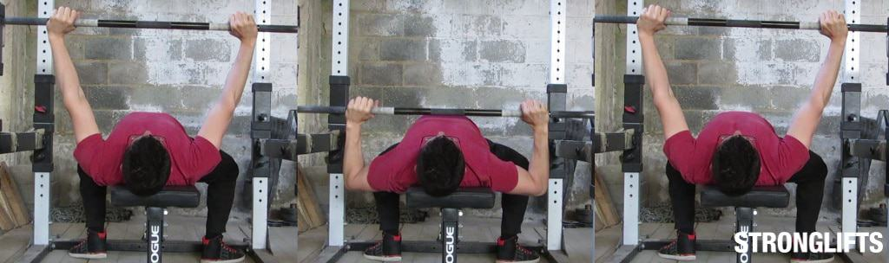

## Cum sa faceti Impinsul cu haltera de la piept(Bench Press) cu o forma adecvata: Ghidul definitiv

## Cum sa faceti Impinsul cu haltera de la piept(Bench Press) cu o forma adecvata: Coborati bara pana la mijlocul pieptului. Apasati-o inapoi pana cand coatele sunt blocate.

## Iata cum sa faci Impinsul cu haltera de la piept(Bench Press) cu o forma corecta:

1. Intindeti-va pe banca cu ochii sub bara
2. Prindeti bara cu o latime medie de prindere (degetele in jurul barei!)
3. Ridicati bara indreptandu-va bratele
4. Coborati bara pana la mijlocul pieptului
5. Impingeti bara inapoi pana cand bratele sunt drepte

Tineti greutatea o secunda in varf, cu bratele drepte. Respirati. Apoi inspirati puternic, tineti-o si coborati din nou bara. Tine-ti fundul pe banca cand ridicati din nou.

Impinsul cu haltera de la piept(Bench Press) este un exercitiu compus pentru intreg corpul. Iti lucreaza cel mai mult pieptul, umerii si tricepsul. Este cel mai eficient exercitiu pentru a obtine forta in partea superioara a corpului si a masa musculare, deoarece este un exercitiu pentru partea superioara a corpului in care veti ridica cea mai mare greutate (mai mult decat [Overhead Press](/exercitii/umeri/presa-deasupra-capului)). Cu cat ridicati mai mult la Bench Press, cu atat pieptul este mai mare.

Pentru a evita durerile de umar, miscati-va coatele la 75 ° cand coborati bara. Nu incercati sa va intindeti (stretch) pieptul miscand coatele la 90 °. Va veti afecta umerii daca bratele superioare sunt perpendiculare cu trunchiul din partea de jos. Muta-ti coatele cu 75 ° pentru a te antrena fara dureri.

Spre deosebire de [genuflexiuni(Squat)](/exercitii/picioare/squads) sau [Indreptari(Deadlift)](/exercitii/spate/indreptari), bara nu se misca intr-o linie verticala atunci cand faceti Impinsul cu haltera de la piept(Bench Press) cu o forma corespunzatoare. Se misca in diagonala de la mijlocul pieptului peste umeri. Acesta este cel mai sigur mod de a face Impinsul cu haltera de la piept(Bench Press) pentru umeri. Este, de asemenea, cel mai eficient mod de face Impinsul cu haltera de la piept(Bench Press) cu o greutate mare.

Acesta este ghidul definitiv pentru o forma corespunzatoare pe Impinsul cu haltera de la piept(Bench Press).

Cuprins

   <ul style="column-count: 2; column-gap: 18%; columns: 2; list-style: none;">
      <li style="list-style:none;">
         <a style="font-size:16px;" href="#prezentare-generala"> 1 Introducere</a>
         <ul style="list-style:none; margin-top:0; margin-bottom:0;">
            <li style="list-style:none; margin-bottom:0;"><a style="font-size:16px;" href="#cum-sa-faci-bench-press">1.1. Cum sa faci Bench Press</a></li>
            <li style="list-style:none; margin-bottom:0;"><a style="font-size:16px;" href="#pregatirea-bench-press"> 1.2. Pregatirea pentru Bench Press</a></li>
            <li style="list-style:none; margin-bottom:0;"><a style="font-size:16px;" href="#bench-press"> 1.3. Bench Press 101</a></li>
            <li style="list-style:none; margin-bottom:0;"><a style="font-size:16px;" href="#videoclipuri"> 1.4. Videoclipuri</a></li>
         </ul>
      </li>
      <li style="list-style:none;">
         <a style="font-size:16px;" href="#siguranta">2 Siguranta</a>
         <ul style="list-style:none; margin-top:0; margin-bottom:0;">
               <li style="list-style:none; margin-bottom:0;"><a style="font-size:16px;" href="#repetari-nereusite">2.1. Repetari nereusite</a></li>
               <li style="list-style:none; margin-bottom:0;"><a style="font-size:16px;" href="#fara-spotter"> 2.2. Fara Spotter</a></li>
               <li style="list-style:none; margin-bottom:0;"><a style="font-size:16px;" href="#thumbless-grip"> 2.3. Priza ce nu implica degetele mari</a></li>
               <li style="list-style:none; margin-bottom:0;"><a style="font-size:16px;" href="#leziuni-ale-umerilor"> 2.4. Leziuni ale umerilor</a></li>
         </ul>
      </li>
      <li style="list-style:none;">
         <a style="font-size:16px;" href="#technica-exercitiului">3 Tehnica exercitiului</a>
         <ul style="list-style:none; margin-top:0; margin-bottom:0;">
            <li style="list-style:none; margin-bottom:0;"><a style="font-size:16px;" href="#priza">3.1. Priza</a></li>
            <li style="list-style:none; margin-bottom:0;"><a style="font-size:16px;" href="#latimea-de-prindere/-a-prizai"> 3.2. Latimea de prindere/ a prizai</a></li>
            <li style="list-style:none; margin-bottom:0;"><a style="font-size:16px;" href="#incheieturile"> 3.3. Incheieturile</a></li>
            <li style="list-style:none; margin-bottom:0;"><a style="font-size:16px;" href="#coate"> 3.4. Coate</a></li>
            <li style="list-style:none; margin-bottom:0;"><a style="font-size:16px;" href="#ant
            ebrate"> 3.5. Antebrate</a></li>
            <li style="list-style:none; margin-bottom:0;"><a style="font-size:16px;" href="#cap"> 3.6. Cap</a></li>
            <li style="list-style:none; margin-bottom:0;"><a style="font-size:16px;" href="#umeri"> 3.7. Umeri</a></li>
            <li style="list-style:none; margin-bottom:0;"><a style="font-size:16px;" href="#partea-superioara-a-spatelui"> 3.8. Partea superioara a spatelui</a></li>
            <li style="list-style:none; margin-bottom:0;"><a style="font-size:16px;" href="#piept"> 3.9. Piept</a></li>
            <li style="list-style:none; margin-bottom:0;"><a style="font-size:16px;" href="#partea-inferioara-a-spatelui"> 3.10. Partea inferioara a spatelui</a></li>
            <li style="list-style:none; margin-bottom:0;"><a style="font-size:16px;" href="#fundul"> 3.11. Fundul</a></li>
            <li style="list-style:none; margin-bottom:0;"><a style="font-size:16px;" href="#picioare"> 3.12. Picioare</a></li>
            <li style="list-style:none; margin-bottom:0;"><a style="font-size:16px;" href="#deblocarea-barei"> 3.13. Deblocarea barei</a></li>
            <li style="list-style:none; margin-bottom:0;"><a style="font-size:16px;" href="#coborarea"> 3.14. Coborarea</a></li>
            <li style="list-style:none; margin-bottom:0;"><a style="font-size:16px;" href="#pozitia-de-jos"> 3.15. Pozitia de jos(Bottom Position)</a></li>
            <li style="list-style:none; margin-bottom:0;"><a style="font-size:16px;" href="#urcarea-revenirea"> 3.16. Urcarea/revenirea</a></li>
            <li style="list-style:none; margin-bottom:0;"><a style="font-size:16px;" href="#blocare"> 3.17. Blocare</a></li>
            <li style="list-style:none; margin-bottom:0;"><a style="font-size:16px;" href="#fixarea-barei"> 3.18. Fixarea barei</a></li>
            <li style="list-style:none; margin-bottom:0;"><a style="font-size:16px;" href="#directia-barei"> 3.19. Directia barei</a></li>
            <li style="list-style:none; margin-bottom:0;"><a style="font-size:16px;" href="#respiratia"> 3.20. Respiratia</a></li>
         </ul>
      </li>
      <li style="list-style:none;">
         <a style="font-size:16px;" href="#instalarea">4 Instalarea echipamentelor</a>
         <ul style="list-style:none; margin-top:0; margin-bottom:0;">
         <li style="list-style:none; margin-bottom:0;"><a style="font-size:16px;" href="#montanti">4.1. Montanti(uprights)</a></li>
         <li style="list-style:none; margin-bottom:0;"><a style="font-size:16px;" href="#carlige-de-siguranta"> 4.2. Carlige de siguranta(safety pins)</a></li>
         <li style="list-style:none; margin-bottom:0;"><a style="font-size:16px;" href="#banca"> 4.3. Banca</a></li>
         <li style="list-style:none; margin-bottom:0;"><a style="font-size:16px;" href="#haltera"> 4.4. Haltera</a></li>
         </ul>
      </li>
      <li style="list-style:none;">
         <a style="font-size:16px;" href="#antrenament-singur">5 Antrenarea singur in siguranta, fara spotter</a>
         <ul style="list-style:none; margin-top:0; margin-bottom:0;">
           <li style="list-style:none; margin-bottom:0;"><a style="font-size:16px;" href="#bench-press-cu-ajutorul-power-rack-ul"> 5.1. Bench Press cu ajutorul Power Rack-ul</a></li>
           <li style="list-style:none; margin-bottom:0;"><a style="font-size:16px;" href="#avantajele-power-rack-ului"> 5.1.1. Avantajele Power Rack-ului</a></li>
           <li style="list-style:none; margin-bottom:0;"><a style="font-size:16px;" href="#dezavantajele-power-rack-ului"> 5.1.2. Dezavantajele Power Rack-ului</a></li>
           <li style="list-style:none; margin-bottom:0;"><a style="font-size:16px;" href="#setatu-carligele"> 5.1.4. Setati intotdeauna carligele de siguranta!</a></li>
           <li style="list-style:none; margin-bottom:0;"><a style="font-size:16px;" href="#siguranta-fara-power-rack"> 5.2. Siguranta fara Power Rack</a></li>
           <li style="list-style:none; margin-bottom:0;"><a style="font-size:16px;" href="#roll-of-shame"> 5.2.2. Roll of shame</a></li>
           <li style="list-style:none; margin-bottom:0;"><a style="font-size:16px;" href="#nu-incercati-sa-faceti-pr-uri!"> 5.2.4. Nu incercati sa faceti PR-uri!</a></li>
           <li style="list-style:none; margin-bottom:0;"><a style="font-size:16px;" href="#daca-te-blochezi"> 5.2.5. Daca te blochezi</a></li>
           <li style="list-style:none; margin-bottom:0;"><a style="font-size:16px;" href="#tip!"> tip!</a></li>
           <li style="list-style:none; margin-bottom:0;"><a style="font-size:16px;" href="#alternative-nu-atat-de-sigure-"> 5.3. Alternative nu atat de sigure ...</a></li>
           <li style="list-style:none; margin-bottom:0;"><a style="font-size:16px;" href="#bench-smith"> 5.3.1. Aparatul Bench Press Smith</a></li>
           <li style="list-style:none; margin-bottom:0;"><a style="font-size:16px;" href="#bench-press-cu-gantere"> 5.3.2. Bench Press cu gantere</a></li>
           <li style="list-style:none; margin-bottom:0;"><a style="font-size:16px;" href="#spotters"> 5.3.3. Spotters</a></li>
           <li style="list-style:none; margin-bottom:0;"><a style="font-size:16px;" href="#forma-corecta-a-bench-press"> 5.4. Forma corecta a Bench Press</a></li>
           <li style="list-style:none; margin-bottom:0;"><a style="font-size:16px;" href="#fara-priza-ce-nu-implica-degetul-mare!"> 5.4.1. Fara priza ce nu implica degetul mare!</a></li>
           <li style="list-style:none; margin-bottom:0;"><a style="font-size:16px;" href="#blocati-coatele"> 5.4.2. Blocati coatele</a></li>
           <li style="list-style:none; margin-bottom:0;"><a style="font-size:16px;" href="#fixati-corespunzator"> 5.4.3. Fixati corespunzator</a></li>
           <li style="list-style:none; margin-bottom:0;"><a style="font-size:16px;" href="#supravegheze"> 5.5. Solicitarea ajutorului este in regula</a></li>
         </ul>
      </li>
      <li style="list-style:none;">
         <a style="font-size:16px;" href="#greseli">6 Greseli</a>
         <ul style="list-style:none; margin-top:0; margin-bottom:0;">
            <li style="list-style:none; margin-bottom:0;"><a style="font-size:16px;" href="#miscarea-coatelor"> 6.2. Miscarea coatelor</a></li>
            <li style="list-style:none; margin-bottom:0;"><a style="font-size:16px;" href="#utilizarea-aparatelor"> 6.3. Utilizarea aparatelor</a></li>
            <li style="list-style:none; margin-bottom:0;"><a style="font-size:16px;" href="#executia"> 6.4. Executarea cu incheieturile indoite</a></li>
            <li style="list-style:none; margin-bottom:0;"><a style="font-size:16px;" href="#fara-power-rack"> 6.5. Fara Power Rack sau Spotter</a></li>
            <li style="list-style:none; margin-bottom:0;"><a style="font-size:16px;" href="#fixarea(racking)-barei-gresit"> 6.6. Fixarea(Racking) barei gresit</a></li>
            <li style="list-style:none; margin-bottom:0;"><a style="font-size:16px;" href="#nu-va-blocati-coatele-in-partea-de-sus"> 6.7. Nu va blocati coatele in partea de sus</a></li>
            <li style="list-style:none; margin-bottom:0;"><a style="font-size:16px;" href="#piept-plat"> 6.8. Presarea(Bench Pressing) cu un piept plat</a></li>
            <li style="list-style:none; margin-bottom:0;"><a style="font-size:16px;" href="#ridicarea-fundului-de-pe-banca"> 6.9. Ridicarea fundului de pe banca</a></li>
            <li style="list-style:none; margin-bottom:0;"><a style="font-size:16px;" href="#picioarele-in-aer"> 6.10. Va tineti picioarele in aer</a></li>
         </ul>
      </li>
      <li style="list-style:none;">
         <a style="font-size:16px;" href="#dureri-incheieturi">7 Dureri la nivelul incheieturii</a>
         <ul style="list-style:none; margin-top:0; margin-bottom:0;">
            <li style="list-style:none; margin-bottom:0;"><a style="font-size:16px;"  href="#incheieturile-indoite">7.1.  Nu faceti Bench Press cu incheieturile indoite</a></li>
            <li style="list-style:none; margin-bottom:0;"><a style="font-size:16px;" href="#utilizati-priza-bulldog"> 7.2. Utilizati priza “Bulldog”</a></li>
            <li style="list-style:none; margin-bottom:0;"><a style="font-size:16px;" href="#verificati-latimea-prizei"> 7.3. Verificati latimea de prindere</a></li>
            <li style="list-style:none; margin-bottom:0;"><a style="font-size:16px;" href="#fara-prinderi-ce-nu-implica-degetul-mare!"> 7.4. Fara prinderi ce nu implica degetul mare!</a></li>
            <li style="list-style:none; margin-bottom:0;"><a style="font-size:16px;" href="#benzi-pentru-incheietura-mainii"> 7.5. Benzi pentru incheietura mainii</a></li>
         </ul>
      </li>
      <li style="list-style:none;">
         <a style="font-size:16px;" href="#variatii-ale-bench-press">8 Variatii ale Bench Press-ului</a>
         <ul style="list-style:none; margin-top:0; margin-bottom:0;">
            <li style="list-style:none; margin-bottom:0;"><a style="font-size:16px;" href="#close-grip-bench-press"> 8.1. Close Grip Bench Press</a></li>
            <li style="list-style:none; margin-bottom:0;"><a style="font-size:16px;" href="#incline-bench-press"> 8.2. Incline Bench Press</a></li>
            <li style="list-style:none; margin-bottom:0;"><a style="font-size:16px;" href="#decline-bench-press"> 8.3. Decline Bench Press</a></li>
            <li style="list-style:none; margin-bottom:0;"><a style="font-size:16px;" href="#bench-press-cu-gantere"> 8.4. Bench Press cu gantere</a></li>
            <li style="list-style:none; margin-bottom:0;"><a style="font-size:16px;" href="#aparat-pentru-bench-press"> 8.5. Aparat pentru Bench Press</a></li>
            <li style="list-style:none; margin-bottom:0;"><a style="font-size:16px;" href="#flotari"> 8.6. Flotari (Pushups)</a></li>
         </ul>
      </li>
      <li style="list-style:none;">
         <a style="font-size:16px;" href="#imbunatatirea-bench-press">9. Imbunatatirea Bench Press-ulu</a>
         <ul style="list-style:none; margin-top:0; margin-bottom:0;">
            <li style="list-style:none; margin-bottom:0;"><a style="font-size:16px;" href="#faceti-bench-press-mai-des">9.1. Faceti Bench Press mai des</a></li>
            <li style="list-style:none; margin-bottom:0;"><a style="font-size:16px;" href="#imbunatatirea-posturei">9.2. Imbunatatirea posturei/formei</a></li>
            <li style="list-style:none; margin-bottom:0;"><a style="font-size:16px;" href="#adaugati-greutate-pe-bara">9.3. Adaugati greutate pe bara</a></li>
            <li style="list-style:none; margin-bottom:0;"><a style="font-size:16px;" href="#reduce-repetarile">9.4. Repetari mai rare</a></li>
            <li style="list-style:none; margin-bottom:0;"><a style="font-size:16px;" href="#microload">9.5. Incarcati cate putin</a></li>
            <li style="list-style:none; margin-bottom:0;"><a style="font-size:16px;" href="#odihna">9.6. Pauze mai lungi intre seturi</a></li>
            <li style="list-style:none; margin-bottom:0;"><a style="font-size:16px;" href="#incalzirea-pentru-bench-press">9.7. Imbunatatiti-va incalzirea(warmup) pentru Bench Press</a></li>
            <li style="list-style:none; margin-bottom:0;"><a style="font-size:16px;" href="#faceti-mai-multe-repetari-inainte-de-ainspira-din-nou">9.8. Faceti mai multe repetari inainte de a inspira din nou</a></li>
            <li style="list-style:none; margin-bottom:0;"><a style="font-size:16px;" href="#adaugati-paused-bench-pentru-ajutor">9.10. Adaugati Paused Bench pentru ajutor</a></li>
            <li style="list-style:none; margin-bottom:0;"><a style="font-size:16px;" href="#fii-rabdator,-vezi-de-asemenea">9.11. Fii rabdator,10. Vezi de asemenea</a></li>
         </ul>
      </li>
   </ul>

## Introducere

## Cum sa faci Bench Press

Cum sa banci Apasati cu o forma adecvata: pregatiti-va pe banca, apucati bara, deblocati-o, coborati-o pana la mijlocul pieptului si ridicati-o inapoi.

Faceti Bench Press in Power Rack pentru o siguranta maxima. Setati carligele de siguranta la inaltimea corespunzatoare, astfel incat sa prinda greutatea daca nu reusiti sa o ridicati. Nu aveti nevoie de spotter daca lucrati Bench Press in Power Rack, asa cum fac eu. Daca nu aveti un Power Rack, cereti cuiva din sala sa se uite cand faceti Bench Press. Apoi urmati acesti cinci pasi simpli pentru a face Bench Press cu o forma corespunzatoare.

**- Pregatirea(Setup)**. Intinde-te pe banca plata cu ochii sub bara. Ridicati pieptul si contractati-va omoplatele. Labele piciorului plate pe podea.
**- Prinde bara**. Pune-ti degetul mic pe semnele inelare ale barei tale(ring marks). Tineti bara in baza palmei cu o strangere completa si incheieturile drepte.
**- Deblocati(Unrack)**. Respirati puternic si deblocati bara indreptandu-va bratele. Mutati bara peste umeri cu coatele blocate/fixate.
**- Coborati bara**. Coborati-o pana la mijlocul pieptului, in timp ce va mutati coatele cu 75°. Pastreaza-ti antebratele verticale. Tine-ti respiratia in partea de jos.
**- Presa(Press)**. Impingeti bara de la mijlocul pieptului pana deasupra umerilor. Tine-ti fundul pe banca. Fixati coatele in partea de sus. Respirati.

Fixati(Rack) greutatea odata ce ati facut Bench Press, cinci repetari pe StrongLIfts 5 × 5. Incheiati ultima reprezentare mai intai, impingeti greutatea departe de piept pana cand veti indreta si fixa coatele. Apoi mutati bara orizontal de deasupra umerilor pe Power Rack. Nu incercati sa o asezati direct pe montanti (uprights), deoarece puteti sa nu nimeriti. Tintiti partile verticale ale Power Rack-ului. Dupa ce le-ati lovit, indoiti coatele pentru a cobori bara in pozitia verticala.

## Pregatirea pentru Bench Press

Pregatirea pentru Bench Press: asezati-va pe banca, culcati-va, contactati-va omoplatele, apucati bara, fixati-va picioarele si apoi deblocati bara.

Pregatiti-va echipamentul mai intai. Puneti carligele de siguranta(safety pins) ale Power Rack-ului dvs. la inaltimea corespunzatoare, astfel incat sa poata prinde greutatea daca nu reusiti repetarea. Centreaza-ti banca. Apoi, fixeaza-te inainte de a desprinde greutatea. Incheieturile se vor indoi daca prindeti bara gresit. Umerii tai se vor misca daca omoplatele nu sunt contractate. Si nu o puteti corecta atunci cand greutatea grea creaza presiune. Pregatiti-va in mod corespunzator pentru a va imbunatati forma si pentru a creste presiunea de pe banca.

**- Intindeti-va**. Stai mai intai la capatul bancii. Apoi intindeti-va pe banca. Pune ochii sub bara.
**- Contactati-va omoplatele**. Ridicati pieptul si incordeaza-ti partea superioara a spatelui. Omoplatele trebuie sa fie inapoi si in jos. Incordati-le.
**- Prinde bara**. Degetul mic in interiorul semnelor inelare(ring marks). Tineti bara jos, aproape de incheietura mainii. Strangeti bara folosind prinderea/priza completa, astfel incat sa nu se poata deplasa.
**- Fixati-va picioarele**. Picioarele fixate pe podea, la o distanta egala cu latimea umerilor. Setati-va mai intai un picior sub genunchi, apoi fixati-l pe celalalt.
**- Deblocati(Unrack) bara**. Indreptati-va bratele pentru a ridica bara de pe montanti(uprights). Muta-o pe orizontala pana cand este echilibrat peste umeri. Terminat.

Pregatiti-va la fel, la fiecare set Bench Press. Cu cat este mai viguroasa pregatirea dvs. pentru a incepe sa faceti Bench Press, cu atat tehnica va fi mai corecta odata ce incepeti sa faceti Bench Press cu greutati. O tehnica mai buna creste eficacitatea. Creste cat de mult poti face cu Bench Press. Nu va pregatiti cu respect zero pentru greutate, deoarece este usor. Pregatiti-va in acelasi mod, indiferent daca faceti Bench Press cu greutatea de incalzire sau greutatea grea.

## Bench Press- Postura 101

Postura Bench Press-ului corecta pe spate: antebratele verticale in partea de jos, bara atinge pieptul.

Conformatia dvs. determina modul in care postura dvs. va arata pentru o eficienta maxima. Cu cat umerii sunt mai largi, cu atat ar trebui sa fie mai larga prinderea. Cu cat bratele superioare sunt mai lungi, cu cat coatele vor fi mai aproape de trunchi, in partea de jos. Nu copiati postura/forma cuiva decat daca aveti aceeasi conformatie. Urmati aceste instructiuni generale pentru Bench Press si modificati-va postura/forma pe masura ce obtineti experienta.

**- Prinderea/Priza**. Tineti bara in partea de jos a palmei, aproape de incheietura mainii. Strangeti bara.
**- Latime prinderii/prizai**. Mainile trebuie sa fie in interiorul semnelor inelare(ring marks) ale barei. Antebrate trebuie sa fie verticale in partea de jos.
**- Degetele mari**. Pozitionati-va degetele mari in jurul barei. Nu faceti Bench Press cu o priza care nu implica degetele mari (degetele mari nu sunt peste bara).
**- Incheieturi**. Trebuie sa se formeze o linie dreapta de la incheietura mainii pana la cot. Nu faceti Bench Press cu incheieturile indoite, deoarece va vor durea.
**- Coatele**. La aproximativ 75°, in partea de jos. Acestea nu ar trebui sa atinga trunchiul, deoarece vor ajunge la un unghi de 90°.
**- Antebrate**. Perpendiculare pe podea din fiecare unghi: atat din lateral cat si din fata.
**- Umerii**. Tine-le inapoi, pe banca. Nu va ridicati umerii.
**- Partea de sus a spatelui**. Contractati-va omoplatele pentru a creste stabilitatea atunci cand faceti Bench Press.
**- Pieptul**. Ridicati-l spre tavan. Atingeti bara in timp ce o coborati. Dar tine-ti fundul pe banca.
**- Cap**. Pozitionati-va cu ochii sub bara. Tine-ti capul neutru. Nu-l impingeti in banca.
**- Partea inferioara a spatelui**. Trebuie sa existe un arc natural. Trebuie ca eu sa pot sa-mi trec mana, plata, intre banca si spatele tau.
**- Fundul**. Tine-ti fundul pe banca cand faci Bench Press. Nu trisati ridicand fundul de pe banca.
**- Picioare**. Plate pe podea, nu in aer. Picioarele la acelasi nivel cu genunchii. Utilizati o pozitie egala cu latimea umerilor ca la genuflexiuni (Squats).
**- Deblocarea (Unracking)**. Deblocati greutatea indreptandu-va bratele. Deplasati bara deasupra articulatiei umarului.
**- Mult mai jos**. Coborati bara pana la mijlocul pieptului. Trage-ti coatele in 75° in timp ce coboara greutatea.
**- Partea de jos a Bench Press-ului**. Incheieturile drepte, antebratele verticale. Coturile in interior, dar nu impotriva trunchiului tau. Bara la mijlocul pieptului.
**- Ridicarea/Revenirea**. Nu va opriti in partea de jos. Impingeti bara inapoi pana deasupra umerilor. Blocati-va coatele.
**- Lockout**. Blocati bara peste articulatia umarului. Fixati-va coatele in partea de sus. Nu-le indoiti inapoi.
**- Fixati(racking) bara**. Blocare cu coatele drepte. Mutati bara inapoi pe suport. Coborati-o pe montanti(uprights).
**- Directia/traiectoria barei**. Linie diagonala de la mijlocul pieptului pana la umeri. Nu vertical pe umeri, gat sau piept.
**- Respiratia**. Respirati adanc in partea de sus, mentineti-va respiratia in coborare, si in partea de jos, expirati in partea de sus.

## Siguranta

## Repetari nereusite

Cum sa esuezi cand faci Bench Press in siguranta: coborati bara inapoi spre piept. Aplatizeaza-ti trunchiul astfel incat bara sa atinga barele. Apoi alunecati sub ea.

Nu va veti bloca niciodata sub greutate daca faceti Bench Press in Power Rack. Power Rack-ul are carlige de siguranta orizontale(horizontal safety pins) pentru a prinde bara, daca nu reusiti. Setati aceste carlige putin mai jos decat pozitia de jos cand faceti Bench Press. Bara nu poate atinge carligele (safety pins), la repetari bune. Daca nu reusiti sa ridicati greutatea, coborati bara pana la mijlocul pieptului. Apoi aplanati-va trunchiul pentru a cobori bara pe acele/carligele de siguranta. Acesta este cel mai sigur mod de a face Bench Press.

Bench Press, fara Power Rack sau spotter, este periculos. Daca va blocati cu bara, singura cale de iesire este „roll the shame”. Coborati bara pana la mijlocul pieptului, rotiti-o pana la stomac si apoi lasati-o in jos. Totusi, acest lucru nu se va simti placut, deoarece greutatile grele iti vor zdrobi stomacul. Alternativa este la Bench Press fara gulere(collars), astfel incat sa puteti inclina bara intr-o parte. Dar sala de sport te va ura pentru ca scapi/arunci greutatea. Obtineti un Power Rack.

Benching cu gantere pare mai sigur, dar nu este. Nu poti fi blocat, adevarat. Insa, daca nu reusiti sa ridicati ganterele grele, acestea va pot cadea pe fata si va pot rani. Sau trebuie sa arunci ganterele pe podea si sa enervezi managerul salii de sport. Bench Press in Power Rack este mai sigur, deoarece carligele de siguranta(safety pins) prind bara daca ramaneti blocati. Greutatea nu poate cadea pe fata sau pe podea. Se poate intampla daca lucrati cu gantere grele.

Teama de vatamare pe Bench Press este normala.Oamenii mor in fiecare an de accidentele cu Bench Press. Nu folositi prinderea ce nu implica degetul mare(thumbless grip). Folositi priza completa pentru ca bara sa nu va alunece din maini si sa va ucida. Nu faceti Bench Press grele fara Power Rack - bara va va zdrobi daca nu reusiti sa tineti bara. Incepeti usor si concentrati-va asupra formei inainte de a merge mai greu. O forma corecta iti va spori increderea, care depaseste frica. Setati carligele de siguranta chiar daca credeti ca le puteti face.

## Fara Spotter

Faceti Bench Press in interiorul Power Rack-ul, chiar daca aveti un spotter. Lasati-l sa va ajute sa (de)blocati greutatea. El nu ar trebui sa atinga bara in timp ce faceti Bench Press.

Nu aveti nevoie de spotter daca faceti Bench Press in Power Rack. Fac asta de mai bine de 10 ani in sala mea de gimnastica, de obicei fara spotter si nu m-am ranit niciodata. Campionul mondial, Mike Tuchscherer, lucreaza cu peste 500 de kilograme si, de asemenea, ridica in sala de gimnastica a casei sale, fara spotter. Ar putea fi ucis daca se blocheaza cu atata greutate. Cu toate acestea, el a fost intotdeauna in siguranta, Benching in Power Rack cu carligele de siguranta gata sa prinda bare in cazul unei repetari nereusite/esuate.

Chiar daca aveti un spotter, ar trebui sa faceti Bench Press in Power Rack. Majoritatea oamenilor nu stiu sa se concentreze. Vor privi in jur in timp ce faceti Bench Press si vor reactiona prea tarziu. Sau va vor lua bara din maini la mijlocul repetarii, nu vor nimeri montantii(uprights) si o vor scapa pe fata dvs. Nu presupuneti ca sunteti in siguranta, deoarece aveti un spotter. S-ar putea sa nu stie. Faceti Bench Press in Power Rack. Setati pinii/carligele de siguranta(safety pins) astfel incat sa poata salva in cazul oricarei repetari esuate/nereusite.

Scopul principal al unui spotter este sa va ofere o mana de ajutor. Pentru a va ajuta sa descarcati bara de pe umeri. Acest lucru mentine umerii inapoi pe banca si pieptul strans. Iti micsoreaza rezistenta pentru Bench Press-ul facut cu greutatea. Dar, din nou, majoritatea oamenilor nu stiu sa localizeze/sa se concentreze. Ei pot debloca bara de pe suport cu prea multa forta si pot misca umerii din pozitie. Mana lor poate face mai mult rau decat bine. Adesea esti mai bine sa faci Bench Press singur.

## Fara prinderi ce nu implica degetul mare(No Thumbless Grip)

Stanga: prindere fara degetul mare(thumbless grip), periculoasa, nu o folosi. Mijloc: priza completa, dar bara prea sus, incheieturile se vor indoi. Dreapta: priza/prindere corecta, tip “bulldog” cu bara tinuta in partea de jos a mainii.

Nu faceti Bench Press cu o priza in care degetul mare se afla sub bara(thumbless grip). Bara iti poate aluneca din maini, iti va cadea pe fata si te poate ucide. Pozitionati-va degetele in jurul barei folosind o priza completa. Bara nu va poate aluneca din maini daca degetele dvs. sunt acolo pentru a-o asigura. In cazul in care incheietura mainii te doare daca utilizezi prinderea completa, de obicei, sunt aplecate atunci cand faceti Bench Press. Indreptati-va incheieturile prinzand bara mai jos in maini.Utilizati prinderea “Bulldog” asa cum este explicat mai jos.

## Leziunile umerilor

Stanga: coatele in exterior, pot duce la aparitia leziunilor la nivelul umerilor. Centru: coatele prea apropiate de corp, ineficiente. Dreapta: coatele trebuie fixate la aproximativ 75 °

O postura proasta a Bench Press-ului provoaca dureri de umar si rani. Nu faceti Bench Press cum fac culturistii, cu coatele la 90°, de corp. Nu coborati bara in stil guillotine pana la gat. Veti obtine o intindere mai mare a pieptului daca coatele sunt perpendiculare cu trunchiul, in partea de jos. Dar iti vei afecta umerii. Partea superioara a bratului tau va va contracta coada rotatorilor impotriva articulatiei AC. Tesuturile se vor inflama.

Forma corecta de presare a bancii(Bench Press) implica coatele la aproximativ 75°, in partea de jos a Bench Press-ului. Unghiul exact depinde de constructia dvs. Dar coatele nu ar trebui sa fie perpendiculare cu trunchiul, deoarece acest lucru este nesigur. Ele nu ar trebui sa va atinga trunchiul, deoarece acest lucru este ineficient. Coborati bara cu coatele in aproximativ 75 °, mentinand antebratele verticale din orice unghi. Inregistrati-va cand faceti Bench Press pentru a va verifica pozitia coatelor.

Nu faceti Bench Press cu ajutorul aparatului Smith. Forteaza o cale verticala a barei, deoarece bara este atasata de sine. Dar directia barei nu este verticala pe Bench Press. Bara nu se poate muta intr-o linie verticala peste umeri, deoarece acest lucru ii afecteaza. Nu se poate deplasa vertical peste piept, deoarece este ineficient. Bara trebuie sa se deplaseze in diagonala de la umeri la mijlocul pieptului. Ai nevoie de greutati libere pentru a face acest lucru.

## Tehnica Bench Press-ului

## Prinderea/Priza

Stanga: tinand bara la mijlocul palmei, incheieturile se vor indoi si se vor rani. Mijloc: bara in partea de jos a mainii(la baza acesteia), incheietura nu se indoaie. Corect: tineti bara in partea de jos a mainii.

Prinderea completa. Pozitionati degetele mari in jurul barei. Acesta este cel mai sigur si cel mai eficient mod de face Bench Press intens. Strangeti bara, astfel incat sa nu se poata misca in maini. Bratele, umerii si muschii pieptului se vor contracta mai greu, ceea ce va creste presiunea la Bench Press (hiper radiatie). Nu va relaxati si nu deschideti mainile in timp ce va antrenati, deoarece bara se va deplasa. Tine-ti mainile inchise si strange bara cat puteti de tare.

In niciun caz o prindere ce nu implica degetul mare!(thumbless grip= degetul mare este sub bara) Bara iti poate aluneca din maini daca o strangi fara degetele mari. Daca aluneca, niciun spotter nu va fi suficient de rapid pentru a prinde bara. Iti va zdrobi fata, gatul sau pieptul. Vei fi ranit sau, mai rau, vei muri. Pozitionati-va degetele mari in jurul barei pentru a-o fixa. Strangeti bara, astfel incat sa nu se poata deplasa. Acest lucru va va creste/imbunatati Bench Press-ul in acelasi timp. In cazul in care incheieturile va dor, apucati bara mai jos pentru a evita indoirea incheieturilor.

## Prinderea tip Bulldog

Stanga: apucand bara la mijlocul palmei, incheietura se va indoi. Stanga: folositi prinderea de tip Bulldog rotind mainile in interior, inainte sa inchideti palmele. Incheietura nu se va indoi.

Prinderea in partea de jos a palmei. Tineti bara in baza palmei, aproape de incheieturi. Nu o tineti aproape de degete ca pe [Indreptari(Deadlift)](/exercitii/spate/indreptari), deoarece incheieturile se vor indoi. Incheietura indoite vor durea. Incheieturile indoite ingreuneaza greutatea, deoarece bara este mai departe de incheietura mainii. Acesta este un efect de parghie si un transfer de putere proaste. Strangeti bara in partea de jos a palmei, astfel incat sa se sprijine peste incheieturi si coate. Vei lucra cu o greutate mai mare fara dureri la incheietura mainii.

Bulldog Grip. Cel mai simplu mod de a strange bara in partea de jos a palmei este folosirea prizai de tip Bulldog. Imaginati-va cum un Bulldog isi aseaza labele. Prindeti bara rotind palmele inainte de a le inchide. Apoi strangeti bara pentru a nu se misca. Priza Bulldog se va simti ciudat si mai putin sigura. Dar nu este mai putin sigura, deoarece degetele mari impiedica bara sa alunece. Incercati-o pentru cateva antrenamente, va veti obisnui.

## Latimea de prindere a barei

Stanga: prindere prea larga, antebratele sunt inclinate. Mijloc: prindere prea ingusta, accentueaza tricepsul. Dreapta: antebrate verticale, cel mai eficient mod de a face Bench Press.

Prindere/Priza medie. Strangeti bara cu degetul mic in interiorul semnelor inelare(ring marks) ale barei. Antebratele trebuie sa fie perpendiculare pe podea atunci cand bara iti atinge pieptul. Constructia dvs. determina latimea de prindere de care aveti nevoie pentru acest lucru, dar de obicei functioneaza una medie. Prinderile largi sunt dure pentru umerii majoritatii. Prinderile mai inguste sunt ineficiente pentru a depasi greutatea, deoarece iti inclina antebratele. Iti accentueaza tricepsul. Lucrati cu o prindere medie.

Antebrate verticale. Antebratele trebuie sa fie perpendiculare pe podea atunci cand bara iti atinge pieptul. Verificati acest lucru inregistrandu-va antrenamentul de Bench Press. Daca coatele sunt in afara incheieturilor in partea de jos a Bench Press, greutatea este mai greu de ridicat/bench(este ca si cum ai face o extensie de triceps). Daca coatele sunt in interiorul incheieturilor, greutatea pune mai multa presiune pe articulatiile umarului.Faceti Bench Press cu antebratele verticale in partea de jos, reglandu-va latimea de prindere.

## Incheieturile

Incheieturile se vor indoi daca apucati bara prea sus(in partea de sus a palmei). Acest lucru este ineficient si va provoca dureri. Bara trebuie sa fie plasata in partea de jos a palmei (in baza palmei), astfel incat incheietura mainii sa fie dreapta.

Incheieturi drepte. Cea mai sigura si mai eficienta modalitate de a face Bench Press este cu incheieturile drepte. Atunci cand bara atinge pieptul, in partea de jos a Bench Press-ul, trebuie sa se formeze o linie dreapta intre cot si incheietura. Nu te apuca sa faci Bench Press cu incheieturile indoite deoarece te vei rani. Benzile pentru incheieturi nu sunt o solutie, trebuie sa ai o forma corecta. Indreptati incheieturile asezand bara mai in josul palmei si mai aproape de incheietura mainii. Acest lucru va va imbunatati transferul de putere in acelasi timp si va va creste Bench Press-ul.

Prinderea in partea de jos a palmei. Nu pozitionati bara in mijlocul palmei si nici aproape de degete ca in [Indreptari(Deadlift)](/exercitii/spate/indreptari). Gravitatea va trage bara in jos cand faceti Bench Press. Iti va indoi incheieturile si ti le va rani daca nu pozitionati bara in josul palmei. Pregatiti-va pentru Bench Press, apucand bara in partea de jos a palmei si aproape de incheietura mainii. Folositi priza Bulldog, rotiti mainile inainte sa va apropiati degetele. Apoi strangeti bara, astfel incat sa nu se poata misca si sa nu indoiti incheieturile.

## Coate

Stanga: coatele in exterior, duce la aparitia leziunilor la nivelul umarului. Centru: coatele prea apropiate, ineficiente. Dreapta: coatele sunt fixate corespunzator la aproximativ 75°.

Coatele prea apropiate. Coborati bara in timp ce miscati coatele. Constructia dvs. va determina cat de mult ar trebui sa va apropiati coatele. Bratele superioare nu pot fi perpendiculare cu trunchiul, in partea de jos a Bench Press-ului. Dar coatele nu va pot atinge nici trunchiul. Cel mai sigur si eficient mod de a face Bench Press este cu antebratele verticale in partea de jos. Se va forma o linie dreapta de la incheietura mainii la cot. De obicei, un unghi al bratului superior de aproximativ 75 ° functioneaza.

Nu va atingeti trunchiul. Atingerea trunchiului cu coatele , le plaseaza in interiorul incheieturilor. Greutatea devine din ce in ce mai greu de ridicat/bench si mai grea pentru articulatiile tale. Acest lucru este practicat de catre Geared Powerlifters care folosesc camasi cu compresie. Dar noi,care nu folosim camasa pentru Bench Press pentru a ne ajuta sa ridicam bara de pe piept. Coatele si incheieturile trebuie sa fie intinse, deoarece acesta este cel mai eficient mod de a face Bench Press. Nu va apropiati prea mult coatele in partea de jos a Bench Press-ului.

**- Nu va miscati coatele**. Nu coborati bara cu coatele la 90 °. Nu faceti presa cum fac culturistii, cu coatele perpendiculare pe trunchi, in partea de jos. Va veti bloca umerii incercand sa obtineti un piept mai mare. Partea superioara a bratelor superioare iti va zdrobi coafele rotative impotriva articulatiei tale AC la fiecare repetare. Umerii tai se vor inflama si se vor rani. Miscati-va coatele la 75° in partea de jos.

**- Miscati doar in urcare**. Urcarea/ridicarea trebuie sa fie o oglinda a coborarii. Trebuie sa va miscati coatele pentru a ridica bara deasupra umerilor. Daca nu, coatele vor incheia in fata barei. Sau se va forma o linie verticala peste mijlocul pieptului. Ambele sunt ineficiente pentru Bench Press cu greutati mari. Bench/Ridicati bara de la mijlocul pieptului peste articulatiile umarului miscandu-va coatele pe drumul de urcare.

**- Antebrate verticale**. Cea mai eficienta metoda de a face Bench Press este cu antebratele verticale cand bara atinge pieptul. Formarea unei linii drepte de la incheietura la cot favorizeaza o parghie mai buna, mai mult transfer de putere si nici o durere la incheietura mainii. Daca coatele sunt prea in spate sau inainte, apucati bara in partea de jos a palmei( la baza acesteia) si reglati latimea de prindere. Daca coatele sunt pozitionate gresit in continuare, va atingeti pieptul prea sus / jos. Inregistrati-va antrenamentul de Bench Press pentru a va ridica antebratele verticale.

**- Blocati in partea de sus**. Deblocati(unrack) greutatea cu coatele fixate. Blocati-le din nou in partea de sus a fiecarei repetari si atunci cand ridicati greutatea. Nu incepe sa faci Bench Press, fara sa blocati coatele in partea de sus. In primul rand, repetarea nu conteaza, nu este valabila. In al doilea rand, ai putea scapa bara si te vei rani. In al treilea rand, blocarea este sigura daca nu depasiti intervalul normal de miscare a articulatiei cotului. Blocati coatele in partea de sus a fiecarei repetari, dar nu extindeti prea mult.

## Antebrate

Stanga: antebratele verticale cu bara peste umeri, cauzeaza rani. Cele 2 din mijloc: antebratele nu sunt verticale, atingand pieptul prea sus / jos.
Dreapta: antebrate verticale, cel mai eficient mod de a face Bench Press.

**- Verticale din lateral**. Antebratele trebuie sa fie perpendiculare pe podea atunci cand bara iti atinge pieptul. Dintr-o vedere laterala, trebuie sa se formeze o linie dreapta de la incheietura mainii la cot. Acesta este cel mai sigur si mai eficient mod de a face Bench Press. Daca incheieturile se indoaie, apucati bara folosind prinderea Bulldog. Daca coatele sunt prea inapoi sau inainte, trageti mai mult / mai putin sau atingeti pieptul prea sus / jos. Inregistrati-va si reglati-va postura.
**- Verticale din fata**. Antebratele trebuie sa fie, de asemenea, perpendiculare cu podeaua atunci cand privesti din fata sau din spate. Antebratele inclinate sunt ineficiente. Benching-ul cu o strangere ingusta si coatele in afara incheieturilor este ca si cum ai face o extensie de triceps. Benching-ul cu o strangere larga si coatele in interiorul incheieturilor este prea greu pentru umeri. Inregistrati-va si corectati-va priza/prinderea la Bench Press cu antebrate verticale.

## Cap

Stanga: pozitionat prea departe pe bara, acest lucru mareste distanta pe care o parcurge bara atunci cand o deblocati(unrack). Dreapta: mai sus pe banca, ochii sub bara, distanta mai scurta pentru a debloca greutatea.

**- Ochii sub bara**. Intinde-te pe banca cu ochii sub bara. Acest lucru reduce distanta dintre Power Rack si umeri. Face greutatea mai usor de deblocat(unrack). Nu va lasati mai jos pe banca sau bara va trebui sa se deplaseze mai mult atunci cand o deblocati. Acest lucru iti ia din putere si este nesigur. Bara trebuie sa va fie peste ochi atunci cand va intindeti pe banca si va uitati in sus. Daca lovesti montantii(uprights) pe drumul de sus, esti prea aproape.
**- Nu va impingeti capul**. Gatul va va durea daca iti impingi capul pe/in banca cand te antrenezi. Contractati-va muschii gatului, fara a impinge capul pe/in banca. Cea mai simpla modalitate de a face acest lucru este sa nu iti tii capul pe banca. Atingeti banca plata doar cu parul. Muschii gatului tau vor fi contractati daca capul este deasupra bancii. Gatul tau nu te va durea, pentru ca nu poti sa iti impingi capul pe/in banca.
**- Pastreaza capului neutru**. Nu va intoarceti capul pentru a privi in montantii (uprights) sau va veti roti gatul. Nu ridicati capul pentru a verifica daca bara a atins pieptul. Uita-te la tavan si pastreaza-ti capul neutru. Puneti bara inapoi pe aparat fara a intoarce capul. Blocati bara peste umeri si mutati-o inapoi pe montantii (uprights) Power Rack-ului. Cand il atingeti, indoaie-ti bratele pentru a cobori bara in pozitia orizontala, pe montanti(uprights). Nu e nevoie sa te uiti.

## Umeri

Stanga: nu ridica din umeri, bara este mai mare si trebuie sa se deplaseze la o distanta mai mare. Dreapta: umerii stau din nou pe banca, bara este mai mica si parcurge distante mai scurte.

**- Umeri inapoi**. Tine-ti umerii pe banca. Nu-i ridica atunci cand ridicati greutatea. Daca umerii sunt inainte, mainile dvs. vor fi mai sus. Cu cat mainile sunt mai ridicate, cu atat traiectoria barei este mai lunga si cu atat mai greu de echilibrat greutatea. Tineti umerii in spre spate pe banca. Desfaceti bara cu bratele drepte. Lasati greutatea sa va impinga umerii in banca, inainte de a cobori bara.

**- Nu apasati, impingeti**. Cel mai bun mod de a va tine umeri pe banca este sa va ganditi la impingere, nu la apasare. Indepartati-va de bara in loc sa indepartati bara de piept. Imaginati-va ca faceti un Pushup si va indepartati de podea in loc sa impingeti podeaua. Faceti Bench Press prin a va indeparta de bara in banca. Umerii tai vor ramane inapoi.

**- Coboara o mana**. Umerii tai se pot indrepta atunci cand deblocati bara. Unele Power Racks nu au suficient gauri, ceea ce plaseaza montantii(uprights) prea sus sau jos. Prea jos provoaca pierderi de forta, deoarece trebuie sa indrepti bratele mai mult pentru a debloca. Prea sus face ca umerii sa se desprinda de pe banca, atunci cand deblocati bara. Cereti unui spotter sa va ajute sa deblocati bara, astfel incat umerii sa ramana inapoi. Veti avea mai multa forta.

## Partea superioara a spatelui

Contractati-va omoplatele ca si cum ati incerca sa tineti un stilou intre ele. Acest lucru va ofera o platforma mai buna la Bench Press.

**- Contractati-va omoplatele**. Intinde-te pe banca cu partea superioara a spatelui. Imaginati-va ca tineti un stilou intre omoplati, contractandu-i. Acest lucru iti aplatizeaza partea superioara a spatelui si creste stabilitatea atunci cand stai pe banca. Puteti impinge partea superioara a spatelui mai tare pe banca, ceea ce va mareste Bench Press-ul. Nu stati doar pe banca. Contractati-va omoplatele inainte de a debloca greutatea.

**- Ramai incordat**. Nu va ridicati umeri inainte. Vei pierde etansitatea superioara a spatelui, pieptul se va prabusi si mainile tale vor fi mai sus. Acest lucru face ca traseul barei sa fie mai lung si greutatea mai greu de depasit si ridicat. Tine-ti spatele incordat, pieptul in sus si umerii in spate. Contractati-va omoplatele inainte de a debloca greutatea. Cereti o mana de ajutor pentru a nu pierde etanseitatea. Tineti-va partea superioara a spatelui incordata, impingandu-va in banca la fiecare repetare.

## Pieptul

Ridicati pieptul spre tavan atunci cand faceti Bench Press. Observati ca tricoul meu este mai strans in partea dreapta. Pieptul meu este mai plin. Acesta este cel mai eficient mod de a face Bench Press.

**- Ridica-ti pieptul**. Lucrati cu omoplatele contractate impreuna. Ridica-ti pieptul spre tavan. Faceti acest lucru arcuindu-va ipartea inferioara a spatelui si rotindu-ti cutia toracica in sus. Tine-ti fundul pe banca. Contractati-va muschiul dorsului mare pentru a fixa pieptul in pozitie. Greutatea va fi mai usoara, deoarece va veti atinge pieptul, pozitionat mai sus. Aceasta scurteaza traiectoria barei si scade miscarea orizontala a barei pentru a o ridica inapoi peste umeri.

**- Fara piept plat! Benching-ul cu un piept plat te obliga sa-ti atingi trunchiul mai jos**. Cu cat bara se afla mai departe de umeri, cu atat este mai greu sa faceti Bench Press cu aceasta, si cu atat este mai greu pentru umeri. Umerii tai se pot misca in fata si pot fi raniti daca lucrezi cu pieptul plat. Nu schimbati raza de miscare prin ridicarea pieptului cand faceti Bench Press. Vei face exercitiul mai sigur si mai eficient.

## Partea inferioara a spatelui

Nu faceti Bench Press cu spatele plat. Dar nici nu-l arcuiti prea mult. Obtineti un arc natural in partea inferioara a spatelui, astfel incat sa-mi pot strecura mana plata intre spatele tau inferior si banca.

**- Arcuiti-va spatele**. Faceti Bench Press cu partea inferioara a spatelui arcuita. Intinde-te pe banca cu un arc natural in partea inferioara a spatelui. Acelasi arc pe care il ai cand stai. Ar trebui sa pot sa-mi misc mana plata intre banca si spatele tau. Arcuirea spatelui inferior ajuta la mentinerea pieptului sus. Creste eficacitatea atunci cand faceti Bench Press. Tine-ti fundul pe banca in timp ce iti arcuiesti partea inferioara a spatelui.

**- Nu arcui prea mult**. Nu trebuie sa va arcuiti pe spate, ca o potcoava. Unii powerlifters fac acest lucru cand fac Bench Press cu greutati mai grele. Dar va afecteaza spatele. Supra arcuirea va preseaza discurile coloanei vertebrale. Poate provoca dureri de spate. Unii considera, de asemenea, supra arcuirea o metoda prin care poti trisa, deoarece scade prea mult intervalul de miscare. Arcuiti-va spatele inferior pentru a va mentine pieptul sus cu un arc natural ca atunci cand stati. Fara exagerare.

**- Fara spate plat**. Scopul nu este de a reduce intervalul de miscare. Scopul este sa faci Bench Press cu pieptul in sus. Acest lucru este mai sigur pentru umerii dvs., si mai eficiente pentru ridicarea greutatilor mari. Pieptul tau nu va ramane orientat in sus, iar omoplatele nu vor ramane incordate daca faci Bench Press cu spatele plat. Arcuieste-ti spatele inferior pentru a ramane incordat. Daca te doare spatele, inceteaza sa arcuiesti prea mult. Faceti Bench Press cu un arc natural ca atunci cand stai, fara a va supra solicita.

## Fundul

Nu va ridicati fundul de pe banca. Asa trisati. Arcuieste-ti spatele inferior, dar tine-ti fundul in jos cand faceti Bench Press.

**- Tine-ti fundul in jos**. Faceti Bench Press cu fundul pe banca. Partea inferioara a spatelui poate fi deasupra bancii pentru a va mentine pieptul. Dar fundul tau nu poate, altfel repetarea este una incorecta. In acest caz, verificati daca banca dvs. este inalta de 45 cm. Daca are o inaltime mai mica, obtineti o banca mai buna sau ridicati-o pe a ta punand farfurii plate sub ea. Apoi, faceti Bench Press impingand picioarele in podea, si partea superioara a spatelui si fesele in banca. Nu te impinge doar din picioare.

**- Nu ridica fundul de pe banca! Benching cu fundul ridicat de pe banca nu este corect**. Este ca si cum ai transforma o genuflexiune(Squats) intr-o jumatate de genuflexiune(Squats). Acesta face ca greutatea sa fie mai usor de echilibrat prin scaderea traiectoriei de miscare. Ridicarea fundului de pe banca va ofera trei cartonase rosii in competitiile de powerlifting. Acesta va poate rani spatele inferior daca va extindeti prea mult coloana vertebrala. Daca fundul tau se ridica de pe banca pe StrongLifts 5 × 5, este echivalentul unei repetari nereusite. Repetati greutatea data viitoare.

## Picioare

**- Puneti-va picioarele direct sub genunchi**. Picioarele pe banca sau in aer sunt incorrect pozitionate. Picioarele in fata ta inseamna ca nu iti poti folosi picioarele. Picioarele sub fund iti ridica calcaiele.

**- Picioare pe podea**. Faceti Bench Press cu picioarele pe podea. Nu va puneti picioarele pe banca, si nici nu le tineti in aer pentru a va simti mai bine muschii. Este instabila si ineficienta pentru Benching cu greutati mari, deoarece nu va puteti folosi picioarele. Picioarele aflate pe podea cresc stabilitatea, echilibrul si rezistenta. Iti imbunatateste forma ajutandu-te sa-ti mentii pieptul in sus si arcuirea inferioara a spatelui. Faceti Bench Press cu picioarele plate pe podea.

**- Calcaiele pe podea**. Faceti Bench Press cu tot piciorul plat pe podea. Nu va ridicati calcaiele. Calcaiele ridicate sunt mai putin stabile din acelasi motiv, stand pe degetele de la picioare este mai putin stabil decat pe piciorul tau intreg. Ai o suprafata de contact mai mare daca iti tii tot piciorul pe podea. Unii powerlifters fac Bench Press cu calcaiele ridicate. Federatia Internationala de Powerlifting (IPF) nu o permite. Tine-ti calcaiele pe podea cand faceti Bench Press.

**- Pozitia tip genuflexiune(Squat)**. Faceti Bench Press cu calcaiele cu aceeasi latime ca latimea umerilor. Folositi aceeasi pozitie pe care o utilizati cand faceti genuflexiuni(Squats). Nu faceti Bench Press cu o pozitie restransa, este mai putin stabila. Aveti un echilibru mai bun pe banca cu o pozitie mai larga. Daca soldurile te dor cand faci Bench Press, pozitia ta este prea larga (sau prea stransa). Restrange-ti pozitia pana la latimea umarului de la un calcai pana la celalalt. Intoarce-ti picioarele la 30°, astfel incat sa se alinieze cu coapsele.

**- Genunchii pe directia gleznelor**. Faceti Bench Press cu genunchii deasupra gleznelor. Acest lucru inseamna u unghi de 90 ° la nivelul genunchiului si articulatiilor gleznei. Nu faceti cu picioarele in fata gleznelor. Face imposibila impingerea din picioare si scade puterea. Picioarele iti pot fi usor in spatele genunchilor, atata timp cat nu iti ridici calcaiele de pe podea, fundul de pe banca sau nu te arcuiesti prea mult. Acest lucru va poate ajuta sa impingeti din picioare mai bine.

## Deblocarea barei

Apasati bara in sus pentru a o scoate din montanti(uprights). Apoi mutati-o inainte pe umeri. Nu coborati bara direct de pe montanti(uprights).

**- Ochii sub bara**. Intinde-te pe banca cu ochii sub bara. Acest lucru reduce distanta dintre Power Rack si umeri. Face greutatea mai usoara si mai sigura de deblocat. Daca va aflati mai jos, va trebui sa mutati bara mai departe pentru a ajunge la umeri. Aceasta risipeste puterea si este mai putin sigura. Este ca si cum ai face o tractiune(lat pullover) inaintea de Bench Press. Ai putea sa pierzi bara si sa-ti faci rau. Muta-te mai sus, astfel incat ochii sa fie sub bara.

**- Umerii inapoi**. Tine-ti umerii inapoi pe banca atunci cand descarci greutatea. Incepe cu omoplatele contractate si pieptul in sus. Stai incordat. Nu lasa umerii sa inainteze. Daca o fac, coborati montantii (uprights). Coatele trebuie sa fie indoite cand apucati bara. Deblocati-o, indreptandu-va bratele, nu ridicand din umeri. Acest lucru ii tine inapoi pe banca.

**- Blocheaza-ti coatele**. Ridicati bara de pe montanti(uprights) blocand coatele. Tineti-le fixate in timp ce deplasati bara la umeri. Nu deblocati cu coatele indoite. Ai putea sa pierzi bara si sa-ti afectezi fata. Lasa-ti scheletul mai puternic sa poarte greutatea, nu muschii. Blocarea coatelor nu este rea atata timp cat nu le hiper-extindeti. Daca coatele sunt blocate inainte de a desface bara, coborati montantii(uprights).

**- Bara pana la umerii, intai**. Muta bara de la Power Rack la umeri inainte sa o cobori. Echilibreaza-o mai intai peste umeri. Nu coborati bara de la montanti(uprights) la piept intr-o linie inclinata. Te situezi intr-o pozitie slaba daca cobori bara de deasupra fetei. Este ca si cum ai face Lat Pullups(tractiuni). Bara iti poate cadea pe fata si poti muri. Deblocati bara, mutati-o la umerii si apoi coborati-o.

## Coborarea

Coborati bara pana la mijlocul pieptului, in timp ce iti tragi coatele in aproximativ 75°. Tineti-va incheieturile drepte si antebratele verticale pe podea.

**- Trage-ti coatele**. Coborati bara spre pieptul mijlociu in timp ce va mutati coatele. Nu ar trebui sa va atingeti trunchiul, deoarece acest lucru este ineficient. Dar acestea nu ar trebui sa fie la 90° in exterior, perpendiculare pe trunchiul tau, deoarece asta provoaca leziuni la umar. Unghiul tau exact al cotului, atunci cand faci Bench Press, depinde de conformatia ta. Regula este sa-ti tragi coatele cu aproximativ 75°, astfel incat antebratele tale sunt verticale in partea de jos.

**- Antebrate verticale**. Antebratele trebuie sa fie perpendiculare pe podea cand coborati bara. Trebuie sa se formeze o linie dreapta de la bara la incheietura mainii la cot, din fiecare unghi. Daca antebratele nu sunt perpendiculare atunci cand coborati bara, va impingeti coatele prea mult/putin.Sau iti atingi pieptul prea sus/jos. Sau prinderea/priza ta este prea larga/ingusta. Inregistrati-va singur. Priveste-ti antebratele si imbunatateste-ti postura pentru a le mentine verticale/perpendiculare.

**- Controlat, nu lent**. Coborati bara controlat, nu lent. Daca coborati bara prea lent, veti pierde puterea pentru exercitiu. Daca coborati prea repede bara, va fi mai dificil sa faceti exercitiul cu o postura corecta. Nu coborati greutatea incet pentru a va simti mai mult muschii. Iti vei simti muschii mai tare atunci cand faceti Bench Press cu greutati mari. Coborati bara controlat cu o forma buna, dar nu lent.

## Pozitia de jos

Locul in care bara trebuie sa atinga pieptul depinde de conformatia dvs., latimea de prindere, arcul etc. Dar antebratele ar trebui sa fie perpendicular, din fiecare unghi in partea de jos a Bench Press-ului.

**- Atinge-ti pieptul mijlociu**. Coborati bara pana la pieptul mijlociu - mijlocul pieptului (sternului). Pozitia exacta depinde de conformatie, prinderea si arcul dvs. Bratele lungi pun coatele mai departe de umeri. Bara iti va atinge pieptul mai jos. Arcuirea spatelui va ridica pieptul. Bara il va atinge mai sus. Daca antebratele sunt verticale, din fiecare unghi, in partea de jos, bara va atinge pieptul unde trebuie.

**- Fara repetari pe jumatate! Folositi o gama completa de miscare**. Coborati bara pana va atinge pieptul. Daca nu, repetarea nu conteaza, nu este corecta. Jumatate de repetare lucreaza mai putin la nivelul muschilor, dezvolta o forta zero in partea de jos si ofera jumatate din castiguri. Astfel trisezi ca atunci cand faci jumatate de genuflexiune(Squats). Mergeti pana la capat. Daca nu puteti, greutatea este prea grea. Daca umerii va dor, corectati-va postura. Ridicati pieptul, contracati-va omoplatele si pozitionati coatele la 75 °.

**- Atingeti si reveniti!**. Coborati bara, atingeti pieptul si ridicati-o inapoi. Nu faceti pauza in partea de jos, deoarece greutatea va fi mai greu de ridicat. Folositi reflexul de intindere inversand rapid miscarea. Muschii dvs. se vor contracta mai greu dupa intinderea(stretch) pe drumul in jos. Powerlifters isi intrerup exercitiul Bench Press, deoarece aceasta este regula competitiei. Veti face pe Bench Press mai intens daca nu faceti pauza, dar atingeti si continuati cu StrongLifts 5 × 5.

**- Fara expulzari ! “Atingeti si reveniti” nu inseamna a expulza bara**. Nu lasati bara rapid pe piept. Poate ajunge la picioare sau la fata, in loc de sus. Traiectoriile gresite ale barei ingreuneaza impingerea (press) si provoaca repetari esuate. Daca bara incetineste dupa ce va atinge pieptul, ridicati prea rapid. Coborati bara mai lent. Grabeste impingerea acesteia inapoi, iar viteza se va reduce. Periati pieptul atingandu-va tricoul cu bara.

## Urcarea/revenirea

Impingeti bara departe de piept pana va trece de umeri. Tineti-va incheieturile drepte si coatele sub bara. Antebratele trebuie sa ramana verticale in timp ce bara se misca.

**- Impingeti(Bench ) in diagonala**. Impingeti bara in diagonala de la mijlocul pieptului pana deasupra umerilor. Nu impingeti pe o linie verticala peste mijlocul pieptului. Acest drum este mai scurt, dar ineficient. Cel mai simplu mod de a tine bara in varf este pe directia umerilor, deoarece acesta este punctul dvs. de echilibru. A o tine pe directia pieptului mijlociu este mai greu, deoarece este departe de punctul tau de echilibru. Este ca si cum ai face front raises. Impingeti bara inapoi spre umeri.

**- Miscati-va coatele**. Impingeti bara departe de pieptul dvs,. in timp ce va miscati coatele. Trebuie sa stea sub bara. V-ati “tucked” coatele, in coborare, pentru a evita afectarea umarului. Daca nu faceti acelasi lucru pe drumul inapoi, coatele se vor ajunge in fata barei. Acest lucru face ca greutatea sa fie mai greu de ridicat, ca atunci cand faceti extensii de triceps. “Flare” coatele in timp ce ridicati pe o linie diagonala cu antebratele verticale.

**- Impinge-te**. Impingeti bara departe de pieptul mijlociu, impingandu-va in banca. Imaginati-va ca faceti flotari(Pushups). Te indepartezi de podea pentru ca nu se poate misca. Faceti Bench Press la fel: indepartati-va de bara, in loc sa indepartati bara de tine. Acest lucru impiedica umerii sa se miste inainte. Vei fi incordat pe banca, cu pieptul in sus si cu omoplatele contractate.

**- Fundul pe banca**. Tineti fundul pe banca in timp ce ridicati bara. Daca fundul se ridica de pe banca, repetarea nu este completa. Fixeaza fundul pe banca impingand partea superioara a spatelui si fesele in banca, in timp ce faceti Bench Press cu greutatea. Nu te impinge doar din picioare. Daca fundul tau se ridica de pe banca, verifica inaltimea. Banca dvs. trebuie sa aiba inaltimea de 45cm / 18 ″. Daca este inaltimea este mai mica, ridicati-o punand placi sub ea. Sau obtineti o banca mai bun.

## Lockout

Tineti bara cu bratele drepte peste umeri. Nu o tine in spate sau in fata umerilor. Nu o tineti nici cu coatele deblocate, dar este nesigur.

**- Bara peste umeri**. Bara este echilibrata atunci cand o tineti deasupra umerilor. Bara tinuta deasupra pieptului se simte mai grea. Este ca si cum ai face un front raise. Bara peste fata este, de asemenea, mai grea. Este ca un pullovers. Testeaza: blocheaza o bara goala peste umeri. Mut-o pe pieptul tau. Apoi peste fata ta. Apoi inapoi peste umeri. Observati cum bara peste umeri este mai usoara. Acest lucru se datoreaza faptului ca este in punctul dvs. de echilibru. Intrerupeti fiecare repetare aici.

**- Blocheaza-ti coatele**. Finalizati fiecare repetare blocand coatele. Nu le tine indoite pentru a mentine tensiunea sau pentru a va simti mai mult muschii. Ai putea sa scapi bara pe fata si sa mori. Blocheaza-ti coatele astfel incat scheletul tau, mai puternic, sa tina greutatea in varf, nu si muschii. Coatele vor fi in siguranta, atata timp cat nu-ti hiper-extindeti coatele. Blocati-le in partea de sus, dar nu treceti peste intervalul lor normal de miscare.

## Fixarea barei pe suport(Racking)

Ridicati mai intai bara peste umeri. Apoi mutati-o inapoi pe Power Rack. Odata ce o atinge, indoaie-ti bratele pentru a fixa bara in montantii suportului(uprights).

**- Bara peste umeri, in primul rand**. Nu faceti Bench Press direct pe montanti. Ii puteti rata apasand bara de sub ei. Daca nu nimeriti montantii(uprights), coatele vor fi indoite intr-o pozitie asemanatoare cu cea cand faceti Pullovers. Va va fi greu sa tineti bara, o puteti scapa pe fata si puteti muri. Intotdeauna fixati bara peste umeri, mai intai. Nu va grabiti. Apoi mutati bara inapoi pe Power Rack. Indoiti-va bratele pentru a o cobori pe montanti(uprights).

**- Blocheaza-ti coatele**. Coatele trebuie blocate inainte de a muta bara inapoi pentru a o ridica. Greutatea grea este mai greu de tinut cu coatele indoite. Greutatea cea mai grea de tinut este greutatea pe care o puteti scapa mai usor. Daca bara va cadea pe fata, te va rani sau te va ucide. Impingeti bara peste umeri si blocati coatele. Nu-i extindeti, blocati-i usor. Apoi mutati bara inapoi pe Power Rack cu bratele drepte.
**- Tintiti Power Rack-ul**. Fixati(Rack) bara, mutand-o inapoi pe montantii(uprights) Power Rack-ului. Apoi coborati-o pe montanti(uprights) indoind bratele. Nu tintiti direct montantii(uprights), puteti sa nu nimeriti. Nu va intoarceti capul pentru a privi montantii(uprights), va poate rasuci gatul. Daca sunteti asezat corespunzator pe banca,ati setat in mod corect montantii)uprights, iar bara atinge Power Rack-ul, bara va fi peste montanti(uprights). Pur si simplu indoaie-ti bratele pentru a o fixa.

## Traiectoria barei

Dreapta: ridicarea/benching intr-o linie verticala peste umeri te va rani. Mijloc: linia verticala peste mijlocul pieptului este ineficienta. Corect: traiectoria diagonal, adecvata a barei

**- Linie diagonala**. Forma corecta de a cobora bara este in diagonala de la umeri la piept si inapoi in sus. Aceasta distanta este mai lunga decat cu o bara verticala. Dar previne afectarea umarului. Coatele trebuie sa se afle la 75 ° in partea inferioara, astfel incat bratele superioare sa nu-si afecteze coafa rotatorilor impotriva articulatiei AC. Iar bara trebuie sa se blocheze peste umeri (punctul dvs. de echilibru). Pentru asta este nevoie de o traiectorie in diagonala.

**- Nu vertical**. Spre deosebire de genuflexiuni(Squats) sau [Indreptari(Deadlift)](/exercitii/spate/indreptari)s, o traiectorie verticala nu functioneaza pe Bench Press. Deplasarea barei intr-o linie verticala peste umerii iti misca coatele la 90 °. Acest lucru afecteaza umerii. Linia verticala peste piept pune bara in fata umerilor in partea de sus. Acest lucru este mai greu, ca si cum ai face front raises. Cea mai sigura si eficienta traiectorie este de la umeri pana la mijlocul pieptului. Nu puteti face acest lucru daca bara se misca vertical.

**- Ridica-ti pieptul**. Traiectoria barei nu poate fi verticala cand faceti Bench Press. Daca este, va miscati coatele sau impingeti pe directia pieptului. Primul este rau pentru umerii tai, cel de-al doilea ineficient. Coborati bara intr-o linie diagonala. Apoi obtineti o traiectorie mai verticala ridicand pieptul. Coborati bara si intalniti-o cu pieptul. Tine-ti fundul pe banca. Bara iti va atinge pieptul mai sus si mai aproape de umeri. Acest lucru este mai eficient.

## Respiratia

**- Inspira in partea de sus**. Antrenati-va cu o forma corespunzatoare. Deblocati greutatea si tineti-o deasupra umerilor. Respirati, tineti-va respiratia si coborati bara. Inspirarea in varf te ajuta sa ramai incordat prin cresterea presiunii in trunchi. Va ajuta sa va mentineti pieptul in sus, omoplatele contractate si arcuite inapoi. Nu respirati in timp ce coborati bara. Nu vei fi incordat. Respirati in varf, tineti-va respiratia apoi coborati bara.

**- Tineti-va respiratia in partea de jos**. Nu expirati in partea de jos. Pieptul tau se va dezumfla ca un balon, vei pierde etanseitatea si greutatea va fi mai greu de ridicat/impins. Tine-ti respiratia pe drumul in jos(in coborare) si in partea de jos. Tensiunea arteriala va creste. Dar va reveni la normal cand setul dvs. se va termina. Si muschii mai puternici, dobanditi din antrenamentele intense cu greutati, iti va scadea tensiunea arteriala, deoarece vor solicita mai putin inima.

**- Expirati in partea de sus**. Expirati odata ce ati blocat greutatea peste umeri. Dar nu va goliti plamanii intre repetari sau veti pierde etanseitatea. Bench Pressers calificati fac deseori mai multe repetari cu o singura respiratie pentru a ramane incordati. Respirati puternic inainte de a cobori pentru prima repetare. Apoi inspirati scurt si rapid intre repetari, in varf/in partea de sus. Puteti expira incet contrar glotei inchise, cand impingeti, daca presiunea este prea mare pe ultimele repetari.

## Instalarea echipamentului

## Montanti(uprights)

Veti pierde forta daca montantii(uprights) sunt prea jos. Insa vei ridica din umeri daca sunt pozitionati prea sus. Pune-ti montantii(uprights) undeva intre acestea, astfel incat sa ramai incordat.

Setati verticalele astfel incat bratele sa fie indoite cand apucati bara. Intinde-te pe banca cu ochii sub bara. Pieptul in sus, omoplatul incordat si arcuit inapoi. Apucati bara si ridicati-o de pe montanti (uprights), indreptandu-va bratele. Daca faceti acest lucru corect, umerii vor ramane,pe spate, pe banca. Vei fi incordat si vei pierde mai putina energie pentru a desface greutatea/bara. Acest lucru creste rezistenta la Bench Press.

Montantii(uprights) sunt prea sus daca bratele sunt drepte atunci cand apuci bara. Acest lucru te obliga sa deblochezi prin ridicarea umerilor inainte. Omoplatele nu vor ramane incordate si nu ii poti incorda din nou, dupa ce ati scos greutatea, va va comprima. Umerii slabiti sunt instabili si ineficienti pentru Benching grele. Coborati montantii(uprights), astfel incat bratele sa fie indoite atunci cand descarcati.

Montantii sunt prea jos daca trebuie sa faceti o jumatate de exercitiu, Bench Press, pentru a debloca bara. Bratele tale trebuie sa fie indoite cand o apuci. Dar nu ar trebui sa faci o jumatate de repriza. Conservati-va puterea si energia pentru a cobora si ridica greutatea. Nu irosi puterea deblocand bara. Coborati montantii(uprights), astfel incat sa trebuiasca sa indreptati bratele cat mai putin pentru a ridica bara de pe montanti(uprights). Umerii trebuie sa stea pe spate pe banca.

Unele Power Racks nu au suficient gauri. Montantii(uprights) nu se potrivesc cu lungimea bratului meu. Sunt prea inalti sau prea josi. Verificati daca puteti gauri gauri suplimentare fara a face ca Power Rack-ul dvs. sa fie instabil. Sau ridicati-va banca cu un cm punand placaj sub ea. Daca niciuna dintre metode nu functioneaza, setati-va montantii(uprights) mai jos, mai degraba, decat prea sus. Vei pierde oarecare forta deblocand bara cu bratele mai indoite. Dar umerii tai vor ramane in spate si incordati.

## Carlige de siguranta(safety pins)

Nu trebuie sa va atingeti pinii/carligele de siguranta(safety pins) la repetari bune ale Bench Press-ului. Setati-le usor mai jos decat pieptul. Apoi, atunci cand esuezi, aplatizeaza-ti trunchiul pentru a sprijini bara pe carligele de siguranta.

Setati carligele de siguranta(safety pins) ale Power Rack-ului mai jos decat partea de jos a Bench Press-ului. Bara trebuie sa atinga pieptul fara sa loveasca carligele. Daca coborati carligele de siguranta (safety pins) la nivelul pieptului, ii veti lovi in timpul antrenamentului. Acest lucru dezechilibreaza bara si va adopta o traiectorie proasta. Este o modalitate stupida de a esua repetarile pe StrongLifts 5 × 5. Puneti carligele de siguranta(safety pins) mai jos decat pieptul, astfel incat sa nu le loviti niciodata la repetari bune.

Cand nu reusesti o repetare si esti blocat de greutate, coboara mai intai bara la piept. Apoi coborati-o pe carligele de siguranta(safety pins) aplatizandu-va trunchiul. Acesta este un alt motiv pentru care ar trebui sa faci Bench Press cu pieptul in sus, omoplatele incordate si arcuite inapoi. Iti ridica trunchiul, astfel incat sa poti face Bench Press cu carligele de siguranta(safety pins) mai jos, fara sa-i lovesti la repetari bune. Pur si simplu aplatizati-va pieptul si spatele pentru a cobori bara pe carligele de siguranta (safety pins).

Nu aveti nevoie de spotter daca faceti Bench Press in Power Rack. Chiar daca aveti un spotter, faceti Bench Press in Power Rack pentru o siguranta maxima. Pinii/Carligele de siguranta(safety pins) vor prinde bara daca spotterul dvs. reactioneaza prea lent, sau deloc. Siguranta invinge frica. Iti creste increderea. Va veti antrena la maxim, cu toata puterea dvs, fara a fi retinut de frica. Prin urmare, exercitiul de Bench Press se va imbunatati mai repede. Iata cateva Power Racks-uri pe care le recomand:

**- Atlas Power Rack**. Transport ieftin, dar fara transport gratuit. Recenzii de 4,8 stele pe Amazon.
**- PowerLine PPR200X**. Sustine 600lb, montanti(uprights) exteriori, carlige de siguranta, bara de tractiuni. Dar prea scurt pentru Overhead Press. 4,6 stele. Transport gratuit.
**- Body-solid Pro**. Sustine 1000lb, bara de tractiuni, dar costa mai mult decat PowerLine PPR200X. Acesta este similar cu al meu.
**- Titan Power Rack**. Sustine 700lb, 28 gauri, bara cu Chin-ups, sub 300 USD.
**- Rogue R3**. De inalta calitate cu bara de tractiuni. Dar scump si trebuie sa-l ansamblezi.
**- Short Power Rack**. Potrivit pentru plafoane joase, sub 6 ″.

## Banca

Centrati-va banca in Power Rack pentru un echilibru adecvat. Nu o asezati pe o parte sau nu veti debloca bara uniform. Puneti banca mai sus in Power Rack, astfel incat capul sa se sprijine atunci cand va intindeti cu ochii sub bara. Banca dvs. ar trebui sa va sprijine intreaga parte superioara a spatelui, astfel incat sa va puteti conduce pe banca. Ar trebui sa aiba 30cm / 12 ″ latime. O banca mai mica este mai putin stabila si ineficienta pentru Bench Press-urile grele.

Banca dvs. ar trebui sa aiba 45cm / 18 ″ inaltime. Daca banca dvs. este mai joasa, fundul va iesi de pe banca atunci cand lucrati cu greutatea. Aceasta este inselaciune. Tine-ti fundul pe banca ridicandu-ti banca la inaltimea corespunzatoare. Pune farfurii plate pe podea sub picioarele bancii tale. Genunchii trebuie sa fie usor mai jos decat soldurile. Daca esti mai scund si banca este prea inalta, ridica-ti picioarele punand farfurii sub ele.

Folositi o banca grea. Sarcina limita ar trebui sa fie de cel putin 300 kg / 600lb. Evitati bancile ieftine cu 140kg / 300lb. Nu este nevoie de multa greutate pentru ca picioarele lor sa se indoaie. Sarcina limita include greutatea corpului. Deci 140kg / 300lb la 77kg / 170lb BW sunt 63kg / 130lb pe bara. Vei face Bench Press cu aceasta greutate in termen de trei luni pe StrongLifts 5 × 5. Obtineti o banca puternica pentru a nu fi ucis. Una fara picioare atasate. Va recomand:

- Bench Flat Adidas - sustine pana la 600lb
- Rogue Flat Bench Press - sustine pana la 1000lb
- Banca plata Fitness Rep - sustine 1000lb, pret excelent

## Haltera(Barbell)

Centreaza-ti haltera in montanti(uprights), astfel incat sa o deblocati(unrack) uniform. Trageti-o contra partii din fata a montantilor(uprights) inainte de a debloca(unrack) haltera. Acest lucru scurteaza distanta dintre montanti(uprights) si umeri. Daca bara se sprijina pe partea din spate a montantilor, aproape de partile verticale ale Power Rack-ului, va trebui sa o deplasati pe o distanta mai mare. Aceasta risipeste puterea si este mai putin sigur.Sprijiniti bara de partea din fata a montantilor(uprights).

Faceti Bench Press cu haltera, folosind mansoane rotative(revolving sleeves). Mansoanele trebuie sa se roteasca independent de bara. Daca exteriorul barei dvs. nu se invarte, bara se va roti in maini. Acest lucru va suprasolicita incheieturile si coatele si scade rezistenta la prindere. Folositi o haltera olimpica(Olympic Barbell) cu mansoane rotative. Puneti-va degetul mic in interiorul marcajelor verticale ale barei, astfel incat bratele sa fie verticale. Iata cateva haltere pe care le recomand:

**- Rogue Power Bar**. calitate inalta, cel mai bun din cele mai bune.
**- Troy Texas Power Bar**. Sustine 1500 de kilograme, knurling central.
**- Body-solid Olympic Bar**. Daca doriti ceva ieftin, nu as cumpara-o.
**- Cap Barbell**. Testat la 1500lb, negru. Insa ii lipseste knurling-ul central pentru genuflexiuni(Squats).

## Benching singur in siguranta, fara spotter

Cel mai sigur mod de a face Bench Press fara spotter este in Power Rack. Carligele de siguranta (safety pins) pot prinde bara daca nu reusiti repetarea. Greutatea nu va poate cadea pe piept sau sa va prinda sub aceasta. Acest lucru creste siguranta si increderea. Puteti sa va antrenati cu o greutate mai mare, iesiti si progresati mai repede, deoarece stiti ca sunteti in siguranta.

Nu aveti nevoie de un spotter daca faceti Bench Press in interiorul Power Rack-ului. De asemenea, spotterii nu garanteaza siguranta. Este posibil sa nu acorde atentie, sa reactioneze prea lent si sa-ti lase bara sa cada pe fata. Faceri intotdeauna Bench Press in Power Rack-ul pe StrongLifts 5 × 5 pentru siguranta maxima. Chiar daca ai un spotter.
Press in Power Rack, astfel incat carligele de siguranta (safety pins) sa poata prinde bara daca nu reusiti.

Power Rack-urile au patru suporturi verticale cu montanti(uprights) pentru a sustine/bloca bara. Bara nu este atasata de sine, spre deosebire de aparatul Smith. Se misca liber, astfel incat sa o poti echilibra singur. Daca nu reusiti o repetare, Power Racks-ul are doua carlige de siguranta orizontali(horizontal safety pins) pentru a prinde bara. Power Rack-urile de calitate pot sustine o greutate mai mare decat veti face vreodata. Daca faci Bench Press in Power Rack asa cum fac eu, nu ai nevoie de un spotter. Puteti face Bench Press singur, in siguranta si intens.

## Avantajele Power Rack-ului

Nu aveti nevoie de un spotter pentru a prinde greutatea daca nu reusiti o repetare. Carligele de siguranta(safety pins) ai Power Rack-ului o vor prinde. Bara nu te poate prinde sub ea, nu va cadea pe piept, si nici nu te poate ucide. Puteti face Bench Press in siguranta, fara a cere ajutor. De asemenea, spotterii nu garanteaza siguranta. Pot reactiona prea lent sau nu acorda atentie. Power Racks sunt mai fiabile si va ofera mai multa libertate. Nu este nevoie sa va cautati un partener de antrenament daca sala de sport nu are spotter.

Mai multa siguranta este egala cu mai multa incredere si mai multe castiguri. Stiti ca pinii/carligele de siguranta(safety pins) vor prinde greutate daca esuati. Nu mai tineti de frica esecului. Puteti lucra la maxim si incerca PR-uri fara spotter. Si vei fi surprins ca puteti face mai multe repetari sau sa lucrati cu mai multa greutate decat va asteptati. Repetari si o greutate pe care nu le-ai fi incercat niciodata fara Power Rack sau spotter. Vei progresa mai repede pe Stronglifts 5 × 5 daca faceti Bench Press in Power Rack.

Am petrecut mai mult de zece ani Bench Pressing, mai ales singur, in sala de sport de acasa, fara spotter. Nu am reusit repetari de multe ori, dar nu m-am accidentat niciodata. Carligele de siguranta(safety pins) ale Power Rack-ului meu au prins intotdeauna bara. Campionul Mondial, Mike Tuchscherer, de asemenea, face Bench Press, mai ales singur, in sala de sport, de origine, fara spotter. El face Bench Press cu aproape 500lb, astfel incat daca nu reuseste, il poate ucide. Dar a fost intotdeauna in siguranta, deoarece se antreneaza in interiorul Power Rack.

Daca sala de sport nu are un Power Rack, treceti la o sala de sport reala care are una. Sau cumpara-ti propriul Power Rack si construieste-ti o sala de sport asa cum am facut eu. Retineti ca, daca faceti StrongLifts 5 × 5, aveti nevoie si de un Power Rack pentru genuflexiuni(Squats). Aveti nevoie de unul pentru a prinde bara de pe partea superioara a spatelui daca nu reusiti sa faceti genuflexiuni(Squats) cu greutatea. Iata cateva Power Racks pe care le recomand pentru a face genuflexiuni(Squats) si Bench Press in siguranta, fara spotter.

**- Atlas Power Rack**. Transport ieftin, dar fara transport gratuit. Recenzii de 4,8 stele pe Amazon.
**- PowerLine PPR200X**. Sustine 600lb, montanti(uprights) exteriori, carlige de siguranta, bara de tractiuni. Dar prea scurt pentru Overhead Press. 4,6 stele. Transport gratuit.
**- Body-solid Pro**. Sustine 1000lb, bara de tractiuni, dar costa mai mult decat PowerLine PPR200X. Acesta este similar cu al meu.
**- Titan Power Rack**. Sustine 700lb, 28 gauri, bara cu Chin-ups, sub 300 USD.
**- Rogue R3**. De inalta calitate cu bara de tractiuni. Dar scump si trebuie sa-l ansamblezi.
**- Short Power Rack**. Potrivit pentru plafoane joase, sub 6 ″.
Rack-urile pentru genuflexiuni(Squats) cu carlige de siguranta(safety pins) functioneaza, de asemenea, la Bench Press in siguranta, fara spotter. Arata ca o jumatate de Power Rack, cu exceptia faptului ca carligele de siguranta sunt adesea fixate. Daca nu se potrivesc cu lungimea bratelor dvs. si nu le puteti ajusta, le veti lovi la repetari bune. Acest lucru dezechilibreaza bara si provoaca repetari esuate. Ridicati-va banca punand farfurii plate sub ea. Aceasta va pozitiona trunchiul mai sus, astfel incat sa nu atingeti carligele de siguranta la repetarile bune.

## Dezavantajele Power Rack-ului

Este posibil sa fie nevoie sa descarcati bara pentru a o pune in montanti dupa un esec. Aceasta nu este o problema cu greutati mai usoare. Dar greutatile mai mari vor fi prea grele pentru a le ridica din carligele de siguranta in montanti. Va trebui sa indepartati placile, sa ridicati bara in montanti (uprights) si sa adaugati discurile inapoi. Acest lucru poate fi atat de enervant. Un spotter bun va va ajuta sa ridicati bara in montanti(uprights) daca esuati . Nu trebuie niciodata sa indepartati placile/discurile
.
Benching-ul fara spotter nu inseamna “hand-off”. Trebuie sa desprindeti singur bara de montanti (uprights). Umerii tai pot cobori de pe banca in timp ce faci asta. Acest lucru este mai putin eficient pentru rezistenta maxima, deoarece pierdeti etanseitatea. Acesta este motivul pentru care aproape toti powerlifters primesc “hand-off” de la un spotter atunci cand concureaza. Ii ajuta sa-si tina umerii in spate si incordati. Si economiseste energie pentru antrenamentul efectiv.

Unii oameni considera ca Bench Pressing in Power Rack este o eticheta proasta pentru sala. Ei cred ca Power Racks-urile sunt doar pentru genuflexiuni(Squats). Nu este cazul. Curls din rack sunt proaste, deoarece nu aveti nevoie de carlige de siguranta. Ai nevoie de ele pentru Bench Press. Daca deranjezi un Squatter, spune-i lui sa faca [genuflexiuni(Squat))](/exercitii/picioare/squads) in timp ce te odihnesti. Scoate banca si ajuta-i pe toti sa incarce bara. S-ar putea sa va gasiti un partener de pregatire pentru a face StrongLifts 5 × 5.

## Cum sa esuezi in siguranta

Cum sa esuezi in siguranta: coborati bara inapoi in piept. Aplatizeaza-ti trunchiul astfel incat bara sa atinga bara. Apoi alunecati sub ele.

Setati-va carligele de siguranta sub partea de jos a Bench Press-ului. Bara nu ar trebui sa le loveasca la repetari bune. Daca se va intampla, va dezechilibra bara, avand o traiectorie proasta si va provoca repetari esuate. Bara trebuie sa atinga pieptul mijlociu fara sa loveasca carligele. Daca acest lucru pare prea scazut: forma corespunzatoare Bench Press-ului este piept ridicat, omoplat incordat si arcuit inapoi. Bara va atinge carligele daca va aplatizati trnchiul atunci cand esuati.

Cand nu reusiti sa faceti Bench Press cu greutatea, coborati mai intai bara spre piept. Tineti-va mainile pe bara si controlati-o. Aplatizeaza-ti pieptul si spatele pentru a cobori bara pe carligele de siguranta (safety pins). S-ar putea sa fii nevoit sa o rostogolesti, in jos, pana la stomac. Odata ce bara se sprijina pe carligele de siguranta, aluneca pe banca spre montantii Power Rack-ului. Cand soldurile sunt sub bara, asezati-va pe banca, ridicati-va de sub greutate.

Aduna-te pentru cateva secunde. Apoi ridicati-va si intoarceti-va astfel incat sa fiti cu fata la montanti. Bara ar trebui sa fie intre montanti(uprights) si tine. Rotiti bara aproape de montanti (uprights), astfel incat sa fie mai usoara de ridicat. Puneti greutatea inapoi pe suport, [Indreptari(Deadlift)](/exercitii/spate/indreptari)ing mai intai, folosind o prindere normal de [Indreptari(Deadlift)](/exercitii/spate/indreptari). Apoi ridicati bara in montanti aplecand bratele ca si cum ai face upright rows. Daca greutatea este prea mare, indepartati cateva placi. Nu va faceti rau ca ratand montantii.

Faceti cateva Bench Press-uri nereusite de cateva ori pentru a depasi teama de esec. Puneti 80% din greutatea maxima pe bara si setati carligele de siguranta. Deblocati bara, coborati-o la piept si impingeti-o inapoi. Apoi esuati la mijlocul repetarii, coborand bara inapoi spre piept si carligele de siguranta. Acest lucru se va simti ciudat. Dar faceti-o din nou de doua-trei ori si veti deveni confortabil cu nereusirea unei repetari. Teama de necunoscut va disparea, ceea ce sporeste increderea.

## Setati intotdeauna carligele de siguranta(safety pins)!

Nu trebuie sa atingeti pinii/carligele de siguranta(safety pins) la repetari bune ale Bench Press-ului. Setati-le usor mai jos decat pieptul. Apoi, atunci cand esuezi, aplatizeaza-ti trunchiul pentru a sprijini bara pe carligele de siguranta.

Setati carligele de siguranta inainte de a va aseza pe banca. Asigurati-va ca sunt pozitionate la aceeasi inaltime de ambele parti. Daca faceti Bench Press acasa, ca mine, si familia sau prietenii tai utilizati Power Rack-ul dvs., verificati carligele de siguranta inainte de fiecare set si antrenament. Este posibil sa fi coborat carligele de siguranta pentru a se potrivi cu conformatia lor sau pentru un alt motiv. Verificati intotdeauna carligele de siguranta ale Power Rack-ului dvs. Setati-le chiar daca credeti ca puteti face Bench Press cu acea greutatea.

Recent, am neglijat verificarea carligelor de siguranta inainte de a fi incepe antrenamentul. Am crezut ca greutatea este in regula. Si eu am facut primele repetari, dar apoi nu au reusit la jumatatea repetarii. Carligele erau prea jos. Prietena mea era acolo, dar nu era pregatita sa ma ajute. Iar greutatea era prea grea pentru ca ea sa o tina. Am scapat rotind bara spre stomac („roll of shame”, vezi mai jos). Dar greutatea m-a invins si m-a durut stomacul. Am facut o prostie si a fost vina mea.

Accidentele se intampla, chiar si la cei mai experimentati Bench Pressers atunci cand se complac. Cand asta s-a intamplat, deja ridicam de peste 15 ani. Ar fi fost un mod prostesc de a muri, totusi acest lucru se intampla oamenilor in fiecare an. Poti avea o zi proasta. Bara poate iesi din groove. Piciorul tau poate aluneca. Si te poti rani rau. Setati carligele pe fiecare set, pentru fiecare greutate, ca si cum ar fi greutatea PR. Nu va leneviti in privinta asta.

## Siguranta fara Power Rack

Antrenarea fara Power Rack sau spotter nu este in siguranta. Daca nu reusiti o repetare, bara va va prinde si va va zdrobi. Iti poate cadea pe gat sau pe fata si te poate ucide. Aceasta nu este o exagerare, oamenii mor din cauza accidentelor de Bench Press in fiecare an. Singura modalitate de a intra sub bara daca esuezi este inclinand-o intr-o parte sau folosind metoda “roll of shame”. Dar ambele sunt mai putin sigure decat daca ai face exercitiului Bench Press intr-un Power Rack. Poti muri. Achizitioneaza-ti un suport.

## Roll of shame

Roll of shame este ca si cum ai esua Bench Press in Power Rack, dar fara unu’. Coborati bara pana la piept. Impingeti-o pe stomac pana la solduri. Ridicati-va pe banca si ridicati-va cu bara ca si cum ati face [Indreptari(Deadlift)](/exercitii/spate/indreptari)ing. Apoi coborati-o pe podea. Nu este atat de rusinos, dar oamenii cred adesea ca esecul este „rusinos”. “Roll of shame” va poate ajuta sa va deblocati daca esuati la Bench Press. fara Power Rack sau spotterul care va poate ajuta.
Dar “roll of shame” functioneaza doar cu greutati carora le poti face fata. Greutatea puternica iti va zdrobi cutia toracica, stomacul si soldurile, ceea ce te va durea. Daca greutatea este cu adevarat grea, iti va afecta abdomenul inainte de a ajunge la solduri. Daca ai ghinion, bara poate rupe un vas de sange in interior si vei sangera pana la moarte. Trebuie sa fii capabil sa tii greutatea in partea de jos pentru ca metoda “roll of shame” sa functioneze. Nu il folosesc si nici nu il recomand, deoarece este periculos.

Acest tip foloseste cu succes “Roll of Shame” cu 120 kg / 265lb. Dar greutatea maxima cu care se poate antrena este probabil mai mare pentru ca poate controla greutatea. El nu ar fi in stare sa se ridice aceeasi greutate daca ar incerca sa faca Bench acest PR. Nu te lasa pacalit de cat de usor il face sa para. Toata lumea poate face acest lucru atunci cand Bench Pressin greutati submaximale. Pentru greutati mari, aveti nevoie de Power Rack.

## Nu incercati sa faceti Bench PRs!

Daca nu aveti un Power Rack sau un spotter, nu depasiti greutati de lucru, nu sunteti sigur ca puteti face acest lucru. Nu incercati Bench Press PRs. Nu va antrenati cu greutatile pe care nu ati mai lucrat de mult timp. Stai departe de esec. Aceasta inseamna ca daca faceti StrongLifts 5 × 5, v-ati straduit sa depasiti primele trei repetari de Bench Press si nu simtiti ca puteti obtine ultimele doua repetari, nu incercati. Pune bara la loc, in loc sa risti sa te accidentezi.

Acest lucru va va impiedic progresul. Vei analiza ceea ce crezi ca poti face, nu ceea ce poti face de fapt. Poate ca ai fi putut face ultimele doua repetari. Nu puteti sti pentru ca nu ati incercat. Si nu puteti incerca in siguranta fara spotter sau Power Rack. Daca sunteti prea precaut, veti obtine un nivel mai scazut de intensitate. Dar trebuie sa te antrenezi intensiv pentru a-ti creste Bench Press. Power Racks va ofera siguranta si incredere pentru a lucra din greu.

De asemenea, puteti fi prea increzator in loc sa fiti prea precaut. Este tentant sa fi lacom si sa continui oricum. Sa crezi ca poti face inca o repetare. Sau cu 2,5 kg / 5lb mai mult decat setul anterior usor. Uneori se dovedeste ca ai dreptate. Dar daca gresesti si nu ai nimic sau nimeni care sa prinda bara, acest lucru se poate transforma intr-o greseala ce te va costa. Cu Power Rack-ul, nu conteaza daca aveti dreptate sau gresiti, pinii/carligele de siguranta(safety pins) prind intotdeauna bara.

Stii cu ce greutate poti face Bench Press. Incepeti usor si adaugati greutate progresiv. StrongLifts 5 × 5 functioneaza astfel: incepeti cu bara goala si adaugati 2,5 kg / 5lb la fiecare antrenament. Daca ati facut ultimul antrenament 5 × 5 80kg / 175lb, stiti ca puteti face Bench Press cel putin o repetare cu 82,5 kg / 180lb data viitoare. Acesti pasi mici va ajuta, de asemenea, sa intelegeti diferenta dintre repetari usoare si dure, in functie de viteza barei.

## Daca te blochezi, tipa!

Daca esuati repetarea fara Power Rack sau spotter, metoda “role of shame” nu functioneaza, veti (collared) elimina greutatile de pe bara folosind metoda descrisa mai sus(in care nu bara nu are mansoane), apoi strigati pentru ajutor. Greutatea va va zdrobi pieptul si coastele. Vei fi mai slab cu fiecare secunda. Acest lucru se poate termina prost, oamenii mor din cauza accidentelor de genul acesta in fiecare an. E prea tarziu pentru a fi timid acum. Striga pentru ajutor. Tare. Mai tare, ca sa te auda. Sper ca cineva observa si reactioneaza rapid.

Cand salvatorul tau este acolo, ajuta-l sa ridice bara. Mentineti-va priza/prinderea pe bara si nu-l lasati sa faca toata munca. Greutatea poate fi prea grea pentru el sa o tina sau poate nu este suficient de puternic. Nu doriti ca el sa nu reuseasca si sa va cada bara pe fata. Tine-ti mainile pe bara si ajuta-l prin impingerea greutatii cu putere ramasa. Odata ce bara este blocata in montanti(uprights), ii multumesti pentru ca te-a ajutat.

Nu am fost pus in situatia de mai sus,niciodata in 16 ani de pregatire. Nici macar in primii cinci ani, cand faceam Bench Press intr-o sala de sport fara Power Rack. Am cerut intotdeauna un loc la seturile mele grele. Am vazut oameni de cateva ori prinsi sub bara. Se intampla rapid si reactionam prea lent. Acesta este un mod stupid de a te rani sau de a muri. Cere-I cuiva un loc(spot). Daca nu exista nimeni, nu face Bench Press puternic. Foloseste-ti capul si vei fi in siguranta.

[Acest tip a avut noroc ...](https://www.youtube.com/watch?v=3q6hAY6lscM)

## Alternativele nu atat de sigure ...

## Smith Machine Bench Press

Aparatul Smith arata ca un Power Rack, dar cu bara fixata pe sinele verticale. Bara are carlige pentru a prinde acele(pins) de pe partile verticale ale masinii. Pentru a ridica bara trebuie sa o rotiti astfel incat carligele sa prinda acele. Aparatul echilibreaza bara, dar o misca doar intr-o linie verticala. Acest lucru face ca Smith Machine sa para mai sigur decat Benching cu greutati libere. Dar este mai putin sigur decat cred oamenii. Si mai putin eficient.

Majoritatea aparatelor Smith nu au carlige de siguranta orizontale. Daca nu reusiti, trebuie sa rotiti bara, astfel incat carligele sa prinda pini verticali. Rateaza si bara te va prinde si te va zdrobi, si nu exista nimic care sa o opreasca. Metoda “roll of shame” sau inclinarea barei intr-o parte nu va functiona. Bara este fixata pe sine. Smith blocheaza miscarea non-verticala. Nu reusesti sa agati bara si te va face ca un sandwich pe banca ca o ghilotina.

Exista sanse mari sa nu reusesti sa fixezi bara. In primul rand, nu poti reactiona lent. In al doilea rand, nu puteti roti prea mult bara pentru a o debloca. Dar daca rotiti prea putin, carligele vor lovi acele(pins) la repetarile bune. Chiar daca o faci cum trebuie, rotirea mainilor pentru a debloca(unrack) bara va incurca cu prinderea/priza barei. Cel mai sigur si eficient mod de a face Bench Press este cu antebratele verticale. Bara-cot-incheietura=linie dreapta. Daca nu strangeti bara si nu o mentineti acolo, veti avea dureri la nivelul incheieturii mainii.

Umerii , de asemenea, te pot durea. Smith Machine impune o traiectorie a barei verticala. Nu este sigur ca bara sa aiba o traiectorie verticala. Iti forteaza coatele, ceea ce iti afecteaza umerii. Nici linia verticala peste piept nu functioneaza. Acesta pune bara in fata umerilor in partea de sus. Acest lucru este ineficient, ca si cum ar face front raises. Modul corect de a face Bench Press este intr-o linie in diagonala. Dar nu puteti face acest lucru daca utilizati aparatul Smith.

Dreapta: benching intr-o linie verticala peste umeri, te vei rani. Mijloc: linia verticala peste mijlocul pieptului este ineficienta. Corect: traiectoria in diagonala adecvata a barei

Producatorii de aparate Smith sunt de acord. Cele mai noi variante „3D” permit miscarea orizontala a barei. Dar ele tot echilibreaza greutatea pentru tine. Vrei sa echilibrezi bara singur, ca orice obiect pe care il ridici in afara salii de sport. Vrei sa cobori/ridici greutate tu singur, in loc sa lasati un aparat sa micsoreze munca la care sunt supusi muschi. Benching-ul cu greutati libere este mai greu. Dar acesta este motivul pentru care este mai eficient in cresterea fortei si a muschilor.

Am facut Bench Press in aparatul Smith cand am inceput sa ma antrenez. Mi-am ranit umerii si incheieturile. Cand am devenit mai inteligent si am trecut la greutati libere, nu am putut sa analizez ceea ce am facut pe masina Smith. A trebuit sa scad greutatea. Smith Machine dezvolta puteri false. Si nu este mai sigur, este mai daunator pentru articulatiile tale. Faceti Bench Press cu greutati libere pe StrongLifts 5 × 5. Faceti Bench Press in Power Rack, astfel incat sa puteti face acest lucru in siguranta, fara spotter.

## Bench Press cu gantere(dumbbell)

Dumbbell Bench Press pare mai sigur, deoarece nu va puteti bloca sub greutate. Dar daca va opriti la mijlocul repetarii, gantera poate cadea pe podea sau pe fata. Primua varianta va enerva managerul salii, cel de-al doilea va poate rani. Faceti Bench Press in Power Rack este mai sigur, deoarece carligele de siguranta(safety pins) prind intotdeauna bara, daca nu reusiti. Greutatea nu poate cadea pe podea sau pe fata, spre deosebire de gantere(Dumbbells).

Benching cu gantere grele fara spotter este aproape imposibil. Ai nevoie de ajutor pentru a obtine ganterele in pozitia de inceput, deasupra umerilor. De asemenea, aveti nevoie de ajutor pentru a le aduce pe podea, cand veti termina setul dvs. Nu aveti nevoie de ajutor pentru ganterele usoare. Dar nici nu vor construi putere maxima.Trebuie sa lucrati greu pentru a deveni mai puternic.Fara spotter, Barbell Bench Press in Power Rack este singura cale de urmat.

StrongLifts 5 × 5 nu functioneaza cu ganterele. Adaugarea in greutate a fiecarui antrenament este esentiala pentru a progresa. Cresteri mici functioneaza mai bine decat cele mari. Adaugarea de 5lb la o banca de 200lb este o crestere de 2,5%.10lb este de 5%.10lb la o banca de 100lb este de 10%. Ganterele cresc de obicei cu 2kg / 5lb. Putine sali de sport au gantere cu cresteri mai mici sau pe care le puteti regla. Acest lucru te obliga sa faci salturi de 10lb pe StrongLifts 5 × 5. Te vei plafona mai repede.

Ganterele nu sunt rele. Am o pereche de gantere reglabile in sala de sport. Dar le folosesc pentru a face exercitii de izolare pentru Bench Press. Nu le folosesc pentru a inlocui Bench Press-ul cu haltera(Barbell). Pentru ca cea mai buna modalitate de a-ti creste Bench Press-ul este de a face Bench Press si de a te antrena intens. Siguranta este esentiala pentru a depasi cu incredere greutati grele, fara a te rani. Daca nu aveti un spotter, faceti Bench Press in Power Rack.

## Sppoters

Faceti Bench Press in interiorul Power Rack-ului, chiar daca aveti un spotter. Lasati-l sa va ajute sa (de)blocheze greutatea. El nu ar trebui sa atinga bara in timp ce faceti Bench Press.

Unii oameni cred ca ai nevoie de un spotter pentru Bench Press. Dar totusi te poti rani cu un spotter. O cautare rapida pe Youtube va va afisa videoclipuri cu Bench Pressers care s-au ranit rau in ciuda faptului ca au un spotter (sau mai multi). Greutatea grea cade repede. Daca scapati bara, aceasta va va lovi de obicei inainte ca spotterul sa reactioneze. Acesta este motivul pentru care recomand Bench Pressing in Power Rack chiar si cu un spotter. Carligele de siguranta(safety pins) prind intotdeauna bara.

Majoritatea oamenilor nu stiu ce au de facut. Tin bara prea mult. O apuca prea curand. Nu sunt intotdeauna atenti. Spotterii buni iti ofera o mana de ajutor, in mod corect, astfel incat umerii sa ramana pe banca. Ei apuca bara doar daca nu reusesti o repetare, nu daca te chinui doar. Iti sporesc increderea. Spotterii slab pregatiti pot face mai mult rau decat bine. Adesea, este mai bine sa te apuci de Bench Pressing singur, fara spotter.

Daca aveti un partener de incredere care stie si poate sa va ajute, folositi-l. Daca programele dvs. nu coincid, nu puteti gasi un spotter bun sau va antrenati singuri in sala de sport ca mine, atunci lasati-va Power Rack-ul sa fie spotterul dumneavoastra, si sa va ajute. Setati carligele de siguranta(safety pins) la fiecare set, astfel incat sa poata prinde bara daca nu reusiti. Le-am setat chiar daca unul dintre fratii mei este acolo sa ma ajute. Daca el nu acorda atentie sau reactioneaza prea lent cand nu reusesc, carligele de siguranta (safety pins) prind mereu bara.

Iata un exemplu. Un Powerlifter se antreneaza cu 185 kg (408lb). Acesta nu este un incepator si a folosit o prindere/priza completa, dar cumva bara a alunecat. Greutatea cade repede, cei doi spotters nu au reactionat la timp. Bara a fost ridicata, insa aceasta i-a rupt diafragma si coastele. Ulterior a murit in spital. Lectia este ca spotterii nu garanteaza siguranta. Intotdeauna fac Bench Press in Power Rack cu carlige de siguranta(safety pins) si recomand sa faceti la fel.

## Forma corecta a Bench Press-ului

Cel mai periculos mod de a te rani pe Bench Press este de a scata bara si a-ti cadea pe fata, gat sau piept. Oamenii mor in fiecare an din cauza acestui tip de accident. Din nou, antrenati-va in Power Rack pentru ca pinii/carligele de siguranta(safety pins) sa prinda bara daca nu reusiti. Setati carligele( safety pins) chiar daca aveti un spotter. Apoi faceti Bench Press cu o forma adecvata pentru a reduce riscul de a scapa bara. Folositi o prindere/priza completa, blocati coatele si fixate(rack) bara corect.

## Fara prindere thumbless(degetul mare este sub bara)!

Stanga: prindere thumbless(nu implica degetul mare), periculoasa, nu o folosi. Mijloc: prindere/priza completa, dar bara se afla in partea de sus a palmei, incheieturile se vor indoi. Dreapta: prindere bulldog corecta cu bara pozitionata la baza palmei.

Niciodata nu faceti Bench Press cu o prindere thumbless. Bara poate sa alunece din maini daca degetele mari nu sunt peste aceasta si nu o fixeaza. Pozitionati-va degetele in jurul barei folosind priza completa. Prindeti-o astfel incat sa nu se poata misca. Observati ca puteti strange mai tare cu degetele mari. Aceasta creste rezistenta Bench Press-ului, deoarece bratele si umerii se contracta mai tare (hiper radiation). In cazul in care incheieturile va dor, incetati sa le indoiti prin prinderea barei la baza palmei.

Unii oameni puternici lucreaza cu o greutate impresionanta, fara sa tina bara cu degetul mare(thumbless grip). Altii au scapat bara pe piept, in ciuda faptului ca foloseau o priza completa. Insa riscul de a scapa bara este mai mare atunci cand utilizati prinderea ce nu implica degetul mare (thumbless grip). Acesta este motivul pentru care mai este numita si prinderea sinucigasa. Nu conteaza daca cineva a folosit ani de zile fara accidente. Dar se poate intampla o singura data, si este de ajuns. Priza thumbless nu are niciun avantaj. Daca priza completa se simte mai putin confortabila, apuci bara gresit.

## Blocheaza-ti coatele

Incepeti si terminati fiecare repetare cu coatele blocate in partea de sus. Lasa-ti scheletul sa tina greutatea deasupra umerilor. Puteti tine bara mai mult si mai usor cu coatele blocate. Acest lucru creste siguranta, deoarece este mai putin probabil sa scapi bara daca muschii sunt obositi de la repetarile pe care tocmai le-ai facut. De asemenea, iti mareste capacitatea Bench Press-ul, deoarece muschii economisesc forta pentru ridicarea efectiva a greutatii.

Nu faceti Bench Apasati cu coatele fara sa le blocati in partea de sus, pentru a obtine mai multa tensiune. Puteti scapa bara daca muschii dvs. sunt obositi de la ultima ta repetare. Iar benching greutati in sus si in jos va construi muschi. Daca doriti mai multa tensiune, adaugati placi pe bara. Mai multa forta inseamna mai multi muschi. Daca faceti StrongLifts 5 × 5 si nu va blocati coatele in partea de sus a repetarii dvs., acestea nu conteaza. La fel, daca decizi vreodata sa concurezi.

Blocarea coatelor este sigura pentru articulatii. Ceea ce este rau este sa-i fortezi dincolo de domeniul lor normal de miscare. Nu asa va recomand sa faceti Bench Press. Nu va hiper-extindeti coatele niciodata. Blocati-le usor si ramaneti in raza normala de miscare a articulatiilor. Daca o faceti bine, coatele nu se vor rani atunci cand faceti Bench Press. Blocarea se va simti mai sigura si va fi mai putin probabil sa pierdeti/scapati bara.

## Fixati(Rack) bara corespunzator

Tineti bara cu bratele drepte peste umeri. Nu o tine in spatele sau in fata umerilor. Nu o tineti nici cu coatele deblocate, nu este sigur.

Deblocati bara cu coatele blocate. Muta o deasupra umeri inainte sa cobori. Nu lasati bara de la montanti (uprights) la mijlocul pieptului. Bara trebuie sa porneasca de deasupra umerilor pentru a avea o rezistenta corespunzatoare si echilibru. Coborarea barei din spatele umerilor este nesigura. Face greutatea mai dificila de tinut, ca si cum ai face tractiuni(pullovers). Luati-va timp pentru a debloca(unrack) bara. Mutati bara peste umeri inainte de a o cobori. Acest lucru este mai sigur.

Duceti mai intai bara peste umeri. Apoi mutati-o inapoi pe Power Rack. Odata ce il atingeti, indoaie-ti bratele pentru a fixa bara pe montanti(uprights).

Termina repetarea inainte de a pune bara inapoi in suport(racking). Blocheaza-ti coatele in partea de sus si tineti bara peste umeri. Traiectoria nu trebuie sa fie inclinata, de la piept la montanti (uprights). Puteti rata montantii(uprights) impingand sub, scapati bara, iar aceasta va cadea pe fata. Blocati bara mai intai deasupra umerilor pentru ca astfel o veti tine mai usor. Apoi mutati-o inapoi pe Power Rack. Indoaie-ti bratele pentru a fixa bara pe montanti(uprights).

Seteaza-ti montantii (uprights) la inaltimea corespunzatoare. Intinde-te pe banca cu ochii sub bara si apuca-o. Coatele ar trebui sa fie indoite. Bratele voastre nu pot fi inca drepte, deoarece veti rata montantii atunci cand fixate(rack) greutatea. Umerii tai se vor ridica de pe banca. Coborati montantii, astfel incat coatele sa fie indoite cand apucati bara. Apoi deblocati(unrack) bara indreptandu-va bratele. Daca faceti acest lucru, este mai putin probabil sa scapati bara.

Nu trebuie sa atingeti carligele de siguranta(safety pins) in timpul repetarilor bune ale exercitiului. Setati-le usor mai jos decat pieptul. Apoi, atunci cand esuezi, aplatizeaza-ti trunchiul pentru a sprijini bara pe carligele de siguranta(safety pins).

## A ruga pe cineva sa va supravegheze(spot)/sa va ajute, este in regula

Nu va fie rusine sa cereti ajutor daca oamenii sunt in preajma. Nu este niciodata nepoliticos, doar in cazul in care o faci la jumatatea repetarii. Alegeti pe cineva, asteptati pana cand termina setul sau, apoi duceti-va si cereti un loc. El nu are nimic de facut intre seturi, doar sa se odihneasca. Daca va este rusine de greutatea cu care lucrati, veti fi si mai rusinat daca ramaneti prins sub ea si trebuie sa strigati pentru ajutor. Cereti ajutor. Nimanui nu-i pasa si puterea ta va creste oricum.

Nimeni nu va refuza sa te ajute cu greutatile. Toata lumea are nevoie de ajutor la un moment dat daca sala de sport nu are Power Rack. Este greu sa ai parte de ajutor daca refuzi sa dai unul. Majoritatea oamenilor vor fi fericiti sa va ajute (tu imi scarpini spatele, iar eu il voi scarpina pe al vostru). Niciodata nu am fost refuzat , nici macar cand eram un incepator, dar am auzit ca se intampla. Daca ti se pare: nu-l lua personal si nu-ti face griji. Intoarceti-va si intrebati pe cineva care este mai amabil.

Cand reusiti sa gasiti o astfel de persoana, spuneti-i la ce sa se astepte: cate repetari intentionati sa faceti si cate credeti ca veti obtine. Spune-le cand si cum sa te ajute. Ar trebui sa va ajute sa deblocati bara, ca mai apoi sa elibereze bara, dupa ce va fi echilibrata peste umeri. Nu ar trebui sa atinga bara decat daca nu o puteti ridica sau ati terminat. Daca totul merge bine, poate ati gasit un partener cu care sa faceti StrongLifts 5 × 5.

Amintiti-va ca trebuie sa faceti Bench Press in Power Pack, deoarece spotter-ul nu poate inca sa prinda greutatea daca pierdeti repetari.

## Cele mai frecvente greseli

Bench Press este cel mai periculos dintre toate exercitiile. O duzina de oameni mor in fiecare an din cauza ca scapa bara pe fata, pe gat sau pe piept in timpul antrenamentului. Pe o gramada de alte persoane ii dor umerii, incheieturile sau spatele, deoarece fac Bench Press cu o forma proasta.

Iata primele 10 greseli intalnite atunci cand faceti Bench Press, care ucid si ranesc halterofilii, si cum sa le evitati.
ul sub bara, periculoasa, nu o folosi. Mijloc: prindere/priza completa, dar bara este pozitionata pres sus in palma, incheieturile se vor indoi. Dreapta: prindere bulldog corecta cu bara la baza mainii/palmei.

Prinderea/Priza Thumbless inseamna sa tii bara cu degetele mari in aceeasi parte cu celelalte degete. Unii prefera sa faca Bench Press cu o astfel de prindere, deoarece se simte mai confortabil.Intr-adevar, este mai putin probabil ca incheietura sa se indoaie si sa doara. Prinderea Thumbless pozitioneaza bara mai jos in maini, mai aproape de incheieturi. Acest lucru imbunatateste, de asemenea, transferul de putere punand bara peste oasele antebratului. Face greutatea mai usoara la Bench Press.

Problema cu aceasta prindere este ca bara iti poate aluneca din maini. Daca bara se rostogoleste la mijloc, nu veti avea degetele care sa o opreasca sa va cada din maini. Bara va cadea mai repede decat va puteti indeparta de sub greutate. Acesta va cadea mai repede decat poate reactiona spotterul dvs. (daca aveti unul). Va cadea pe fata, gat sau piept. Bara te va ucide pe loc sau vei muri mai tarziu in urma sangerarilor interne. [Acesta ai putea fi tu](https://www.youtube.com/watch?v=cSJCDcAKShA)

Unii oameni fac Bench Press cu o prindere de tip thumbless de ani de zile fara accidente. Dar se poate intampla o singura data, si este de ajuns. Benching cu o prindere/priza completa este mai sigur decat fara degetele in jurul barei. Acesta este motivul pentru care ei numesc prinderea/priza de tip thumbless, „acceptarea sinuciderii”. E periculos. Mai rau, Bench Pressing cu o prindere de tip thumbless(cu degetele mari sub bara,langa celelalte degete)nu ofera avantaje.Daca prinderea completa se simte inconfortabila, ai o prindere gresita. Degetele tale nu au nimic de-a face.

Intotdeauna faceti Bench Press folosind prinderea completa. Pozitionati-va degetele mari in jurul barei pentru a o fixa. Strangeti bara tare, astfel incat sa nu se poata misca in maini. Acest lucru va creste rezistenta in acelasi timp, prin contractarea mai multa a bratelor si a umerilor. Daca te dor incheieturile, tii bara prea sus in mana. Pune o mai jos in palma, aproape de incheieturi. Trebuie sa faceti Bench Press cu incheieturile drepte si bara peste oasele antebratului.

## Miscandu-va coatele

Stanga: coatele evazate/prea in exterior, duce la aparitia leziunilor. Centru: coatele prea apropiate, ineficiente. Dreapta: coatele sunt fixate corespunzator cu aproximativ 75°.

Coatele “ard” (flare) atunci cand sunt la 90° in partea de jos a Bench Press-ului. Aceasta pune bratele superioare perpendiculare pe trunchiul tau. Forteaza bara sa se deplaseze intr-o linie verticala pana la gat. Vince Gironda a recomandat acest stil de bodybuilding al Bench Press in urma cu zeci de ani. Benching bara la gat cu coatele intinse iti intinde pieptul in partea de jos. Vince Gironda credea ca acesta este cel mai bun exercitiu pentru a construi un piept mai mare.

Intr-adevar, Bench Pressing cu coatele evazate(flared) este cel mai bun exercitiu pentru a-ti distruge umerii. De fiecare data cand coborati bara, partea superioara a osului bratului superior perforeaza tendoanele coafelor rotative impotriva articulatiei AC. Acest lucru iti afecteaza coafele rotativa pe fiecare repetare si le inflameaza. Umerii tai te vor durea. Si nu puteti acuza Bench Press pentru asta. Postura incorecta a Bench Press este cea care determina afectarea umarului.

Unii o rezolva prin repetarea reprizai pe jumatate. Bratele tale superioare nu iti pot contracta coafele rotative impotriva articulatiilor AC daca mergi doar pe jumatate. Puteti face Bench Press fara durere. Si va puteti antrena mai intens, deoarece bara se deplaseaza jumatate din distanta. Dar Benching jumatate de repetare iti subliniaza tricepsul. Va lasa pieptul afara, care lucreaza cel mai mult in partea de jos. Acest lucru face ca repetarile sa fie mai putin eficiente pentru construirea unui piept mai mare.

Faceti Bench Press coborand bara pana la mijlocul pieptului. Trage-ti coatele la 75 ° in partea de jos pentru a evita afectarea umarului. Unghiul exact depinde de latimea umarului, lungimea bratului si asa mai departe. Dar bratele superioare nu pot fi niciodata perpendiculare cu trunchiul, in partea de jos a Bench Press-ului. Nici ele nu va pot atinge trunchiul. Trage-ti coatele la 75° si tine-le sub bara, astfel incat antebratele tale sa ramana perpendiculare pe podea.

## Folosind aparate

Pare mai sigur sa faceti Bench Press cu ajutorul aparatelor. Bara este atasata de aparatul Smith. Nu va puteti dezechilibra, deoarece aparatul echilibreaza bara pentru dvs. Nici nu va puteti bloca sub greutate. Bara are carlige pentru a fi prinsa daca esuati. Si totusi, Bench Pressing in aparatul Smith este mai putin sigur decat cred oamenii. Iti va distruge umerii. Si este mai putin eficient pentru formarea fortei si a muschilor.

Stanga: benching intr-o linie verticala peste umeri ii va rani. Mijloc: linia verticala peste mijlocul pieptului este ineficienta. Corect: traiectoria barei, in diagonala.

Aparatul Smith forteaza bara sa se miste intr-o linie verticala. Dar traiectoria barei corespunzatoare nu este verticala pe Bench Press. Daca bara se misca vertical pana la gat, coatele vor fi la 90 ° in partea de jos. Acest lucru va va afecta umerii asa cum s-a explicat mai sus: partea superioara a bratelor superioare va va perfora tendoanele coafelor rotative impotriva articulatiilor AC. Umerii tai se vor rani daca faceti Bench Press puternic in aparatul Smith.

Ai putea rezolva asta coborand/impingand bara intr-o linie verticala peste mijlocul pieptului. Acest lucru va permite sa va fixate coatele la 75°, in partea de jos a Bench Press-ului, pentru a evita afectarea umarului. Dar te obliga sa misti bara intr-o linie verticala peste piept. Blocarea barei peste piept este mai grea. Greutatea nu este echilibrata peste umeri, in varf. Trebuie sa o tineti in fata, ca si cum ai face front raises. Acest lucru este ineficient pentru antrenare intensa.

Modul corespunzator de a face Bench Press este cu bara in diagonala. Nu puteti face acest lucru cu aparatele Smith, de aceea sunt rai pentru umeri. Unele sali de gimnastica au o aparate Smith „3D” mai noi, care permite miscarea orizontala. Aceasta sunt mai bune pentru umerii tai, deoarece bara se poate misca pe diagonala. Dar aparatul inca echilibreaza greutatea pentru tine, in loc sa te lase pe tine sa o faci. Acest lucru este mai putin eficient pentru formarea fortei si a muschilor.

Faceti Bench Press cu greutati libere, astfel incat sa controlati unde se duce bara. Lasa-ti muschii stabilizatori sa echilibreze greutatea. Evitati sa va blocati sub bara prin antrenarea in Power Rack. Setati carligele de siguranta astfel incat sa poata prinde bara. Daca sala de sport nu are un Power Rack, cereti managerului sa obtina unul astfel incat sa puteti face Bench Press in siguranta, fara a va distruge umerii. Sau sa-ti aduci propriul Power Rack in sala de sport ca mine.

## Benching cu incheieturile indoite

Incheieturile se vor indoi daca apucati bara prea sus. Acest lucru este ineficient si va provoaca dureri. Pozitionati bara la baza palmei, astfel incat incheietura mainii sa ramana dreapta.

Incheietura va vor durea daca faceti Bench Press cu incheieturile indoite. Gravitatea trage bara in jos. Daca o prindeti gresit, bara va impinge mainile inapoi. Acesta va va intinde incheieturile peste intervalul lor normal de miscare. Cu cat greutatea este mai grea, cu atat intinderea(stretch) este mai puternica si cu atat incheieturile te vor durea mai tare. Acest lucru nu are nicio legatura cu incheietura mainii, fiind slaba sau mica. Nici nu aveti nevoie de benzi pentru incheieturi. Trebuie doar sa faceti Bench Press cu incheietura dreapta.

Bench Pressing cu incheieturile indoite fac greutatea mai greu de impins. Iti pune bara in spatele antebratelor, in loc sa o pozitioneze in fata. Forta pe care o generati cu pieptul, umerii si muschii bratului superior nu poate merge direct in bara. Cel mai eficient mod de a transfera forta in bara este atunci cand se sprijina direct peste oasele antebratului. Aceasta inseamna ca bara trebuie sa fie aliniata vertical cu incheieturile si coatele.

Stanga: pozitionati bara la mijlocul palmei, incheietura se va indoi. Stanga: folositi prinderea Bulldog rotind mainile inainte sa inchideti mainile. Incheietura nu se va indoi.

Faceti Bench Press cu incheieturile drepte. Strangeti bara mai jos in palme, aproape de incheieturi. Utilizati prinderea Bulldog pentru a roti mainile in timp ce apucati bara. Tineti bara la baza palmelor, chiar peste oasele antebratului. Apoi strangeti bara pentru a nu se putea misca in maini. Incheietura va ramane dreapta cand faceti Bench Press. Durerile la nivelul incheieturii mainii se va opri si greutatea va fi mai usoara la Bench Press.

## Fara Power Rack sau Spotter

Cea mai periculoasa greseala pe care o puteti face este faceti Bench Press greu, fara Power Rack sau spotter. Daca nu reusiti, bara va va cadea pe fata, va va sparge nasul / dintii si va va ucide. Sau iti va cadea pe gat si te va strangula. Sau iti va cadea pe piept, iti va zdrobi cutia toracica si te va omori in acest fel. Milioane de oameni fac Bench Press in siguranta. Dar altii, excesiv de increzatori (sau ignoranti), mor in fiecare an dupa ce nu au reusit sa ridice bara.

Puteti incerca sa rostogoliti bara spre stomac daca nu reusiti singur, fara Power Rack. Dar daca greutatea este prea mare, nu veti putea sa va ridicati. Bara iti va zdrobi abdomenul, iti poate sparge un vas de sange in interior si te va ucide. Puteti incerca sa inclinati bara intr-o parte, astfel incat placile sa alunece. Dar acest lucru functioneaza numai daca nu ati pus mansoanele(collars). Cu o bara grea si mansoanele (collars) fixate, singura dvs. optiune este sa strigati si sa sperati ca cineva va ajuta inainte ca bara sa va omoare.

Faceti intotdeauna Bench Press in interiorul Power Rack-ului. Setati carligele de siguranta orizontali (horizontal safety pins), astfel incat sa poata prinde bara daca nu reusiti sa faceti Bench Press cu greutatea. Acestea ar trebui sa fie putin sub piept, astfel incat sa nu le loviti la repetarile bune. Setati carligele de siguranta(safety pins) chiar daca credeti ca puteti face Bench Press cu greutatea. Nu stii niciodata daca termini avand o zi proasta. Daca faci Bench Press in interiorul Power Rack-ului cu carligele de siguranta(safety pins) fixate, nu aveti nevoie de un spotter.

Cum sa esuezi in siguranta: coborati bara inapoi pe piept. Aplatizati-va trunchiul astfel incat bara sa atinga bara. Apoi alunecati sub ea.

Daca sala de sport nu are un Power Rack pentru Bench Press, atunci cereti cuiva sa va supravegheze. Nu este nimic in neregula cu conditia sa nu ceri la jumatatea setului. Asteptati pana cand a fixat bara inapoi in suport (rack the bar). Atunci cereti sa va ajute. Spune-i la ce sa se astepte: cate repetari intentionezi sa faci si cate crezi ca vei face de fapt. Daca nu reusesti, ajuta-l sa ridice bara. Nu dati drumul la bara si nu-l lasati sa faca toata munca. Nu vrei sa scape pe bara.

Nu faceti Bench Press cu greutati mari fara Power Rack sau spotter. Nu va antrenati cu greutati daca nu sunteti sigur ca le puteti sustine. Nu faceti Bench Press cu greutatile pe care nu le-ati ridicat de cateva luni. Si nu incercati Bench Press PRs. Faceti Bench Press cu greutatea cu care stiti ca va puteti antrena. Stai departe de esec. Acest lucru va va incetini progresul pe StrongLifts 5 × 5. Dar viata ta este mai importanta decat PR. Obtineti un Power Rack daca doriti sa faceti Bench Press cu greutati mari.

## Punerea barei inapoi pe suport gresit(Racking Wrong)

Impingeti bara in sus pentru a o scoate din montanti(uprights). Apoi mutati-o inainte pe umeri. Nu coborati bara direct de pe montanti(uprights).

Nu deblocati(unrack) bara de pe montanti(uprights) direct la piept. Aceasta lucru misca bara peste cap in loc de umeri. Face bara mai greu de tinut. Nu ai echilibru cu bara in spatele umerilor. Este ca si cum ai face tractiuni (pullover). Ai putea pierde bara si scapa-o pe fata. Deblocati (unrack) bara mutand-o mai intai peste umeri. Echilibrati-o. Apoi coborati bara pana la piept. Luati-va timp pentru a debloca(unrack) inainte de a face Bench Press.

Duceti mai intai bara peste umeri. Apoi mutati-o inapoi pe Power Rack. Odata ce-l atinge, indoaie-ti bratele pentru a fixa(rack) bara pe montanti (uprights).

Acelasi lucru se intampla cand fixezi (rack) bara inapoi pe suport. Nu fixati bara direct pe montanti atunci cand setul dvs. s-a terminat. Puteti rata montantii (uprights) apasand sub ele. Bara iti poate cadea pe fata, daca nu ai un spotter care sa o prinda rapid. Finalizeaza setul inainte sa fixati(rack) bara.Blocheaz-o mai intai peste umeri. Apoi mutati-o inapoi in functie de Power Rack. Indoaie-ti bratele pentru fixa (rack) bara pe montanti (uprights). Nu va grabiti.

Pastrati distanta dintre Power Rack si umeri. Intinde-te pe banca cu ochii sub bara. Nu va lasati mai jos sau va trebui sa mutati bara mai departe pentru a o debloca (unrack). Nu ai putere cand bara iti este peste cap si in spatele punctului tau de echilibru. Muta-te pe banca. Si coborati montantii (uprights), astfel incat bratele sa fie indoite cand prindeti bara. Umerii tai nu pot iesi de pe banca atunci cand te deblochezi (unrack) bara.

## Nu va blocati coatele in varf

Muschii raman tensionati daca nu iti blochezi coatele in partea de sus a exercitiului Bench Press. Dar daca muschii va sunt obositi, puteti scapa bara si o puteti arunca pe piept. Este mai sigur sa sustineti greutate cu scheletul, blocand coatele. Acest lucru ofera, de asemenea, muschilor dvs. o pauza si economiseste puterea pentru urmatoarea repetare. In plus, puteti inspira rapid pentru a ramane incordat. Blocati coatele si veti face mai multe repetari si cu o greutate mai mare.

Blocarea coatelor pe Bench Press nu este daunatoare pentru articulatiile tale. Ce este rau este hiper-extensia. Coatele te vor durea daca treci de intervalului lor normal de miscare. Aceste leziuni sunt comune artelor martiale. In Jujutsu tehnica armbar consta in hiper-extinderea cotului adversarului. Acest lucru doare si este modul obisnuit de a castiga un meci. Dar nu este modul in care ar trebui sa blocati coatele atunci cand faceti Bench Press.

Finalizati fiecare repetare, blocand coatele in partea de sus. Fii delicat. Ramaneti in limitele normale de miscare a articulatiei cotului. Daca faceti acest lucru bine, coatele nu vor fi afectate. Dar greutatea se va simti mai sigura, deoarece scheletul tau mai puternic poate tine greutatea. Blocati coatele atunci cand deblocati/blocati bara de pe/pe montanti (uprights). Este mai putin probabil sa scapi bara si sa o arunci pe fata daca o misti cu coatele blocate.

Daca vreti sa insistati pe tensiunea musculara, adaugati greutate pe bara. Cu cat greutatea este mai grea, cu atat muschii trebuie sa lucreze mai mult. Corpul tau trebuie sa solicite mai multi muschi pentru a depasi greutati mai mari. Trebuie sa-i incordeze mai tare. Mai multa greutate inseamna, de asemenea, o capacitate (volume) mai mare a Bench Press-ului. 5 × 5 50kg sunt 1250 kg. 5 × 5 80 kg sunt 2000 kg de ridicat, mai mult cu 40%. Capacitatea(volume) este mai important pentru a construi muschi decat tensiunea.

Coatele trebuie sa se blocheze in partea de sus a fiecarei reprise, altfel repetarea este egala cu un esec. Domeniul de miscare este mai scurt cu coatele deblocate. Acest lucru micsoreaza efortul muschilor. Acesta este motivul pentru care trebuie sa va blocati coatele in competitiile de powerlifting. Si de aceea trebuie sa le blocati pe StrongLifts 5 × 5. Bara trebuie sa atinga trunchiul, in partea de jos. Si coatele tale trebuie sa se blocheze in varful fiecarei repetari. Daca nu, repetarea nu conteaza, nu este corecta.

## Bench Pressing cu pieptul plat

Nu faceti Bench Press cu spatele plat. Dar nici nu-l arcui. Obtineti un arc natural in partea inferioara a spatelui, astfel incat sa-mi pot strecura mana plata intre spatele tau inferior si banca.

Cu cat este mai plat pieptul, cu cat bara trebuie sa-ti atinga trunchiul mai jos pentru a-ti mentine antebratele verticale. Cu cat bara iti atinge trunchiul mai jos, cu atat bara va fi mai departe de umeri. Cu cat bara este mai departe de umeri, cu atat va fi mai greu sa faci Bench Press cu greutatea. Benching-ul cu pieptul plat este mai greu pentru umeri. Si daca se ridica in fata, de pe banca, in partea de jos a Bench Press, ii vei rani.

Ridica-ti pieptul cand faceti Bench Press. Nu stati doar pe banca. Incordati-va omoplatele. Arcuieste-ti partea inferioara a spatelui, astfel incat sa pot glisa mana intre banca si corpul tau. Tine-ti fundul pe banca. Apoi ridicati-va pieptul si incordati-va muschiul dorsal mare pentru a bloca aceasta pozitie. Acum puteti cobori bara mai sus, pe piept, mai aproape de umeri, cu antebrate verticale. Acest lucru este mai sigur si mai eficient.

Daca faceti Bench Press cu pieptul in sus, asta nu inseamna ca trisati. Reduce raza de miscare. Dar doar usor. Pentru ca nu ar trebui sa iti arcuiesti spatele la extrem, asa cum fac unii powerlifters. Acest lucru reduce mult mai mult raza de miscare. De asemenea, va comprima discurile coloanei vertebrale si poate provoca dureri de spate. Acest lucru este diferit. Este vorba de a-ti face postura pe banca mai sigura pentru umeri si mai eficienta. Ridica-ti pieptul, dar pastreaza-ti un arc natural.

## Va ridicati fundul de pe banca

Nu va ridicati fundul de pe banca. Asa trisati. Arcuieste-ti spatele inferior, dar tine-ti fundul pe banca atunci cand faceti Bench Press.

Greutatea este mai usor de ridicat cand ridicati fundul de pe banca. Dar trisati. Aceasta scurteaza raza de miscare. Unii ridica fundul atat de sus incat Bench Press-ul se transforma in repriza pe jumatate. Bara se deplaseaza pe jumatate din distanta. Muschii tai depun jumatate din efort pentru a face Bench Press. Si obtineti jumatate din castiguri. Ridicati-va fundul destul de sus si spatele inferior se poate extinde prea mult. Acest lucru apasa discurile coloanei vertebrale si poate provoca dureri de spate.

Tineti-va fundul pe banca. Nu va impingeti doar picioarele pe podea atunci cand faceti Bench Press. Pastrati-va partea superioara a spatelui si funduli pe banca. Impinge-te departe de bara in loc sa impingi bara. Partea inferioara a spatelui se poate ridica de pe banca pentru a va ajuta sa va mentineti pieptul sus. Dar fundul tau nu poate iesi niciodata de pe banca. Daca se intampla in orice moment al reprizai, aceasta nu mai este valabila. Este un set esuat si trebuie sa repetati greutatea.

Daca fundul tau continua sa iasa de pe banca, verificati inaltimea. Unele sali de gimnastica au banci scurte care fac imposibila mentinerea fundului pe banca. Ar trebui sa aiba 45cm / 18 ″ inaltime, astfel incat soldurile dvs. sunt putin mai inalte decat genunchii cand va intindeti. Daca banca dvs. este mai joasa, puneti placi plate sub picioare pentru a o ridica. Daca te antrenezi acasa ca mine, trebuie doar sa ai o banca mai buna, astfel incat sa nu fii nevoit sa te incurci cu discuri/placi. Iata cateva pe care le recomand pentru StrongLifts 5 × 5 ...

- Bench Flat Adidas - sustine pana la 600lb
- Rogue Flat Bench Press - sustine pana la 1000lb

## Va tineti picioarele in aer

Puneti-va picioarele direct sub genunchi. Picioarele pe banca sau in aer nu sunt corecte. Picioarele in fata inseamna ca nu iti poti folosi picioarele. Picioarele sub fund iti ridica calcaiele.

Este incorect sa faci Bench Press cu picioarele in aer sau pe banca. Daca iti pierzi echilibrul in timp ce te antrenezi poti cadea de pe banca, iar bara va cadea pe tine. Este usor sa va dezechilibrati daca impingeti in mod inegal sau incarcati mai multe placi pe o parte a barei. Faceti Bench Press cu picioarele in aer este, de asemenea, ineficient pentru a ridica greu, deoarece nu va puteti solicita picioarele. Iti este mai greu sa te mentii pieptul in sus.

Nu trebuie sa faceti Bench Press cu picioarele in aer pentru a-ti simti mai mult muschii. Cand faceti Bench Press cu 100 kg pentru 5 × 5 veti simti acest lucru in muschii dumneavoastra. Iar cel mai rapid mod de a ajunge acolo este sa puneti picioarele pe podea, astfel incat sa va puteti utiliza picioarele. Ridicarea picioarelor este un truc pentru a-ti mentine pieptul si spatele plat. Ideea este sa va „izolati” pieptul. Intr-adevar, face ca Bench Press sa fie mai greu pe umeri, asa cum am explicat mai sus. Nu o face.

Faceti Bench Press cu picioarele pe podea. Tot piciorul trebuie sa fie plat pe podea, inclusiv calcaiele. Puneti-va picioarele la o distanta egala cu latimea umerilor ca atunci cand faceti [genuflexiuni(Squat))](/exercitii/picioare/squads), astfel incat sa aveti un echilibru optim. Picioarele tale trebuie sa fie direct sub genunchi sau usor in spate. Nu faceti Bench Press cu picioarele prea apropiate. Este mai putin stabil. Nu faceti Bench Press cu picioarele in fata genunchilor. Nu puteti folosi picioarele daca picioarele sunt prea in fata.

Daca spatele inferior doare cand picioarele sunt pe podea, verificati coloana vertebrala. Ar trebui sa aiba un arc natural ca atunci cand stai. Nu arcuiti partea inferioara a spatelui prea mult deoarece iti vei pune discurile coloanei vertebrale in pericol. Acest lucru va durea. Daca coloana vertebrala este neutra, dar continua sa doara, verificati inaltimea bancii. S-ar putea sa fie prea inalta pentru conformatia dvs. Daca picioarele tale sunt scurte, pune ceva sub ele pentru a te ridica. Acest lucru va va mentine spatele neutru.
ul incheieturilor. Nu lasati incheieturile sa se indoaie. Greutatea ii va indoi peste nivelul lor normal de miscare, ceea ce le va afecta. Prindeti bara in maini, aproape de incheieturi, pentru a opri durerile incheieturilor. Acesta este cel mai sigur si mai eficient mod de a face Bench Press.

Benzile pentru incheietura mainii pot asigura ameliorarea durerilor de la nivelul acestora. Dar nu rezolva problema/cauza, care este aproape intotdeauna o postura proasta. La fel si cu flexia incheieturii (wrist curls): pot sa-ti intareasca incheieturile, dar nu rezolva o forma proasta. Prindeti bara cum trebuie cand faceti Bench Press inainte de a incerca orice altceva pentru a opri durerea la incheietura mainii.

## Dureri la nivelul incheieturii

## Opriti-va din a face Bench Press cu incheieturile indoite

Incheieturile se vor indoi daca pozitionati bara prea sus. Acest lucru este ineficient si va provoca dureri. Prindeti bara mai jos in maini, astfel incat incheietura mainii sa ramana dreapta.

Faceti Bench Press cu incheieturile indoite provoaca dureri la incheietura mainii. Acesta pune bara in spatele incheieturilor, in loc de deasupra lor. Gravitatea trage bara in jos cand faceti Bench Press. Comprima totul de sub ea si impinge mainile in jos, daca incheieturile sunt indoite. Aceasta iti intinde (stretch) incheieturile pe calea grea. Cu cat greutatea este mai mare pe bara, cu atat mai mult va intinde(stretch) incheieturile indoite peste nivelul lor normal de miscare. Din acest motiv te dor incheieturile.

Incheieturile indoite ingreuneaza si coborarea/impingerea barei. Forta pe care o generati cand impingeti bara de la piept nu poate merge direct in bara. Bara este in spatele antebratelor cand incheieturile sunt indoite, nu deasupra lor. Pentru a conduce forta direct in bara, aveti nevoie de o linie dreapta de la bara la incheieturi pana la coate. Indreptati-va incheieturile pentru a face greutatea mai usor de impins si pentru a creste Bench Press-ul.

Incheieturile se vor indoi daca prindeti bara gresit. Majoritatea oamenilor o tin in mijlocul palmelor cand fac Bench Press. Dar bara iti impinge palmele in jos si iti va indoi incheieturile inapoi. Intarirea incheieturilor nu le va tine drepte. Aceasta nu este o problema de slabiciune. Nu este nici o problem de tipul „incheieturii slabe”. Este o problema de tehnica. Singura cale de a face Bench Press cu incheieturile drepte este prin benching corect bara.

## Utilizati prinderea/ priza Bulldog

Stanga: tinand bara la mijlocul palmei, incheieturile se vor indoi si se vor rani. Mijloc: bara in partea de jos a palmei, la baza, incheietura nu se indoaie. Corect: tineti bara la baza maini.

Faceti Bench Press cu bara peste baza mainilor. Tineti-o aproape de incheieturile mainilor, la baza degetelor, peste oasele antebratului. Scopul este sa ai incheieturile drepte: incheieturile si coatele trebuie sa fie aliniate cu bara, astfel incat antebratele dvs. sunt perpendiculare pe podea. Prindeti bara mai jos si apoi pozitionati-va degetele in jurul barei folosind o priza/ prindere completa. Prindeti bara, astfel incat sa nu se poata misca in maini inapoi intr-o pozitie proasta.

Cel mai simplu mod de a prinde corect bara este folosind prinderea Bulldog. Imaginati-va cum un Bulldog isi pozitioneaza labele. Prindeti bara cu degetele mari si aratator. Apoi rotiti-va mainile in asa fel incat degetele mari sa fie orientate spre podea. Bara trebuie sa se sprijine pe diagonala in mainile tale, intre baza degetelor si a palmelor. Inchideti mainile punand degetele pe bara. Strangeti varful degetelor in bara, astfel incat sa nu se poata misca.

Stanga: pozitionand bara la mijlocul palmei, incheietura se va indoi. Stanga: folositi prinderea Bulldog rotind mainile inainte sa le inchideti. Incheietura nu se va indoi.

Prinderea/ Priza Bulldog poate fi incomoda la inceput. S-ar putea sa credeti ca este mai putin sigura decat sa pozitionati bara la mijlocul palmei. Cu toate acestea, nu este asa. Degetele tale sunt in jurul barei. Acestea impiedica bara sa va alunece din maini. Daca sunteti mai slabi cu prinderea Bulldog, din cauza ca nu v-ati obisnuit. Transferul de putere este mai mare cu aceasta prindere. Fiti perseverent si aveti rabdare. Bench Press-ul va creste fara a aparea durerea.

Incheietura va va ramane dreapta daca strangeti corect bara. Nu se va indoi, deoarece bara se va sprijini direct peste oasele antebratului. Acest lucru va va opri incheieturile de la a se rani. De asemenea, va face greutatea mai usoara de sustinut. Transferul de putere din piept, umerii si muschii tricepsului in antebrate si bara este mai mare. Veti obtine mai multe repetari pe StrongLifts 5 × 5 si pe Bench Press cu mai multa greutate.

Daca bara incepe deasupra incheieturilor, dar se misca in mijlocul setului dvs., nu ati prins-o corect. Strangeti bara mai tare. Strangeti cat puteti. Impingeti varful degetelor in bara si prindeti-o cu degetele mari. Nu lasati bara sa se mute de la baza mainile la degete. Acesta va va intinde(stretch) incheietura mainii, va cauza dureri si va ucide transferul de putere punandu-va intr-o pozitie proasta. Tineti bara peste incheieturi, strangand-o tare, astfel incat sa nu se poata misca.

## Verificati latimea prizai

Stanga: priza prea larga, antebratele inclinate. Mijloc: prindere prea ingusta, subliniaza tricepsul. Dreapta: antebrate verticale, cel mai eficient mod de a Bench Press.

Antrenarea cu o priza prea larga pentru conformatia ta poate provoca dureri la incheietura mainii. Incheieturile nu pot ramane deasupra coatelor cu o prindere larga. Ele se misca, ceea ce va inclina incheieturile si va streseaza articulatiile incheieturii. Unii powerlifters au o prindere larga pentru a reduce gama de miscare si mai mari greutatea. Dar, de obicei, folosesc benzi pentru incheieturi si tricouri special pentru Bench. Pentru raw lifters, ca noi, prinderile/ prizale mai late ne omoara articulatiile si sunt prea dure pentru umeri.

Faceti Bench Press cu incheieturile deasupra coatelor. Trebuie sa se formeze o linie verticala de la bara la incheieturi pana la coate, din fiecare unghi. Incheieturile nu se pot indoi atunci cand faceti Bench Press. Dar nici nu pot fi inclinate. Inregistrati-va si verificati latimea prizai. Cu exceptia cazului in care aveti umeri mai lati, degetul mic ar trebui sa fie in interiorul semnelor inelare(ring marks) barei dvs. Daca incheieturile nu sunt deasupra coatelor,priza este prea larga. Ingusteaza-o pentru a-ti face antebratele verticale.

## Nu utilizati prinderea Thumbless(in care degetul mare este sub bara)!

Stanga:prindere de tip thmbless, periculoasa, nu o folosi. Mijloc: prindere completa, dar bara pozitionata prea sus in palma, incheieturile se vor indoi. Dreapta: corect- prindere bulldog cu bara pozitionata la baza palmei.

Prinderea Thumbless inseamna sa tii bara cu degetele mari in aceeasi parte cu restul degetelor (pozitonate sub bara). Este o modalitate usoara de a remedia durerea la incheietura mainii pe Bench Press. Bara se sprijina automat mai jos in maini cu o astfel de prindere. Incheietura mainii nu se indoaie si devine dreapta. Acest lucru opreste durerile si face greutatea mai usor de ridicat in acelasi timp. Obtineti un transfer de putere mai bun de la trunchi la antebrate la bara.

Problema cu Bench Pressing cu prinderea thumbless este ca te poate ucide. Daca bara se misca in maini, degetele mari nu vor putea sa o opreasca din a aluneca din maini. Nici nu poti scapa de bara, pentru ca stai pe banca. Orice spotter nu va fi suficient de rapid pentru a prinde barul. Va cadea pe fata, gat sau piept. Acesta este un mod stupid de a muri si totusi exista cateva cazuri in fiecare an.

Nu faceti Bench Press cu priza thumbless. Nu conteaza daca tipul o foloseste si nu a avut niciodata vreun accident. De asemenea, nu conteaza daca acest tip a scapat la bara, chiar daca ai utilizat o prindere completa. Priza de tip thumbless( degetul mare se afla sub bara) este mai riscanta decat cea completa. Si nu ai nevoie de mai mult de un accident... Daca te dor incheieturile, corectati-va postura pozitionand bara mai jos in maini/palme cand faceti Bench Press. Pentru a face acest lucru nu trebuie sa utilizati priza thumbless, puteti face acest lucru cu o priza completa.

## Benzile pentru incheieturi

Benzile pentru incheieturi arata ca niste benzi de ridicare( lifting straps) pe care le pui in jurul incheieturilor. Ele actioneaza ca o protectie pentru articulatia incheieturii mainii pentru a preveni deplasarea acesteia inainte si inapoi. Acestea va sustin incheieturile cand faceti Bench Press. Nu toti care fac Bench Press intens folosesc benzi pentru incheieturi, dar multi o fac. Olympic lifters pun adesea benzi (athletic tape) in jurul incheieturilor. Acest lucru le confera incheieturilor un sprijin suplimentar, similar modului in care functioneaza benzile pentru incheieturi.

Benzile pentru incheietura mainii pot fi utile, dar nu corecteaza postura proasta. In cazul in care va dor incheieturile pentru ca se indoaie cand faci Bench Press, atunci mai intai corectati-va priza/ prinderea. Benzile pentru incheieturi pot asigura ameliorarea durerilor, dar nu rezolva adevarata problema. In schimb, o poate acoperi actionand ca un plasture(band-aid). Durerea de la incheietura mainii s-ar putea agrava daca continuati sa faceti Bench Press cu incheieturile indoite, dar cu o greutate mai mare, datorita protectiei suplimentare oferita de benzile pentru incheieturi.

Incheieturile mici sunt scuza obisnuita pentru a face Bench Press cu benzile pentru incheieturi. Am incheieturi mici. Degetul mare se suprapune cu degetul mijlociu cand imi apuc incheieturile mainiilor. Cu toate acestea, nu folosesc benzi pentru incheietura mainii atunci cand Bench Press (sau Overhead Press). Banca mea este ingrozitoare. Dar acesta este un punct bun: poate aveti nevoie de benzi pentru incheieturi odata ce faceti Bench Press cu greutati uriase. Dar rar ai nevoie de ele pentru a face Bench Press cu 60kg / 135lb sau chiar cu 100 kg / 220lb daca folosesti o forma adecvata.

Incheieturile slabe este o alta scuza des intalnita. Nu aveti nevoie de exercitii de izolare, cum ar fi Curls pentru a va intari incheieturile. Incheietura rareori te dor din cauza ca sunt slabe. De obicei, te dor pentru ca prindeti bara gresit. Aceasta este o problema tehnica. In plus, incheietura mainii va fi mai puternica daca veti creste greutatea/ Bench Press-ul. Pentru a face Bench Press cu o greutate mai mare, tineti-va incheieturile drepte, astfel incat sa nu va doara. Curls pentru incheietura mainii nu vor rezolva o forma/ postura proasta.

Verificati intotdeauna priza/ prinderea mai intai daca va dor incheieturile mainiilor. Faceti Bench Press cu incheieturile drepte. Pozitionati bara la baza palmei, aproape de incheieturi, peste oasele antebratelor. Folositi prinderea Bulldog pentru a reduce bara. Strangeti-o tare, pentru ca bara sa nu se poata deplasa din pozitie. Nu ezitati sa reduceti greutatea dvs. timp de cateva saptamani pentru a va obisnui cu noua priza/ prindere. Acest lucru va va oferi, de asemenea, o pauza incheieturilor pentru a se recupera.

Daca incheieturile va dor in ciuda faptului ca faceti Bench Press cu incheieturile drepte, atunci incercati benzile pentru incheieturi. Cu cat sunt mai lungi, cu atat le puteti infasura de mai multe ori in jurul incheieturilor, cu atat articulatiile vor fi mai rigide. Mai multa rigiditate este egal cu mai mult sprijin pentru incheieturi. Totusi, nu va doriti prea rigid, deoarece acest lucru poate restrictiona miscarea si poate determina o postura proasta. Dar daca nu sunteti femeie, invelisurile scurte de la incheietura mainii nu vor fi eficiente. Mergi cel putin cu 60cm / 24 ″. Iata cateva invelisuri bune pentru incheietura mainii ...

- Benzi pentru incheieturi Inzer
- Benzi pentru incheieturi Titan

Folositi benzi pentru incheietura mainii pe Bench Press, precum folositi o centura de ridicare pentru genuflexiuni( Squat) si [Indreptari(Deadlift)](/exercitii/spate/indreptari). Purtati benzi pentru incheieturi numai pe seturile dvs. grele. Faceti seturile de incalzire fara benzi pentru incheieturi. Acest lucru va va provoca incheieturile mainilor pentru a sprijini greutatea insasi pe majoritatea seturilor. De asemenea, te obliga sa tii bara in mod corespunzator in loc sa te bazezi pe benzile pentru incheieturi, iar tu sa ai o forma proasta.

## Variatii ale Bench Press-ului

Close Grip Bench Press consta in a face Bench Press folosind o prindere ingusta. Asezati-va pe banca intins, ca atunci cand faceti Bench Press. Insa prindeti bara cu mainile la o distanta egala cu latimea umerilor. Acestea ar trebui sa fie peste umeri in partea de sus si langa tine trunchi in partea de jos. Aceasta este aceeasi latime de prindere pe care o utilizati la Overhead Press. Apoi coborati bara pana la mijlocul pieptului si impingeti-o inapoi.

Sa faceti Bench Press cu o prindere ingusta este mai greu decat cu cea medie. Domeniul de miscare este mai lung, deoarece bratele sunt verticale in partea de sus. Tricepsul tau este solicitat mai mult, deoarece antebratele tale sunt inclinate in partea de jos. Si pieptul tau lucreaza mai putin deoarece coatele coboara mai putin. Close Grip Bench Press lucreaza aceiasi muschi ca Bench Press-ul. Dar asteptati-va sa faceti cu aproximativ 20% mai putin cu prinderea ingusta decat cu cea medie.

Close Grip Bench Press este un bun inlocuitor pentru Bench Press daca aveti probleme cu umarul. Priza/ prinderea ingusta iti tine coatele mai aproape de corpul tau si nu le lasa sa mearga la fel de adanc. Daca umerii te dor cand faceti Bench Press, in ciuda utilizarii unei forme adecvate, incearca prinderea ingusta (close grip). Multe persoane care sufera de dureri de umeri la Bench Press pot face Close Grip fara durere. Vei avea o greutate mai mica, dar este mai bine decat sa nu faci deloc bine.

Nu prindeti bara prea ingust atunci cand faceti Close Grip Bench Press. Mainile tale nu ar trebui sa se atinga una de cealalta. Acest lucru va va pune prea mult incheietura in exteriorul antebratelor. Incheietura va va durea, bara va fi greu de echilibrat si veti avea mai putina rezistenta. Prindeti bara cu mainile la aceeasi distanta cu umerii. Folositi aceeasi prindere ca la Overhead Press. Si strangeti bara tare, astfel incat sa nu se poata misca in maini.

## Incline Bench Press

Incline Bench Press consta in a face Bench Press pe o banca inclinata. Inclinati banca cu aproximativ 45°. Intindeti-va cu picioarele pe podea si apucati bara cu o prindere medie. Deblocati cu bratele drepte, coborati bara spre pieptul superior si impingeti-o inapoi peste umeri. Tineti-va fundul pe banca si partea inferioara a spatelui neutru. Faceti Bench Press in Power Rack pentru a evita ranile daca nu reusiti sa ridicati greutate.

Majoritatea oamenilor fac Incline Bench Press pentru a-si viza „pieptul superior”. Dar nu poti izola o parte din piept. Cel mai mare muschi toracic este muschiul pectoral mare. Acesta este un muschi cu doua capete, cu o parte care se ataseaza de clavicula, iar cealalta de stern. Nu puteti contracta un capat fara sa il contractati si pe celalalt (incercati). Ambele capete se contracta indiferent daca faceti Bench Press plat sau inclinati. Nu puteti izola o parte.

Cel mai bun mod de a creste pieptul superior este sa-ti cresti capacitatea Bench Press-ului si a Overhead Press. Bench Press-ul iti lucreaza partea superioara a pieptului, deoarece pieptul tau se contracta in ansamblu. The Overhead Press iti vizeaza pieptul superior (dar nu il izoleaza), deoarece este ca un steep
Incline Bench(banca inclinata puternic - abrupta). Cu cat este mai puternic muschiul pieptului principal (pectoralul tau mare), cu atat va fi mai mare. Cu cat este mai mare, cu atat alimenteaza mai mult granitele pieptului tau.

Acesta este si modul in care iti cresti „pieptul interior si exterior”. Ambele sunt pectoralele dvs. mari care se contracta in ansamblu. Aveti un pectoral mic pe partea laterala, pectoralul minor. Dar se afla sub pectoralul tau major, asa ca nu-l poti vedea. Singurul lucru cu care poti lucra este pectoralul tau major. Si cel mai bun mod de a-l lucra este prin cresterea Bench Press-ului. Acest lucru il va creste pieptul si mai mult.

## Decline Bench Press

Declin Bench Press este un Bench Press declin in declin (done decline). Intindeti-va pe banca, cu soldurile mai sus decat capul. Aveti nevoie de o banca de declin cu atasamente pentru picioare, astfel incat sa nu alunecati in jos in timp ce faceti Bench Press cu greutatea. Deblocati bara, coborati-o la pieptul inferior si impingeti-o inapoi. Faceti Bench Press intr-un Power Rack sau cu un spotter pentru a nu te rani daca nu reusesti. Majoritatea oamenilor fac Bench Press Decline cu scopul de a-si viza „pieptul inferior”…
Declin Bench Press este o pierdere de timp. Nu puteti izola pieptul inferior, asa cum am explicat mai sus, deoarece muschii pieptului se contracta in acelasi timp. Puteti sa-l vizati prin declin benching, dar raza de miscare este scurta, deoarece bratele sunt inclinate si aproape de trunchi. Aceasta este precum ai face jumatate de genuflexiune (Squats). Doar creste-ti Bench Press si pieptul inferior va creste automat. In cel mai rau caz adaugati [dips](/exercitii/piept/dips) pentru a va tinti pieptul inferior.

## Bench Press cu gantere (Dumbbell Bench Press)

Dumbbell Bench Press este un Bench Press care foloseste doua gantere. Pune ganterele pe podea in fata bancii tale. Stai pe margine, apuca ganterele si ridica-te in timp ce le trage spre coapse. Acum aseaza-te din nou, pastrand ganterele aproape de piept si de coapse. Intindeti-va pe spate si impingeti. Echilibrati ganterele peste umeri cu bratele drepte, in varf. Pozitionati-va coatele la 75 ° in partea de jos.

Multi oameni cred ca Bench Pressing cu ganterele este mai sigur. Pare ca nu va puteti bloca sub greutate daca nu reusiti. In realitate, daca esuezi cu ganterele grele fara spotter, va trebui sa le arunci pe podea. O gantera poate sa-ti cada pe fata daca nu o poti controla. Ganterele sunt mai greu de controlat deoarece fiecare mana se misca separat. Acesta este avantajul lor, dar si dezavantajul lor in ceea ce priveste siguranta.

In plus, poti bench mai greu cu ganterele. Benching 100kg / 225lb este la indemana celor mai multi tipi. Incercati insa sa depasiti gantere de 50kg / 110lb. Mai intai trebuie sa le ridicati de pe podea pe piept. Apoi, trebuie sa le readuceti pe podea cand ati terminat. Cu exceptia cazului in care ai un spotter, vei continua sa te antrenezi cu gantere usoare. Nu conteaza daca sunt mai greu de echilibrat, usor este usor. Va puteti antrena cu o greutate mai mare cu ganterele, ceea ce este mai bine.

Chiar daca aveti un spotter excelent, este inca mai usor sa progresezi atunci cand lucrezi cu ganterele. Ganterele din salile de gimnastica cresc de obicei cu 2 kg / 5lb. Acest lucru va obliga sa adaugati 4 kg / 10lb la fiecare antrenament. Dar Bench Press lucreaza muschi mici precum pieptul, umerii si bratele. Au nevoie de cresteri mai mici de maxim 2,5 kg / 5lb. Mai putin este si mai bine. Dar nu poti adauga mai putina greutate cu ganterele. Acest lucru va va face sa nu reusiti repetarile si sa va plafonati mai repede.

Daca un brat este mai puternic decat celalalt atunci cand faceti Bench Press cu o gantera, concentreaza-te pe impingerea uniforma. Nu-ti obtine reperarea cu orice pret, lasandu-ti bratul mai puternic sa faca mai multa munca. Acest lucru nu va face decat sa agraveze dezechilibrul, plus ca te poti rani singur. Tineti-va de partea voastra mai puternica, astfel incat partea voastra mai putin puternica sa tina pasul. In timp, acest lucru va va imbunatatii echilibrul, va egala fortele.

Bench Press cu ganterele este bun ca exercitiu de izolare. Dar nu inlocuieste Bench Press-ul cu o bara grea. Daca umerii se simt mai bine atunci cand folositi gantere, asigurati-va ca va fixati coatele la 75 ° in partea de jos atunci cand faceti Bench Press cu gantere(barbell). Incercati, de asemenea, Close Grip Bench Press mai intai pentru a va forta sa va tineti coatele mai aproape. Veti putea sa va antrenati mai intens/ greu si sa folositi cresteri mai mici decat cu ganterele.

## Aparatele de Bench Press

“The Chest Press” este un aparat in care stai pe o banca si impingi manerele inainte. Trunchiul tau este de obicei vertical, dar exista aparate in care stai orizontal, ca pe un Bench Press obisnuit. Manerele se misca de obicei impreuna ca atunci cand lucrati cu bara. Dar cateodata se misca separat, asa cum fac ganterele. Exista, de asemenea, Smith Machine si versiunea sa 3D, unde puteti face Bench Apasati o bara care este atasata la sine.

Masinile sunt ineficiente pentru a castiga forta si muschi si nu sunt sigure. Nu trebuie sa echilibrati bara, acest lucru o face aparatul. Ca urmare, mai putini muschi lucreaza in general. O sa stiti acest lucru cand veti trece la greutati mai tarziu, deoarece aceeasi greutate va fi mai greu de sustinut. Mai rau, nu decideti cum se misca bara sau greutatea. Masina face. Nu puteti sa impinge bara intr-o linie in diagonala pentru a va mentine umerii in siguranta.

Benching-ul greu cu aparate iti pune umerii in pericol. Nu o face. Nu folositi masini pentru ca nici nu puteti echilibra bara. Cea mai buna modalitate de a va imbunatati la echilibrarea barei este sa o practicati: echilibrati greutatilor libere. Muschii dvs. de stabilizare nu pot fi mai puternici daca va bazati pe un aparat, care functioneaza la fiecare antrenament. Stai departe de utilaje si faceti Bench Press cu greutati gratuite. Sunt mai eficiente si mai sigure pentru umerii.

## Flotari(Pushups)

Flotarile (Pushup) sunt un exercitiu compus, cu greutate corporala, care iti lucreaza pieptul, umerii, bratele, abdomenul si muschii spatelui inferior. Intindeti-va cu burta pe podea. Pune mainile sub umeri si indreapta-ti degetele in sus. Coatele ar trebui sa fie la aproximativ 75 ° (fara a va atinge trunchiul sau a fi perpendicular –flaring) ridicati-va de podea indreptandu-ti bratele. Blocati-va coatele in partea de sus.

Flotarile (Pushups) sunt un exercitiu minunat, dar nu sunt un inlocuitor al Bench Press-ului. Flotarile (Pushups) lucreaza muschi similari. Dar este greu sa te antrenezi cu greutari mari. Nu puteti utiliza o centura dip, cum faceti la [dips](/exercitii/piept/dips) si Tullups. Puteti pune un disc pe spate, dar aveti nevoie de un spotter pentru asta si poate cadea. Puteti purta o vesta x, puneti lanturi in jurul gatului sau puteti folosi o banda de rezistenta. Dar este mai simplu sa faci doar cu bara si sa adaugi 2,5 kg / 5lb la fiecare antrenament.

Am facut flotari (Pushups) inainte de a incepe sa ridic greutati. Nu am putut face o repriza prima data pentru ca nu am facut sport pentru prima jumatate a vietii. Eram atat de slaba, incat am facut flotari (Pushups) in genunchi. Dar am continuat si, in cele din urma, puteam face 70 de flotari (Pushups) la rand pe coate. Au devenit mai usoare si mi-am dat seama dupa un timp ca nu ma simt mai puternic sau mai musculos. Construiam rezistenta. Asa ca m-am inscris la sala si am inceput sa ridic greutati.

Rar mai fac flotari (Pushups). Nu mai pot face 70 de repetari pentru ca nu ma antrenez (si nu-mi pasa de asta). Dar pot face zece flotari (pushups) bune oricand, indiferent de situatie. Pentru ca imi lucrez muschii pentru flotari (Pushups) cu Bench Press, folosind o greutatea mai grea decat cea corporala. Acesta este motivul pentru care cresterea Bench Press-ului va creste si Pushups-urile. Nu veti putea face 70 de repetari. Dar vei putea face mai multe flotari (Pushups) decat o persoana obisnuit.

## Intensificarea Bench Press-ului

Cea mai simpla modalitate de a-ti imbunatatii Bench Press-ului este sa faceti mai mult Bench Press. Cu cat faceti mai mult Bench Press, cu atat vei obtine mai multa experienta si forma dumneavoastra se va imbunatatii. Forma corecta imbunatateste eficacitatea miscarii. Creste cat de mult Bench Press-ul.

Exercitiile de izolare si variatiile Bench Press va pot ajuta sa va mariti Bench Press-ul. Dar nu sunt niciodata un inlocuitor al Bench Press-ului. Nu puteti deveni mai bun la un exercitiu pe care nu il faceti. Pentru a-ti mari capacitatea de Bench Press-ul, trebuie sa faceti Bench Press. Greu si des.

## Faceti Bench Press mai des<a name="asd">faceti-bench-press-mai-des</a>

Treceti de la Bench Press o data pe saptamana la de doua ori pe saptamana. Faceti Bench Press luni, odihniti-va, apoi faceti-o din nou vineri. Utilizati acelasi stil Bench Press in ambele zile, cel pe care doriti sa il imbunatatiti. Pentru majoritatea oamenilor asta inseamna Bench Press cu banca plata in ambele zile. Prin cresterea frecventei de antrenare, practicati mai multa miscarea. Forma ta se imbunatateste si devine mai eficienta. Acest lucru creste puterea de a face Bench Press.

Majoritatea oamenilor va vor spune sa efectuati exercitiile fizice pentru a va mari Bench Press-ul. Pentru a face Pushups, Dumbbell Bench, Close Grip Bench Press, [dips](/exercitii/piept/dips) si asa mai departe. Dar acest lucru functioneaza rar. In timp ce aceste exercitii vor consolida muschii pe care ii utilizati pe Bench Press, ei nu antreneaza miscarea/ deplasarea. Este ca si cum ai incerca sa devii mai bun la vioara, cantand la chitara. Nu conteaza daca sunt ambele instrumente cu coarde. Nu este la fel. Ai nevoie sa faci exercitii specifice.

Nu mai ganditi ca un culturist si incepeti sa ganditi ca un sportiv. Da, trebuie sa-ti consolidezi muschii. Dar trebuie sa exersezi si abilitatea de a face Bench Press. Si obtineti mai multa experienta prin Bench Pressing mai des. Mai multa experienta este echivalentul unei forme mai bune si o capacitatea de a face Bench Press mai mare. Treceti de la a face Bench Press o data pe saptamana la de doua ori pe saptamana. Verificati programul 5 × 5 StrongLifts: vei face Bench Press la fiecare antrenament

## Imbunatateste-ti postura/ forma

Pozitia de jos corecta: antebrate verticale din fiecare unghi, incheietura dreapta, bara atinge mijlocul pieptului

O forma corecta creste eficacitatea. Acesta misca bara pe cea mai scurta distanta de la mijlocul pieptului pana la umeri. Cu cat este mai scurta distanta de deplasare a barei, cu atat este mai usor sa ridici greutatea. Forma corecta a Bench Press-ului imbunatateste, de asemenea, transferul de forta de la muschii pieptului si a umerilor in antebratele si ,mai apoi, la bara. Si imbunatateste stabilitatea evitand in acelasi timp parghia. Toate acestea cresc Bench Press-ului.

Forma corecta a Bench Press-ului previne, de asemenea, accidentarile. Antrenarea cu o prinderea/ priza gresita este ineficient si va cauza dureri la cot sau la incheietura. Daca faceti Bench Press cu coatele la 90° iti vei rani umerii. Ridicarea fundului de pe banca este considerata trisare si iti poate afecta spatele inferior. Orice leziune va poate forta sa luati o pauza de pe Bench Pressing. Acest lucru iti incetineste progresul in loc sa-l accelereze. Forma corecta este cheia pentru a face Bench Press fara sa te ranesti.

Indiferent de nivelul la care va aflati, exista intotdeauna loc pentru a imbunatati forma dvs. Asigurati-va ca cititi ghidul meu definitiv cu privire la modul in care sa faci Bench Press cu o forma corespunzatoare. Iata varianta scurta cu cele mai importante puncte tehnice pentru a-ti creste Bench Press-ul.

**- Prinderea/Priza**. Tineti bara la baza palmei, aproape de incheieturi. Prindeti bara cu o proiza completa.
**- Incheieturi**. Faceti Bench Press cu incheieturile drepte. Prindeti bara, astfel incat incheieturile sa nu se indoaie si sa nu te doara.
**- Coate**. Pozitionati-le la 75 ° in partea de jos, tineti-le direct sub bara, din toate unghiurile.
**- Antebratelor**. Perpendiculare pe podea, formandu-se o linie dreapta de la bara pana la incheietura mainii la cot din toate unghiurile.
**- Piept**. Indreptat in sus, incordati-va omoplatii, arcuieste-ti spatele pentru a ramane incordat
**- Umerii**. Tineti-i inapoi, pe banca, impingeti-i in banca atunci cand impingeti bara
**- Picioare**. Plate pe podea, picioare sub genunchi, la o distanta, unul de celalalt, egala cu latimea umerilor ca atunci cand faci genuflexiuni( Squats)
**- Traiectoria barei**. In diagonala de la mijlocul pieptului pana la umeri, nu verticala peste piept sau umeri.
**- Fixarea (racking)**. Blocati coatele, mutati bara mai intai pe umeri, obtineti un lift daca puteti.

## Adaugati greutate pe bara

[Milo-Croton](./assets/milo-croton)
Legenda spune ca Milo din Croton si-a imbunatatit puterea, transportand un bou in fiecare zi. Adaugati greutate pentru a deveni mai puternic.

Pentru a face Bench Press greu, trebuie sa faceti Bench Press greu. Nu puteti construi puterea pentru a face Bench Press cu 100kg / 220lb daca va antrenati cu jumatate din greutate de fiecare data. Cu toate acestea, unii oameni se asteapta la asta. Ei fac Bench Press cu aceeasi greutate saptamana dupa saptamana, luna dupa luna, uneori an dupa an. Apoi se intreaba de ce Bench Press-ul lor nu creste niciodata, sau mai rau, scade. Se datoreaza faptului ca nu oferiti corpului niciun motiv pentru a deveni mai puternic.

Cel mai simplu mod de a deveni mai puternic este sa adaugati greutate. Aceasta se intoarce in Grecia Antica. Conform legendei, luptatorul Milo de la Croton s-a antrenat pentru Jocurile Olimpice carand in fiecare zi un bou nou-nascut. Pe masura ce boul crestea, il expunea incet pe Milo la o greutate mai grea. Corpul sau s-a adaptat prin construirea de forta si muschi. Milo a castigat Jocurile Olimpice de sase ori. Si desi aceasta poate fi doar o legenda, ideea este sa adaugati greutate.

Nu faceti Bench Press cu aceeasi greutate luni intregi. Da-i corpului tau un motiv pentru a deveni mai puternic. Incercati intotdeauna sa faceti Bench Press putin mai mult decat data trecuta. La StrongLifts 5 × 5, adaugati 2,5 kg / 5lb (sau mai putin) de fiecare data cand faceti Bench Press. Incepeti usor pentru a va concentra pe forma adecvata si a dezvolta impulsul. Cand te blochezi, micsorati greutatea si incercati sa recuperati. Aplicatia iti spune cand sa adaugi greutate si cand sa elimini din aceasta, astfel incat sa te poti concentra pe exercitiul propriu-zis.

## Reduce repetarile (Lower the reps)

Treceti de la Bench Pressing cu seturi de opt sau zece repetari la cinci repetari. Greutatea va fi mai usor de echilibrat, deoarece setul s-a terminat inainte de a obosi. Apoi adaugati greutate pe bara pentru a face din nou o provocare. Acum faceti Bench Press cu greutati mai mari. Asa cum am explicat mai sus, cheia pentru a face Bench Press cu greutati mari este sa faceti Bench Press cu greutati mari. Puteti face Bench Press cu greutati mai mari cu seturi de cinci. Acesta este motivul pentru care progresezi.

Repetari mai mici (Lower reps) de cate cinci functioneaza si pentru construirea muschilor. 3 × 8 este egal cu 24 de repetari in total. 5 × 5 este egal cu 25, cu o repetare mai mult. Volumul total este aproximativ acelasi. Dar puteti face Bench Press cu greutati mai mari cu 5 × 5. Greutatea mai mare iti stimuleaza mai mult muschii sa devina mai mari. Acesta si volumul total pe care il conduci construiesc cel mai mult muschii. Dubleaza-ti Bench Press-ul si corpul superior va fi mai mare. Mai multa forta este egal cu mai multi muschi. Asa creeaza 5 × 5 muschi.

Lower reps creeaza, de asemenea, rezistenta. Daca dublati Bench Press-l de la 50kgx8 la 100kgx5, de cate ori credeti ca puteti face Bench Press cu 50kg? Mai mult decat inainte, cu siguranta. Dar Pushups? Vor fi si mai usoare, deoarece fiecare repetare iti solicita muschii mai puternici mai putin. Dureaza mai mult pana cand pieptul si umerii obosesc. Vei face mai multe repetari. Cresterea Bench Press-ului dvs. creste rezistenta musculara. Si duce la Pushups.

Schimbati Bench Press-ul de la 3 × 8 sau 3 × 10 la 5 × 5. Greutatea va fi mai usoara. Nu veti avea o stare de rau sau febra musculara. Adaugati 2,5 kg / 5lb la fiecare antrenament. Bench Press-ul dvs. va creste incet pana la cele mai mari greutati pe care le-ati ridicat vreodata. Va deveni o provocare. Si daca va lipseste 3 × 8, puteti schimba mai tarziu. Cand o faci, vei face Bench Press 3 × 8 cu greutati mai mari, datorita puterii pe care o construiesti cu 5 × 5. Mai multa forta este egal cu mai multi muschi.

## Microload

[Discuri mici](./assets/fractional-plates.jpg)
Microloading inseamna adaugarea a mai putin de 2,5 kg / 5lb la fiecare antrenament. Microloading functioneaza pentru a creste Bench Press-ului prin amanarea plafonarilor. Trebuie sa adaugati greutate pentru a va mari Bench Press-ul. Dar nimeni nu o poate face pentru totdeauna sau cu totii am face Bench Press cu 500 kg. Cu totii ne vom plafona, in cele din urma, prin nereusirea repetarilor. Cel mai bun mod de a trece peste plafonari este sa nu le lovesti in primul rand. Incarcari mai mici intarzie/ amana plafonarile prin incetinirea progresiei.

Microloading este mai util la Bench Press decat la genuflexiuni (Squat) sau [Indreptari(Deadlift)](/exercitii/spate/indreptari). Bench Press lucreaza muschi mai mici, cum ar fi umerii, pieptul si bratele. Genuflexiuni (Squats) and [Indreptari(Deadlift)](/exercitii/spate/indreptari)s iti lucreaza mai mult coapsele si muschii spatelui. Muschii mai mari sunt mai puternici si pot ridica greutati mai mari. Puteti adauga 2,5 kg / 5lb la fiecare antrenament mai mult la genuflexiune (Squat) si [Indreptari(Deadlift)](/exercitii/spate/indreptari). Pe Bench Press, aceeasi crestere duce la plafonari mai rapide.

Iata un exemplu: sa zicem ca sunteti un lifter de nivel mediu care face Bench Press cu 100 kg, Squats 140 kg si [Indreptari(Deadlift)](/exercitii/spate/indreptari)s 180 kg (220lb, 300lb, 400lb). Adaugarea a 2,5 kg / 5lb la [Indreptari(Deadlift)](/exercitii/spate/indreptari) reprezinta o crestere de 1,25%. Insa adaugarea la 100kg Bench Press este de 2,5%. Este de doua ori mai greu. Este ca si cum ai creste [Indreptari(Deadlift)](/exercitii/spate/indreptari)-ul cu 5kg / 10lb la 185kg / 410lb. Este mai probabil sa esuati si sa va plafonati. Cresterile mici sunt mai eficiente pentru Bench Press.

Ironia este cu cat greutatea cu care lucrati este mai mica, cu atat este mai greu sa adaugati 2,5 kg / 5lb la fiecare antrenament. Adaugarea a 2,5kg / 5lb la un Bench Press de 100 kg / 200lb este o crestere de 2,5%. Daca faceti jumatate din asta, Bench Press cu 50kg / 110lb si acelasi 2,5 kg / 5lb este o crestere de 5%. Cei mai multi oameni se asteapta ca microloading-ul sa fie mai util pentru Bench Press-urile mai puternice, cu experienta. Dar se dovedeste a fi opusul. Cu cat faci Bench Press cu o greutate mai mica, cu atat ai nevoie de microloading pentru a deveni mai puternic.

Pentru microloading ai nevoie de placi/ discuri mici. Majoritatea salilor de sport nu au discuri mai usoare de 1,25 kg / 2,5lb. Iar in unele sali de gimnastica, cele mai usoare placi sunt de 2,5 kg / 5lb. Acest lucru va obliga sa adaugati 5 kg / 10lb la fiecare antrenament. La un Bench Press de 50 kg / 110 lb, aceasta inseamna o crestere de 10%. E prea mult. Va functiona pentru genuflexiuni (Squat) si [Indreptari(Deadlift)](/exercitii/spate/indreptari) pentru un timp, deoarece folosesc muschi mai mari. Dar nu va functiona pentru Bench Press. In scurt timp, nu vei reusi sa faci toate repetarile si te vei plafona.

Obtineti placi fractionale mai mici, care cantaresc 0,25 kg pana la 1 kg (versiunea lb este de obicei 0,25-1lb). Pune-le in geanta de gimnastica, astfel incat sa le poti folosi in sala de sport. Reduceti la jumatate cresterea in greutate pe Bench Press de la 2,5 kg / 5lb pe antrenament la 1,25 kg / 2,5lb sau chiar 0,5 kg / 1lb. Acest lucru inseamna ca adaugati 0,25 kg / 0,5lb pe fiecare parte a barei. Vei progresa mai incet, dar acest lucru va amana si plafonarile. Bench Press-ul va creste mai mult, ceea ce te va motiva.

Unii oameni pun la indoiala eficienta microloading-ului. Este adevarat ca placile variaza adesea in greutate. Placile de 20kg / 45 pot fi adesea oprite cu 1 kg / 2-3lb. Acest lucru neaga microloading-ul. Dar, de asemenea, nu aceasta este ideea. Obiectivul nu este un microloading unic. Scopul este microloadingul cumulativ. Adaugati 1kg / 2lb la Bench Press in fiecare saptamana si va creste cu 52 kg / 104lb pe an. Variatia aleatorie a greutatii este irelevanta. Tendinta ascendenta conteaza.

Nu va lasa socat de pretul pe kg / lb al placilor fractionale. Sunt intr-adevar mai scumpe decat placile obisnuite. Dar este normal. Costa mai mult fabricarea placilor cu o toleranta mai mica a greutatii. Pentru asta platiti. Asigurati-va ca obtineti placi fractionale cu gauri de 5 cm / 2 ″, astfel incat sa se potriveasca pe bara vostru olimpica (Olympic Barbell). Iata cateva placi fractionale pe care vi le recomand pentru a va mari Bench Press-ul ...

- Placi fractionale Ader
- Placile fractionare Rogue lb
- Placi de fractiune Rogue kg
- Placi de fractiune lemnoasa de fier (Iron Woody) kg

  Exista tone de solutii DIY pentru skate ieftine cu timpul. Puteti pune mai multe mansoane pe bara. Puteti bucla mici lanturi in jurul barei. Puteti pune greutati la glezna pe bara dvs. Puteti incarca cu saibe grele de la un magazin de constructii (hardware). Am auzit ca unii oameni umplu pungi mici cu nisip si le pun pe bara. Orice merge. Placile fractionale sunt mai usor de utilizat, mai usor de dus la sala si le ai pentru totdeauna.

Microload imediat ce va luptati in terminarea repetarilor. Daca abia ai obtinut 5 × 5, nu adaugati 2,5 kg / 5lb data viitoare. S-ar putea sa ratezi repetarile si apoi trebuie sa lucrezi cu aceeasi greutatea sau sa micsorezi greutatea. Treceti la cresteri de 0,5 / 1lb pe antrenament. Bench Press-ul va creste mai lent. Dar voi fi mai putine sanse de a esua si de a petrece antrenamente repetand greutatea sau de a o micsora. Bench Press-ul ajunge sa creasca mai repede, fara frustrare.

Femeile ar trebui sa faca microload Bench Press din prima zi. Femeile sunt mai mici decat barbatii. Muschii lor sunt mai mici. Muschii mai mici pot ridica mai putin in greutate. Acesta este motivul pentru care recordurile de Bench Press pentru barbati sunt mai mari decat ale femeilor si de ce aceea sporturile sunt impartite pe sexe. Cresterea cu 2,5 kg / 5lb nu functioneaza pentru femei (sau pentru baieti mici / mai mari). Veti trece de la Benching 40kg 5 × 5 la un antrenament, la abia obtinerea unui repetari cu 42,5 kg data viitoare. Adaugati cate putin (Microload).

Retineti ca aplicatia StrongLifts 5 × 5 pentru iPhone si Android iti va spune sa faci microload pe Bench Press atunci cand detecteaza ca te chinui sa cresti greutatea. Puteti, de asemenea, sa adaugati o greutate mica manual, oricand, modificand cresterile de greutate in setarile aplicatiei. Si aplicatia iti va spune cate seturi, repetari si cu ce greutate trebuie sa te antrenezi la fiecare antrenament pentru a-ti creste Bench Press-ul. Aplicatia StrongLifts 5 × 5 se poate descarca gratuit pe iPhone si Android.

## Odihneste-te mai mult intre seturi

Odihneste-te cinci minute intre seturile grele de Bench Press. Veti obtine mai multe repetari si veti face Bench Press cu o greutate mai mare. O pauza mai mare creste cantitatea de ATP disponibila pentru setul urmator. ATP este principala ta sursa de energie pentru ridicarea greutatilor. Fiecare set de Bench Press utilizeaza ATP. Se va reface 80% daca va odihniti trei minute, si 95% dupa cinci minute. Odihneste-te cinci minute intre seturile grele pentru a creste ATP. Veti face mai multe repetari si cu o greutate mai mare.

Pauzele mai scurte va vor face sa transpirati mai mult. Dar nu iti vor creste Bench Press-ul. Te obliga sa faci Bench Press cu resursele de ATP epuizate, ceea ce este mai greu. Pauza mai lunga de cinci minute nu este necesara. Ai ceva mai mult ATP disponibil, dar petreci mai mult timp in sala de sport. Este un compromis cu profituri diminuate. Nu ma odihnesc niciodata mai mult de cinci minute intre seturile Bench Press.

Mentineti-va antrenamentele scurte, odihnindu-va doar cinci minute intre seturile de Bench Press. Nu trebuie sa va odihniti mult timp intre seturile mai usoare. Daca doriti sa stiti cat timp sa stati intre fiecare set de Bench Press, utilizati aplicatia StrongLifts 5 × 5 pentru iPhone si Android. Cronometrul incorporat va va spune cat timp sa va odihniti intre fiecare set de incalzire si de lucru. Te va ajuta sa iti cresti Bench Press-ul fara sa petreci o viata intreaga in sala.

## Imbunatatirea exercitiilor de incalzire (Bench Press Warmup)

Incalziti-va pentru Bench Press, mai intai facand mai multe seturi mai usoare. Faceti doua seturi de cinci cu bara, apoi adaugati greutatea pe fiecare set pana cand atingeti greutatea de lucru. Folositi seturile de incalzire pentru a exersa forma corecta si pentru a va incalzi muschii. Vei face mai putine greseli in timpul seturilor tale grele si ai mai putine sanse sa te ranesti. Luati-va timp pentru a va incalzi in mod corespunzator si astfel va veti creste Bench Press-ul.

Nu incepeti Bench Press-ul cu o placa mare de 20 kg / 45lb pe fiecare parte. Modul gresit de incalzire este 12x60 kg, 8x80 kg si apoi 5 × 5 100 kg. Asta inseamna 1360 kg de ridicat si 20 de repetari. Modul adecvat de incalzire este 5x20 kg, 5x20 kg, 5x40 kg, 3x60 kg, 2x80 kg, 1x90 kg si apoi 5 × 5 100 kg. Implica doar 830 kg, dar 21 repetari. Esti mai putin obosit, deoarece te-ai incalzit ridicand cu 40% mai putin in greutate. Dar ai facut cu o repetare mai mult pentru a exersa o forma/ postura corecta.

Incalziti-va intotdeauna cu bara goala cand faceti Bench Press. Adaugati 10-20 kg / 25-45lb pe set pana cand ajungeti la setul de lucru. Nu faceti mai mult de cinci repetari pe set. Reduceti repetarile pe masura ce greutatea dvs. de incalzire creste. Daca doriti sa stiti numarul de seturi, repetari si greutatea optima pentru incalzire pentru orice greutate de lucru, folositi calculatorul de incalzire din aplicatiile StrongLifts 5 × 5 pentru iPhone / Android. Te va ajuta sa-ti cresti/ imbunatatesti Bench Press-ul.

## Faceti mai multe repetari inainte de a inspira din nou

Acesta este un sfat pentru cei avansati. Nu pentru incepatori.
Incercati sa faceti repetari multiple cu o singura respiratie. Intindeti-va pe banca, cu pieptul in sus, cu omoplatii incordati si spatele arcuit. Deblocati bara cu coatele blocate si deplasati-o peste umeri. Respirati puternic si tineti-va respiratia. Acest lucru va va mentine pieptul sus, umerii stransi si spatele arcuit. Acum coborati bara si faceti cat mai multe repetari, fara sa va expirati. Vei fi mai incordat si vei face mai multe repetari.

Uitati de acest sfat daca sunteti nou la Bench Pressing. Incepatorii nu ar trebui sa-si tina respiratia pentru repetari. Ei nu pot oricum. Dar pieptul trebuie sa stea sus pentru a mentine miscarea eficienta. Face greutatea mai usoara la Bench Press. Respiratia dintre repetari prin golirea plamanilor va relaxeaza pieptul. Ingreuneaza greutatea la Bench Press. Respirati intre repetari in partea de sus a Bench Press-ului. Dar respirati rapid pentru a ramane incordat.

Daca aveti mai multa experienta, incercati sa faceti Bench Press mai multe repetari cu o singura respiratie. Respirati adanc in varf inainte de a face prima repriza. Nu asteptati sa coborati bara. Faceti-o imediat dupa ce ati inspirat. Apoi cat mai multe repetari, in timp ce va tineti respiratia. Pe un set greu de cinci, obtin de obicei cel putin trei repetari cu o singura respiratie. Acest lucru imi tine pieptul incordat si economiseste energie pentru ultimele doua repetari.

Exagerezi daca simti ca lesini. Ideea este sa ramai incordat, sa nu lesini si sa-ti cada bara pe fata. Daca presiunea este prea mare pentru a mentine respiratia, expirati. Respirati impotriva glotei inchise pe drumul de urcare. Sau respirati repede in varf. Insa evitati sa pierdeti etanseitatea prin golirea plamanilor. Si asigurati-va ca nu asteptati prea mult pentru a cobori bara dupa ce inspirati adanc.

## Adaugati Paused Bench ca exercitii de izolare

Paused Bench Press: coborati bara pe piept, intrerupeti 2-3 secunde in partea de jos, apoi impingeti-o inapoi.

Acesta este un sfat pentru cei avansati. Nu pentru incepatori.

Paused Bench Press este cel mai bun exercitiu de izolare pentru Raw Bench Pressers ca noi. Este ca un Bench Press, dar cu o pauza de doua-trei secunde in partea de jos. Coborati bara pana la piept. Opreste-te cand bara iti atinge pieptul. Stai incordat in timp ce numeri pana la trei. Apoi impingeti bara departe de piept peste umeri. Repeta. Adaugarea exercitiului Paused Bench Press ca exercitiu de asistenta/ izolare va creste Bench Press-ului.

Paused Bench Press imbunatateste partea de jos a Bench Press-ului. Asa cum am explicat mai devreme: impingerea barei de pe piept este cea mai grea parte pentru Raw Bench Pressers ca noi. Paused Bench Press creste timpul de tensiune in partea de jos. Dezvolta forta de a impinge prin punctul lipicios pe Bench Press-ul obisnuit. Campionul mondial Mike Tuchscherer mi-a prezentat la acest exercitiu in urma cu cativa ani.

Cheia este sa incepeti fiecare repetare in partea de sus, la fel ca atunci cand faceti Bench Press. Nu incepeti cu bara pe piept, cum este la Overhead Press. Forma corecta pe Bench Press incepe cu bara in partea de sus. Daca inversati ordinea incepand din partea de jos, va fi mai greu sa va pregatiti corect. Veti avea mai putina influenta asupra Bench Press-ului obisnuit. Faceti Pause Bench Press cum faceti si Bench Press. Adaugati doar doua-trei secunde in partea de jos.

Paused Bench Press nu inlocuieste Bench Press-ul obisnuit. Pentru a-ti mari Bench Press-ul, trebuie sa faci Bench Press. Nu intrerupeti fiecare repetare de Bench Press. Nu va incalziti facand o Paused Bench Press deoarece va veti epuiza muschii pentru Bench Press. Faceti Bench Press obisnuit cu o atingere si mergeti in partea de jos (fara a indoi). Dupa ce ati terminat, efectuati Paused Bench Press separate ca exercitiu de asistenta/ izolare.

Pe StrongLifts 5 × 5, puteti face Paused Bench Press la finalul antrenamentului. Trei seturi de cinci cu aproximativ 20% mai putin decat Bench Press. Doar asigurati-va ca ati verificat mai intai alte optiuni. Microload, repetati greutatea daca ramaneti blocati, micsorati greutatea (deload) dupa trei esecuri, treceti de la 5 × 5 la 3 × 5 si asa mai departe. Doar atunci ar trebui sa adaugati Paused Bench Press. Retineti ca aplicatia StrongLifts 5 × 5 va va sfatui cum sa progresati pe Bench Press.

## Fii rabdator

Bench Press-ul va creste mai lent decat [genuflexiunile (Squat)](/exercitii/picioare/squat) and [Indreptari(Deadlift)](/exercitii/spate/indreptari). Vei esua mai devreme. Si vei face Bench Press cu greutate mai mica decat la genuflexiuni (Squat) sau [Indreptari(Deadlift)](/exercitii/spate/indreptari). Bench Press lucreaza muschii mai mici. Muschii mai mici nu pot sustine la fel de mari ca cei mari. Acesta este motivul pentru care recordurile la Raw Squat sunt mai mari decat la Bench Press. Acesta este si motivul pentru care genuflexarea (Squatting) 140kg / 300lb este mai usoara decat Benching cu aceeasi greutate. De aceea rabdarea este esentiala.

Resetati-va asteptarile. Nu te poti astepta la PR-uri de 10kg / 20lb pe Bench Press. Adaugarea la 100 kg / 220lb este o imbunatatire de 10%. Este ca Bench Presser de 180kg / 400lb sa loveasca un PR de 18kg / 40lb peste noapte. Rareori auzi asta. De obicei auziti ca au lovit un mic PR de numai 2,5 kg / 5lb. Este o imbunatatire de 1,25%. Este ca si cum ai adauga 1kg / 2.5lb la un Bench Press de 100kg / 220lb. Acesta este modul in care ar trebui sa va asteptati ca Bench Press-ul dvs. sa creasca.
Faceti un mare lucru din PR-urile mici. Nu suna impresionant sa accesati PR-uri de 1kg / 2lb pe Bench Press. Dar adauga. Mareste-ti Bench Pressul cu 1kg / 2lb in fiecare saptamana si vei obtine cu 52 kg / 104lb mai mult intr-un an. Acel Bench Press de 60kg / 135lb se transforma in 112kg / 249lb. Acesta greutate este mai mare decat cea cu care majoritatea baietilor din salile de sport se antreneaza. Nu trebuie decat sa lucrati cu pasi mici. Ai rabdare, iar Bench Press-ul va creste.
