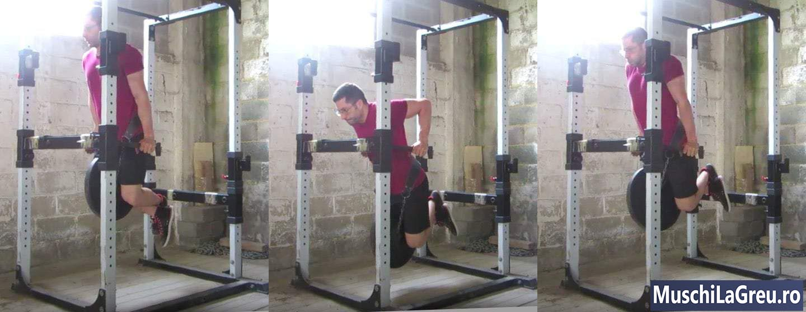

## Cum sa faci flotari la paralele(dips) cu o forma corecta: Ghidul complet

_Dip indoind bratele pana cand umerii sunt sub coatele tale. Apoi reveniti_

Iata cum sa faci Dips(flotari la paralele) cu o forma corecta:

1. Apucati barele paralele si sariti, indreptati-va bratele
2. Coborati-va corpul indoindu-va bratele in timp ce va aplecati
3. Coborati pana cand umerii sunt sub nivelul coatelor
4. Ridicati corpul, indreptandu-va bratele
5. Blocati-va/fixati-va coatele in partea de sus(top)

Dips(flotari la paralele) sunt un exercitiu compus, cu greutate corporala. Faci Dips(flotari la paralele) ridicandu-te mai intai pe doua bare cu brate drepte. Coborati-va corpul pana cand umerii sunt sub nivelul coatelor. Impingeti-va pana cand bratele sunt din nou drepte. Dipsurile iti lucreaza pieptul, umerii, spatele si muschii bratului.

Forma corecta a Dip-ul este esentiala pentru a evita durerile de umar si piept. Nu lasa umerii sa se rasuceasca inainte. Nu ridica din umeri. Tine-ti umerii inapoi si in jos. Coborati-va pana cand umerii va sunt sub coate, dar nu mai mult. Faceti flotari pe bare paralele fixe si evitati flotaril la inele.

Dips-urile nu fac parte din [Antrenamente 5x5](/program/5x5/) in mod implicit. Nu aveti nevoie de ele pentru a castiga forta si muschi. Daca doriti sa va accentuati bratele si aveti timp pentru a face mai mult, puteti adauga Dips(flotari la paralele) la antrenamentul A. Dar ramaneti concentrat pe imbunatatirea genuflexiunilor(Squats). Conteaza cel mai mult pentru castigarea fortei si a muschilor.

Acesta este ghidul complet pentru o forma corespunzatoare pentru flotari la paralele. Acopera, de asemenea, variatii precum Dips(flotari la paralele) cu greutate(Weighted Dips).

Cuprins

   <ul class="contents-ul">
      <li style="list-style:none;">
         <a style="font-size:16px;" href="#introducere"> 1 Introducere</a>
         <ul style="list-style:none; margin-top:0; margin-bottom:0;">
           <li style="list-style:none; margin-bottom:0;"><a style="font-size:16px;" href="#cum-sa-faci-dips">1.1. Cum se faci dips</a></li>
            <li style="list-style:none; margin-bottom:0;"><a style="font-size:16px;" href="#dips(flotari-la-paralele)-forma"> 1.2. Dips(flotari la paralele) forma 101</a></li>
            <li style="list-style:none; margin-bottom:0;"><a style="font-size:16px;" href="#muschii-lucrati"> 1.3. Muschii lucrati/antrenati</a></li>
         </ul>
      </li>
      <li style="list-style:none;">
         <a style="font-size:16px;" href="#tehnica-dip"> 2 2. Tehnica Dip</a>
         <ul style="list-style:none; margin-top:0; margin-bottom:0;">
            <li style="list-style:none; margin-bottom:0;"><a style="font-size:16px;" href="#priza">2.1. Priza</a></li>
            <li style="list-style:none; margin-bottom:0;"><a style="font-size:16px;" href="#latimea-prizei"> 2.2. Latimea prizei</a></li>
            <li style="list-style:none; margin-bottom:0;"><a style="font-size:16px;" href="#antebrate"> 2.3. Antebrate</a></li>
            <li style="list-style:none; margin-bottom:0;"><a style="font-size:16px;" href="#coatele"> 2.4. Coatele</a></li>
            <li style="list-style:none; margin-bottom:0;"><a style="font-size:16px;" href="#piept"> 2.5. Piept</a></li>
            <li style="list-style:none; margin-bottom:0;"><a style="font-size:16px;" href="#umeri"> 2.6. Umeri</a></li>
            <li style="list-style:none; margin-bottom:0;"><a style="font-size:16px;" href="#cap"> 2.7. Cap</a></li>
            <li style="list-style:none; margin-bottom:0;"><a style="font-size:16px;" href="#trunchi"> 2.8. Trunchi</a></li>
            <li style="list-style:none; margin-bottom:0;"><a style="font-size:16px;" href="#partea-inferioara-a-spatelui"> 2.9. Partea inferioara a spatelui</a></li>
            <li style="list-style:none; margin-bottom:0;"><a style="font-size:16px;" href="#picioare"> 2.10. Picioare</a></li>
            <li style="list-style:none; margin-bottom:0;"><a style="font-size:16px;" href="#partea-de-sus-dip-ului"> 2.11. Varful(Top)</a></li>
            <li style="list-style:none; margin-bottom:0;"><a style="font-size:16px;" href="#coborarea"> 2.12. Coborarea</a></li>
            <li style="list-style:none; margin-bottom:0;"><a style="font-size:16px;" href="#partea-de-jos"> 2.13. Partea de jos</a></li>
            <li style="list-style:none; margin-bottom:0;"><a style="font-size:16px;" href="#respiratia"> 2.14. Respiratia</a></li>
         </ul>
      </li>
      <li style="list-style:none;">
         <a style="font-size:16px;" href="#probleme-comune"> 3 Probleme comune</a>
         <ul style="list-style:none; margin-top:0; margin-bottom:0;">
           <li style="list-style:none; margin-bottom:0;"><a style="font-size:16px;" href="#inselaciune">3.1. A trisa</a></li>
           <li style="list-style:none; margin-bottom:0;"><a style="font-size:16px;" href="#nu-pot-face-niciun-dips"> 3.2. Nu pot face niciun Dips</a></li>
           <li style="list-style:none; margin-bottom:0;"><a style="font-size:16px;" href="#dureri-de-umar"> 3.3. Dureri de umar</a></li>
           <li style="list-style:none; margin-bottom:0;"><a style="font-size:16px;" href="#dureri-in-piept"> 3.4. Dureri ale pieptului</a></li>
         </ul>
      </li>
      <li style="list-style:none;">
         <a style="font-size:16px;" href="#variatii-de-dips">4 Variatii</a>
         <ul style="list-style:none; margin-top:0; margin-bottom:0;">
           <li style="list-style:none; margin-bottom:0;"><a style="font-size:16px;" href="#weighted-dips">4.1. Weighted Dips</a></li>
           <li style="list-style:none; margin-bottom:0;"><a style="font-size:16px;" href="#bench-dips"> 4.2. Bench Dips</a></li>
           <li style="list-style:none; margin-bottom:0;"><a style="font-size:16px;" href="#ring-dips"> 4.3. Ring Dips</a></li>
           <li style="list-style:none; margin-bottom:0;"><a style="font-size:16px;" href="#aparatul-pentru-dips(dips-machine)"> 4.4. Aparatul pentru Dips(Dips Machine)</a></li>
         </ul>
      </li>
   </ul>

## Introducere

## Cum sa faci Dips(Flotari la paralele)

Aveti nevoie de doua bare Dip pentru a face Dips. Aceste bare trebuie sa fie paralele, fixe si stabile. Majoritatea salilor de gimnastica au o statie Dip pe care o puteti folosi si pentru Pullups si ridicarea genunchiului agatat. Puteti face si Dips-uri in Power Rack, daca primiti doua manere de scufundare care se incadreaza in ace de siguranta. Nu faceti Dips(flotari la paralele) pe inele sau intre banci, ambele va pot rani umerii. Utilizati in schimb bare paralele. Iata cum se face Dips(flotari la paralele) cu o forma corecta in cinci pasi simpli...

- **Pregatirea**. Prinde barele si sari. Echilibreaza-te cu coatele fixate.
- **Dips**. Coborati-va corpul indoindu-va bratele. Inclinati-va trunchiul usor inainte.
- **Break Parallel**. Coborati pana cand umerii va sunt sub nivelul coatele, in partea de jos.
- **Ridica-te**. Ridicati corpul inapoi in pozitia de pornire/initiala, indreptandu-va bratele.
- **Lockout**. Echilibreaza-te cu umerii peste maini. Blocheaza-ti/Fixeaza-ti coatele.

Daca va lipseste puterea pentru a face o singura repetare, faceti exercitii negative. Treceti peste partea de urcare, pentru moment, si faceti doar coborarea pe care sunteti mai puternici. Apucati barele pentru flotarile la paralele(dips), sariti si indreptati bratele. Coborati incet pana cand umerii va sunt sub nivelul coatelor. Apoi puneti-va picioarele pe podea si sariti inapoi pe barele pentru dips cu bratele drepte. Cand puteti face 10 repetari negative cu o forma adecvata, puteti face un singur dip .

## Dips(flotari la paralele) forma corecta

Modul ideal de a face Dips(flotari la paralele) este cu mainile sub umeri. Acest lucru mentine bratele aproape de corp. Umerii mai largi au nevoie de o prindere mai larga. Dar aveti nevoie de bare in unghi pentru a le regla. Barele mele sunt paralele, asa ca latimea mea de prindere urmareste echipamentul meu. Acest lucru functioneaza bine daca aveti o greutate medie. Dar poate fi o problema pentru corpurile speciale. Tine minte si urmati aceste recomandari pentru a face Dips(flotari la paralele) cu o forma corecta...

- **Latimea prizei** . Mainile tale ar trebui sa fie la acelasi nivel cu umerii si in afara soldurilor.
- **Priza**. Tineti barele cu mana joasa, aproape de incheieturi. Folositi o strangere completa si strangeti barele.
- **Antebratelor**. Tine-ti antebratele verticale din toate unghiurile, in coborare si in urcare.
- **Coate**. Blocati-le in partea de sus. Si tineti-le la 45 ° in partea de jos. Nu le lasati si nu va atingeti trunchiul.
- **Piept**. Ridica-ti pieptul inainte sa cobori. Ridicati pieptul intre repetari in varf.
- **Umerii**. Impingeti-i inapoi si in jos. Nu-i lasati sa aplece inainte. Nu-ti ridica umerii, de asemenea.
- **Cap**. Mentineti-va capul pe linie cu trunchiul. Nu te uita la tavan. Priviti podeaua din fata.
- **Trunchi**. Trunchiul trebuie sa fie usor inclinat pentru a avea echilibru. Inclinati-va usor inainte in timp ce coborati.
- **Partea** inferioara a spatelui. Nu va arcuiti partea inferioara a spatelui.Trebuie sa ramana neutra. Trebuie sa se formeze o linie dreapta de la umeri pana la genunchi.
- **Picioare**. Indoaie genunchii si incruciseaza-ti picioarele. Puteti mentine picioarele drepte daca aveti bare inalte.
- **Varfu**(Top). Bratele drept. Coatele fixate. Piept sus. Umerii impins in jos. Trunchiul inclinat usor.
- **Coborarea**. Ridicati-va pieptul, inspirati si indoiti-va bratele. Inclinati usor inainte.
- **Partea** de jos a dip-ului. Break parallel coborand-va pana cand umerii va sunt sub coate.
- **Urcarea**. Ridicati-va indreptandu-va bratele. Nu te uita in sus. Tine-ti umerii in jos.
- **Lockout**. Bratele drepte. Coatele incuiate. Piept sus. Umerii in jos. Cap neutru.
- **Respiratia**. Inspirati in partea de sus. Mentineti in coborare. Expirati din nou in varf.

<!-- Gratuit: descarcati lista mea de verificare pentru a obtine cele mai bune sfaturi pentru a face Dips(flotari la paralele) cu o forma corecta. Recititi aceste sfaturi intre seturi si veti face mai multe Dips(flotari la paralele) fara sa va raniti. . Inscrieti-va pentru a avea acces instantaneu la lista de verificare si va voi trimite sfaturi si trucuri zilnice pe e-mail. Doar faceti click aici. -->

## Muschii lucrati

Flotarile la paralele(dips) lucreaza mai mult decat tricepsul. Bratele se indoaie si se indreapta pentru a va misca corpul. Dar primesc ajutor de la umeri, piept si muschii spatelui. Si mult mai multi muschi lucreaza pentru a va mentine echilibru in timp ce corpul dvs. se misca. Acesta este motivul pentru care Dips-urile sunt un exercitiu compus: lucreaza multi muschi in acelasi timp. Acesta este si motivul pentru care va puteti antrena mai intens : mai multi muschi solicitati, mai multa forta. Muschii lucrati la Dips...

- **Bratele**. Tricepsul iti indreapta bratele pentru a-ti muta corpul in sus. Tricepsul tau este cel mai mare muschi al bratului, aflat in spatele bratului superior. Cu cat tricepsul tau este mai puternic, cu atat va fi mai musculos si cu cat bratele tale sunt mai mari. Muschii antebratelor lucreaza, de asemenea, pentru a tine barele stranse.
- **Piept** si umeri. Dips-urile sunt ca o presa verticala (vertical [Bench Press(Impinsul cu haltera de la piept)](/exercitii/piept/impinsul-cu-haltera-de-la-piept/)). Va impingeti corpul in sus pe Dips(flotari la paralele) ca si cum apasati bara de pe banca(Bench). Bratele superioare sunt paralele cu podeaua din partea de jos si trebuie sa fie verticale pentru blocare. Acest lucru solicita muschii pieptului si umerilor.
- **Abdomen**. Muschii tai abdominali tin spatele neutru, in timp ce corpul se misca in sus si in jos. Acestia impiedica arcuirea in excesiv si il mentin neutru. Acest lucru dezvolta „6 pack-ul”, rectus abdominus. Vor aparea daca mananci corect.

Flotarile la paralele lucreaza aceeasi muschi ca [Bench Press(Impinsul cu haltera de la piept)](/exercitii/piept/impinsul-cu-haltera-de-la-piept/) si flotari. Diferenta este ca poti lucru mai intens pe Bench decat Dips, si pe Dips(flotari la paralele) decat flotari. Pe Bench, doar adaugati placi pe bara. La Dips(flotari la paralele) puteti adauga cu usurinta greutate folosind o curea(dip belt). Flotarie sunt greu de facut. Ai nevoie de o vesta x (x-vest) sau de lanturi in jurul gatului sau cineva trebuie sa-ti puna o farfurie pe spate. Cu Press Bench si Dips(flotari la paralele) este mai usor sa avansezi, sa adaugi o greutate mai mare.

Dips-urile sunt mai eficiente decat pushdowns sau skullcrushers la a construi brate mai mari. Greutatea pe Dips(flotari la paralele) este mai mare. Trebuie sa va ridicati greutatea. Un tip mediu de 75 kg ca mine poate face cu usurinta Dips-uri cu greutate corporala. Le pot face cu 20 kg in plus, in total 95 kg. Incercati pushdowns sau skullcrushers cu 95 kg... Dips(flotari la paralele) sunt mai eficiente pentru ca iti lucreaza tricepsul cu o greutate mai mare. Mai multa greutate este egala cu mai multa forta, care este egala cu mai multi muschi.

## Tehnica Dip

## Prindere/Priza

Priza completa. Strangeti barele pentru flotarile la paralele cu degetele mari. Strangeti barele tare, astfel incat mainile sa nu poata aluneca in timp ce corpul dvs. se misca. Acest lucru impiedica incheieturile sa se indoaie si sa doara atunci cand faci Flotari la paralele. De asemenea, creste rezistenta, deoarece bratele, umerii si muschii toracelui se pot contracta mai tare atunci cand strangeti barele. Nu faceti Dips(flotari la paralele) cu o prize ce nu implica si degetele cele mari. Folositi prize completa pentru a avea mai multa forta si o forma mai buna.

Priza cu palma joasa(Grip Low Palm). Pune partea de jos a palmelor pe barele pentru dips. Incheieturile si antebratele trebuie sa fie aliniate cu barele pentru a putea impinge direct in ea. Aceasta creste rezistenta si previne durerea incheieturilor. Apucarea barelor in mijlocul palmei este gresita, deoarece nu iti pune antebratele peste barele pentru dips. Iar presiunea corpului tau iti va indoi incheieturile, le va intinde pe spate si va provoca dureri. Prindeti barele in partea de jos a palmei ca la [Bench Press(Impinsul cu haltera de la piept)](/exercitii/piept/impinsul-cu-haltera-de-la-piept/).

## Latimea prizei

Prinderea/priza ingusta. Prindeti barele pentru flotari la paralele cu mainile la nivelul umerilor. Mainile tale ar trebui sa fie sub umeri si chiar in afara soldurilor. Acest lucru mentine bratele aproape de corp si de umeri stransi. Puteti prinde barele mai largi daca aveti umeri largi si acces la barele inclinate(angled dip bars). Daca folositi bare fixe, ca mine, echipamentul dvs. va determina latimea de prindere. Acest lucru functioneaza de obicei bine daca nu aveti umeri foarte mici / largi.

## Antebrate

_Inclinati-va inainte cand coborati. Antebratele tale ar trebui sa fie perpendiculare pe podea._

Verticala din lateral. Mentineti-va antebratele verticale in timp ce corpul dvs. se misca in sus si in jos. Aceasta creste rezistenta, deoarece oasele antebratului pot impinge direct in bare(la paralele). Singura modalitate de a va mentine antebratele verticale in timpul Dips(flotari la paralele) este sa va aplecati usor inainte pe drumul in jos/coborare. Mentinerea trunchiului vertical este ineficienta, deoarece iti pune antebratele inapoi si inclinate in partea de jos. Inclinati-va usor inainte, pe coborare.

Verticala din fata. Antebratele trebuie sa fie, de asemenea, verticale (perpendiculare) pe podea atunci cand privesti si din fata si din spate. Daca antebratele sunt inclinate, priza este prea ingusta sau lata. Prea ingusta este ca o priza ingusta pe [Bench Press(Impinsul cu haltera de la piept)](/exercitii/piept/impinsul-cu-haltera-de-la-piept/). Prea lata este rea pentru umeri. Reglati-va priza astfel incat mainile sa fie chiar sub umeri si in afara soldurilor. Pentru aceasta, veti avea nevoie de acces la barele inclinate pentru dips(angled dip bars). Dar iti va creste puterea pe Dips.

## Coate

_Blocati-va(lock) coatele in partea de sus a fiecarei repetari._

Blocati in partea de sus. Incepeti si terminati fiecare repetare cu brate drepte sau repetarea nu este corecta. Blocheaza-ti coatele inainte sa cobori. Blocati-le din nou in partea de sus a fiecarei repetari. Acest lucru iti lucreaza muschii corpului superior printr-o gama completa de miscare. Vei dobandi brate mai puternice si mai mari. Nu faceti jumatate de repetare sau veti obtine jumatate din castiguri. Blocheaza-ti coatele. Atata timp cat nu te hiper-extindeti, ci blochezi usor, articulatiile tale vor fi bine.

Cotul la 45 °. Tine-ti bratele aproape de corp. Nu ar trebui sa va atinga trunchiul in partea de jos. Dar nici nu ar trebui sa se miste (flare) si sa nu ajunga perpendiculare. Strangeti barele(la paralele), astfel incat mainile sa va fie sub umeri. Apoi trageti-va coatele la 45°, in coborare si mentineti-va antebratele verticale. La inceput, acest lucru poate fi mai dificil daca esti obisnuit sa iti misti(flare) coatele. Dar este mai bine pentru umeri si vei fi mai puternic.

## Piept

Ridica-ti pieptul. Ridicarea pieptului opreste partea superioara a spatelui de la rotunjire, ceea ce poate provoca dureri in piept. De asemenea, va ajuta sa va tineti umerii inapoi, astfel incat sa nu doara. Faceti un piept mare in partea de sus a fiecarei repetari. Respirati puternic, mentineti-va respiratia si coborati. Break parallel coborand pana cand umerii sunt sub coatele tale. Reveniti, indreptandu-va bratele. Blocati-va Dips-urile ridicand pieptul in partea de sus.

## Umeri

Impingeti-va umerii in jos. Nu-ti lasa umerii sa se duca in fata sau te vei accidenta. Tineti-i inapoi ridicand pieptul, inainte sa cobori. Finalizati fiecare repetare ridicand pieptul din nou, astfel incat umerii sa ramana inapoi. Nu trebuie sa va contractati omoplatele. Dar umerii tai nu se pot misca inainta si nu ridica din umeri, impotriva urechilor. Daca o fac, impingeti umerii in jos in timp ce faceti Dips. Si amintiti-va sa va ridicati pieptul.

## Cap

Cap neutru. Nu priviti tavanul deoarece gatul va fi ranit si umerii vor veni in fata. Capul trebuie sa ramana in linie cu trunchiul. Dar trebuie sa va aplecati usor inainte, pe drumul in jos, pentru a va mentine antebratele verticale. Inseamna ca nu puteti privi drept inainte, altfel capul dvs. nu va ramane in linie cu trunchiul. In schimb, uita-te la podeaua din fata ta in timp ce faci Flotari la paralele. Acest lucru mentine gatul neutru si in siguranta.

## Trunchi

Apleaca-l in fata. Antebratele dvs. nu pot ramane verticale daca va mentineti trunchiul in pozitie verticala. Vor fi inclinate in partea de jos, ceea ce este ineficient si va poate face sa pierdeti echilibrul. Trebuie sa va aplecati usor inainte pe drumul in jos. Nu exagerati sau veti pierde echilibrul. Ideea este sa va mentineti antebratele verticale in partea de jos. Daca o faci bine, iti vei solicita mai mult pieptul si vei avea mai multa putere.

## Partea inferioara a spatelui

Arc natural. Partea inferioara a spatelui trebuie sa ramana neutra atunci cand faceti flotarile la paralele. Neutru inseamna sa pastrezi un arc natural ca atunci cand stai. Partea inferioara a spatelui nu ar trebui sa fie plata sau curbata prea mult. Daca hiper-extindeti, va veti perfora discurile coloanei vertebrale si puteti avea dureri de spate. Pastrati-va partea inferioara a spatelui neutru, contractand abdomenul si mentinandu-va cutia toracica in jos. Faceti flotari la paralele cu o linie dreapta de la umeri pana la genunchi atunci cand priviti din lateral.

## Picioare

Genunchi indoiti vs picioare drepte. Puteti mentine spatele neutru mai usor daca faceti Dips(flotari la paralele) cu picioarele drepte. Acest lucru se datoreaza faptului ca va puteti contracta mai tare fesele, ceea ce impiedica arcuirea excesiva a spatelui inferior. Insa picioarele tale vor lovi podeaua decat daca nu folosesti bare pozitionate la inaltime mare pentru a face Dips(flotari la paralele) cu picioarele drepte. Prefer sa-mi se indoaie picioarele. Daca faceti acest lucru, asigurati-va ca va mentineti partea inferioara a spatelui neutru, incordandu-va abdomenul si fesele.

## Varful/partea de sus dip-ului

Brate drepte. Blocati-va coatele inainte sa coborati. Inceperea dip-ului cu coatele indoite nu conteaza, la fel cum jumatate de genuflexiunile(Squats) nu se pune ca o repetare. Coatele indoite usureaza Dips-urile prin scurtarea gamei de miscare. Trebuie sa iti lucrezi muschii corpului superior printr-o gama completa de miscare pentru a castiga forta maxima si pentru a construi masa musculara. Indreptati-va bratele inainte sa coborati. Blocheaza din nou coatele pentru a-ti incheia repetarea.

Pieptul in sus. Ridicarea pieptului impiedica rotunjirea partii superioara a spatelui. Va ajuta sa va tineti umerii inapoi si in jos, astfel incat sa nu fie afectati. Faceti un piept mare inainte sa va coborati.Mentine-l umplandu-ti cutia toracica cu aer. Piept in sus, respiratie puternica, mentinerea respiratiei. Apoi,coboara pana cand treci de paralela(break parallel). Daca umerii nu raman inapoi, impingeti-i in jos. Nu-i lasa sa se miste inainte si sa ridice din umeri, pana la nivelul urechilor.

## Coborarea

Apleaca-te in fata. Coborati (dip down) indoindu-va bratele. Mentineti-va antebratele verticale aplecandu-va usor inainte. Unghiul exact al trunchiului depinde de corpul dvs. Dar scopul este sa va mentineti antebratele verticale atunci cand priviti din lateral. Acest lucru mareste controlul si rezistenta in urcare, deoarece antebratele dvs. pot impinge direct in barele pentru dips. Nu cobori direct. Inclinati usor inainte.

## Partea de jos a dip-ului

_Coborati pana cand umerii va sunt sub coate._

Break Parallel. Nu trebuie sa mergeti cat mai jos pentru a obtine o intindere(stretch) mai mare. Nu ar trebui sa faci asta pentru ca va poate afecta umerii. Dar trebuie ca bratele superioare sa fie paralele cu podeaua sau orice altceva nu este suficient de scazut. Trebuie sa treceti de paralela (break parallel) coborand pana cand umerii va sunt sub coate. Acesta este singurul mod in care Dips(flotari la paralele) iti va lucra muschii corpului superior printr-o gama completa de miscare. Este modul in care obtineti forta maxima si castigurile musculare.

## Respiratia

Respirati in partea de sus. Echilibrati-va pe barele de scufundare cu coatele incuiate si picioarele in aer. Ridica-ti pieptul pentru a-ti tine umerii jos. Apoi inspirati puternic, tineti-l si scufundati-va. Tine-ti respiratia pe drumul in jos si in partea de jos. Vino inapoi, ridica pieptul si blocheaza coatele. Expirati, adunati-va o secunda si repetati. Nu respirati in timpul Dips-urilor sau veti pierde etanseitatea si pieptul se va prabusi.

## Probleme comune

## Cheating( a trisa)

Forma corecta pe Dips(flotari la paralele) incepe cu coatele blocate si se termina cu umerii mai jos decat coatele. Aceasta lucreaza, in acelasi timp, cea mai mare cantitate de muschi. Iti lucreaza bratele, umerii si pieptul printr-o gama completa de miscare.Dar,de asemenea, ingreuneaza Dips-urile, deoarece corpul tau se deplaseaza pe o distanta mai mare. Multi oameni triseaza, coborand doar jumatate din drum. Dar acest lucru duce la jumatate din forta si castigurile musculare.

Blocheaza-ti coatele in partea de sus. Incepeti fiecare repetare cu bratele drepte. Coborati pana cand umerii va sunt sub coate. Apoi ridica-te, indreapta-ti bratele si blocheaza coatele. Nu incercati sa obtineti mai multa tensiune, tinand coatele deblocate in partea de sus. Acest lucru scurteaza intervalul de miscare. Finalizati toate repetarile blocand coatele. Articulatiile tale vor fi in siguranta daca nu-ti dai coatele peste limita normala de miscare, dar se blocheaza mai usor.

Treceti de paralela(break parallel) in partea de jos. Coborati-va pana cand umerii va sunt mai jos decat coatele. Nu trebuie sa cobori cat poti de mult pentru a obtine o intindere(stretch) mai mare. Umerii si pieptul pot fi afectati daca exagerati, mergand prea jos - nu faceti asta. Dar bratele superioare paralele cu podeaua nu sunt suficient de joase. Trebuie sa treceti de aceasta paralela(break paralela) aducand umerii sub coatele tale. Rugati pe cineva sa verifice sau inregistrati-va singuri.

Flotarile la paralele sunt mai grele atunci cand utilizati o gama completa de miscare. Dar acesta este motivul pentru care sunt mai eficienti pentru a dobandi forta si muschii in partea superioara a corpului. Nu va acel om care face Dips(flotari la paralele) cu 20 de kilograme atasate la centura, dar face doar jumatate de dip. Esti ca omul care se lauda cu Bench 300lb, dar fundul se ridica la fiecare repetare si el nu atinge niciodata pieptul. Nu este eficient si nu conteaza. Faceti-va Dips-urile in mod corespunzator.

## Nu pot face niciun dip

Flotarile la paralele te obliga sa-ti ridici greutatea. Acest lucru este adesea prea greu atunci cand sunteti la inceput. Este motivul pentru care prefer barele: sunt mai usor de adaptat/reglat. Sa presupunem ca cantaresti 75 kg ca mine, nu pornesti [Antrenamente 5x5](/program/5x5/) cu 75 kg la genuflexiuni( Squats). Incepi cu bara goala de 20 kg. Dar nu puteti incepe mai usor cu Dips. Puteti slabi, dar acest lucru necesita timp si nu veti ajunge la 20 kg. Flotarile la paralele(Dips) sunt mai grele, deoarece trebuie sa incepi intens.

Cel mai bun mod de a face Dips-ul mai usor daca nu puteti face nicio repetare este sa faceti exercitii negative. Concentrati-va sa faceti doar drumul in jos, adica negative. Coborati incet pana cand umerii va sunt sub coate. Apoi puneti-va picioarele pe podea si sariti inapoi pe barele pentru flotarile la paralele cu bratele drepte. Esti mai puternic in coborare decat in urcare, pentru a putea face acest lucru. Dupa ce puteti face zece negative cu o forma adecvata, puteti face un singur dip.

Puteti ruga, de asemenea, pe cineva sa va ajute prinzandu-va laturile cu mainile sale, pentru a va ajuta in urcare. Obtinerea ajutorului de la o banda de rezistenta nu functioneaza pe Flotari la paralele, uitati de ea. Uitati si de aparate(assisted dip machine). Iti misca bratele si greutatea, dar nu si corpul. Arata la fel, dar nu este. Vei deveni mai bun la flotari la paralele facute cu un aparat, dar doar atat. Cel mai bun mod de a deveni mai puternic la Dips(flotari la paralele) este sa faci Dips.

Pentru a deveni mai puternic la Dips, cat mai rapid, faceti Dips(flotari la paralele) zilnic. Puteti face usor Dips-uri acasa, punand doua scaune pe spate. Faceti flotari la paralele de mai multe ori pe zi. Coborati incet pana cand picioarele tale ating podeaua. Ridicati-va si repetati. Dupa cateva saptamani veti avea puterea sa faceti o flotare completa. Aceasta tehnica Pavel Tsatsouline numeste „Greasing The Groove”. Vei fi mai puternic la Dips(flotari la paralele) daca faci Dips(flotari la paralele) si ii faci frecvent.

## Dureri de umar

Flotarile la paralele va vor afecta umerii daca nu reusiti sa-I mentineti in pozitie. Nu lasa umerii sa se aplece inainte. Nu iti ridica umerii pana la nivelul urechilor. Impingeti umerii inapoi si in jos. Ridica-ti pieptul in partea de sus, inainte sa cobori. Respirati puternic inainte de a cobora si mentineti-va respiratia pe drumul in jos. Nu expirati sau veti pierde etanseitatea. Coborati, break parallel si reveniti. Expirati, ridicati pieptul, repetati.

Asigurati-va ca nu mergeti prea jos. Trebuie sa folositi o gama completa de miscare pentru a obtine rezistenta maxima si muschi cu Flotarile la paralele. Dar asta nu inseamna ca ar trebui sa mergeti pana la capat pentru a obtine o intindere(stretch) mai mare. Majoritatea oamenilor nu au flexibilitate pentru a cobori adanc. Umerii dvs. se vor apleca, ceea ce ii pune in pericol. Coborati(dip) cu o gama completa de miscare. Dar opriti-va cand umerii va sunt sub coate. Nu este nevoie sa coborati mai mult.

## Dureri in piept

Durerea la nivelul toracelui sau a claviculei se intampla daca partea superioara a spatelui se rotunjeste in timpul Dips-ului. Partea superioara a spatelui se va rotunji daca nu reusiti sa va mentineti pieptul sus. Ridicati pieptul in partea de sus, inainte de a cobora. Mentineti-va forma umplandu-ti plamanii cu aer. Inspirati puternic, mentineti-o, apoi coboara. Treceti de paralela(break parallel) in partea de jos, fara a merge prea jos sau a expira. Apoi reveniti, blocati-va coatele si ridicati pieptul din nou. Tine-ti umerii in jos.

## Variatii de dips

## Dips(flotari la paralele) cu greutati(Weighted dips)

_Utilizati o curea pentru dip(dip belt) pentru a adauga greutate pe Dips_

Dips-urile ponderate(Weighted dips) sunt flotari la paralele cu greutate suplimentara. Puneti o centura pentru flotari la paralele cu discuri atarnate pe un lant de talie. Apoi coborati indoindu-ti bratele si te ridici din nou. Adaugarea greutatilor este cruciala odata ce puteti face zece Dips(flotari la paralele) cu o forma adecvata. Facerea High Dips-urilor este ineficienta pentru formarea fortei si a muschilor.Aceasta creeaza rezistenta. Nu faceti 20 de repetari de [Bench Press(Impinsul cu haltera de la piept)](/exercitii/piept/impinsul-cu-haltera-de-la-piept/) pentru a construi un piept mai mare. Adaugati greutate. La fel si pe Dips: adaugati greutate.

Cea mai usoara modalitate de a face Weighted Dips(flotari la paralele) este folosirea unei curele pentru dips. Aceasta este o centura pe care o pui in jurul taliei. Are un lant care intra in gaurile placilor/discurilor pe care le pui pe bara. Placile atarna de lantul respectiv si cureaua dintre picioare, in timp ce faci Dips(flotari la paralele). Centurile de calitate pot suporta cu usurinta o greutate de peste 80kg / 150lb.

_Utilizati o curea pentru flotari la paralele pentru a adauga greutate._

Nu puneti un lant pe centura pe care o utilizati pentru genuflexiuni(Squats) and Deadlifts. O veti deteriora. Obtineti in schimb o curea speciala pentru dips. Iata cateva pe care le recomand...

- **Curea** Dip Polypro
- **Curea** Brute
- **Curea** Rogue Dip

Puteti face, de asemenea, Weighted Dips, tinand o gantera intre picioare. Dar acest lucru functioneaza doar cu greutati usoare. O gantera grea iti va cadea dintre picioare. Chiar daca il puteti tine, picioarele dvs. nu pot fi indoite, trebuie sa fie drepte. Acest lucru inseamna ca barele(dip bars) trebuie sa fie mai inalte, astfel incat picioarele sa nu atinga podeaua in timp ce tii gantera intre picioare. Serios, trebuie sa va achizitionati cureaua. Este mai usor de utilizat si economiseste timp.

Treceti la Weighted Dips(flotari la paralele) odata ce puteti face 10 Dips(flotari la paralele) cu o forma adecvata. Incepeti cu 2,5 kg / 5lb pentru doua seturi de cinci si adaugati greutate la fiecare antrenament. Cel mai bine este sa incarcati cate putin(microload). Dips-urile folosesc muschi mai mici, la fel ca [Bench Press(Impinsul cu haltera de la piept)](/exercitii/piept/impinsul-cu-haltera-de-la-piept/) si Overhead Press. Veti progresa mai mult daca adaugati doar 1 kg / 2lb la fiecare antrenament. Imi place sa fac doua seturi de cinci Weighted Dips(flotari la paralele) la sfarsitul antrenamentului, urmate de un set de Dips(flotari la paralele) doar cu greutate corporala pentru cat mai multe repetari.

## Bench Dips

Bench Dips(flotari la paralele) sunt Dips(flotari la paralele) intre doua banci plane. Iti pui mainile pe banca din spate. Picioarele merg pe banca din fata ta. Ridica fundul de pe podea, indreptandu-ti bratele. Indoaie usor picioarele pentru a evita presiunea asupra articulatiilor genunchiului. Apoi coborati prin indoirea bratelor pana cand va treceti de paralela(break parallel). Ridicati-va si repetati. Puteti adauga greutate punand o farfurie pe coapse, in timp ce faceti Bench Dips.

Bench Dips(flotari la paralele) sunt groaznice pentru umerii tai. Mainile tale nu sunt langa trunchiul ca atunci cand faci Dips(flotari la paralele) pe bare. Sunt in spatele tau, deoarece acolo este banca. Acest lucru face imposibil sa va mentineti umerii inapoi si in jos. Vor veni inainte. Si cu cat mergi mai adanc si mai greu, cu atat umerii iti vor veni mai in fata. Acest lucru accentueaza articulatiile umarului si le poate afecta. Nu faceti Bench Dips. Faceti pe bare.

## Flotari(Dips) la inele

Dipsurile inelare(Flotari la inele) sunt Dips(flotari la paralele) care folosesc inele de gimnastica in loc de bare pentru dips(flotari la paralele). Prinde cele doua inele si sari pentru a ridica picioarele de pe podea. Indoiti-va bratele si coborati(dip) in timp ce tineti mainile aproape de corp, nu le lasati sa se abata. Treceti de paralela(break parallel), reveniti si repetati. Facand dips pe inele este mai greu decat pe bare paralele, deoarece inelele sunt instabile. Muschii tai trebuie sa te stabilizeze ceea ce adauga provocarii.

Dar Flotari la inele(flotari la paralele) sunt periculoase pentru umeri. Avantajul lor principal este si dezavantajul lor major. Mainile tale trebuie sa stea aproape de corp pentru a-ti tine umerii stransi.Dar inelele lucreaza impotriva ta, deoarece nu sunt fixate. Ele se pot indeparta de corpul si poti pune umerii intr-o pozitie slaba, nefavorabila. Acest lucru va poate afecta muschii coafei rotatorii (rotator cuff muscles) care va tin umerii impreuna. Uitati de inele si faceti flotari la paralele.

## Aparate pentru flotari la paralele(Dips Machines)

The Assisted Dip Machine este un aparat care va ajuta sa faceti dips(flotari la paralele) atunci cand nu aveti rezistenta. Va asezati cu genunchii sau picioarele pe o platforma. Apoi apucati barele, coborati(dip) si reveniti. Aparatul te va ajuta sa uric prin ridicarea platformei care iti sustine genunchiului. Foloseste o greutatea de contrabalans pentru aceasta. Cu cat veti seta mai mult greutatea pe masina, cu atat va va oferi mai mult ajutor pe parcursul finalizarii Dips-urilor dvs.

Exista un alt aparat pentru dips, Dip Machine, unde stai pe o banca cu coapsele blocate sub suport. Apucati barele de langa dvs., indoiti bratele si le indreptati din nou. Aceasta masina este pentru Dips, ceea ce este Lat Pullups pentru Pullups. Puteti seta greutatea pe Dip Machine mai usoara decat greutatea dvs. Nu trebuie sa va ridicati greutatea corpului spre deosebire de momentul in care faceti flotari la paralele obisnuite. Asadar, masina Dip este mai usoara.

Dar aparatele nu sunt la fel. Muschii dvs. nu trebuie sa va echilibreze corpul, deoarece te odihnesti pe o platforma sau pe o banca. Abdomenul si muschii inferiori ai spatelui nu trebuie sa va stabilizeze trunchiul, din acelasi motiv. Corpul tau nu se misca pe aparatele pentru dip, ci doar bratele tale. Aceasta inseamna ca lucreaza mai putin muschii decat pe Dips-urile obisnuite. Acesta este motivul pentru care aparatele sunt mai putin eficiente pentru a obtine forta si muschii in partea superioara a corpului.

Poate doriti sa utilizati aparate, deoarece nu puteti face nicio repetare. Sau doriti sa utilizati un aparat pentru a deveni mai puternici, astfel incat sa puteti trece mai tarziu la Dips-uri obisnuite. Dar acest lucru functioneaza rar. Si atunci cand se intampla, intotdeauna dureaza mai mult decat facand Flotari la paralele. Pentru ca folosirea utilajelor pentru a va imbunatati la flotari la paralele este ca si cum ati incerca sa va imbunatatiti la tenis jucand ping pong. Arata la fel, dar nu sunt. Trebuie sa joci tenis pentru a deveni mai bun la tenis. La fel si cu flotari la paralele .

Cel mai rapid si eficient mod de a va imbunatati la Dips(flotari la paralele) este sa faceti Dips. Daca nu puteti face nicio repetare, faceti negative. Faceti doar coborarea. Coborati-va incet pana cand treceti de paralela(break parallel). Apoi puneti picioarele pe podea si sariti din nou in pozitia de pornire. Acest lucru functioneaza pentru ca esti mai puternic in coborare decat in urcare/ridicare. Dupa ce puteti face zece negative cu o forma adecvata, incercati sa faceti un dip complet. Veti putea sa o faceti.
