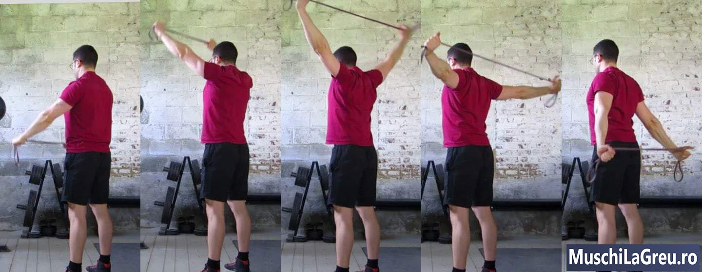

## Cum sa faci Genuflexiuni(Squats) cu o forma corecta: Ghidul complet

.jpg>)
_Cum sa faci genuflexiuni(Squts) cu un barbell: indoaie-ti picioarele pana cand coapsele sunt paralele cu solul. Apoi reveniti._

Iata cum sa faci genuflexiuni cu o forma adecvata, folosind o barila:

1. Stai cu bara in partea superioara a spatelui, iar picioarele trebuie sa fie paralele cu umerii.
2. Cobori in genuflexiune, impingand genunchii in lateral, in timp ce miscati soldurile inapoi.
3. Pozitia coapselor va fi paralela cu solul, coborand pana cand soldurile sunt mai jos decat genunchii
4. Revino in pozitia initiala, mentinand genunchii in afara si pieptul sus
5. Stai cu soldurile si genunchii blocati in partea de sus

Tineti greutatea o secunda in varf. Respira. Apoi inspirati puternic, tineti-o si faceti urmatoarea genuflexiune. Repetati pana cand ati facut cinci repetari pe [Antrenamente 5x5](/5x5/) .
Squats-ul iti lucreaza intregul corp. Picioarele se indoaie si se indreapta pentru a muta greutatea. Muschii abs si partea inferioara a spatelui va stabilizeaza trunchiul, in timp ce picioarele se misca. Partea superioara a spatelui, umerii si bratele echilibreaza bara din spate. Multi muschi functioneaza in acelasi timp, nu doar picioarele.

Genuflexiuni cu bara este regele tuturor exercitiilor. Lucreaza mai multi muschi, cu o greutate mai mare, decat exercitii mai populare precum [Bench Press](/exercitii/impinsul-cu-haltera-de-la-piept/) . Prin urmare, este mai eficient sa obtii rapid forta generala si muschii . De aceea, faceti genuflexiuni(Squats) 3x / saptamana pe antrenamentul [Antrenamente 5x5](/5x5/) .

Forma corecta pentru Genuflexiuni cu bara este esentiala pentru a evita durerile de genunchi si spate. Nu faceti genuflexiuni partiale(partial Squats), parcurgand doar jumatate din drum. Coborati in genuflexiune pana cand nivelul soldurilor este sub nivelul genunchilor. Faceti genuflexiunea astfel incat genunchii sa fie aliniati cu picioarele voastre. Tine-ti spatele inferior neutru, nu-l lasati sa se curbeze/cocoseze.

Acesta este ghidul complet pentru o forma adecvata a exercitiului Genuflexiuni cu bara. Acopera beneficiile Genuflexiunii cu bara, tehnica pentru Genuflexiuni cu bara(Squat), muschii lucrati, problemele des intalnite si durerea ce poate aparea, precum si variatiile de Genuflexiuni cu bara(Squat) precum Genuflexiuni cu bara(Squat) in fata si Squat Olympic.

Cuprins

<ul class="contents-ul">
  <li style="list-style:none;">
    <a style="font-size:16px;"href="#introducere"> 1 Introducere</a>
    <ul style="list-style:none; margin-top:0; margin-bottom:0;">
       <li style="list-style:none; margin-bottom:0;"><a style="font-size:16px;"href="#beneficiile-genuflexiunilor">1.1 Beneficii exercitiului</a></li>
       <li style="list-style:none; margin-bottom:0;"><a style="font-size:16px;"href="#cum-sa-faci-genuflexiuni">1.2 Cum sa faci genuflexiuni</a></li>
       <li style="list-style:none; margin-bottom:0;"><a style="font-size:16px;"href="#genuflexiuni-101">1.3 Genuflexiuni 101</a></li>
       <li style="list-style:none; margin-bottom:0;"><a style="font-size:16px;"href="#adancimea-corespunzatoare">1.4 Adancimea corespunzatoare</a></li>
       <li style="list-style:none; margin-bottom:0;"><a style="font-size:16px;"href="#muschi-lucrati">1.5 Muschi lucrati</a></li>
       <li style="list-style:none; margin-bottom:0;"><a style="font-size:16px;"href="#videoclipuri">1.6 Clipuri video</a></li>
    </ul>
  </li>
  <li style="list-style:none;">
    <a style="font-size:16px;"href="#protectia"> 2 protectia</a>
    <ul style="list-style:none; margin-top:0; margin-bottom:0;">
      <li style="list-style:none; margin-bottom:0;"><a style="font-size:16px;"href="#protectia-genunchiului">2.1 Protejarea genunchiului</a></li>
      <li style="list-style:none; margin-bottom:0;"><a style="font-size:16px;"href="#protejarea-partii-inferioare-a-spatelui"> 2.2 Protejarea partii inferioare a spatelui</a></li>
      <li style="list-style:none; margin-bottom:0;"><a style="font-size:16px;"href="#esuarea-repetarilor-in-siguranta"> 2.3 Esuarea repetarilor in siguranta</a></li>
    </ul>
  </li>
  <li style="list-style:none;">
    <a style="font-size:16px;"href="#technica-genuflexare"> 3 Technica-squat</a>
    <ul style="list-style:none; margin-top:0; margin-bottom:0;">
      <li style="list-style:none; margin-bottom:0;"><a style="font-size:16px;"href="#postura">3.1 Postura</a></li>
      <li style="list-style:none; margin-bottom:0;"><a style="font-size:16px;"href="#picioarele-si-degetele-de-la-picioare">3.2 Picioarele si degetele de la picioare</a></li>
      <li style="list-style:none; margin-bottom:0;"><a style="font-size:16px;"href="#genunchii">3.3 Genunchii</a></li>
      <li style="list-style:none; margin-bottom:0;"><a style="font-size:16px;"href="#gambe">3.4 Gambe</a></li>
      <li style="list-style:none; margin-bottom:0;"><a style="font-size:16px;"href="#solduri">3.5 Solduri</a></li>
      <li style="list-style:none; margin-bottom:0;"><a style="font-size:16px;"href="#partea-inferioara-a-spatelui">3.6 Partea inferioara a spatelui</a></li>
      <li style="list-style:none; margin-bottom:0;"><a style="font-size:16px;"href="#prinderea">3.7 Prinderea</a></li>
      <li style="list-style:none; margin-bottom:0;"><a style="font-size:16px;"href="#pozitia-barei">3.8 Pozitia barei</a></li>
      <li style="list-style:none; margin-bottom:0;"><a style="font-size:16px;"href="#coate">3.9 Coate</a></li>
      <li style="list-style:none; margin-bottom:0;"><a style="font-size:16px;"href="#partea-superioara-a-spatelui">3.10 Partea superioara a spatelui</a></li>
      <li style="list-style:none; margin-bottom:0;"><a style="font-size:16px;"href="#piept">3.11 Piept</a></li>
      <li style="list-style:none; margin-bottom:0;"><a style="font-size:16px;"href="#cap">3.12 Cap</a></li>
      <li style="list-style:none; margin-bottom:0;"><a style="font-size:16px;"href="#unghiul-de-aplecare">3.13 Unghiul spatelui</a></li>
      <li style="list-style:none; margin-bottom:0;"><a style="font-size:16px;"href="#scoaterea-barei">3.14 Scoaterea barei de pe support/aparat</a></li>
      <li style="list-style:none; margin-bottom:0;"><a style="font-size:16px;"href="#coborarea">3.15 Coborarea</a></li>
      <li style="list-style:none; margin-bottom:0;"><a style="font-size:16px;"href="#baza">3.16 Baza</a></li>
      <li style="list-style:none; margin-bottom:0;"><a style="font-size:16px;"href="#revenirea">3.17 Revenirea</a></li>
      <li style="list-style:none; margin-bottom:0;"><a style="font-size:16px;"href="#intre-repetari">3.18 Intre repetari</a></li>
      <li style="list-style:none; margin-bottom:0;"><a style="font-size:16px;"href="#punerea-barei-pe-suport">3.19 Punerea barei pe suport</a></li>
      <li style="list-style:none; margin-bottom:0;"><a style="font-size:16px;"href="#traseul-barei">3.20 Traseul barei</a></li>
      <li style="list-style:none; margin-bottom:0;"><a style="font-size:16px;"href="#respiratia">3.21 Respiratia</a></li>
    </ul>
  </li>
  <li style="list-style:none;">
    <a style="font-size:16px;"href="#probleme-comune"> 4 Probleme comune</a>
    <ul style="list-style:none; margin-top:0; margin-bottom:0;">
      <li style="list-style:none; margin-bottom:0;"><a style="font-size:16px;"href="#nu-treceti-de-potizia paralela">4.1 Nu se poate ajunge intr-o pozitie paralela</a></li>
      <li style="list-style:none; margin-bottom:0;"><a style="font-size:16px;"href="#pierderea-echilibrului">4.2 Pierderea echilibrului</a></li>
      <li style="list-style:none; margin-bottom:0;"><a style="font-size:16px;"href="#inclinati-spre-inainte">4.3 Inclinati spre inainte</a></li>
      <li style="list-style:none; margin-bottom:0;"><a style="font-size:16px;"href="#calcaiele-ridicate">4.4 Calcaiele ridicate</a></li>
      <li style="list-style:none; margin-bottom:0;"><a style="font-size:16px;"href="#rotunjirea-spatelui-inferior">4.5 Rotunjirea spatelui inferior</a></li>
      <li style="list-style:none; margin-bottom:0;"><a style="font-size:16px;"href="#genunchi-prea-apropiati">4.6 Genunchi prea apropiati</a></li>
      <li style="list-style:none; margin-bottom:0;"><a style="font-size:16px;"href="#firca-de-a-face-genuflexiuni">4.7 Teama de a face genuflexiuni(squats)</a></li>
    </ul>
  </li>
  <li style="list-style:none;">
    <a style="font-size:16px;"href="#dureri-comune"> 5 Dureri comune provocate de genuflexiuni(squats)</a>
    <ul style="list-style:none; margin-top:0; margin-bottom:0;">
      <li style="list-style:none; margin-bottom:0;"><a style="font-size:16px;"href="#dureri-in-zona-gatului">5.1 Dureri in zona gatului</a></li>
      <li style="list-style:none; margin-bottom:0;"><a style="font-size:16px;"href="#durere-la-incheietura-mainiii">5.2 Resimtirea unei dureri la nivelul incheietura mainii</a></li>
      <li style="list-style:none; margin-bottom:0;"><a style="font-size:16px;"href="#dureri-la-nivelul-cotului">5.3 Dureri la nivelul cotului</a></li>
      <li style="list-style:none; margin-bottom:0;"><a style="font-size:16px;"href="#dureri-in-zona-genunchilor">5.4 Dureri in zona genunchilor</a></li>
      <li style="list-style:none; margin-bottom:0;"><a style="font-size:16px;"href="#dureri-ale-spate-inferior">5.5 Dureri ale spate inferior</a></li>
      <li style="list-style:none; margin-bottom:0;"><a style="font-size:16px;"href="#dureri-de-sold">5.6 Durere in zona soldului</a></li>
      <li style="list-style:none; margin-bottom:0;"><a style="font-size:16px;"href="#durerea-inghinala">5.7 Durerea inghinala</a></li>
    </ul>
  </li>
  <li style="list-style:none;">
    <a style="font-size:16px;"href="#genuflexiuni-intindere"> 6 Squat Stretches</a>
    <ul style="list-style:none; margin-top:0; margin-bottom:0;">
     <li style="list-style:none; margin-bottom:0;"><a style="font-size:16px;"href="#flexibilitatea-soldului">6.1 Flexibilitatea soldului</a></li>
     <li style="list-style:none; margin-bottom:0;"><a style="font-size:16px;"href="#flexibilitatea-umerilor">6.2 Flexibilitatea umerilor</a></li>
    </ul>
  </li>
  <li style="list-style:none;">
    <a style="font-size:16px;"href="#echipamente"> 6 Echipamente</a>
    <ul style="list-style:none; margin-top:0; margin-bottom:0;">
      <li style="list-style:none; margin-bottom:0;"><a style="font-size:16px;"href="#power-rack">7.1 Power Rack</a></li>
      <li style="list-style:none; margin-bottom:0;"><a style="font-size:16px;"href="#alternativele-rack-power-ului">7.2 Alternativele Rack Power-ului</a></li>
      <li style="list-style:none; margin-bottom:0;"><a style="font-size:16px;"href="#olympic-barbell">7.3 Olympic Barbell</a></li>
    </ul>
  </li>
  <li style="list-style:none;">
    <a style="font-size:16px;"href="#variatii-genuflexiuni"> 8 Variatiile genuflexiunilor(Squat)</a>
    <ul style="list-style:none; margin-top:0; margin-bottom:0;">
     <li style="list-style:none; margin-bottom:0;"><a style="font-size:16px;"href="#squat-olimpic">8.1 Squat Olimpic</a></li>
      <li style="list-style:none; margin-bottom:0;"><a style="font-size:16px;"href="#ass-to-grass-squat">8.2 Ass-to-Grass Squat</a></li>
      <li style="list-style:none; margin-bottom:0;"><a style="font-size:16px;"href="#front-squat">8.3 Front Squat</a></li>
      <li style="list-style:none; margin-bottom:0;"><a style="font-size:16px;"href="#box-squat">8.4 Box Squat</a></li>
      <li style="list-style:none; margin-bottom:0;"><a style="font-size:16px;"href="#smith-squat">8.5 Smith Squat</a></li>
      <li style="list-style:none; margin-bottom:0;"><a style="font-size:16px;"href="#leg-press">8.6 Presa pentru picioare</a></li>
      <li style="list-style:none; margin-bottom:0;"><a style="font-size:16px;"href="#genuflexiuni-cu-ganterele">8.7 Genuflexiuni cu ganterele</a></li>
    </ul>
  </li>
  <li style="list-style:none;">
    <a style="font-size:16px;"href="#intrebari-frecvente"> 9 Intrebari frecvente</a>
    <ul style="list-style:none; margin-top:0; margin-bottom:0;">
      <li style="list-style:none; margin-bottom:0;"><a style="font-size:16px;"href="#cum-pot-face-genuflexiuni-cu-mai-multa-greutate?">9.1 Cum pot face genuflexiuni cu mai multa greutate?</a></li>
      <li style="list-style:none; margin-bottom:0;"><a style="font-size:16px;"href="#cum-imi-pot-creste-squat-max?">9.2 Cum imi pot creste Squat Max?</a></li>
      <li style="list-style:none; margin-bottom:0;"><a style="font-size:16px;"href="#de-cate-ori-pe-saptamana-trebuie-sa-fac-genuflexiuni(squat)?">9.3 De cate ori pe saptamana trebuie sa fac genuflexiuni(Squat)?</a></li>
      <li style="list-style:none; margin-bottom:0;"><a style="font-size:16px;"href="#cate-repetari-ar-trebui-sa-fac?">9.4 Cate repetari ar trebui sa fac?</a></li>
      <li style="list-style:none; margin-bottom:0;"><a style="font-size:16px;"href="#cum-obtin-forma-perfecta?">9.5 Cum obtin forma perfecta?</a></li>
      <li style="list-style:none; margin-bottom:0;"><a style="font-size:16px;"href="#daca-fac-genuflexiuni">9.6 Daca fac genuflexiuni</a></li>
      <li style="list-style:none; margin-bottom:0;"><a style="font-size:16px;"href="#fundal-va-fi-mai-mare?"> fundal va fi mai mare?</a></li>
      <li style="list-style:none; margin-bottom:0;"><a style="font-size:16px;"href="#daca-fac-genuflexiuni">9.7 Daca fac genuflexiuni</a></li>
      <li style="list-style:none; margin-bottom:0;"><a style="font-size:16px;"href="#voi-fi-mai-lat-in-zona-soldurilor?">voi fi mai lat in zona soldurilor?</a></li>
      <li style="list-style:none; margin-bottom:0;"><a style="font-size:16px;"href="#ce-pot-face-in-loc-de-squats?">9.8 Ce pot face in loc de Squats?</a></li>
      <li style="list-style:none; margin-bottom:0;"><a style="font-size:16px;"href="#poti-face-squats-daca-ai-genunchii-nu-tocmai-intr-o-forma-buna-?">9.9 Poti face Squats daca ai genunchii nu tocmai intr-o forma buna ?</a></li>
      <li style="list-style:none; margin-bottom:0;"><a style="font-size:16px;"href="#de-ce-imi-ies-genunchii-in-evidenta-cand-fac-genuflexiuni(squat)?">9.10 De ce imi ies genunchii in evidenta cand fac genuflexiuni(Squat)?</a></li>
      <li style="list-style:none; margin-bottom:0;"><a style="font-size:16px;"href="#ce-se-intampla-daca-urasc-genuflexiunile(squats)?">9.11 Ce se intampla daca urasc genuflexiunile(Squats)?</a></li>
    </ul>
  </li>
</ul>

## Introducere

## Beneficiile genuflexiunilor

Nimic din ceea ce am facut in sala nu a functionat pana cand am inceput sa fac genuflexiuni. Si totusi putini oameni in sala de sport fac genuflexiuni(Squat). Cei mai multi oameni sar peste genuflexiuni (Squats) pentru ca sunt greu de facut. Ei folosesc scuze precum „Genuflexiunile sunt rele pentru genunchi”. Dar, spuneti raspicat, daca nu faceti genuflexiuni in fiecare saptamana, folosind greutati libere si ajunegti intr-o pozitie paralela la fiecare repetare, programul dvs. de antrenament este ineficient. Iata 11 beneficii ale acestui exercitiu. 11 motive pentru care ar trebui sa incepi sa faci genuflexiuni astazi...

1. **Capeti putere**. Forta este capacitatea ta de a-ti muta corpul impotriva unei rezistente externe. Bara este pe spatele tau cand faci genuflexiuni si gravitatia o trage in jos. Muschii tai trebuie sa genereze rezistenta impotriva gravitatiei pentru a controla bara pe coborare si pentru a o ridica inapoi. Mareste-ti Squat si cresti puterea muschilor. Aceasta putere te ajutain fiecare zi si in sport, deoarece Squats iti lucreaza intregul corp.

2. **Construiti muschi**. Squats lucreaza o tona de muschi. Picioarele indoite, trunchiul ramane drept, iar partea superioara a corpului sustine bara. Toti acesti muschi functioneaza in acelasi timp pentru a echilibra si pentru a reusi sa faceti genuflexiuni cu aceasta greutatea. Aceasta elibereaza hormoni de constructie musculara precum testosteronul. Cu cat esti mai greu, cu atat muschii devin mai puternici si mai mari . Aceasta intarzie pierderea masei musculare slabe ( sarcopenie, 2,5 kg / deceniu pentru cei peste 25 de ani in medie).

3. **Arde grasimi**. Veti pierde grasime atunci cand corpul dvs. arde mai multa energie decat mancati. Muschii tai ard energie pentru a ridica greutatea. Genuflexiunile ard mai multa energie decat orice alt exercitiu, deoarece lucreaza mai multi muschi si cu greutati mai mari. Genuflexiunile facute intens va accelereaza, de asemenea, metabolismul cateva ore dupa antrenament (EPOC). Cand combinati acest lucru cu o nutritie adecvata, genuflexiunile va vor ajuta sa ardeti grasime si sa obtineti un abdomen ce va fi invidiat.

4. **Imbunatarirea formei fizice**. Inima ta este un muschi. Genuflexiunile(Squat) va consolideaza muschii, inclusiv inima. O face mai eficienta deoarece orice activitate necesita mai putin efort. Mersul pe scari sau alergarea pun mai putina presiune pe o inima mai puternica. Acest lucru scade frecventa cardiaca si tensiunea arteriala in timp. Acesta, la randul sau, iti imbunatateste aparatul cardiovascular. Genuflexiunile sunt bune pentru inima ta, spre deosebire de ceea ce iti vor spune unii medici.

5. **Cresteti rezistenta**. Genuflexiunile(Squats) va intaresc picioarele. Te fac sa alergi mai repede si mai mult, deoarece fiecare pas necesita mai putin efort. Asta nu inseamna ca veti alerga brusc un maraton. Dar maratonul 5km va fi mai usor. Genuflexiunile nu te vor face lent si voluminos. Veti castiga masa musculara atunci cand va dublati numarul de genuflexiuni(Squats). Dar niciodata nu vei castiga atat de multa masa incat sa te incetineasca. Este ca si cum ai pune un motor mai puternic in masina ta.

6. **Cresteti explozivitatea**. Explozivitatea este abilitatea ta de a genera rapid forta. In fizica aceasta este puterea: cata munca poti face intr-un timp dat (P = L / T). Picioarele mai puternice pot face mai multa munca in aceeasi perioada de timp. Cu cat puteti face mai multe exercitii in timpul dat, cu atat aveti mai multa putere. Genuflexiunile(Squats) construiesc explozivitate pentru sport prin cresterea puterii. Nu te vor face mai lent, cand practice un sport, vei deveni mai rapid.

7. **Intaresc oasele**. Gravitatea trage bara in jos cand faci genuflexiuni. Acest lucru pune presiune pe tot ce este sub bara. Oasele tale sunt tesuturi vii (se vindeca daca se rup), care reactioneaza la aceasta compresie verticala, devenind mai puternice. Genuflexiunile nu impiedica cresterea. Ele cresc densitatea oaselor tale. Acestea le fac mai puternice si mai putin predispuse la accidentare. Acest lucru va protejeaza impotriva caderilor si osteoporozei.

8. **Intarirea articulatilor**. Genuflexiunile(Squats) intaresc muschii din jurul articulatiilor genunchiului, articulatiilor soldului, articulatiilor gleznei, coloanei vertebrale si asa mai departe. Iti intareste, de asemenea, tendoanele si tesuturile conjunctive. Acest lucru creeaza sprijin pentru articulati si coloana vertebrala. Le protejeaza impotriva ranilor. Si va poate ajuta sa va ameliorati durerile de spatelui( in partea inferioara) sau a genunchiului. Cheia este sa faci genuflexiuni cu o forma adecvata, astfel incat sa-ti consolidezi articulatiile in loc sa le stresezi.

9. **Cresteti flexibilitatea**. Genuflexiunile(Squats) nu te vor face inflexibil si „legat de muschi”. Cei mai multi oameni care fac genuflexiuni pentru prima data isi dau seama ca sunt inflexibili, deoarece nu au mai facut genofleiuni de ani de zile. Squats nu va poate face inflexibil, deoarece trebuie sa fiti flexibil ca sa faci genuflexiuni corect. In fiecare saptamana iti antrenezi picioarele facut o gama larga de miscari. Acest lucru mentine flexibilitatea corecta a soldului care poate preveni durerile de spate.

10. **Imbunatatirea echilibrului**. Cand faci genuflexiuni(Squats) trebuie sa echilibrezi bara in timp ce corpul tau se misca. Acest lucru imbunatateste echilibrul si coordonarea. Iti sporeste, de asemenea, capacitatea de a-ti simti corpul miscandu-se prin spatiu ( propriaceptie ). Squats va face mai bun la sport si la invatarea unor abilitati noi. Te fac mai putin probabil sa cazi cand urci pe scari sau in intuneric. Nu faci genuflexiuni cu aparate. Fa genuflexiuni cu greutati libere/bara/haltere, astfel incat echilibrul dvs. sa se imbunatateasca.

11. **Disciplina se va imbunatatii.** Sa faci genuflexiuni(Squats) este greu. Facand lucruri grele, chiar si atunci cand nu iti place, antrenezi muschiul dintre urechi: mintea ta. Acest lucru construieste disciplina si forta mentala, care este cruciala pentru a obtine rezultate la sala. De asemenea, construieste disciplina care se transfera in alte domenii ale vietii tale. Te ajuta sa te tii de nutritia aleasa, sa te culci la timp, sa faci treaba si asa mai departe. Prin genuflexiuni (Squats) dobandesti disciplina.

Sunt mult mai multe. Cresterea greutatilor, in general, scade colesterolul, imbunatateste metabolismul glucozei, imbunatateste insulina si asa mai departe. Genuflexiunile(Squats) sunt cele mai bun exercitiu cu greutati pe care il puteti face, deoarece lucreaza mai mult muschi si cu mai multa greutate decat orice alt exercitiu. Prin urmare, este cel mai bun exercitiu pe care il puteti face in sala de sport. Este singurul pe care ar trebui sa il faci daca ai timp doar pentru unul singur.

## Cum sa faci genuflexiuni

.jpg>)
_Cum sa faci genuflexiuni:bara in fata, te bagi sub bara, deblochezi bara,stai drept,te apleci pana coapsele sunt paralele cu solul, apoi revii._

Faceti genuflexiuni in Power Rack pentru o siguranta maxima. Setati siguranta orizontale astfel incat sa poata prinde bara daca nu reusiti sa o faci genuflexiunea. Nu faceti genuflexiuni in aparatul Smith cu bara atasata pe sine. Aparatele sunt ineficiente pentru a castiga forta si muschi. Si bare fixa va poate rani. Fa genuflexiuni cu greutati libere/haltere, mai degraba, decat sa utilizezi Power Rack, Squat Rack sau Squat Stands. Iata cum sa faci genuflexiuni in cinci pasi simpli...

1. **Amplasarea.** Stai cu fata spre bara. Prindeti bara aflata pe suport cu o priza medie. Puneti-o pe partea superioara a spatelui, aplecati-va sub bara. Tineti pieptul in fata.
2. **Scoaterea barei de pe suport**. Mutati-va picioarele sub bara. Scoateti bara de pe suport prin indreptarea picioarelor. Faceti un pas inapoi cu picioarele drepte. Blocati-va soldurile si genunchii.
3. **Genuflexiunea(Squat)**. Inspira adanc, tineti-va respiratia si incepeti flexarea genunchilor (squat). Impingeti-va genunchii in timp ce va miscati soldurile inapoi. Mentineti-va spatele inferior neutru.
4. **Infrange paralelismul**. Flexati genunchi pana cand soldurile sunt sub nivelul genunchilor. Coapsele paralele cu podeaua nu sunt suficient de scazute. Trebuie sa “infrangeti paralelismul”, si sa coborati mai mult.
5. **Revenirea**. Dupa ce ati “infrant paralelismul”, reveniti in pozitia initiala. Tine-ti genunchii in spre exterior si pieptul in fata. Blocati soldurile si genunchii cand ajungeti in potizia initiala. Respira.

Faceti cinci repetari pe [Antrenamente 5x5](/5x5/) si apoi adaugati greutatea. Nu incercati sa faceti genuflexiuni cu bara direct pe montanti(uprights). Ai putea sa ratezi. Finalizati setul mai intai tinand bara cu soldurile si genunchii blocati cand sunteti in pozitia initiala. Apoi inaintati pana cand bara loveste partile verticale ale Power Rack-ului dvs. Picioarele tale vor fi chiar sub bara. Acum incepeti flexarea indoindu-va picioarele. Bara va ajunge in siguranta, pe montanti(uprights).

## Genuflexiuni 101

-proper-form.jpg>)
_Forma corecta a genuflexiunilor: pozitia umerilor, prindere mijlocie, genunchii in sus, infrangerea paralelismului._

Constructia dvs. determina aspectul corespunzator pentru forma dvs.. Cu cat latimea umerilor este mai mare, cu atat distanta dintre maini, cand sustin bara, trebuie sa fie mai mare. Daca ai un trunchi scurt cu coapse lungi ca mine, te vei apleca mai mult in fata decat oamenii cu un trunchi lung si coapse scurte. Nu incercati sa faceti genuflexiuni, cum face altcineva decat daca aveti aceeasi constructie. Urmati aceste instructiuni generale privind forma genuflexiunilor si individualizati-o pe masura ce castigati experienta...

- **Pozitie**. Fa genuflexiuni cu calcaiele la acelasi nivel cu umerii. Distanta dintre picioare trebuie sa fie egala cu latimea umerilor tai.
- **Picioare**. Mutati-va picioarele in exterior, formand un unghi de 30 °. Tine-ti intregul picior plat pe podea. Nu ridicati degetele de la picioare sau calcaiele.
- **Genunchii**. Impingeti genunchii in lateral, in directia picioarelor. Blocati genunchii cand ajungeti in pozitia initiala, la fiecare repetare.
- **Soldurilor**. Flexati-va soldurile si genunchii in acelasi timp. Miscati-va soldurile spre exterior si in jos in timp ce impingeti genunchii in exterior.
- **Partea inferioara a spatelui**. Fa genuflexiuni cu spatele drept, ca atunci cand stai in picioare.Fara sa indoiti spatele. Mentineti spatele neutru.
- **Prindere**. Prindeti bara bine. Dar nu incercati sa sustineti greutati mari cu mainile. Lasa partea superioara a spatelui sa sustina bara.
- **Latime de prindere** Folositi o prindere medie, mai ingusta decat atunci cand executati [Bench Press](/exercitii/impinsul-cu-haltera-de-la-piept/). Mainile tale ar trebui sa fie in afara umerilor.
- **Pozitia barei**. Puneti bara intre muschii trapezului si adevaratii umeri(in cazul unei bari usoare) sau pe muschii trapezului(pentru o bara grea). Centrati bara.
- **Incheieturi**. Incheieturile se vor indoi si te vor durea daca incercati sa sprijiniti bara cu mainile. Sustineti-o cu partea superioara a spatelui.
- **Coate**. In spatele trunchiului in prima parte a genuflexiunii, nu vertical sau orizontal. Si pe aceeasi linie cu triunchiul,atunci cand sunteti jos .
- **Partea superioara a spatelui**. Arcuiti-va partea superioara a spatelui pentru a crea suport pentru bara. Incordeaza-ti omoplatii si ridicati pieptul.
- **Piept**. Ridica-ti pieptul inainte de a desface bara. Tineti-l in sus si incordat, inspirand adanc inainte de a incepe flexarea.
- **Cap**. Mentineti-va capul pe linie cu trunchiul. Nu te uita la tavan sau la picioarele tale. Nu va intoarceti capul in lateral.
- **Unghiul spatelui**. Spatele nu trebuie sa fie in pozitie verticala sau orizontala, dar in diagonala. Unghiul exact depinde de constructia si pozitia barei.
- **Scoaterea barei de pe suport**. Puneti bara pe spate si picioarele sub bara. Deblocati-o prin indreptarea picioarelor. Faceti cativa pasi in spate.
- **Mult mai jos**. Flexati-va soldurile/bazinul si genunchii in acelasi timp. Soldurile/bazinul inapoi, genunchii in exterior. Mentineti-va spatele inferior neutru.
- **Adancimea**. Flexeaza/coboara pana cand soldurile sunt mai jos decat genunchii. Nu este suficient ca ale tale coapse sa fie paralele cu solul.Infrangeti paralelismul.
- **Revenirea**. Misca-ti bazinul in sus. Tine-ti genunchii afara, pieptul sus si capul neutru.
- **Intre repetari**. Stati cu soldurile si genunchii fixate/blocati. Respira. Fii pregatit pentru urmatoarea repetare.
- **Punerea barei pe suport**. Fixeaza/ blocheaza soldurile si genunchii. Apoi, inainteaza, atinge suportul/aparatul si indoaie genunchii.
- **Directia barei**. Deplasati bara intr-o linie verticala peste mijlocul piciorului. Fara miscari pe orizontala.
- **Respiratie**. Inspirati adanc (in varf/cand sunteti sus). Tineti-va respiratia cand sunteti jos. Expirati cand sunteti sus, in pozitia initiala.

## Adancimea corespunzatoare genuflexiunilor

-depth.jpg>)
_Flexeaza pana cand soldurile sunt mai jos decat genunchii. Dar nu cobori mai mult de atat._

Flexeaza pana cand soldurile sunt sub nivelul genunchilor. Acest lucru iti misca corpul printr-o gama completa de actiuni/miscari. Iti intareste uniform muschii picioarelor. Coapsele paralele cu podeaua nu sunt suficient de jos, nu ai flexat destul. Trebuie sa “infrangeti paralelismul”, astfel incat partea superioara a genunchilor sa fie mai sus decat bazinul/soldurile. Daca nu poti flexa asa, pune-ti talpile la o distant egala cu latimea umerilor si degetele de la picioare la 30 °. Acum faci genuflexiuni(Squats), in timp ce impingeti genunchii in partile laterale. Vei face genuflexiuni/veti flexa mai adanc.

Multe persoane fac genuflexiuni(Squats) partiale. Au facut genufleziuni doar un sfert sau jumatate din drum. Acest lucru face ca greutatea sa para mai usoara, vei face genuflexiuni(squat) mai usor, deoarece se deplaseaza pe o distanta mai mica. Puteti flexa(squatting) cu mai multa greutate. Dar genuflexiunile partiale functioneaza doar cvadricepsul. Nu iti intareste bicepsul femural(hamstrings), si nici fesele, care sunt importante pentru sanatatea genunchiului. Multi oameni cred ca genuflexiunile(Squats) partiale sunt mai sigure. Dar creeaza dezechilibre musculare care adesea provoaca leziuni la nivelul genunchilor.

Altor persoane le place sa faca genoflexiuni adanc. “Ass-to-Grass” (ATG) implica flexarea pana cand fundul iti atinge gleznele. Acest lucru lucreaza muschii pe o distant mai mare. Dar, de asemenea, scade greutatea cu care poti lucre intrucat bara coboara mai departe,mai jos. In plus, majoritatea oamenilor le lipseste flexibilitatea, nu pot face genuflexiuni atat de adanci, fara a-si deforma postura. Va recomand sa flexati pana “infrangeti paralelismul”, adica pana cand soldurile/bazinul este mai jos decat genunchi, apoi sa va opriti, nu coborati mai jos de atat. Nu este nevoie sa faci genuflexiuni(Squats) mai adanc pentru a castiga forta si muschi.

## Muschii lucrati

Genuflexiunile(Squats) sunt mai mult decat un exercitiu de picioare. Picioarele sustin cea mai mare parte a greutatii. Dar abdomenul si muschii spatelui inferior trebuie sa-ti stabilizeze trunchiul in timp ce corpul superior echilibreaza bara/haltera. Genuflexiunile(Squats) iti lucreaza intregul corp din cap pana in picioare. Acesta este motivul pentru care faceti genuflexiuni( Squats) mai greu decat alte exercitii si de ce sunt mai eficienti pentru a castiga forta si muschi . Squats lucreaza urmatorii muschi...

- **Coapsele**. Picioarele tale se indoaie cand te flexezi in timp ce genunchii stau. Totul se indreapta spre varf/partea superioara. Acestea lucreaza muschii genunchiului si soldului: cvadricepsul, bicepsul femural(hamstrings), adductorii si fesele. Genuflexiunile(Squat) este cel mai bun exercitiu pentru a construi picioare puternice, musculare si un fund ferm.
- **Gambe**. Tibia este inclinata, cand esti jos. Si va fi in pozitie vertical, cand esti sus, in pozitia initiala. Aceasta miscare a gleznei iti lucreaza cei mai importanti muschi ai gambei: muschii gastrocnemian si solear . Dar nu te astepta la minuni. Genetica joaca un rol important atunci cand vine vorba de construirea gambelor mai mari.
- **Partea inferioara a spatelui**. Gravitatea trage bara in jos cand faci genuflexiuni. Partea inferioara a spatelui trebuie sa reziste acestei forte descendente pentru a va mentine coloana vertebrala neutra si in siguranta. Acest lucru intareste muschii de pe spatele coloanei vertebrale, care il protejeaza impotriva leziunilor: erectorii spinali.
- **Abdominali**. Muschii tai abdominali ajuta muschii inferiori ai spatelui sa mentina coloana vertebrala neutra atunci cand faci genuflexiuni. Acest lucru iti intareste muschii cu sase pachete care se afla pe burta: muschiul drept abdominal si muschii oblicii(extern si intern) din lateral. Muschii abdominali mai puternici sunt mai musculosi. Mancati corect si vor aparea.
- **Brate**. Bratele va ajuta muschii din spate sa echilibreze bara de pe spate. Mainile strang bara, ceea ce creste tensiunea in antebrate si in bratele superioare. Genuflexiunile(Squats) nu va lucreaza bratele ca Chinups, deoarece bratele nu se misca, nu se indoaie. Insa ai parte de un brat izometric.

Genuflexiunile(Squats) lucreaza, de asemenea, muschiul care pompeaza sangele la picioarele tale: inima ta. Si intareste muschiul dintre urechi: mintea ta. Multi oameni urasc genoflexiunile(Squats) pentru ca sunt atat de greu de facut. Dar si de aceea sunt atat de eficiente pentru a castiga forta si muschi. Oamenii care au curajul sa faca genuflexiuni in fiecare saptamana, construiesc o disciplina care devine utila in alte parti ale vietii lor (cum ar fi respectarea alimentatiei sanatoase si a obiceiurilor de somn).

Daca aveti timp doar pentru a face un singur exercitiu, atunci fa genuflexiuni(Squat). Genuflexiunile (Squats) lucreaza mai multi muschi, cu mai multa greutate, pe o distanta mai mare, decat orice alt exercitiu. Greutatea este mai grea decat pe o flexie a piciorului sau extensia picioarelor. Trebuie sa echilibrezi greutatea singur, spre deosebire de Leg Press, unde stai pe un aparat. Bara se misca de doua ori mai mult decat pe [Deadlifts](/exercitii/indreptari/) . Nu exista niciun inlocuitor pentru genuflexiuni(Squats). Genuflexiunile (Squats) sunt cu adevarat cele mai bune.

<!-- ## Videoclipuri

Puteti sa ma vedeti facand genuflexiuni( Squats) cu o forma corecta si raspunzand la cele mai comune intrebari despre genuflexiuni(Squat), in general, din videoclipurile 5 × 5 Antrenamente . Videoclipul antrenamentului A 5 × 5 de la Antrenamente este mai jos. Puteti vedea videoclipul antrenamentului B Antrenamente in care fac, de asemenea, genuflexiuni aici. Retineti ca voi face genuflexiuni cu greutatea cu care veti lucra in saptamana 8/9 din [Antrenamente 5x5](/5x5/) . Daca doriti sa vedeti cum fac genuflexiuni(Squat) cu o greutate mai mare, verificati in schimb acest videoclip .

Iata un al doilea videoclip in care ma puteti vedea facand genuflexiuni(Squat) cu 170kg / 374lb pentru cinci repetari. Daca se pare ca ma aplec prea mult in fata, amintiti-va ca fac genuflexiuni cu bara joasa si am un trunchi scurt cu coapsele lungi. Acest lucru ma obliga sa ma aplec mai mult pentru a tine bara peste mijlocul piciorului. Daca as incerca sa fac genuflexiuni mai putin adanci, cu conformatia mea, si pozitia barei astfel,mi-as pierde echilibrul. Aceasta postura functioneaza pentru mine, iar spatele inferior este in siguranta, deoarece ramane neutru. -->

## Protectia/Siguranta exercitiu

 

## Protectia genunchiului

-knees-out.jpg>)
_Impingeti-va genunchii in asa fel incat coapsele sa fie aliniate cu picioarele._

Genuflexiunile(Squats) nu iti afecteaza genunchi daca utilizati o forma adecvata. Intoarceti-va picioarele la 30 °. Indreapta-ti genunchii in aceeasi directie, impingandu-i in partile laterale. Flexeaza/coboara, miscandu-ti genunchii si soldurile in acelasi timp. Mutati-va soldurile inapoi si in jos in timp ce impingeti genunchii in afara. Daca o faci corect, genunchii se vor deplasa in prima jumatate a genuflexiunii si apoi vor ramane acolo unde sunt. Soldurile iti vor termina genuflexiunea si vor suporta cea mai mare parte din greutate.

Genuflexiunile(Squats) sunt daunatoare pentru genunchi daca utilizati o forma proasta. Nu faceti genuflexiunile, indoindu-va doar genunchii si miscandu-i pe toti inainte. Folositi-va muschii mai puternici si mai mari ai soldului. Flexati indoind genunchii si soldurile in acelasi timp. Du-ti soldurile in exterior precum ai sta pe o toaleta. Impingeti-va si genunchii in asa fel incat coapsele sa ramana aliniate cu picioarele. Nu lasati genunchii sa se apropie prea mult in timpul genuflexarii grele sau va puteti rani articulatiile genunchiului.

Genuflexiunile(Squats) partiale nu sunt mai sigure pentru genunchi. Ele iti lucreaza cvadricepsul, dar abia iti intaresc bicepsul femural si fesele care iti stabilizeaza genunchii. Bicepsil femural nu este eficient pentru a va consolida lantul posterior. Trebuie sa faci genuflexiuni(Squats) si sa treci de momentul in care coapsele sunt paralele cu solul pentru a-ti lucra intregul picior intr-o miscare completa. Acest lucru previne dezechilibrele musculare. Functioneaza muschii din jurul articulatiilor genunchiului. Este modul in care genuflexiunile(squats) corecte construiesc genunchii mai puternici si mai sanatosi.

Milioane de halterofili(powerlifters) si ridicatori olimpice( Olympic lifters) fac genuflexiuni la nivel mondial. Coboara/flexeaza mai mult decat “situatia de parallelism”(cand coapsele sunt paralele cu podeaua/solul) de fiecare data si flexeaza/fac genuflexiuni cu greutati mari. Pe unii sportivi ii dor genunchii, deoarece fiecare sport are un risc. Dar majoritatea nu au probleme la genunchi, in ciuda genuflexarii adanci si cu greutati mari. Nu totul poate fi genetic sau noroc, sunt prea multe. Flexarea sub nivelul paralel este o miscare naturala. Am facut-o ca bebelusi. Am facut-o inainte sa existe toaletele.

Dar multi cred ca genuflexarea sub paralela este rea pentru genunchi, indiferent. Acest mit este perpetuat de oameni care se ranesc la genunchi, in timpul antrenamentului, dar care dau vina pe exercitiu, decat sa admita ca aveau o forma proasta. Oamenii care urasc genuflexiunile(Squats) adora sa auda ca genuflexiunile(Squats) sunt rele pentru genunchi. Este o scuza la indemana pentru a face mai usor jumatate de genuflexiune(Squats) sau deloc. Dar nu vor castiga niciodata forta si muschii cum o fac cei care fac genuflexiuni, sanatos, fara medicamente.

## Protectia spatelui inferior

-lower-back.jpg>)
_Faceti genuflexiuni(Squat) cu o coloana vertebrala neutra. Fara sa indoiti spatele sau sa va arcuiti prea mult._

Genuflexiunile(Squats) sunt potrivite pentru partea inferioara a spatelui daca utilizati o forma adecvata. Partea inferioara a spatelui trebuie sa ramana neutra. Mentineti un arc natural in partea inferioara a spatelui ca atunci cand stati. Pastrati bara peste oasele metatarsiene(midfoot/mijlocul labei piciorului). Nu-o lasa sa se treaca de falange sau te va dezechilibra. Te lasi in fata si ajungi intr o pozitie periculoasa a exercitului buna dimineata (good morning). Fa genuflexiuni cu bara peste oasele metatarsiene si cu partea inferioara a spatelui neutru.

Nu reusiti sa va mentineti coloana vertebrala neutra. Rotunjirea spatelui inferior in timpul genuflexiunilor(Squats) grele comprima discurile coloanei vertebrale. La fel si arcuirea excesiva a spatelui inferior, curband coloana vertebrala in directia opusa. Primul iti comprima partea din fata a discurilor coloanei vertebrale, iar al doilea partea din spate. Ambele pot provoca hernie de disc. Modul sigur de a face genuflexiuni(Squat) este cu ajutorul coloanei vertebrale intr-o pozitie neutra. Nici o rotunjire sau o arcuire in exces, ci un arc natural.

Spatele inferior va ramane neutru daca va impingeti genunchii in afara. Impingeti-le in lateral si in directia degetelor de la picioare. Picioarele trebuie sa fie la 30 ° cu calcaie la acelasi nivel cu umerii.Flexeaza-te indoindu-ti soldurile/bazinul si genunchii in acelasi timp. Genunchi in afara, solduri sau bazinul inapoi si in jos. Pastrati-va partea inferioara a spatelui neutru, nu exagerati. Depasiti paralela, apoi reveniti. Nu mergeti pana la capat, alftel cel mai probabil este ca spatele dvs. sa se rotunjeasca.

Nu face genuflexiuni cu o centura pentru a remedia durerile de spate. Curelele elimina o parte din presiunea spatelui inferior, oferindu-i abdomenului ceva care sa-l forteze si mai mult. Muschii tai abdominali se pot contracta mai tare, ceea ce va creste presiunea asupra abdomenului si cat de greu poti sustine. Dar centurile nu va vor proteja discurile coloanei vertebrale de leziuni daca faceti genuflexiuni cu spatele indoit. Tot te vei ranit. Controleaza-ti forma genuflexiunii(Squat) inainte de a purta o centura. Foloseste-o pentru a face genuflexiuni cu o greutate mai mare, nu pentru ca te doare spatele.

Executarea cu o forma adecvata va va consolida spatele inferior. Gravitatea trage bara in jos cand faci genuflexiuni. Muschii din jurul coloanei vertebrale il impiedica sa se aplece sub greutate. Muschii de la nivelul spatelui inferior (erector spinali) si muschii abdominali (muschiul drept abdominal) devin mai puternici de fiecare data cand reusesti sa faci genuflexiuni 2,5 kg / 5lb mai mult cu spatele neutru. Consolidarea muschilor din jurul coloanei vertebrale o protejeaza impotriva leziunilor din viata de zi cu zi.

## Esuarea repetarilor in siguranta

Fa genuflexiuni(Squat) in Power Rack si nu va veti bloca sub bara. Power Rack-urile au carlige de siguranta/protective(pins) orizontale pentru a prinde greutatea daca nu reusesti. Acestea sunt reglabile. Setati-le mai jos decat pozitia cea mai de jos a genuflexiunii dvs., astfel incat sa nu le atingeti la repetarile bune (spre deosebire de mine din video-ul de mai jos). Daca nu reusesti sa faci genuflexiunea cu greutatea, asezati-o pe acele carlige de siguranta/protectie(pins), flexand inapoi in jos. Iata un exemplu in care nu reusesc, in siguranta, cu 172,5 kg / 379lb...

De asemenea, puteti face genuflexiuni in siguranta intr-un Squat Rack cu carlige de siguranta(pins). Insa acestia trebuie sa fie reglabili. Daca sunt deja fixate si nu sunt potrivite pentru constructia dvs., le veti lovi cand veti face genuflexiuni corecte, care va vor dezechilibra. Mai bine este sa folositi Squat Stands cu capra(sawhorse). Nu recomand spotters (persoana care sustine o alta persoana in timpul unui anumit exercitiu) pentru genuflexiuni. Majoritatea oamenilor nu stiu sa localizeze, astfel incat te poti ranit. Intotdeauna am facut genuflexiuni(squats) cu ajutorul Power Rack-ului, chiar daca am un spotter disponibil. Este mai sigur.

Nu faceti genuflexiuni cu ajutorul aparatului Smith. Pare mai sigur, deoarece bara este fixata pe sine. Dar nu exista carlige de siguranta/ de protectie. In schimb, bara are carlige care prind carligele de siguranta de pe aparat. Daca nu reusiti, trebuie sa rotiti rapid bara, astfel incat sa le prinda. Greseste si vei deveni un sandwich intre bara si podea, ca tipul de mai jos. Chiar daca o faci corect, aparatele echilibreaza greutatea. Facerea genuflexiunilor cu greutatilor libere creste mai multa forta si masa musculara .

<iframe title="esuarea-repetarilor" style="position: absolute; top: 0; left: 0; width: 100%; height: 100%;" width="1100" height="619" src="https://www.youtube.com/embed/1m6vcyQqx_Q?feature=oembed" frameborder="0" allow="autoplay; encrypted-media" allowfullscreen=""></iframe>

## Tehnica de genuflexare

## Postura

-stance-bottom.jpg>)
_Fa genuflexiunile cu calcaiele la acelasi nivel cu umerii._

- **Pozitia “latimea in umeri”**. Stai cu calcaiele la acelasi nivel cu umeri (calcaiele fix sub umeri). Acest lucru creeaza loc pentru ca abdomenul tau sa treaca de picioare atunci cand executi genuflexiunile. Iti va fi mai usor sa treci de momentul in care postura ta este paralela cu pamantul. Daca aveti coapse lungi cu un trunchi scurt ca mine, calcaiele ar trebui sa fie usor mai departate decat daca aveti coapse scurte cu un trunchi lung. Dar calcaiele tale ar trebui sa fie intotdeauna la acelasi nivel cu umerii atunci cand faci genuflexiuni.

- **Postura larga/neingusta**. Este mai greu sa flexati pana jos cu o pozitie mai ingusta. Abdomenul/burta iti blocheaza picioarele cand faci genuflexiuni. Te impiedica sa cobori soldurile sub nivelul genunchi. Flexibilitatea nu este problema in acest caz, tehnica este. Incercati sa flexati cu o pozitie mai larga. Pozitionati-va calcaiele paralel cu umerii si intoarceti degetele de la picioare cu 30°. Acum executa genuflexiunea(Squat) in timp ce iti impingi genunchii in lateral. Va va fi mai usor sa flexati pana la capat, corect.

-stance-top.jpg>)
_Distanta dintre calcaie trebuie sa fie egala cu latimea umerilor._

- **Evitati pozitia larga tip Sumo**. Nu face genuflexiuni cu o pozitie larga. Picioarele nu ar trebui sa atinga partea Squat Rack-ului.Unii powerlifters fac genuflexiuni(Squats), dar de obicei poarta costume speciale de comprimare pentru a-si proteja zona inghinala(groin). Noi facem genuflexiuni fara a purta astfel de costume. Daca incercati sa faceti genuflexiuni cu o pozitie larga ca acesti powerlifters, riscati sa va raniti zona inghinala(groin). Nu o face. Fa genuflexiuni cu calcaiele paralele umerilor. Ar trebui sa fie chiar sub umerii tai atunci cand faci genuflexiuni.

## Picioare si degetele de la picioare

-toe-angle.jpg>)
_Stai cu picioarele(degetele) in exterior, formand un unghi de aproximativ 30°._

- **Degetele in exterior, cu 30 °**. Genunchii trebuie sa fie in exterior pentru a crea spatiu pentru abdomenul dvs. atunci cand va antrenati. Genunchii si picioarele trebuie sa fie aliniate pentru a evita rasucirea articulatiei genunchiului. Prin urmare, degetele de la picioare trebuie sa fie la 30 °. Acest lucru face mai usor flexarea pana jos, va mentine articulatiile genunchiului in siguranta si va creste Squat (prin antrenarea zonei inghinala si feselor mai mult). Nu faceti genuflexiuni cu picioarele drept inainte, deoarece va va fi mai greu sa flexati pana jos, trecand de pozitia paralela. Intoarceti- le cu 30 °.

- **Picioare plate pe podea**. Tine-ti tot piciorul pe podea atunci cand face genuflexiuni(Squat). Nu va ridicati degetele de la picioare sau veti pierde echilibrul, va veti duce inapoi. Nu-ti ridica calcaiele sau vei pierde echilibrul, ducandu-te inainte. Tine-ti degetele de la picioare, calcaiele si picioarele pe podea. Aceasta creste suprafata de contact cu solul. Iti imbunatateste echilibrul si tehnica. Vei face genuflexiuni cu greutati mai mari, deoarece bara se va muta intr-o linie verticala mai previzibila.

-feet.jpg>)
_Stai cu tot piciorul pe podea._

- **Nu ridicati calcaiele! Nu puneti o bucata de lemn sau o farfurie sub calcaie**. Este instabila si o solutie pe termen scurt. Daca iti ridici calcaiele de pe podea cand faci genuflexiuni(Squats), inseamna ca, de obicei, forma/postura ta este gresita. Puneti-va calcaiele la acelasi nivel cu umeri, intoarceti degetele de la picioare cu 30 ° si impingeti genunchii in lateral. Mentineti bara peste mijlocul labei piciorului(oasele metatarsiene), indoind/flexand genunchii si soldurile in acelasi timp. Calcaiele tale vor ramane pe podea daca ai o postura corect.

## Genunchii

-knees-out.jpg>)
_Impingeti-va genunchii in timp ce flexati._

- **Impingeti-va genunchii**. Mentineti genunchii in linie cu picioarele. Distanta dintre acestea trebuie sa fie egala cu latimea umerilor, cu picioarele la 30 ° afara. Apoi impingeti genunchii in exterior in timp ce flexati(coborati). Genunchii iti creeaza spatiu pentru abdomen si usureaza flexarii pana jos. Iti implica muschii inghinali, ceea ce iti creste puterea. Si previne rasucirea articulatiilor genunchiului. Nu lasati ca genunchii dvs. sa se aproprie in timpul exercitiului sau riscati sa va raniti.
- **Nu indreptati genunchii in fata**. Nu faceti genuflexiuni cu genunchii si picioarele indreptate inainte. Acest lucru iti pune abdomenul in calea picioarelor si te impiedica sa flexezi pana jos. Coapsele iti vor lovi soldurile impotriva osului coxal.Partea inferioara a spatelui se va rotunji si veti avea dureri de sold. Veti face genuflexiuni cu mai putina greutate, deoarece nu iti soliciti si muschii inghinali. Faceti genuflexiuni cu degetele de la picioare la 30 ° si impinge-ti genunchii in afara.
- **Genunchii mai in exterior decat degetele de la picioare**. Genunchii ar trebui sa fie la acelasi nivel cu degetele tale, atunci cand esti jos . Vor fi mai inainte daca aveti coapse lungi ca mine decat daca aveti coapse scurte (sau picioare lungi). Dar genunchii ar trebui sa se incheie in linie cu picioarele si aproape direct deasupra degetelor. Flexeaza, impingandu-ti genunchii si soldurile inapoi, in acelasi timp. Genunchii tai vor fi pozitionati bine, pe acelasi nivel cu degetele, daca faci genuflexiunea corect.
- **Nu lasa genunchii sa vina prea in fata**. Genunchii dvs. ar trebui sa inainteze pe prima jumatate a drumului in jos. Insa ar trebui sa stea ficsi, in timp ce soldurile continua sa se miste in jos. Nu flexati doar indoind genunchii. Nu vor mai fi pe acelasi nivel cu degetele, acest lucru iti va solicita genunchii prea mult, si flexarea pana jos devine mult mai dificila, si nu vei mai castiga putere. Indoaie-ti soldurile si genunchii in acelasi timp. Impingeti-va genunchii in timp ce va deplasati soldurile inapoi si in jos.

## Gambe

-knees-1.jpg>)
_Genunchii trebuie sa fie la acelasi nivel cu degetele de la picioare._

- **Tibia trebuie sa fie inclinata**. Tibia ta trebuie sa fie inclinata in partea de jos a flexiei. Va fi mai inclinata daca aveti coapse lungi ca mine decat daca aveti coapse scurte. Dar ele nu ar trebui sa fie perpendiculare pe podea sau va veti pierde echilibrul. Cel mai bine este sa nu va faceti griji pentru tibia dvs. atunci cand faceti genuflexiuni(Squats). Concentreaza-te pe genuflexiune, pe flexie, impingand genunchii si soldurile in acelasi timp. Tibia ta, in cele din urma va fi inclinata cand ajungi jos.
- **Tibia nu trebuie sa fie perpendiculara! Aveti nevoie de o pozitie larga de sumo Squat pentru a va pastra tibia verticala**. Dar acest lucru este foarte solicitant pentru soldurile si pentru zona inghinala, asa cum este explicat in sectiunea de pozitie. Pozitia in care latimea umerilor este egala cu distant intre picioare, este mai sigur. Acest lucru iti face tibia sa adopte o pozitie inclinata, pentru a-ti mentine echilibrul. Nu incercati sa va mentineti tibia verticala sau va veti apleca mai mult, va puteti rani spatele inferior si veti face genuflexiuni cu o greutate mai mica. Lasati-va tibia sa se incline, sa fie pe diagonala.

## Solduri

- **Impingerea soldurilor in spate pe coborare**. Coboara/flexeaza indoindu-ti soldurile si genunchii in acelasi timp. Impingeti soldurile inapoi ca si cum ai sta pe toaleta. Impingeti-va genunchii intre timp. Nu indoiti doar soldurile, sau trunchiul dvs. va ajunge intr-o pozitie orizontala. Dar nu va indoiti doar genunchii, deoarece vor fi prea in fata. Miscati-va soldurile si genunchii in acelasi timp. Bara trebuie sa ramana echilibrata si sa se deplaseze in jos vertical peste oasele metatarsiene.

- **Impingerea soldurilor in sus pe urcare**. Revino in pozitia initiala impingandu-ti soldurile direct in sus. Tineti pieptul in fata,ridicat, partea superioara a spatelui incordata si bara peste mijlocul labei piciorului/ oasele metatarsiene. Nu lasati soldurile sa se ridice mai repede decat pieptul sau va veti lasa in fata si veti ajunge intr-o pozitie periculoasa a exercitiului buna dimineata(good morning). Ridicati-va soldurile si pieptul in acelasi timp. Mentineti unghiul din spate pe care l-ati avut in partea de jos. Bara trebuie sa se deplaseze in sus pe o linie verticala peste nivelul oaselor metatarsiene.

## Partea inferioara a spatelui

-lower-back.jpg>)
_Faceti genuflexiuni(Squats) cu un arc natural al spatelui inferior. Fara exces de arcuire sau rotunjire._

- **Pastrati-va spatele inferior neutru**. Mentineti curba naturala in partea inferioara a spatelui atunci cand faceti genuflexiuni(Squats). Nu lasati partea inferioara a spatelui sa se rotunjeasca sau sa se arcuiasca prea mult. Ambele afecteaza discurile coloanei vertebrale, ceea ce poate provoca dureri de spate sau rani precum hernii. Partea inferioara a spatelui nu trebuie sa stea plata, ci sa aiba o curba naturala ca atunci cand stai in picioare. Mentineti pieptul sus, impingeti genunchii in afara si nu mergeti mai adanc decat paralel. Spatele inferior va ramane neutru atunci cand faceti genuflexiuni(Squats).

## Prindere/Priza

-grip-width.jpg>)
_Folositi o prindere medie Squat. Nu prea larg sau prea apropiata._

- **Priza medie**. Apucati bara ca atunci cand faceti [Bench Press](/exercitii/impinsul-cu-haltera-de-la-piept/) . Puneti-va degetul mic in interiorul inelelor marcate ale barei. Apoi strangeti omoplatul pentru a sprijini bara cu muschii din partea superioara a spatelui. Puteti strange bara mai larg daca umerii sunt mai ingusti, astfel incat sa puteti face genuflexiuni(Squats) fara durere. Dar partea superioara a spatelui va fi mai slaba,iar bara va poate afecta coloana vertebrala. Lucrati la flexibilitatea umarului, astfel incat sa puteti micsora distanta dintre brate pe bara, in timp.
- **Strangeti bara**. Cu cat strangeti mai tare bara, cu atat bratele, umerii si muschii din spate se contracta mai mult. Acest lucru creste suportul pentru bara, probabilitatea de a se misca pe spate scade si creste astfel puterea. Apucati bara strans pentru genuflexiuni. Strangeti-o strans inainte de a desface bara. Strangeti-o tare ca sa nu se poata misca. Nu te relaxa si nu deschide mainile in timp ce faci genuflexiuni(Squats). Continua sat ii bara.

-grip.jpg>)
_Apucarea barei cu sau fara degetul mare pentru genuflexiuni(Squats)_

- **Prinderea cu sau fara degetul mare**. Strangerea completa( cu degetul mare) va permite sa strangeti bara mai tare, ceea ce adauga rezistenta. Iti ofera mai mult control asupra barei si te simti mai sigur. Dar incheieturile tale se vor indoi mai mult. Priza fara degetul mare iti mentine incheieturile mai dreapta. Dar se poate simti mai nesigur, nu puteti strange bara la fel de tare si incheieturile se pot indoi daca incercati sa tineti bara cu mainile. Incercati prinderea fara degetul mare daca va dor incheieturile / coatele.
- **Nu sustine bara cu mainile**. Este vorba despre o genuflexiune, nu de un [Bench Press](/exercitii/impinsul-cu-haltera-de-la-piept/) . Daca incercati sa tineti greutatea cu mainile, incheieturile si coatele te vor durea odata ce greutatea va fi grea. Trebuie sa sustineti bara cu muschii superiori ai spatelui. Tineti si strangeti bara. Dar lasati partea superioara a spatelui sa sprijine greutatea. Flexarea cu o prindere care nu include si degetul mare va poate invata sa sustineti bara cu partea superioara a spatelui.

## Pozitia barei

-bar-position.jpg>)
_Pozitii cu bara inalta sau joasa._

- **Bara inalta(High bar)**. Prima metoda de a face genuflexiuni(Squats) este cu bara pe muschiul trapez, in partea de jos a gatului. Tineti muschiul trapezul incordat, astfel incat bara sa nu pune presiune pe coloana vertebrala. Cu cat micsorati distanta dintre maini, cu atat puteti strange mai tare, si cu atat muschii pot sustineo bara mai grea. Trunchiul tau va fi mai vertical, drept, atunci cand faci genuflexiuni cu bara inalta pentru a mentine bara echilibrata peste mijlocul labei piciorului/oasele metatarsiene. Genunchii vor inainta prea mult si soldurile nu destul de in spate.
- **Bara joasa(Low bar)**. Cea de-a doua metoda de a face genuflexiuni(Squats): tine bara intre muschiul trapezului si adevaratii umeri, in partea de sus a omoplatului ( scapula ). Incordati-va omoplatul pentru a crea suport muscular pentru bara si astfel nu poate afecta coloana vertebrala. Va veti apleca mai mult cand veti lucre cu bara joasa(low bar) pentru a o mentine echilibrata peste piciorul mijlociu/oasele metatarsiene. Soldurile tale se vor misca mai mult inapoi si genunchii vor veni mai putin inainte.
- **High bar vs Low Bar**. Bara inalta este mai usoara pe umeri, incheieturi si coate. Bara joasa iti mareste puterea de flexare cu 10-20% folosind mai multe solduri. De aceea Powerlifters fac genuflexiuni(Squats) cu bara joasa si eu fac la fel. Majoritatea oamenilor fac genuflexiuni de tip high bar, deoarece este mai natural. Daca umerilor nu le plac pozitia joasa a barei, ramaneti cu bara inalta. Este mai bine decat sa nu faci genuflexiuni deloc. Daca vrei sa faci genuflexiuni cat poti de tare, fa bara joasa.
- **Centrul Barei**. Daca faci genuflexiuni(Squats) cu bara care se sprijina mai mult pe o parte a spatelui, iti vei incarca coloana vertebrala, soldurile si genunchii neuniform. Acest lucru poate provoca durere si rani. Asezati bara in centru/mijloc. Centrati-o inainte de a pune greutatea, nu dupa. Rugati pe cineva sa verifice daca bara este centrata sau faceti o poza din spate. Dupa ceva timp, va veti simti daca bara este centrata sau nu, si nu veti avea nevoie de feedback.

## Coate

-elbows.jpg>)
_Stai cu coatele inapoi si antebratele inclinate._

- **In spatele trunchi, cand sunteti in pozitie verticala**. Nu faceti genuflexiuni(Squats) cu antebratele verticale si coatele sub bara. Greutatea va va comprima incheieturile, le va indoi si va vor provoca dureri la nivelul incheieturii /al cotului.Dar nu ridica coatele prea mult, sus de tot, doar atunci cand antebratele sunt orizontale fata de podea. Acest lucru va provoca dureri la nivelul umarului si rotunjire in partea superioara a spatelui. Ridicati coatele usor in spatele trunchiului in partea superioara, astfel incat antebratele dvs. sunt inclinate .
- **Inclina-le, cand sunteti jos**. Mentineti-va coatele in linie cu trunchiul in partea de jos a genuflexiunii. Antebratele nu ar trebui sa fie orizontale sau verticale fata de podea. Antebratele orizontale provoaca rotunjirea partii superioare a spatelui si dureri de umeri. Antebratele vertical provoaca dureri la nivelul incheieturilor si al cotului. Pastreaza-ti antebratele inclinate. Coatele ar trebui sa inceapa in spatele trunchiului in partea de sus, si sa ramana acolo in timp ce trunchiul tau se deplaseaza de la vertical la inclinat.

## Partea superioara a spatelui

- **Incordati omoplatul**. Bara iti va afecta coloana vertebrala si te va durea daca te faci genuflexiuni cu partea superioara a spatelui. Incordati partea superioara a spatelui pentru a crea un raft muscular care va sustine bara. Inordati-va omoplatele impreuna cand faceti genuflexiuni(Squats). Incordati-le inainte de a scoate greutatea de pe suport, nu dupa. Nu trebuie sa infasurati un prosop in jurul barei sau sa folositi un suport de spuma daca faceti genuflexiuni cu partea superioara a spatelui.
- **Arcuiti-va partea superioara a spatelui**. Bara se va misca daca partea superioara a spatelui se va misca in timpul genuflexiunii(Squat). Se va rostogoli si nu va mai fi in echilibru si va va trage in fata. Te vei apleca inainte, vei ajunge intr-o pozitie periculoasa a exercitiului buna dimineata(good morning) si iti vei pune spatele in pericol. Pastreaza-ti pozitia fixa pe tot parcursul genuflexiunii. Ridicati pieptul, incordati omoplatul si strangeti bara. Respirati intre repetari, si tineti-va respiratia in timpul repetarii.

## Piept

- **Pieptul in fata**. Partea superioara a spatelui trebuie sa ramana arcuita atunci cand faci genuflexiuni, astfel incat bara nu se poate misca si sa nu te poata trage in fata. Ridica-ti pieptul inainte de a desface bara. Ridicati-l din nou in partea de sus a fiecarei repetari inainte de a incepe genuflexiunea. Tine-ti pieptul in fata inspirand la inceputul fiecarei repetari, si expirand la finalul fiecarei repetari. Nu inspirati in mijlocul genuflexiunii sau veti pierde tensiunea si pieptul dvs. se va prabusi. Tine-ti respiratia pana cand ajungi in pozitia initiala.

## Cap

-head-position.jpg>)
_Tine-ti capul pe linie cu trunchiul cand faci genuflexiuni._

- **Capul in linie cu trunchiul**. Uita-te la un punct in fata ta, de pe podea. Daca stai in fata unui perete asa cum fac eu, uita-te la partea inferioara a peretelui. Nu te uita la tavan pentru ca iti vei afecta gatul. Nu priviti in lateral atunci cand ridicati / descarcati(rack/unrack) greutatea sau va veti rasuci gatul. Nu va uitati la picioare deoarece partea superioara a spatelui se va rotunji. Mentineti gatul lin linie cu trunchiul. Trebuie sa fie o linie dreapta intre cap si solduri. Acest lucru mentine gatul in siguranta si pieptul sus.
- **Nu te uita in sus**. Daca te uiti in sus in timp ce faci genuflexiuni(Squats) intens, acestea va vor deforma discurile spinale din gat. Acest lucru poate provoca dureri la nivelul gatului si posibile rani. Multi Squatters puternici privesc in sus in timpul executarii exercitiului si par a fi bine. Dar s-ar putea sa nu fii atat de norocos. Cea mai sigura pozitie pentru gat este intotdeauna sa-l pastrezi neutru ca atunci cand stai. Se va simti ciudat sa faci genuflexiuni(Squat) asa daca esti obisnuit sa privesti in sus. Dar te vei obisnui daca continui sa exersezi.
- **Ignora oglinzile**. Verificarea posturii prin antrenarea in fata unei oglinzi te obliga sa privesti in jos. Acest lucru este rau pentru gat. Verificarea posturii tale in oglinda ce este departe de tine este si mai grav, deoarece iti rasuceste gatul. Nu am oglinzi in sala mea de sport. Daca ai una in fata ta cand faci genudlexiuni(Squats), priviti „prin ea”. Fixeaza un punct in partea de jos fara a te uita cum executi exercitiul. Apoi verificati-va postura cu ajutorul unei inregistrari video.

## Unghiul de aplecare

-back-angle.jpg>)
_Unghiu este mai putin vertical din cauza trunchiului scurt / a coapselor lungi. Dar bara este la acelasi nivel cu oasele metatarsiene._

- **Depinde de conformatie**. Oamenii cu un trunchi scurt si coapse lungi ca mine se apleaca mai mult inainte cand fac genuflexiuni(Squats). Daca ai coapsele lungi, soldurile/bazinul trebuie sa fie mai in spate. Trunchiul trebuie sa se aplece mai mult pentru a mentine bara echilibrata peste oasele metatarsiene. Persoanele cu un trunchi lung si coapse scurte, fac genuflexiuni cu o pozitie mai verticala. Acest lucru confirma faptu ca conformatia dvs. determina unghiul cu care trebuie sa va aplecati, unghiul dintre spate si orizontala. Nu copiati postura al cuiva, daca are o alta conformatie.
- **Depinde de pozitia barei**. Va veti apleca mai mult atunci cand face genuflexiuni(Squats) cu bara joasa(low bar) decat bara inalta(high bar). Cu cat bara este mai joasa pe spate, cu atat mai mult trebuie sa va aplecati pentru a mentine bara echilibrata, peste oasele metatarsiene. Cu cat este mai sus bara pe spate, cu atat trunchiul tau poate fi mai aproape de pozitia verticala. Genuflexiunile cu bara joasa(low bar) cu un trunghi in pozitie vertical, nu functioneaza, vei cadea in spate. Executarea exercitiului cu o bara pozitionata sus (high bar), dar cu un trunchi prea aplecat( unchiul este prea mic), de asemenea, nu va functiona deoarece greutatea te va va trage in fata.
- **Bara la acelasi nivel cu oasele metatarsiene**. Unghiul din spate este corect daca bara este la acelasi nivel cu oasele metatarsiene. Mijlocul labei piciorului(oasele metatarsiene) este punctul tau de echilibru. Bara este echilibrata atunci cand incepe, se misca si se termina pe dreapta ce contine si mijlocul labei piciorului( oasele metatarsiene). Nu conteaza cat de inalt sau de scund esti, puneti bara pe spate pe aceeasi linie cu acestea. De asemenea nu conteaza cat de lungi sau scurte sunt coapsele si trunchiul. Concentrati-va sa coborati bara de-a lungul unei drepte verticale ce contine si oasele metatarsiene, iar unghiul spatelui va fi, automat, potrivit.

## Scoaterea barei de pe suport/aparat (Unracking)

-unracking.jpg>)
_Bara in fata ta. Pune picioarele sub ea. Scoateti bara de pe suport facand un pas inapoi. Stai drept pentru o secunda inainte de a incepe sa flexezi._

- **Pregatirea**. Bara trebuie sa fie in fata ta. Ar trebui sa fie la nivelul mijlocului pieptului cand stai in picioare( in pozitie verticala). Prinde bara, aplecati-va sub ea si pune-o pe spate. Muta-ti picioarele sub bara, ridica-ti pieptul si arcuie-ti partea superioara a spatelui. Nu o scoateti(unrack) cu partea superioara a spatelui liber deoarece bara va apasa pe coloana vertebrala. In plus, nu va puteti incorda spatele odata ce bara pune presiune pe spate. Incordati-va inainte de a scoate(unracked) bara. Si mentineti spatele si gatul neutre.
- **Stai drept**. Scoateti bara de pe suport indreptandu-va picioarele. Picioarele ar trebui sa fie sub bara, cu soldurile si genunchii aplecati ca si cum ai face o jumatate de genuflexiune. Acum scoateti bara indreptandu-va. Nu scoateti bara cu picioarele in spatele acesteia sau va veti solicita prea mult spatele. Nu scoateti(unrack) bara cu un picior in spate sau veti pune presiune neuniform pe coloana vertebrala. Pune picioarele sub bara, indreapta-te si tine-ti calcaiele pe podea.
- **Mergeti inapoi**. Deblocati bara mergand inapoi. Vrei sa vezi montanti cand ai terminat setul, astfel incat sa poti pune greutatea inapoi in siguranta. Bara trebuie sa fie in fata ta, ca mai apoi sa scoti(unrack) bara de pe suport ridicandu-te in pozitia vertical,dreapta. Apoi faceti un pas inapoi cu fiecare picior. Nu faceti o tona de pasi inapoi. Mentineti putin pentru a economisi energie. Acest lucru face, de asemenea, ca suportul/aparatul/montantii sa fie aproape de dvs. in momentul in care ati terminat setul. Mergeti inapoi, blocati-va soldurile si genunchii si sunteti gata sa incepeti flexarea.

## Pana jos

-way-down.jpg>)
_Deblocheaza soldurile si genunchii. Apoi flexeaza miscand soldurile/bazinul inapoi, in timp ce iti impingi genunchii in fata._

- **Genunchii in afara, soldurile in spate**. Flexeaza indoind genunchii si soldurile in acelasi timp. Nu doar genunchii deoarece vor inainta prea mult. Nu impingeti doar soldurile inapoi sau va veti inclina prea mult. Miscati-le pe amandoua in acelasi timp. Genunchii se vor misca pe prima jumatate a genuflexiunii, dar dupa raman acolo unde sunt. Soldurile tale apoi termina miscarea prin ruperea paralela( atunci cand treceti de momentul in care coapsele dvs. sunt paralele cu solul), in timp ce spatele inferior ramane neutru.
- **Bara la acelasi nivel cu oasele metatarsiene**. Bara trebuie sa se deplaseze pe o linie verticala peste oasele metatarsiene(acestea apartin dreptei) atunci cand faci genuflexiuni. Daca nu, greutatea te va trage inainte sau inapoi si iti vei pierde echilibrul. Mentineti bara peste mijlocul labei piciorului, indoind genunchii si soldurile in acelasi timp. Blocati bara in partea superioara a spatelui, astfel incat sa nu se poata misca si sa provoace un dezechilibru. Tineti-va pieptul in fata, incordati-va omoplatul si strangeti bara tare.
- **Controlat, nu lent**. Cu cat faci genuflexiuni mai repede, cu atat vei reveni mai greu in pozitia initiala, de jos, si cu atat vei fi mai puternic pe urcare. Daca coborati prea rapid, va va fi greu sa aveti o postura adecvata. O forma necorespunzatoare anuleaza orice avantaj pe care coborarea rapida o ofera. Faci genuflexiuni cat de repede puteti mentinand o forma corecta. Nu fiti lenti, dar controlati bara pe coborare.

## Partea de jos

-depth.jpg>)
_Flexeaza pana cand soldurile sunt sub nivelul genunchilor. Break parallel._

- **Break parallel**. Partea superioara a genunchilor trebuie sa fie mai inalta decat cea a soldului, in partea de jos a fiecarei repetari ai genuflexiunii. Coapsele paralele cu podeaua nu sunt suficient de jos. Acestea ar trebui sa fie usor inclinate, astfel incat sa rupeti paralelismul(break parallel). Daca nu puteti, largiti-va pozitia, astfel incat calcaiele sa fie la acelasi nivel cu umerii. Mutati-va degetele de la picioare cu 30 ° si impingeti genunchii in timp ce flexati. Acest lucru va crea spatiu pentru ca abdomenul ta sa treaca picioare.
- **Fara repetari facute pe jumatate! Folositi o gama completa de miscare**. Flexeaza pana cand rotunjirea soldului este mai mica decat partea superioara a genunchilor. Genuflexiunile facute pe jumatate(Half Squats) nu conteaza. Iti antreneaza cvadriceps-ul, dar nu si soldurile si fesele. Acestea creeaza dezechilibre musculare care provoaca leziuni la genunchi. Si construiesc putere falsa: greutatea este mai usor de flexat, deoarece se deplaseaza pe o distant mai mica. Dar lucrezi mai putini muschi . Break parallel. Daca nu poti, greutatea este prea grea.
- **Nu mergeti „ATG”**. Nu trebuie sa faceti genuflexiuni adanci(ass-to-glass) pana cand fundul va atinge gleznele. Vrei sa folosesti o gama completa de miscare. Dar deja faci asta prin ruperea paralelismului (break parallel). Genuflexiunile adanci maresc si mai mult raza de miscare. Dar, de asemenea, scad cat de greu veti putea flexa. Si majoritatea oamenilor nu isi pot mentine spatele neutru atunci cand fac genuflexiuni adanci. Break parallel, apoi revino. Nu merge prea adanc.
- **Revenirea**. Flexati, break parallel, apoi reveniti rapid. Greutatea va fi mai usor de flexat deoarece veti folosi Reflexul de intindere(Stretch Reflex). Muschii picioarelor se vor contracta mai greu, datorita intinderii(stretch) realizate pe coborare. Cu cat muschii se contracta mai greu, cu atat esti mai puternic. Cheia este sa mentineti o forma adecvata in partea de jos prin mentinerea genunchilor in afara, soldurilor in spate si spatele inferior neutru.
- **Nu intrerupeti/Nu puneti pauza**. Pierdeti Reflexul de intindere(Stretch Reflex) daca va opriti in partea de jos a genuflexiunii. Acest lucru face ca greutatea sa fie mai greu de ridicat. Vei face genuflexiuni cu o greutate mai mare. Flexeaza, break parallel, apoi revino. Nu va opriti in partea de jos, reveniti rapid, in schimb. Lucrati cu o forma corecta controland bara. Tineti-va genunchii in afara, soldurile inapoi si partea inferioara a spatelui neutru, in partea de jos a genuflexiuni(Squat).

## Ridicarea / Revenirea

-way-up.jpg>)
_Ridicati-va miscand soldurile in sus. Mentineti genunchii in afara si unghiul spatelui constant._

- **Soldurile in sus, genunchii in afara**. Revino in pozitia initiala, miscand soldurile drept in sus.Nu le miscati inainte deoarece genunchii vor fi prea in fata, ceea ce va scadea considerabil puterea. Nu va miscati soldurile inapoi sau genunchii se vor misca inapoi si va veti apleca mai mult pentru a mentine echilibrul. Ridicati-va mutand soldurile direct in sus in timp ce iti impingi genunchii in afara. Daca o faci corect, bara se va deplasa pe o linie verticala pe directia oaselor metatarsiene.
- **Mentineti unghiul spatelui**. Miscati-va soldurile si pieptul in sus in acelasi timp. Daca soldurile tale se ridica mai repede, te vei apleca mai mult, ceea ce transforma genuflexiunile intr-un exercitiu de buna dimineata(good morning). Acest lucru este periculos pentru zona inferioara a spatelui si ineficienta pentru genuflexiunile intense. Mentineti unghiul spatelui cand faceti genuflexiuni. Ar trebui sa fie constant pana cand la jumatate in ridicare. Tineti-va pieptul in fata si partea superioara a spatelui in timp ce soldurile se misca in sus.
- **Bara pe directia oaselor metatarsiene**. Faci genuflexiuni corect daca bara se misca intr-o linie vertical pe directia oaselor metatarsiene. Daca bara se misca peste degetele de la picioare atunci cand faci genuflexiuni, te va trage in fata si te vei dezechilibra. Daca bara se misca spre glezne, te va trage inapoi si te vei dezechilibra. Greutatea este intotdeauna mai usor de lucrat si mai sigura pentru articulatiile tale daca bara se deplaseaza pe directia oaselor metatarsiene. Gandeste-te ca faci genuflexiuni drept in sus.

## Intre Repetari

-hip-pain.jpg>)
_Blocheaza-ti soldurile si genunchii in partea de sus a genuflexiunii._

- **Blocheaza-ti genunchii**. Finalizati fiecare repetare blocand genunchii. Nu stati cu picioarele indoite pentru a mentine tensiunea asupra muschilor. Lasa-ti scheletul sa tina greutatea blocandu-ti genunchii. Acest lucru lucreaza cvadriceps-ul printr-o gama completa de miscare si face bara mai usor de tinut. Este sigur daca nu indreptati genunchii inapoi si nu treceti de gama normala de miscare. Blocati-va genunchii usor in partea de sus. Repetarea nu este complete, si nu o poti numara, daca nu faci asta.
- **Blocheaza-ti soldurile**. Fiecare repetare trebuie sa se termine cu soldurile si genunchii inchisi. Nu stati cu soldurile in spate cand esti sus, in pozitia initiala. Acest lucru afecteaza spatele inferior, deoarece sunteti aplecat inainte. Stati drept si blocheaza soldurile, astfel incat sa ai o linie dreapta de la umeri pana la glezne. Va puteti contracta muschii fesieri daca va ajuta sa va reamintiti sa va blocati soldurile. Dar nu-ti lasa spatele jos. Mentineti-l neutru in partea de sus.
- **Incordeaza-te**. Cand esti gata sa faci urmatoarea repetare, incordeaza-te. Ridica-ti pieptul, arcuieste-ti partea superioara a spatelui si contractati-va omoplatul. Strangeti bara, astfel incat sa nu se poata misca in timp ce te antrenezi. Apoi inspirati, tineti-o si incepeti sa flexati. Luati-va timp pentru a va incorda inainte de a incepe sa flexati. Veti avea o forma mai buna si mai multa forta. Dar nu asteptati ore cand sunteti in picioare, sus. Nu trebuie sa va ia mai mult de cateva secunde pentru a va incorda.

## Punerea barei inapoi pe suport/aparat (Rack)

-racking.jpg>)
_Finalizeaza-ti repetarea si stai drept. Apoi mergeti inainte pana cand bara loveste suportul. Flexeaza ca sa o fixezi pe suport._

- **Termina-ti genuflexiunile mai intai**. Stai drept cu soldurile si genunchii blocati inainte de a ridica greutatea. Nu incercati sa o flexezi direct. Unu, acea repetare nu conteaza pentru ca nu ai blocat. Doi, iti fortezi spatele inferior miscand bara intr-o linie diagonal, in loc de una verticala. Trei, ai putea rata montantii/carligele de siguranta(uprights) si sa te ranesti. Stai drept cu soldurile si genunchii blocati inainte de a ridica bara.
- **Vizeaza suportul**. Asezati bara inapoi pe support mergand inainte, pana atingeti partile verticale ale Power Rack. Apoi indoaie-ti picioarele si bara va ateriza in pozitia verticala. Nu intoarceti capul pentru a verifica pozitiile vertical pentru ca va puteti afecta gatul. Nu incercati nici sa puneti bara direct, puteti sa ratati. Miscati bara impotriva Power Rack-ului. Cand bara atinge suportul, se afla deja deasupra carligelor de siguranta(uprights). Pur si simplu indoaie picioarele pentru fixa greutatea.

## Traseul barei

-bar-path.jpg>)
_Forma corecta a genufleiunii(Squats) muta bara intr-o linie verticala pe directia oaselor metatarsiene._

- **Linie verticala**. Bara trebuie sa se deplaseze pe o linie verticala atunci cand flexezi. Aceasta este cea mai scurta distanta pe care bara o parcurge in jos si inapoi in sus. Orice miscare orizontala a barei in timpul flexarii(Squat) este incorecta. Creste distanta parcursa, provoaca un dezechilibru si pune presiune pe articulatii. Bara trebuie sa fie pe directia oaselor metatarsiene, pe spate. Flexeaza indoindu-ti soldurile si genunchii. Trunchiul trebuie sa fie inclinat, astfel incat bara sa se miste pe directia oaselor metatarsiene.
- **Bara pe directia oaselor metatarsiene(mid-foot)**. Mijlocul labei piciorului tau este punctul tau de echilibru. Bara este echilibrata atunci cand se deplaseaza pe directia oaselor metatarsiene in timpul genuflexiunii. Daca bara se misca deasupra picioarelor sau a degetelor de la picioare, in orice moment, te va trage in fata si te vei dezechilibra. Daca se deplaseaza inapoi, spre glezne, te va trage inapoi, vei simti ca vei cadea si va trebui sa faci un pas inapoi. Tineti bara pe directia oaselor metatarsiene(mid-foot) pe tot parcursul executarii exercitiului.

## Respiratia

- **Inspira in partea de sus**. Inspira inainte de a desface bara si de a face pasul in spate. Inspira din nou cand incepeti sa flexati, chiar inainte de a cobori. Ridicati-va pieptul, coontractati-va omoplatii si strangeti bara. Respirati puternic, tineti-va respiratia si apoi flexati. Inspirand puternic, va va ajuta sa va mentineti pieptul sus. Impiedica rotunjirea partii superioare a spatelui, ceea ce va poate determina sa va aplecati in fata in timpul flexarii.
- **Mentineti in partea de jos**. Nu expirati in timp ce flexati/coborati sau in partea de jos a genuflexiunii. Vei pierde tensiunea in zona nervoasa si a abdomenului. Pieptul tau se va prabusi si partea superioara a spatelui se va rotunji. Bara se va misca si va veti dezechilibra. Toate acestea scad rezistenta in timp ce va puneti coloana vertebrala si articulatiile in pericol. Tineti-va respiratia in coborare si in partea de jos a genuflexiunii.
- **Expirati in partea de sus**. Reglati greutatea inapoi si expirati in partea de sus. Puteti expira incet in urcare impotriva glotei inchise, daca greutatea este ridicata incet si daca presiunea este ridicata. Odata ce va aflati in varf, inspirati cat de mult doriti inainte de a incepe urmatoarea repetare. Dupa ce esti pregatit pentru urmatorul set, ridica-ti pieptul si arcuieste-ti partea superioara a spatelui. Apoi inspirati puternic, tineti-va respiratia si flexati, din nou.

## Probleme commune

## Nu treceti de potizia paralela(break parallel)

-narrow-stance.jpg>)
_O pozitie ingusta/limitata va face mai dificila trecerea de pozitia paralela(break parallel). Calcaiele trebuie sa fie la nivelul umerilor._

Daca nu poti break parallel atunci cand te faci genuflexiuni, pozitia ta este prea restransa. Distanta dintre picioare trebuie sa fie egala cu latimea umerilor si intoarce-ti degetele la 30 °. Apoi flexeaza in timp ce iti impingi genunchii. Acest lucru creeaza spatiu pentru ca abdomenul tau sa treaca de picioare. Cei mai multi oameni pot trece de pozitia paralela(break parallel) instantaneu avand o pozitie corecta. Daca nu functioneaza pentru dvs., acest lucru se intampla deoarece soldurile dvs. sunt stranse, faceti Squad Toddler descris mai jos pentru a va creste flexibilitatea.

## Pierderea echilibrului

Bara este echilibrata atunci cand se deplaseaza pe directia oaselor metatarsiene. Acestea constituie punctul tau de echilibru. Testati acest lucru stand cu bara pe spate. Inclinati-va usor inainte cu picioarele drepte si simtiti cum bara te trage in fata. Inclinati-va usor inapoi si simti cum te trage inapoi. Stai drept cu bara pe directia oaselor metatarsiene si simti cum bara este acum echilibrata. Bara plasata pe directia oaselor metatarsiene este cea mai puternica pozitie, poti sta pentru totdeauna.

Daca bara nu este pe directia oaselor metatarsiene in niciun moment, vei pierde echilibrul. Vei pierde echilibrul, aplecandu-te in fata, daca bara va trece peste degetele de la picioare. Veti pierde echilibrul, ducandu-te in spate, daca va deplasati pe directia gleznelor. Poti sa te gandesti ca misti bara intr-o linie verticala pe directia oaselor metatarsiene. Asigurati-va ca distant dintre picioare(calcaie) este egala cu latimea umerilor, iar degetele trebuie sa fie la 30 ° in afara, astfel incat sa puteti tine bara pe directia oaselor metatarsiene.

Nu folositi aparate pentru ca va pierdeti echilibrul atunci cand faceti genuflexiunile. Singura modalitate de a invata cum sa echilibrezi greutatea atunci cand faci genuflexiuni este sa echilibrezi greutatea atunci cand flexezi. Nu inveti bazandu-te pe un aparat care o echilibreaza pentru tine. De indata ce treceti la greutati libere, va trebui sa incepeti din nou de la zero. Incepeti cu greutati libere imediat si continuati doar cu ele. Incepeti usor si lucrati in Power Rack daca va temeti de o posibila accidentare.
O pozitie prea aplecata

Te vei apleca in fata daca soldurile se vor ridica mai repede decat pieptul. Flexati miscand soldurile si pieptul in acelasi timp. Nu lasati soldurile sa se ridice mai repede decat pieptul sau trunchiul tau va fi prea orizontal cu podeaua. Acest lucru poate provoca mutarea barei spre gat, si va va traga in fata. Mentineti unghiul spatelui constant pe drum. Soldurile si pieptul trebuie sa se miste in acelasi timp.

## Calcaiele ridicate(va inclinati)

-feet.jpg>)
_Tine-ti intregul picior plat pe podea_

Calcaiele tale se vor ridica de pe podea daca te faci genunflexiuni cu o pozitie nepotrivita, stramta. Puneti-va calcaiele la acelasi nivel latimea umerilor. Intoarceti degetele de la picioare cu 30 ° si flexeaza indoindu-ti soldurile si genunchii in acelasi timp. Soldurile inapoi, genunchii in afara. Genunchii ar trebui sa se miste prima jumatate a genuflexiunii si apoi sa ramana acolo, in timp ce soldurile continua sa coboare. Nu lasati genunchii sa se apropie prea mult sau bara va fi la acelasi nivel cu degetele de la picioare, veti fi trasi inainte de catre greutate si calcaiele se vor ridica de pe sol.

Nu faceti genuflexiuni(Squats) cu o placa sau bucata de lemn sub calcaie. Aceasta este o solutie de asistenta de banda care creeaza noi probleme in loc sa remedieze postura proasta. Gata cu calcaiele ridicate, iti pun prea multa presiune pe genunchi deoarece acestia vor fi prea in fata. De asemenea, este instabila si, asadar, periculoasa pentru flexarea cu greutatilor mari. Si nu rezolvi problemele de flexibilitate sau cele de postura. Tineti-va calcaiele pe podea in loc sa pui chestii sub ele.

Daca credeti ca acestea se ridica de pe sol pentru ca soldurile sau gleznele sunt rigizi/inflexibili, faceti Toddler Squat in fiecare zi timp de 10 minute. Acest lucru va va spori flexibilitatea. Dar amintiti-va ca intinderea(stretching) nu rezolva o forma proasta. Daca calcaiele se ridica de pe podea, deoarece pozitia ta este incorecta, sau nepotrivita tie, atunci adaptati-va pozitia. Intinderea(Stretching) nu va rezolva asta. Trebuie sa o rezolvati facand genuflexiuni cu calcaiele la nivelul umerilor, cu degetelor in exterior si cu genunchii in afara.

Verificati-va si pantofii. Ai nevoie de talpi dure care nu se comprima sub greutate. Asta inseamna ca nu trebuie sa ai pantofi de alergare cu umplutura cu aer sau gel. Greutatea barei va comprima talpile incaltamintei de alergare atunci cand faci genuflexiuni(Squats). Se vor deforma intr-un mod neasteptat care va pot determina calcaiul sa se ridice de pe podea. Incercati desculti si verificati daca asta calcaiele raman pe sol. Apoi obtineti incaltaminte cu talpa dura ca cea a lui Chuck Taylor .

## Rotunjirea spatelui inferior

Rotunjirea spatelui inferior in timpul exercitiului este rea pentru coloana vertebrala. iti comprima discurile vertebrale si poate provoca hernii. Partea inferioara a spatelui se va rotunji daca flexati cu genunchii indreptati inainte. Acest lucru pune partea din fata a soldurilor in calea partii de sus a coapselor. Soldurile tale nu pot trece de nivelul genunchilor, deoarece coapsele sunt in cale. Faceti genuflexiuni(Squats) cu calcaiele la nivelul umerii, cu picioarele in afara si cu genunchii in afara. Spatele inferior va ramane neutru.

De asemenea, spatele inferior se va rotunji daca coborati prea mult. Flexeaza pana cand iti faci soldurile sunt sub partea superioara a genunchilor. Dar nu mergeti mai adanc sau “ass-to-grass” deoarece spatele inferior se va rotunji. Daca insistati sa mergeti in profunzime, asigurati-va ca lucrezi cu bara inalta(high bar) pentru ca trunchiul sa poata ramane vertical. Exercitiile de tipul “ass-to-grass” cu o pozitie joasa a barei(low bar) nu functioneaza. Partea inferioara a spatelui se va rotunji in partea de jos, deoarece trunchiul tau este mai putin vertical.

Buttwink-ul este de obicei doar rotunjire spatelui inferior. Nu mergeti mai jos decat sub paralel si impingeti genunchii in afara - rezolvat. Uneori, buttwink-ul este rezultatul unei supra-arcuiri. Nu puteti tine spatele inferior prea arcuit in partea de jos a genuflexiuni(Squat). Se va muta spre neutru, care poate arata ca rotunjirea spatelui inferior. Dar este doar o resetare. Stai cu un arc natural ca atunci cand stai. Cutia toracica in jos, spatele inferior neutru, abdomenul incordat. Fara buttwink.

## Genunchi prea apropiati/in interior

Este rau pentru genunchi daca acestia sunt prea apropiati. Iti rasucesti articulatiile genunchiului. Uneori, genunchii se pot apropia in timpul unor genuflexiuni grele, cu greutati maxime. Insa cand se intampla prea des, pot provoca dureri in interiorul genunchilor. In plus, acest lucru poate provoca o leziune. Coapsele trebuie sa ramana aliniate cu picioarele. Acest lucru previne rasucirea articulatiilor si ligamentelor genunchiului. Ii pastreaza in siguranta.

Tine-ti genunchii in exterior cand faceti genuflexiuni(Squats). Impingeti-i in lateral. Impingeti-i atat cand flexati/coborati, dar si cand va ridicati/reveniti. Rotatia exterioara a soldului este obiectivul: rotiti coapsa dreapta in sens orar si coapsa stanga in sens antiorar. Degetele de la picioare trebuie sa fie la 30 °, astfel incat picioarele si coapsele sa fie paralele. Calcaiele tale trebuie sa fie la acelasi nivel cu umerii. Nu face genuflexiuni cu o pozitie mai larga, va fi mai greu sa-ti tii genunchii.

Banded Squats va poate ajuta sa va mentineti genunchii in afara. Prindeti o banda de rezistenta in jurul coapselor si flexati. Banda te va face sa tii genunchii in afara. Puteti utiliza un kettlebell usor, dar accentul este pe genuflexiunile drepte, corecte, nu pe greutate. Faceti Banded Squats ca un exercitiu de corectare dupa genuflexiuni(Squats) si in zilele libere. Asteptati-va sa simtiti acest lucru in fese si in muschii inghinali care sunt lucrati atunci cand faceti genuflexiuni cu genunchii in afara.

## Teama de a face genuflexiuni(Squats)

Teama de genuflexiuni(Squats) este normala. Greutatea poate fi greu de lucrat. Puteti da gres sau va puteti rani. Prin urmare, corpul tau are un motiv intemeiat sa perceapa genuflexiunile(Squats) ca o amenintare. De aceea este posibil sa simti frica cand te apropii de bara. De asemenea, puteti simti anxietate care duce la antrenament, ca atunci cand conduceti la sala. Fac genuflexiuni de 16 ani si mai experimentez frica uneori. Nu este nimic in neregula, este o parte a jocului.

Cel mai bun mod de a depasi frica de genuflexiuni( Squats) este sa le faci. Fiecare set pe care il terminati in siguranta este un feedback pozitiv. Acest feedback iti creste curajul si increderea in timp. Nu inlatura frica de genuflexiuni(Squats). Pur si simplu te invata sa fii confortabil, in ciuda sentimentului de teama. Pentru ca stii, din a face genuflexiuni in siguranta, iar si iar, ca totul va fi bine. Aceasta este ca terapia comportamentului cognitiv pentru genuflexiuni(Squats).

Cheia este feedbackul pozitiv. Esecul unei repetari nu este un feedback negativ. Esuarea unei repetari fara Power Rack, a te bloca sub bara si a rani spatele este un feedback negativ. Asta provoaca mai multa teama. Trebuie sa faci genuflexiuni in siguranta. Fa genuflexiuni in Power Rack, seteaza carligele de siguranta(pins) si foloseste o forma adecvata. Faci genuflexiuni in siguranta in acest fel, fara sa te ranesti, deoarece carligele de siguranta(pins) prin bara, stii ca esti in siguranta. Acesta este un feedback pozitiv.

Nu ezitati sa esuati in mod intentionat de cateva ori pentru a depasi frica de necunoscut. In felul acesta, stii cum se va simti atunci cand nu reusesti sa termini o repetare cu o greutate reala si mai grea. Cand va apropiati de bara si simtiti ca va temeti, nu acordati prea multa atentie. Observati-o, inspirati adanc pentru a va calma si mergeti la bar. Continuati asa cum faceti intotdeauna, desfaceti greutatea si faceti-va antrenamentul.

## Dureri commune

 

## Dureri in zona gatului

Genuflexiunile(Squats) va va afecta gatul daca tineti bara gresita. Muschii tai trebuie sa sustina greutatea, nu coloana vertebrala. Nu face genuflexiuni cu o parte superioara a spatelui liber sau bara iti va afecta coloana vertebrala. Incordati-va partea superioara a spatelui inainte de a desface bara. Strangeti bara pentru a putea strange mai tare. Fii incordat tot timpul, astfel incat bara sa nu se poata deplasa pe spate si sa vina sprea in fata, la gat. Daca tineti dreapta bara, nu va veti afecta gatul niciodata cand faceti genuflexiuni.

Nu folositi un suport de spuma, nu infasurati un prosop in jurul barei si nu cumparati o “manta ray”. Acestea pozitioneaza bara mai sus si mai departe de soldurile tale. O sa-ti fie mai greu sa iti tii pieptul in fata. Te vei apleca mai usor, ceea ce iti poate rani spatele. Tineti bara dreapta, nu folositi solutii de asistenta pentru banda. Sincer, am folosit un suport de spuma la inceput. Dar nu am mai folosit unul in 15 ani, in ciuda faptului ca mi-am triplat Squat si am purtat doar un tricou. Forma corecta este cheia.

Tine-ti capul neutru cand faceti genuflexiuni(Squats). Nu te uita in sus sau vei tasa discurile coloanei vertebrale. A face acest lucru in timpul antrenamentului este periculos pentru gatul tau. Stai cu capul aliniat cu trunchiul. Nu-l intoarceti pentru a privi suportul/aparatul cand puneti bara sau pentru a va verifica forma/postura in oglinda laterala. Priveste in fata la un punct fix de pe podea. Uita-te la partea de jos a peretelui daca ai unul in fata ta cand faci genuflexiuni.

## Durere la incheietura mainii

-wrist-pain.jpg>)
_Faceti genuflexiuni cu incheieturile drepte si coatele inapoi._

Genuflexiunile(Squats) va vor rani incheieturile daca sustineti bara cu mainile. Partea superioara a spatelui trebuie sa o sustina. Daca sustineti greutatea cu mainile, aceasta va apasa incheieturile in jos, le va da peste cap si le va obliga sa se miste mai mult decat o fac in mod normal. Acest lucru va va rani incheieturile si coatele. Trebuie sa sustineti bara cu muschii tai superiori si mai mari ai spatelui. Greutatea este prea grea pentru a fi sustinuta de maini.

Antrenarea cu o prindere care nu implica degetul mare va elimina presiunea de pe incheieturi. Pune-ti degetele deasupra barei in loc sa o inconjurati. Aceasta mentine incheieturile drepte si aliniate cu antebratele. Te obliga sa sprijini bara cu partea superioara a spatelui si previne indoirea excesiva a incheieturii. Dar, de obicei, se simte mai putin sigura la inceput. Asigurati-va ca coatele sunt in spatele trunchiului in partea de sus. Se creeaza astfel un sprijin suplimentar pentru partea superioara a spatelui.

Mentinerea barei prea scazuta poate provoca, de asemenea, dureri la incheietura mainii. Trebuie sa va sprijiniti intre muschiul trapezului si umerii din spate atunci cand faci genuflexiuni cu bara joasa(low bar). Nu poate sta mai jos deoarece bara va aluneca in jos in timp flexezi. Mainile tale trebuie apoi sa-l tina inapoi, ceea ce provoaca dureri la incheietura mainii. Tineti bara intre muschii trapezului si umerii din spate, nu mai jos. Strangeti partea superioara a spatelui, ridicati pieptul si trageti coatele inapoi, astfel incat bara nu se poate misca in timp ce faceti genuflexiunile(Squats).

Antrenati-va cu o bara de calitate. Nu folositi o bara ieftina cu mansoane fixe. Partea exterioara in care asezati placile (mansoanele) trebuie sa se poata roti independent fata de bara. Daca sunt fixate, bara iti va bate incheietura si coatele atunci cand placile se invart in timp ce te antrenezi. Folositi un Barbell Olympic cu mansoane rotative. Asigurati-va ca bara este dreapta si bine intretinuta, astfel incat sa se roteasca corect atunci cand faci genuflexiuni(Squats).

Mansetele/Benzile pentru incheieturi(wrist wraps) pot oferi sprijin incheieturilor. Acestea impiedica indoirea excesiva a incheieturilor si actioneaza ca un ghips. Dar nu rezolva forma /echipamentul necorespunzator. Apuca bara corect inainte de a purta benzi pentru incheieturi. Nu o sustineti cu mainile sau prea jos pe spate. Mariti distanta dintre maini, incercati bara inalta(high bar) si folositi o bara mai buna. Daca incheietura mainii doare indiferent de ceea ce faceti, atunci incercati aceste sau aceste, mansetele/benzile pentru incheietura mainii . Dar intotdeauna verificati forma.

## Dureri la nivelul cotului

-elbow-pain.jpg>)
_Greutatea va apasa pe incheieturi si coate daca va mentineti coatele in jos. Tineti-va coatele in spate._

Durerea de cot este intalnita de obicei impreuna cu durerea de la incheietura mainii. Sustineti bara cu partea superioara a spatelui, nu cu mainile. Tineti-o pe muschiul trapezului(bara inalta/high bar) sau intre trapez si umerii din spate (bara joasa/low bar). Nu tineti bara mai jos decat umerii din spate sau va aluneca, indoiti incheieturile si incordati-va coatele. Incercati sa faceti genuflexiuni tinand bara fara degetul mare pentru a va tine incheietura mainii mai dreapta si in linie cu antebratele.

Coatele trebuie sa fie in spatele trunchiului din partea de sus a genuflexiunii. Antebratele nu pot fi verticale sau bara va apasa in jos pe maini, va indoi incheieturile si va strange coatele. Impingeti coatele inapoi in varf, astfel incat antebratele dvs. sa fie inclinate . Mentineti-va antebratele inclinate si paralele cu trunchiul in partea de jos a genuflexiunilor. Nu impingeti coatele inainte sau va veti rasuci si strange articulatiile cotului.

Antebratele inguste pot provoca, de asemenea, dureri de cot. Veti strange/apuca tare la toate exercitiile [Antrenamente 5x5](/5x5/) .De asemenea, s-ar putea sa te lucrezi foarte mult la locul de munca sau sa faci si alte sporturi precum alpinismul sau grappling-ul. Toate acele strangeri pot incorda muschii antebratului si pot provoca dureri la nivelul cotului. Incercati sa va intindeti(stretching) extensorii incheieturii. Stai pe toti patru cu degetele indreptate spre genunchi. Blocheaza-ti coatele, intindeti-va degetele si lasati-l sa se intinda. Fii delicat!

## Durere in zona genunchilor

Genuflexiunile provoaca dureri la genunchi daca genunchii sunt prea apropiati, merg prea inainte sau daca nu te treci niciodata de pozitia paralela(break parallel). Impingeti genunchii in lateral atunci cand faceti genuflexiuni, impingeti soldurile inapoi in acelasi timp si coborati pana cand soldul este sub partea de sus a genunchilor. Daca faci genuflexiuni asa, vei consolida muschii genunchilor. Acest lucru va spori sprijinul pentru articulatia genunchiului. Cheia este sa faceti genuflexiuni cu o forma adecvata.

Flexarea cu mansoane pentru genunchi va poate ajuta. Sunt confectionate din cauciuc sau neopren de 7-9 mm si iti invelesc genunchiul. Acestea capteaza caldura si transpiratia din jurul articulatiei genunchiului. Aceasta va lubrifiaza genunchii, creste mobilitatea si scade riscul de ranire. Mansoanele pentru genunchi va ofera, de asemenea, un sprijin suplimentar care va poate creste increderea in genuflexiuni (Squat) daca va temeti sa nu va raniti genunchii. Iata cateva mansoane recomandate pentru genunchi...

- **Mansoane Rehband**. Aceste mansoane albastre de genunchi sunt folosite de catre Powerlifters. Cel mai bune dintre cele mai bune: 4,8 stele.
- **Benzi de genunchi Tommy Kono TK**. Mai ieftin decat Rehbands, dar nu par sa dureze mult. 3,9 stele.

Retineti ca mansoanele pentru genunchi nu impiedica ranile cauzate de o postura proasta. Daca faceti Quarter Squats cu genunchii in interior la fiecare repetare, va veti rani cu sau fara mansoane. Leziunea ar putea fi mai grava daca mansoanele genunchiului te-ar face sa crezi ca genunchii sunt rezistenti la gloante. Asigurati-va ca utilizati o forma adecvata atunci cand faceti genuflexiuni(Squats). Genunchii in exterior, foloseste-ti soldurile si break parallel. Nu folositi mansoanele genunchiului si apoi lucrati cu o forma proasta.

Invelisurile/benzile pentru genunchi(knee wraps) nu sunt mansoane(knee sleeves). Invelisurile/benzile sunt mai rigide. Iti comprima genunchii, ceea ce iti creste Squat-ul, puterea de flexare,uneori cu 30 kg / 65lb. Si va amortesc picioarele daca nu le indepartati dupa fiecare set. Mansoanele pentru genunchi sunt mai usor de utilizat. Daca utilizati benci pentru genunchi(knee wraps), obtineti-le pe cele scurte si subtiri, astfel incat sa obtineti un sprijin minim. Nu cumparati mansoane(knee sleeves) groase si lungi. Sunt pentru geared Squatters, nu pentru raw Squatters ca noi.

## Durere de spate inferioara

Genuflexiunile(Squats) provoaca dureri de spate daca nu reusiti sa va mentineti spatele neutru. Rotunjirea sau arcuirea in exces comprima discurile inferioare ale spatelui si pot provoca hernii . Rotirea sau incarcarea neuniforma a coloanei vertebrale este, de asemenea, rea. Trebuie sa mentineti un arc natural. Iar pelvisul tau trebuie sa ramana neutru cu podeaua. Aceasta este flexarea cu o forma adecvata. Intareste muschii din jurul coloanei vertebrale, ceea ce il protejeaza impotriva ranilor.

Rotiti partea inferioara a spatelui o rezolvati, impingand genunchii in afara si neflexand prea jos. Break parallel si reveniti, nu mergeti prea jos. Excesul de arcuire in partea inferioara a spatelui o puteti remedia tinandu-ti cutia toracica in jos si incordand abdomenul. Rotunjirea o rezolvi centrand bara pe spate inainte de a o scoate de pe suport(unrack). Incarcarea neuniforma o rezolvati deblocand bara cu ambele picioare, pozitionate sub bara, iar bara la nivelul mijlocului pieptului in uprights.

In timpul genuflexiunii, evitati excesul de inclinare inainte. Mentineti bara echilibrata pe directia oaselor metatarsiene. Nu-l lasa sa se miste pe coloana vertebrala, peste degetele de la picioare sau te va trage in fata. Incordati-va partea superioara a spatelui, astfel incat bara sa nu se poata misca. Flexati(Squatting) prin miscarea soldurilor si pieptului in acelasi timp. Mentineti unghiul spatelui constant. Nu lasati soldurile sa se ridice mai repede decat pieptul sau trunchiul dvs. va sfarsi prea orizontal si va va afecta spatele.

Finalizati fiecare repetare stand cu soldurile blocate. Nu tineti soldurile in sus pentru ca va veti afecta partea inferioara a spatelui. Stai drept, astfel incat sa ai o linie dreapta de la umeri pana la glezne. Partea inferioara a spatelui nu trebuie sa fie plana, ci sa aiba un arc natural ca atunci cand stai. Nu poate avea niciun exces de arcuire (hiperlordoza). Dar nu poti rotunji partea inferioara a spatelui in partea de sus a genuflexiuni(squat), dar nici nu poti sa-ti baga pelvisul sub. Ramaneti neutru.

O respiratie corecta este cruciala pentru a evita durerile de spate inferioare. Trebuie sa respirati si sa va tineti respiratia inainte de a incepe sa flexati. Trebuie sa va tineti respiratia in flexare pana cand reveniti. Nu expirati pe coborare sau in partea de jos. Acest lucru iti goleste plamanii si provoaca tensiune in trunchi. Iti pune spatele inferior in pericol. Respirati puternic si tineti-va respiratia astfel incat sa ramaneti incordat. Aceasta creste suportul si siguranta inferioara a spatelui.

Flexarea(Squatting) cu o centura va poate oferi suport in partea inferioara a spatelui. Dar nu va preveni ranirea de la o flexare(Squatting) cu o forma proasta. Mai rau, te poate incuraja sa continui sa lucrezi cu o postura proasta facandu-te sa crezi ca spatele tau este invincibil.Acest lucru poate agrava orice leziune a spatelui din cauza greutatii mai grele cu care te antrenezi din cauza centurii. Nu purtati o centura pentru a remedia durerile de spate cauzatede o forma proasta. Remediati-va postura in schimb. Apoi adaugati o centura pentru a ridica mai mult.

## Dureri de sold

-hip-pain.jpg>)
_Imposibilitatea de a va bloca soldurile in partea de sus a genuflexiunii dvs. va provoca dureri de sold._

Durerea de sold se intampla daca faci genuflexiuni(Squats) cu genunchii indreptati inainte. Acest lucru face ca partea superioara a coapselor sa se loveasca de partea superioara a soldurilor. Aceasta afecteaza tesuturile intre ele. Impingeti-va genunchii in timp ce va flexati pentru a crea spatiu pentru soldurile voastre. Puneti calcaiele la acelasi nivel cu umeri, pozitionati-va degetele de la picioare cu 30 ° si impingeti genunchii in lateral. Tineti-i in exterior astfel incat sa incetati sa va impingeti soldurile si sa break parallel mai usor.

Genuflexiunile(Squats) pot provoca, de asemenea, dureri de sold daca nu reusiti sa va terminati genuflexiunea(Squat) cu soldurile blocate. Nu tineti soldurile inapoi in partea de sus a fiecarui repetari. Terminati-va genuflexiunea stand drept. Impingeti-va soldurile inainte, astfel incat sa aveti o linie dreapta de la umeri pana la glezne. Poate ajuta sa va ganditi la incordarea feselor. Dar asigurati-va ca acest lucru nu va provoaca rotunjirea spatelui in partea de sus. Soldurile blocate, partea inferioara a spatelui neutra.

## Durerea inghinala(groin)

-groin-pain.jpg>)
_Faceti genufleiuni(Squats) cu o pozitie larga, de sumo, este greu la nivelul tau. In schimb, pastrati-ti latimea umerilor ca punct de reper._

Genuflexiunile(Squats) pot provoca dureri ale muschilor inghinali daca ai o pozitie prea larga, departata. Nu flexati cu o pozitie de sumo. Nu imitati geared Powerlifters, care au o pozitie larga. Poarta costume compresive speciale pentru genuflexiuni(Squats) care le protejeaza zona inghinala. Squatters raw ca noi nu purtam si flexarea(Squatting) cu o pozitie larga ne va forta muschii/zona inghinala(groin). Ingusteaza-ti pozitia, astfel incat calcaiele sa fie la acelasi nivel cu umeri. Puteti merge si mai ingust pentru o perioada pentru a va solicita mai putin aductorii inghinali, astfel incat muschii/zona inghinala(groin) sa se recupereze.

## Genuflexiuni de intindere(Squats Stretches)

## Flexibilitatea soldului

-hip-stretch.jpg>)
_Cea mai buna intindere(Stretch) pentru flexibilitatea soldului_

Toddler Squat este cea mai buna intindere(Stretch) pentru genuflexiuni(Squat).O puteti face odihnindu-va in pozitia de jos a genuflexiunii(Squats) pentru aproximativ un minut. Acest lucru va va intinde (stretch) soldurile si gleznele, astfel incat sa va puteti break parallel mai usor atunci cand faci genuflexiuni(Squats). Numele provine de la copiii care, in mod firesc, fac genuflexiuni sa se joace. Unii numesc acest „Squat Asiatic ” (sau „Thirld World Squat” …), deoarece adultii din Asia se odihnesc adesea in pozitia de genuflexare cand asteapta autobuzul sau mananca.

Toddler Squats sunt eficienti pentru ca intind toti muschii cu care faceti genuflexiuni(Squats). Le intind pe toate in acelasi timp, folosind doar un singur exercitiu si modul in care le folosesti pentru genuflexiuni (Squats). Puteti sa va intindeti(Stretch) tendoanele atingandu-va degetele de la picioare. Amintiti-va ca genuflexiunile(Squats) este un exercitiu compus. Trebuie sa intindeti(stretch) intreaga miscare, nu un singur muschi. The Toddler Squats functioneaza deoarece imbunatateste miscarea.

Pentru a face Squat Toddler, faceti genuflexiuni/flexati fara sa folosesti vreo greutatea. Puneti calcaiele la acelasi nivel cu umerii si degetele la 30 °. Mentineti-va genunchii in afara, pieptul in sus/fata si capul neutru. Odihneste-te sub nivelul paralel(brak parallel) timp de un minut (sau mai putin daca este prea mult pentru tine). Apoi ridicate, odihneste-te si repeta. Faceti 5-10 minute pe zi si incercati sa mentineti mai mult timp de fiecare data. Tine-ti calcaiele pe podea. Tineti-va de ceva daca pierdeti echilibrul. Este normal ca sa te doara gambele si soldurile, dupa un timp .

Toata lumea ar trebui sa poata face Squat Toddler timp de 10 minute. Amintiti-va ca oamenii obisnuiau sa faceti genuflexiuni zilnic si sa treceti de nivelul paralel(break parallel) inainte ca toaletele sa existe. Dar majoritatea oamenilor cresc stand pe toalete, in masini, la serviciu, pe canapea si asa mai departe. Daca nu treceti de zona paralela(break parallel), veti pierde in cele din urma capacitatea de a o face. Din fericire, o poti recapata rapid si usor daca faceti genuflexiuni zilnic, asa cum faceau stramosii tai facand Squat Toddler.

Avertisment rapid: daca aveti antecedente de dureri la genunchi: luati-o incet. The Toddler Squat va va intinde articulatia genunchiului. Acest lucru poate fi destul de greu pentru genunchi. Sa nu cazi direct, controleaza-l. Nu va lasati pe genunchi pentru a cobori mai jos. Mentineti calcaiele pe podea si genunchii in linie cu picioarele. Cel mai important, lasati durerea sa va fie ghidul. Un anumit disconfort este bine, te intinzi. Dar daca articulatiile tale te omoara, opreste-te.

Dupa ce ati crescut flexibilitatea soldului cu ajutorul Toddler Squat, il puteti mentine cu usurinta prin flexarea de mai multe ori pe saptamana, cum ar fi pe [Antrenamente 5x5](/5x5/) . Genuflexiunile (Squats) lucreaza picioarele printr-o gama completa de miscare atunci cand rupeti paralela(break parallel). Ele va intind si va intaresc soldurile. Acestea reprezinta antrenamentul tau saptamanal, astfel incat sa mentineti flexibilitatea soldului. Genuflexiunile(Squats) nu te fac inflexibil pentru ca trebuie sa fii flexibil ca sa faci genuflexiuni(Squat).

## Flexibilitate umerilor

_Strechingul numit "dislocarile umerilor"imbunatatesc flexibilitatea umarului pentru genuflexiuni( Squats)._

Dislocarile umerilor sunt cele mai bune intinderi ale corpului superior pentru genuflexiuni(Squat). O faceti ridicand o coada de matura, de la coapse peste cap si in spatele spatelui. Aceasta va intinde pieptul, umerii si partea superioara a spatelui. Acesta face ca bara sa fie mai usor de tinut pe spate pentru genuflexiuni(Squat). Si de fapt nu va va disloca umerii, ci doar ii intinde(stretch). Gimnastele au folosit dislocarile umerilor de zeci de ani ca exercitiu de intindere.

Puteti face dislocari ale umerilor cu o coada de matura, banda de rezistenta, teava de pvc sau franghie. Doar asigurati-va ca este suficient de lunga. Cu cat umerii sunt mai stransi, cu atat este mai larga este aderenta de care aveti nevoie. Nu faceti dislocari ale umerilor prea inguste sau va veti rani coatele si umerii. Iti recomand sa folosesti o matura lunga cu o prindere larga. Apropiati-va mainile pe masura ce flexibilitatea dvs. se imbunatateste, dar niciodata nu va ingustati decat 1,5x latimea umarului.

Daca coatele se indoaie cand faceti Dislocari ale umerilor, mainile dvs. sunt prea apropiate. Strangeti bara, astfel incat bratele sa ramana drepte. Scopul este sa va miscati umeri, coatele. Daca coatele se indoaie, umerii si pieptul se intind mai putin. Tine- ti coatele fixate. Pastreaza-ti si partea inferioara a spatelui fixa. Nu compensati umerii ingusti prin supra-arcuire(overarching). Mentineti o curba naturala in partea inferioara a spatelui.

Incalziti-va facand dislocari ale umerilor 3 × 10, mai intai. Acest lucru va slabi umerii si va face bara mai usor de tinut pe spate. Flexibilitatea umerilor dvs. se va imbunatati si mai repede daca faceti Dislocari ale umerilor(Shoulders Dislocations) in zilele in care nu va antrenati. Intre timp, mariti distanta dintre maini pe bara cand faceti genuflexiuni(Squats), astfel incat sa se simta mai putin inconfortabil. Ingusteaza-ti priza pe masura ce flexibilitatea ta se imbunatateste. Retineti ca flexarea(Squatting) in sine va va intinde umerii.

Nu incercati dislocariale umerilor(Shoulders Dislocations) cu o haltera(barbell). Este posibil sa-o poti ridica deasupra, dar sa-o duci in spatele tau, este periculos. Acesta va poate disloca umerii, deoarece greutatea va fi prea grea pentru a putea controla umerii. Folositi coada de matura. Daca doriti rezistenta, utilizati o mini banda de rezistenta . Daca doriti greutate, adaugati cea mai mica cantitate de greutate posibila (0,5 kg / 1lb). Dar nu folositi o haltera(barbell) pentru dislocarile umerilor.

## Echipament

Power Rack
Ai nevoie de un Power Rack pentru a face genuflexiuni grele in siguranta. Power Racks-urile au patru stalpi verticali, cu pozitii verticale si pini/carlige de siguranta orizontali. Folosesti pozitiile verticale pentru a pune bara si pe spate. Folositi pinii/carligele de siguranta reglabile pentru a prinde bara daca nu reusiti sa va ridicati greutatea inapoi. Bara se misca liber asa ca decideti unde se duce si flexeaza folosind o miscare naturala. Echilibrezi greutatea care creeaza mai multa forta si masa musculara .

Montanti(uprights) ar trebui sa fie de aproximativ la mijlocul pieptului. Majoritatea oamenilor le fixeaza prea sus. Acest lucru este nesigur, deoarece trebuie sa va ridicati pe varfuri pentru a bloca / a debloca bara. Tot piciorul trebuie sa stea pe podea pentru un echilibru corect. Dar montantii(uprights) nu pot fi prea joase sau picioarele tale se vor apleca mai mult pentru a desface bara. Acest lucru risipeste energia. Setati bara la nivelul mijlocului trunchiului, astfel incat trebuie doar sa indoiti picioarele pentru a desface bara.

Pozitia pinii/carligelor de siguranta orizontale(horizontal safety pins) trebuie sa fie mai jos decat pozitia de jos a genuflexiuni(Squat) dumneavoastra. Nu le setati prea sus sau le veti lovi la fiecare repetare buna. Acest lucru va dezechilibra bara si este un mod stupid de a rata repetitii. Nu puneti acei pini de siguranta prea jos sau va trebui sa va aplecati inainte sau sa cadeti inapoi pentru a pune bara pe suport. Acesta este un mod garantat de a va rani spatele sau coada posterioara. Setati pinii putin mai jos decat locul in care va terminate genuflexiunea de obicei( unde break parallel).

Cand nu reusesti sa ridici greutatea pana sus, coborati bara catre pinii de siguranta, flexand drept in jos. Nu o aruncati inainte sau inapoi pentru ca veti pierde echilibrul. Tineti bara pe directia oaselor metatarsiene si flexati. Mergeti sub paralel(break parallel) pana cand bara este asezata pe pinii de siguranta. Asteptati-va la o intindere dura a muschilor soldului. Exersati esecul cu o greutate usoara de cateva ori. In felul acesta, stii la ce sa te astepti atunci cand esuezi cu adevarat.

Nu aveti nevoie de un spotter daca faceti genuflexiuni in Power Rack. Chiar daca aveti un spotter, este mai sigur sa faceti genuflexiuni(Squat) in Power Rack. Daca spotterul reactioneaza prea tarziu, pinii prind intotdeauna bara. Sa stii ca esti in siguranta creste increderea, depasind frica. Puteti face toate seturile in loc sa astepti sa nu iti mai fie frica. Ca urmare,genuflexiunile( Squat) se imbunatatesc mai repede si castigi mai rapid forta si muschii. Iata cateva Power Racks pe care le recomand...

- **Atlas Power Rack**. Transport ieftin, dar fara transport gratuit. Recenzii de 4,8 stele pe Amazon.
- **Fitness Rep Power Rack cu pret bun - se ocupa de 700lb si vine cu doua bare de tragere, banca plata si atasamente Dips**. 4,9 stele (au si un Rack Squat care ocupa mai putin spatiu - link ).
- **PowerLine PPR200X**. Sustine 600lb, montanti in afara, pini/carlige de siguranta, bara pentru pullup. Dar prea scurt pentru [Overhead Press](/presa-deasupra-capului-cu-haltera/). 4,6 stele. Transport gratuit.
- **Pro-corp solid**. Sustine 1000lb, bara de extragere, dar costa mai mult decat PowerLine PPR200X . Rack similar cu al meu.
- **Titan Power Rack**. Sustine 700lb, 28 gauri, bara pentru chin-up/ bara pentru tractiuni, mai putin de 300\$.
- **Rogue R3**. Calitate inalta cu bara pentru pullup. Dar scump si trebuie sa-l ansamblezi.
- **Rogue R4**. Versiune de lux a modelului R3. Cel mai scump, dar nu este nevoie sa il ansamblezi.
- **Rack scurt de alimentare**. Se potriveste pentru tavane/plafoane mai joase de 6?.

Fac genuflexiuni singur, aproape mereu, in sala mea de gimnastica de la 11 ani. Am esuat de multe ori cu greutati mari. Dar am fost intotdeauna in siguranta pentru ca am facut genuflexiun in Power Rack. Flexarea fara Power Rack nu este sigura decat daca ai un spotter care stie ce face. Flexarea fara Power Rack sau spotter nu este sigura . Mai rau, va va limita progresul pe Stronglifts 5 × 5, deoarece nu puteti face genuflexiuni(Squats) grele pentru a castiga forta si muschi.

Din pacate, nu toate salile de sport au Power Racks. Poate trebuie sa gasesti o sala de gimnastica mai buna care sa aiba una. Sau poate trebuie sa va cumparati propriul Power Rack, sa il puneti in garaj, in subsol sau sopron si sa construiti o sala de gimnastica asa cum am facut eu. Acest lucru necesita timp, efort si bani. Insa iti ia mai putin decat sa incercati sa castigati forta si muschi fara a face genuflexiuni(Squats). Deoarece nu exista niciun inlocuitor pentru genuflexiuni( Squat). Obtineti acces la un Power Rack, astfel incat sa puteti face genuflexiuni(Squat).

## Alternative pentru Power Rack

- **Rack-urile Squat arata ca o jumatate de Power Rack**. Au montanti(uprights) pentru a aseza bara in siguranta pe partea superioara a spatelui. Dar nu au intotdeauna carlige de siguranta orizontale(safety pins). Adesea cele care au carlige de siguranta(safety pins), sunt neajustabile, care pot fi prea mari sau prea mici pentru constructia ta. Am folosit un Squat Rack in primii cinci ani cand m-am antrenat intr-o sala de sport. Merge bine daca stii ce faci. Insa Power Rack este mai sigur doar genuflexiunile(Squats) mai grele.
- **Squat Stands sunt doi poli verticali cu montanti(Squats)**. De obicei, nu sunt conectate, astfel incat sa le puteti muta cu usurinta si sa economisiti spatiu. Dar Squat Stands au rareori carlige de siguranta(safety pins) stabile. Sunt facute pentru Olympic Lifters cu experienta, care folosesc placi de protectie si arunca bara pe podea atunci cand nu reusesc. Iti vei pune bara pe spate cu Squat Stands. Problema consta in scaparea de bara atunci cand nu reusesti sa faci o genuflexiune fara spotter sau pini/carlige de siguranta.
- **Capra(Saw horses) poate servi drept pin/carlig de siguranta(safety pins) pentru Squat Stands**. Le puteti achizitiona pe cele reglabile care gestioneaza 450 kg / 1000lb in majoritatea magazinelor hardware (sunt ieftine). Puneti perechea langa Stand-ul dvs Squat. pentru a prinde bara daca nu reusiti. Doar asigurati-va ca bara nu cade de pe carligele de siguranta(safety pins) si nu se prabuseste pe podea. Flexarea (Squatting) cu Squat Stands si cu capra(saw horses) functioneaza daca stii cum sa le asezi. Dar, din nou, utilizarea Power Rack este intotdeauna mai sigura.
- **Curatarea barei nu functioneaza**. Puteti ridica greutati usoare de la podea pana la umeri si chiar in spatele capului. Dar cu cat greutatea este mai grea, cu atat va fi mai greu de curatat si cu atat acest lucru va va limita genuflexiunile(Squats). Vei fi obosit inainte de a incepe sau nici macar nu vei mai curata bara. Orice ai curata, poti faci genuflexiuni mai intense. Deci niciodata nu faci genuflexiuni grele. Si niciodata nu aveti carlige de siguranta pentru a prinde bara daca nu reusiti sa ridici greutatea.
- **Nu folositi aparate**. Aparatul Smith te obliga sa flexezi(squatting) pe un drum deja stabilit,fixat,deoarece bara este atasata de suport. Acest lucru va poate rani spatele si genunchii inferiori. Este, de asemenea, ineficient pentru a castiga forta si muschi rapid, deoarece masina echilibreaza greutatea. Acelasi lucru se intampla si la Leg Press, plus ca greutatea se misca, nu tu. Aparatele nu sunt inlocuitoare pentru genuflexiunile grele cu greutati libere. Nu va asteptati la aceleasi rezultate.

## Barbell Olympic

-Flexeaza cu un Barbell Olympic. Este cea lunga si grea bara: 2m20 / 7 ′ si 20 kg / 45lb. Partea principala este de 28 mm grosime, partea exterioara 50mm / 2 ″. Bara are spatii speciale pentru maini si in centru, pentru partea superioara a spatelui. Ea va ofera o prindere solida si impiedica deplasarea in sus sau in jos, atunci cand faci genuflexiuni(Squats). Olympic Power Bars sunt dure si nu se dau peste cap. Ele pot sustine cu usurinta o greutate de 450 kg / 1000lb.

Mansoanele(sleeves) de la Barbell Olympic se rotesc. Partea exterioara pe care asezati placile se poate roti independent de bara. Acest lucru este crucial, deoarece placile se invart cand flexezi. Daca mansoanele sunt fixate, partea interioara nu se poate intoarce. Acest lucru va ridica incheieturile, coatele si umerii. Flexarea(Squatting) cu un Barbell Olympic cu mansoane rotative este mai bine pentru articulatiile tale. Dati-le cu ulei si mentine-le, astfel incat mansoanele sa se roteasca corect.

Multe sali de sport au bare ieftine, deoarece cele de calitate sunt scumpe. Barele ieftine sunt adesea mai usoare si mai scurte. Pot sustine doar 10-15 kg (20-30lb) si sa se indoaie atunci cand incarcati doua placi mari pe fiecare parte. Adesea sunt netede la mijloc, ceea ce face ca bara sa se miste cand te antrenezi. Si mansoanele pot fi fixate ceea ce provoaca dureri la nivelul incheieturilor, coatelor si umarului. Cu cat lucrezi cu o greutate mai mare, cu atat barele mai ieftine devin o problema.

Barele de calitate fac diferenta. Se simt mai in siguranta. Nu se apleaca la fel de repede. Nu va streseaza articulatiile. Nu te fac sa te intrebi la mijloc, daca bara se va rupe in doua in timp ce te antrenezi. Aveti o postura mai buna, deoarece bara nu se misca. Ai mai multa incredere pentru ca te simti in siguranta cu privire la echipamentul tau. Genuflexiunile(Squats) sunt intimidante. Nu doriti sa inrautatiti folosind echipamente ieftine care par nesigure.

Barele de calitate sunt scumpe. Dar dureaza o viata. Prima bara pe care am cumparat-o, am folosit-o timp de zece ani intr-un garaj unde ingheata si devine umed. Bara a rezistat bine. I-am dat aceasta bara fratelui meu pentru sala de sport. O poate folosi inca 10 ani. Cumparati o bara de calitate si va trebui sa cumparati una singura toata viata. O veti folosi la fiecare antrenament [Antrenamente 5x5](/5x5/) , pentru fiecare exercitiu, deci nu fiti zgarciti. Verificati aceste bare(Barbells)...

- **Rogue Power Bar**. De inalta calitate, cea mai buna dintre cele mai bune.
- **Troy Texas Power Bar**. Sustine 1500lb, knurling central.
- **Cap Barbell OB-86PB**. Testat la 1500lb, negru, dar fara knurling.
- **Bara olimpica solida pentru corp**. Daca vrei una ieftina, nu as cumpara-o.

Prinde-le de bara, astfel incat placile tale sa nu se poata misca in timpul antrenamentului. Unele bare au mansoane alunecoase pe care placile se misca mai usor. Nu doriti ca o placa/disc sa alunece de pe bara de la mijloc, sa se rastoarne si apoi sa aveti de-a face cu o leziune inferioara a spatelui. Puneti clema cu arc(spring clips) sau gulere( lock-jaw collars) pe bara dvs. cand faceti genuflexiuni(Squat). Le-am pus la fiecare set, inclusiv seturile mele de incalzire, pentru ca urasc distragerea auditiva provocata de miscarile placilor.

Nu aveti nevoie de un suport de spuma sau de o manta ray . Daca gatul te doare cand faci genuflexiuni (Squats), tii bara gresit. Muschii trebuie sa sprijine bara, astfel incat sa nu poata afecta/solicita coloana vertebrala. Contractati-va omoplatele inainte de a desface bara. Daca o faci corect, vei putea lucra cu 180 kg / 400lb si mai mult, poarta doar un tricou asa cum am facut si eu. Nu mascati durerile de gat cu solutii de scurta durata si ramanand cu o forma proasta.

## Variatiuni de genuflexiuni(Squats)

## Genuflexiuni olimpice(Olympic Squat)

Genuflexiunile olimpice sunt genuflexiunile cu o pozitie ridicata in bara. Bara se sprijina mai sus pe spate, in partea de jos a gatului, pe varful muschilor trapezului. Acest lucru va pune trunchiul intr-o pozitie mai vertical- pentru a mentine bara echilibrata pe directia oaselor metatarsiene. Ca rezultat, genunchii sunt mai in fata, iar soldurile sunt mai putin inapoi. Olympic Weight Lifters fac genuflexiuni cu bara inalta(high bar), deoarece imita capturile in timpul curatarii. Culturisti de obicei, de asemenea, fac genuflexiuni(Squats) cu bara inalta(high bar).

Genuflexiuni olimpice(Olympic Squat) este mai usor pe umeri, deoarece bara se sprijina mai sus. Pentru unii, aceasta este singura cale de a face genuflexiuni fara umar, incheietura mainii sau cot. Daca bara joasa doare, in ciuda utilizarii unei forme corespunzatoare, marind distanta dintre maini si lucrezi la flexibilitatea umarului, atunci faceti genuflexiuni cu bara inalta(high bar). Trebuie sa faceti enuflexiuni(Squats) pentru a castiga forta si muschi. Flexarea(Squatting) cu bara inalta(high bar) este mai bine decat sa nu te antrenezi si sa faci prelungiri de picioare, in loc.

Dar sa te antrenezi cu bara joasa(low bar) este mai bine, cu cat poti de mult. Vei flexa cu 10-20% mai multa greutate, deoarece iti poti angaja mai mult soldurile si iti vei mentine pieptul mai usor. Acesta este motivul pentru care Powerlifters intotdeauna lucreaza cu bara joasa(low bar). Olympic Lifters nu lucreaza cu bara joasa(low bar), deoarece genuflexiunile nu reprezinta un exerciu de concurs pentru ei. Acestia fac genuflexiuni pentru a-si imbunatati Snatch and Clean & Jerk. Ei nu fac genuflexiuni pentru a le impunatati, spre deosebire de Powerlifters.

Daca obiectivul tau principal este sa castigi muschi, orice fel de genuflexiune intense este in regula. Este adevarat, bara inalta(high bar) iti lucreaza mai mult cvadricepsul in timp ce bara joasa iti lucreaza mai mult soldurile. Dar diferenta este nesemnificativa. Cvadriceps si soldurile tale depun effort intotdeauna. Si picioarele tale vor deveni musculoase daca faci genuflexiuni grele. S-ar putea ca bara joasa(low bar) sa fie mai buna, deoarece puteti merge cu bara mai grea, mai mare, deoarece domeniul de miscare este mai lung. Dar orice exercitiu facul il bate pe cel nefacut.

Unii oameni prefera sa lucreze cu bara inalta(high bar), deoarece isi mentine trunchiul mai vertical. Le este frica de aplecarea in fata in timpul genuflexiunii. Insa trunchiul tau se va apleca si in fata in timpul exercitiului cu bara inalta(high bar). Bara este mai sus pe spate, ceea ce face mai greu sa va mentineti pieptul sus/in fata. Flexarea cu bara joasa(low bar) determina o adancime mai mare in fata. Dar este mai usor sa iti mentii pieptul sus, spatele superior incordat si unghiul spatelui constant decat cu bara inalta (high bar).

Am facut genufkexiuni cu bara inalta(high bar) cand am inceput sa ridic. Era modul natural de a tine bara pe spate. Cand am devenit interesat sa ma antrenez pentru forta, cinci ani mai tarziu, am trecut la bara joasa(low bar). Nu sunt un powerlifter, dar imi place sa fac genuflexiuni cu greutati mari.

Pot face genuflexiuni cu bara joasa(low bar) mai intense decat cu bara inalta(high bar). Acesta este motivul pentru care am petrecut ultimii zece ani flexand(squatting) cu bara joasa(low bar). Eu rareori ma antrenez cu bara inalta(high bar) acum. Fac genuflexiuni doar cu bara joasa(low bar).

Nu alternate bara joasa(low bar) cu bara inalta(high bar). Vei fi Indus in eroare deoarece tehnica este diferita. Genuflexiunile cu bare joase(low bars) sunt mai inclinate inainte, soldurile sunt mai inapoi, genunchi mai putin inainte. In High Squats, trunchiul este mai vertical, cu genunchii mai in fata, cu soldurile mai putin in spate. Cel mai rapid mod de a stapani postura corecta este sa alegeti un stil si sa-l practicati la fiecare antrenament. Aceasta este specificul. Dupa ce puteti flexa cu 140kg / 300lb, puteti adauga varietate daca doriti.

## Genuflexiuni “Ass- to-Grass”

Daca faci genuflexiunile “Ass-to-grass” sau ATG trebuie sa flexezi pana la capat: pana cand fundul iti atinge gleznele. Acest lucru lucreaza muschii printr-o gama mai lunga de miscare. Olympic Weight Lifters fac genuflexiuni de tipul ATG si uneori se opresc(fac pauza) in partea de jos de jos. Acest lucru imita capturile in timpul genuflexiunilor grele de curatare(heavy Squat cleans). Powerlifters-urile nu fac genuflexiuni de tipul “ass-to-grass” pentru ca cu cat treci mai jos de paralela(break parallel), cu atat vei flexa cu o greutate mai mica. Ei trebuie sa faca genuflexiuni cu cea mai mare greutate cu care pot lucra pentru a progresa.

Iata un videoclip cu Weight Lifter-ul Dimitry Klokov, care face genuflexiuni “ass-to-grass”. El flexeaza pana la capat si chiar face o pauza. Bara se sprijina pe spate (bara inalta), care este singura cale de a face acest tip de genuflexiuni. Poarta wraps pentru genunchi, cel mai probabil sa absoarba o parte din greutate (verificati cat de indoiti sunt genunchii in partea de jos). Trunchiul sau este vertical in partea de jos, dar se apleaca inainte pe drum pentru a-si antrena soldurile puternice, in timp ce tine pieptul sus.

<iframe title="klokov ass to the grass" style="position: absolute; top: 0; left: 0; width: 100%; height: 100%;" width="1100" height="619" src="https://www.youtube.com/embed/i9j_B0XVAv4?feature=oembed" frameborder="0" allow="autoplay; encrypted-media" allowfullscreen=""></iframe>

Majoritatea oamenilor nu au flexibilitatea si structura soldului pentru genuflexiuni(squats) de tipul Ass-to-Grass cu o forma adecvata, cum o face Klokov. Partea inferioara a spatelui se va curba cel mai probabil in partea de jos (unii numesc asta „butt wink”). Rotunjirea coloanei vertebrale atunci cand inca susti o greutate, iti va apasa pe discurile inferioare ale spatelui si pot aparea hernii. Genunchii pot lua si o bataie cu ATG Squats daca cobori repede si va reculati articulatiile genunchiului in locul muschilor.

Nu faceti genufleiuni de tipu ATG. Ar trebui sa folositi o gama completa de miscare flexand in jos pana cand partea superioara a soldului este sub partea superioara a genunchilor. Dar nu merge mai adanc. Rupeti paralela(break parallel) si reveniti. Vei face genuflexiuni mai grele. Daca doriti sa va intindeti soldurile, faceti Toddler Squats separat. Daca insistati pe genuflexiunile ATG, mergeti cu bara inalta si purtati pantofi pentru ridicarea greutatilor. Vei cobori mai usor si calcaiele tale vor ramane pe poda. Dar priveste-ti spatele si genunchii.

## Genuflexiuni cu bara in fata(Front Squat)

Genuflexiunile din fata sunt genuflexiunile(Squats) in care bara este pozitionata pe umerii din fata. Trunchiul tau este mai vertical pentru a mentine bara echilibrata pe directia oaselor metatarsiene. Genunchii iti vin mai mult inainte si gambele tale vor fi mai inclinate fata de o genuflexiune cu bara in spate. Dar soldurile tale se misca mai putin inapoi. Olympic Weight Lifters fac genuflexiuni cu bara in fata, deoarece aceasta miscare face parte din genuflexiunile curate(Squat clean) . Culturistii, de asemenea, adesea fac genuflexiuni cu bara in fata pentru a-si „tinti cvadricepsul”, dar folosind o strangere cu bratele incrucisate.

Iata Dmitry Klokov facand genuflexiuni(Squats) cu bara in fata cu 265 kg / 583lb. El foloseste o prindere curata. Mainile lui sunt deschise, astfel incat umerii lui sa sustina greutatea, nu mainile. El flexeaza pana cand partea superioara a soldului este sub partea superioara a genunchilor. Poarta benzi(wraps) pentru genunchi si incheieturi pentru a absorbi o parte din greutate (coatele sale sunt destul de scazute, cel mai probabil al tau s-ar accidenta daca incercati acest lucru fara wraps). Trunchiul lui ramane in pozitie verticala pentru a tine bara pe umeri.

<iframe title="Genuflexiuni cu bara in fata" style="position: absolute; top: 0; left: 0; width: 100%; height: 100%;" width="1100" height="619" src="https://www.youtube.com/embed/4ZiYs8DRnEY?start=90&feature=oembed" frameborder="0" allow="autoplay; encrypted-media" allowfullscreen=""></iframe>

Genuflexiunile cu bara in fata sunt mai grele pentru genunchi, coate si incheieturi decat genuflexiunile (Squats) cu bara in spate. Genunchii se misca mai inainte in partea de jos pentru a mentine bara echilibrata peste oasele metatarsiene.

Coatele sunt complet indoite si incheieturile intinse inapoi. Genuflexiunile cu bara in fata sunt o idee proasta daca in trecut ai avut dureri de genunchi sau operatie la genunchi. Incheieturile si coatele te vor durea daca sunt stranse (cu exceptia cazului in care incepeti sa intindeti(stretching) enorm de mult zilnic).

Puteti depasi problema incheieturile stranse prin flexarea(squatting) cu bara in fata cu o prindere cu bratul incrucisat. Acesta prindere este folosit de obicei de catre culturisti. Dar este mai dificil sa va mentineti coatele sus.

Daca scad, pieptul tau se prabuseste si spatele se indoaie.Apoi bara se va rostogoli de pe umeri si te va trage in fata. Te apleci si pierzi bara. Olympic Lifters foloseste prinderea curata, deoarece este mai usor sa flexezi intens cu aceasta. Trebuie doar sa va intindeti(stretch) incheieturile.

Genuflexiunile cu bara in fata se simt mai grele decat cele cu bara in spare, deoarece bara este mai greu de tinut. Pieptul si coatele trebuie sa stea drepte pentru a mentine bara pe umeri. Dar vei dori sa te apleci in fata in timpul seturilor grele pentru a-ti solicita soldurile. Daca te apleci prea mult, vei pierde bara. Va puteti apleca mai usor fara a pierde bara daca faceti genuflexiuni cu bara in spate(in special bara joasa). De aceea, puteti face cu usurinta genuflexiuni cu bara in spate (Back Squats) cu 30% mai mult decat puteti face genuflexiuni cu bara in fata(Front Squat).

Front Squats iti lucreaza mai mult cvadripcesul decat Back Squats. Genunchii sunt mai inainte si aplecati in partea de jos. Dar acesta este si motivul pentru care genuflexiunile cu bara in fata sunt mai grele pentru genunchi decat cele cu bara in spate. In plus, nu este ca si cum genuflexiunile cu bara in spate nu iti lucreaza cvadripcesul. O fac. Picioarele se indoite si se indrepta la fiecare repetare atunci cand faceti Back Squat. Acest lucru antreneaza muschii tai, cvadripcesul fara a va afecta genunchii ca Front Squats.

Genuflexiunile cu bara in spate(Back Squats) nu se vor imbunatati daca faceti doar genuflexiunile cu bara in fata (Front Squats). Am incercat cu ani in urma. Am facut genuflexiunile cu bara in fata (Front Squat) 3x / saptamana luni intregi. Ran Smolov pentru Genuflexiuni frontale chiar. Front Squat-ul s-a imbunatati, dar Back Squats nu. Nu conteaza daca Front Squats se simt mai greu. Nu este la fel si nu este specific. Daca vrei sa te perfectionezi la tenis, trebuie sa joci tenis, nu badminton. Daca doriti sa va imbunatatiti la Back Squats, faceti Back Squat. Nu faceti doar genuflexiunile cu bara in fata (Front Squats).

Unii oameni fac genuflexiunile cu bara in fata (Front Squats) pentru ca nu au un Power Rack. Trag bara de la podea pe umerii lor din fata si apoi incep sa flexeza. Acest lucru functioneaza dar doar pentru o perioada. In cele din urma, greutatea devine prea grea pentru a o ridica pe umeri. Curatul limiteaza cat de greu iti poti lucra muschii facand genuflexiuni. Nu iti poti atinge potentialul. Chiar daca puteti curata totul, veti face intotdeauna Back Squats mai bine cu un Power Rack.

Genuflexiunile cu bara in fata (Front Squats) nu sunt inlocuitori pentru Squats Back(genuflexiuni cu bara in spate). Back Squats trebuie sa fie coloana vertebrala a antrenamentului dvs. (cfr [Antrenamente 5x5](/5x5/) ). Concentrati-va pe Back Squats pana cand puteti face 140 kg / 300lb. Nu alternati cu Front Squats, forma este diferita si iti vei strica postura. Daca curatati bara pana la genuflexiuni, obtineti un Power Rack, astfel incat sa puteti face genuflexiuni cu bara in spate(Back Squat) grele si sa va atingeti potentialul. Dupa ce sunteti puternic la Back Squats, puteti adauga genuflexiunile cu bara in fata (Front Squats) pentru varietate.

## Box Squat

Box Squats sunt genuflexiunile(Squats) in care stai pe o cutie si faci genuflexiuni inapoi. Cutia va ajuta sa spargeti paralela(break parallel) in mod constant si sa impiedicati o coborare(Squatting) prea joasa. De asemenea, te ajuta sa stai mai mult pentru a-ti sublinia soldurile fara a pierde echilibrul. Louie Simmons de la Westside Barbell a popularizat Box Squats in anii ’90. Motorizatoarele fac Box Squat, deoarece imita genuflexiunile in costumele de compresie special pentru genuflexiuni(Squats), care se intind in partea de jos si ajuta revenirea.

Dar Box Squats nu functioneaza pentru raw lifters ca noi, deoarece tehnica este diferita. Gambele ta sunt mai verticale pe Box Squats, iar cutia te tine in partea de jos. Cu genuflexiuni libere, gambele vor avansa mai mult, iar soldurile trebuie sa ramana stranse in partea de jos. Daca nu faci niciodata genuflexiuni(Squats) libere, ci doar Box Squat, vei pierde echilibrul si vei fi zdrobit de greutate atunci cand faci genuflexiuni(Squats) libere.Trebuie sa faceti genuflexiuni(Squats) libere, pentru a va imbunatati genuflexiunile (Squats) libere

Am facut aceasta greseala. Dupa acel experiment Front Squat, am petrecut luni intregi facand doar Box Squats, in stil Westside. Box Squat-ul s-a imbunatatit, asa ca am incercat genuflexiunile libere. Ma asteptam sa fie mai mare decat ce facusem pana atunci. Dar, spre surprinderea mea, nu m-am apropiat niciodata de ceea ce flexam cu Box Squat. Nu puteam sa stau incordat in partea de jos a genuflexiunii, am fost zdrobit de greutate si a cazut pe carligele de siguranta(pins). Am fost mai slab la genuflexiunile libere, pentru ca nu le facusem niciodata. Lipsa pregatirii specifice.

Cutia este, de asemenea, un instrument rau pentru a rupe paralela(break parallel) in mod constant. Functioneaza numai atat timp cat o utilizati. Incearca sa faci genuflexiuni fara si esti pierdut. Deoarece cutia te face sa te bazezi pe contactul cu un obiect extern pentru a judeca profunzimea. Nu te invata sa te concentrezi asupra felului in care se simt muschii atunci cand break parallel si apoi sa va amintiti. Asta vine doar facand genuflexiuni libere (Free Squats) in mod constant. Inregistreaza-te singur daca vrei un feedback. Dar nu folositi o cutie.

Box Squats nu este un substitut pentru Back Squats. Nu te vei fi mai bun la genuflexiunile cu bara in spate, deoarece tehnica este diferita. Ei nu va vor invata sa rupeti paralelismul(break parallel) in mod constant, deoarece cutia devine carja. S-ar putea sa va ajute sa va vizati soldurile, dar majoritatea oamenilor nu trebuie sa faca acest lucru. Trebuie doar sa-si creasca puterea de flexare. Deoarece genuflexiunile mai puternice implica solduri mai puternice. Iar modalitatea rapida si cea mai eficienta de a-ti creste genuflexiunile este sa faci genuflexiuni(Squats).

## Smith Squat

Smith Squats sunt genuflexiunile facute in interiorul utilajului. Bara este atasata pe sine si un aparat o echilibreaza pentru tine. Bara se poate deplasa numai in sus si in jos, desi unele sali de sport au aparate 3D Smith, mai noi, care permit o miscare orizontala a barei. Bara aparatului are carlige pentru a prinde si desface greutatea prin rotirea mainilor tale. Legenda culturismului Jack Lalanne a inventat Smith Machine in anii '50.

Smith Squats nu este un inlocuitor pentru greutatile libere. Smith Squats sunt mai putin eficienti pentru a castiga forta si muschi, deoarece masina echilibreaza greutatea. De aceea, oamenii pot Smith Squat mai mult decat cu greutatile libere. Mai rau, Smith Squats este periculos pentru coloana vertebrala si articulatii. Nu decideti unde merge bara, aparatul o face. iti poate forta corpul in miscari nefiresti care cauzeaza rani.

Am inceput sa fac genuflexiuni pe Smith Machine cand am intrat in sala de sport, pentru ca asta facea toata lumea. Le-am facut in fiecare saptamana timp de un an si am incercat sa progresez de fiecare data. Intr-o zi, Smith Machine era ocupata, iar eu si partenerul meu de pregatire nu am vrut sa asteptam. Asa ca am decis sa facem genuflexiuni libere in Rack-ul Squat care deja adunase praf. Spre surprinderea noastra, nu am reusit sa facem genuflexiuni cu aceeasi greutate cu care faceam in Smith. Nu am mai facut niciodata Smith Squats dupa asta.

Poate vrei sa faci Smith Squats pentru ca esti intimidat de greutati libere. Smith Squats mai intai, adevaratele genuflexiuni mai tarziu. Dar este ca si cum ai folosi roti de antrenament pentru a invata cum sa mergi cu bicicleta. Si este la fel de ineficient pentru ca inveti sa depinzi de o masina. Singura modalitate de a invata cum sa echilibrezi greutatea este echilibrand-o singur. Singura modalitate de a te obisnui cu greutatile libere este sa faci genuflexiuni cu acestea. Aceasta este scurtatura.

## Leg Press

Leg Press este o masina/un aparat in care indepartati greutatea cu picioarele. Unele masini Leg Press sunt inclinate cu 45 °, altele sunt orizontale. Dar nu vor inlocui niciodata genuflexiunile(Squats). Greutatea se misca, tu nu. Nu echilibrezi greutatea, masina/aparatul face asta. Mergeti prea adanc, iar spatele inferior se va rotunji in partea de jos si va preseaza discurile coloanei vertebrale. Cu exceptia cazului in care nu aveti brate pentru a tine bara pe spate, ramaneti la genuflexiunile libere.

## Genuflexiuni cu ganterele

.jpg>)
_Genuflexiuni cu kettlebells (sau gantere): aderenta este factorul limitative_

Genuflexiuni cu ganterele sunt genuflexiuni(Squats) cu gantere. Tine-le pe umerii din fata si flexeaza. Beneficiu: nu aveti nevoie de un Power Rack. Dezavantaj: nu poti lucra cu greutati mari. Tinand 50 kg pe fiecare umar este mai greu decat o bara de 100 kg pe spate. Si mai intai trebuie sa obtii acele gantere pe umeri. Progresia este si ea mai grea, deoarece majoritatea ganterelor cresc cu 2kg / 5lb. Acest lucru va obliga sa adaugati 4 kg / 10lb la fiecare antrenament fata de 2,5 kg / 5lb cu bara.

Ai putea sa tii ganterele langa tine. Dar acest lucru transforma Genuflexiuni cu ganterele in Dumbbell [Deadlifts](/exercitii/indreptari/). Pentru ca ganterele lovesc podeaua inainte de a putea rupe paralela(break parallel). Soldurile tale nu pot merge sub genunchi. Nu poti sa-ti lucrezi picioarele si corpul printr-o gama completa de miscare, spre deosebire de atunci cand flexezi cu o bara pe spate. In schimb, faci jumatate de genuflexiune (Squat). Iar priza dvs. va esua inaintea picioarelor,doar daca nu folositi curele.

Mai bine faci Genuflexiuni cu ganterele, decat sa nu faci nimic. Daca nu ai facut niciodata nicio activitate fizica in viata ta si esti in forma, acestea vor oferi corpului tau ceva de lucru. In sfarsit, ganterele devin usoare si pun in dificultate flexarea intense/grea. De aceea nu sunt inlocuitori ai genuflexiunilor cu halterele(barbell). Daca oricum faci genuflexiuni cu gantere, nu te astepta sa castigi forta si muschi si sa progresezi ca cineva care face genuflexiuni cu haltere grele.

## Intrebari frecvente?

## Cum pot faci genuflexiuni cu mai multa greutate?

Daca doriti sa faceti genuflexiuni cu greutati mai mari, iata ce ar trebui sa faceti:

1. Bara joasa. Utilizati o pozitie inferioara a barei, unde bara este asezata in partea superioara a umarilor. Acest lucru va permite instantaneu sa flexati cu cel putin 10% mai multa greutate.
2. Folositi o centura. Purtati o centura de ridicare a greutatii care are aceeasi latime. Acest lucru creste rezistenta toracelui oferind abdomenului tau ceva cu care sa “lupte”. O alta crestere de 10%.
3. Utilizati Power Rack-ul. Si setati carligele de siguranta pentru a prinde greutatile. Acest lucru creste increderea sub bara, astfel incat sa mergeti dupa mai multe repetari, fara sa va fie frica de esec.
4. Faceti pauza squats. Odata faceti genuflexiunea, opriti-va in partea de jos a acesteia timp de doua secunde inainte de a va intoarce/ de a reveni. Aceasta creeaza forta in cea mai grea parte a genuflexiuni(squat).
5. Imbunatateste-ti postura. Cu cat forma dvs. este mai eficienta, cu atat miscarea este mai scurta si cu atat mai multi muschi sunt antrenati. Inregistreaza-te si imbunatateste-ti forma.

## Cum imi pot creste genuflexiunea maxima(Squat Max)?

Daca in cea mai mare parte. Ai facut seturi a cate cinci sau opt repetari, si doriti sa va mariti 1 repetitie max, atunci trebuie sa faci mai multe single-uri (seturi de o repetare ).
Cel mai simplu mod este sa faci un single greu inainte sa-ti faci seturile de cinci. Incalzire, lucreaza pentru o singura repetare grea, apoi coborati greutatea si faceti seturile de cinci.
Facand mai multe single-uri va veti obisnui sa scoateti de pe suport(unracking) si sa flexati (Squatting) greutati mai grele. Abilitatea dvs. se va imbunatati, ceea ce va va creste genuflexiunea maxima(Squat Max).

## De cate ori pe saptamana trebuie sa fac genuflexiuni?

Cel putin de doua ori pe saptamana, ideal de doua ori. O singura data nu este suficient, deoarece nu este suficienta practica. Este greu sa iti imbunatatesti tehnica cand o faci doar o data pe saptamana. De doua ori pe saptamana este mai bine deoarece obtii dubla practica. Fac genuflexiuni de trei ori pe saptamana.

## Cate repetari ar trebui sa fac?

Incepatorii care fac genuflexiuni cu mai putin de 140kg / 300lb si doresc sa obtina un ritm mai puternic, ar trebui sa se axeze pe flexarea(Squatting) in mare parte seturi de cinci repetari. Verifica un antrenament [Antrenamente 5x5](/5x5/) ,pentru un exemplu.

## Cum obtin forma/postura perfecta?

Faceti genuflexiuni (Squats) cat de des puteti, in mod ideal, de trei ori pe saptamana. Inregistreaza- ti antrenamentul pentru a putea vedea ce faci. Analizeaza-ti postura in functie de sfaturile din acest articol. Corecteaza greselile.

## Genuflexiunile(Squats) iti face fundul mai mare?

Genuflexiunile(Squats) iti lucreaza picioarele, inclusiv fundul si “things”. Acei muschi vor fi din ce in ce mai puternici datorita greutatilor mai mari. Majoritatea baietilor considera ca trebuie sa cumpere blugi mai mari dupa cateva luni, deoarece perechea lor anterioara s-a strans in jurul coapselor (dar s-au largit in zona abdomenului/burtii).

## Genuflexiunile (Squats) va fac soldurile mai late?

Nu. Latimea soldului este determinata de structura oaselor. Nu exista prea multi muschi pe partile laterale ale soldurilor. Nimic nu poate creste acolo. Fesele tale vor creste, dar acestea cresc in cea mai mare parte in spate, nu in parti. Majoritatea baietilor gasesc scaderea taliei de la genuflexiuni (pentru ca abdomenul lor devine mai puternic). Genuflexiunile (Squats) nu cresc latimea soldurilor - acesta este un mit.

## Ce pot face in loc de genuflexiuni(Squats)?

Puteti face genuflexiuni cu bara inalta(high bar), daca genuflexiunile cu bara joasa(low bar) va cauzeaza dureri in zona umeriilor.
Dar exercitiile fizice nu iti lucreaza corpul prin aceeasi gama de miscare si cu greutati maxime precum genuflexiunile(Squats). Inlocuirea genufleinilor(Squats) va insemna intotdeauna sa lucrezi cu mai putina greutate (glute bridges, lunges, dumbbell Squat), o gama mai scurta de miscare ( [Deadlifts](/exercitii/indreptari/) ) sau fara a fi nevoie de echilibru (Smith Squats, Leg Press).

Nu exista niciun inlocuitor pentru genuflexiuni(Squats). De aceea, genuflexiunile(Squats) sunt rege pentru forta si dimensiune.

## Pot face genuflexiuni(Squats) daca ai genunchii slabi?

Multi tipi cu genunchii slabi mi-au spus ca genunchii lor se simt mai bine de cand au inceput sa faca genuflexiuni. Acest lucru se datoreaza faptului ca genuflexiunile(Squats) consolideaza muschii picioarelor, ceea ce ofera articulatiei genunchiului mai mult sprijin. Cheia este sa porniti usor, sa folositi o forma adecvata si sa progresati incet (verificati [Antrenamente 5x5](/5x5/) ). Atata timp cat genunchii se simt bine, continuati.

Purtarea de mansoane pentru genunchi pentru genuflexiuni (Squats) va poate ajuta daca aveti genunchi slabi. Mansoanele va vor mentine articulatia genunchiului calda si il va lubrifia. Mansoanelepot actiona, de asemenea, ca suport mental, facandu-va mai increzator.

## De ce imi pocnesc(pop) genunchii cand fac genuflexiuni(Squats)?

Nimic de care sa va faceti griji. Este ca si cand iti trosnesti articulatiile. Doar bule de gaz care apar in articulatia dvs. formeaza schimbarea presiunii. Nu exista nicio dovada ca articulatiile aparute vor provoca artrita. Genunchii, umerii si spatele imi pocnesc uneori cand ridic. Nu este o problema. Incalzeste-te corect si asigura-te ca ai o forma corespunzatoare.

## Ce se intampla daca urasc genuflexiunile(Squats)?

Stai mai mult. Majoritatea oamenilor care urasc genuflexiunile(Squats) nu sunt buni la ele. De aceea, ei urasc sa flexeze(Squatting). Asa ca ei evita sa faca genuflexiuni ceea ce ii face sa le urasca si mai mult. Nu te poti pricepe la genuflexiuni(Squats) daca nu le faci/exersezi . Trebuie sa te antrenezi pentru a progresa.
Regula generala: de fiecare data cand urasti un exercitiu, asta inseamna ca probabil nu esti bun la el. Raspunsul corespunzator este sa faci acest exercitiu mai mult pana cand vei fi destul de bun. Tehnica ta se va imbunatati, puterea ta la fel, iar acest lucru te va bucura.
