## Cum sa faci indreptari cu Forma corecta: Ghid Definitiv

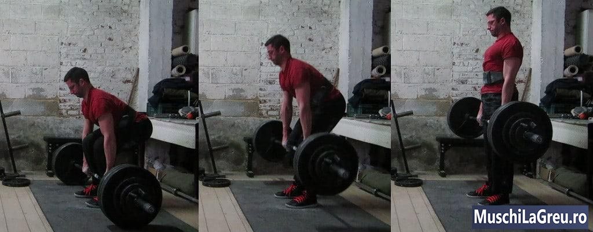
_Deadlifts: trageti greutatea de la podea la coapse cu un spate neutru._

Iata cum sa faci Indreptari(deadlift) cu o forma corecta:

1. Stai cu piciorul la mijloc sub bara
2. Aplecati-va si apucati bara cu o prindere la nivelul umerilor
3. Indoaie genunchii pana cand tibia atinge bara
4. Ridicati pieptul in sus si indreptati-va partea inferioara a spatelui
5. Respirati puternic, tine-ti aerul in piept si ridicati-va cu greutatea

Tineti greutatea o secunda in varf, cu soldurile si genunchii fixati drept. Apoi intoarceti greutatea pe podea miscandu-va soldurile in timp ce indoiti picioarele. Odihnati-va o secunda in partea de jos si repetati. Faceti cinci repetari pe programul [Antrenamente 5x5](/program/5x5/) .

Partea inferioara a spatelui trebuie sa ramana neutra pentru a evita accidentarea. Rotunjirea acestuia in timpul ridicarii este periculoasa pentru coloana vertebrala. Pune presiune inegala asupra discurilor spinarii care le poate rani. Intotdeauna sa faceti Indreptari(deadlifts) cu un spate inferior neutru - mentineti curba naturala a interiorului coloanei vertebrale inferioare.

Cel mai rapid mod de a-ti imbunatati Deadlift-ul este sa-ti imbunatatesti forma. Tragand mai eficient, puteti utiliza mai multi muschi si greutati mai grele. Acest lucru duce la cresterea fortei si a castigurilor musculare. Cel mai bun mod de a-ti imbunatati forma/pozitia este practicand Deadlifts cu o forma adecvata.

Acesta este ghidul complet pentru o forma corespunzatoare pentru Deadlift(indreptari) conventional.

Cuprins

   

   <ul class="contents-ul">
      <li style="list-style:none;">
         <a style="font-size:16px;" href="#notiuni-de-baza-pentru-Indreptari"> 1 1 Notiuni de baza pentru Indreptari
</a>
         <ul style="list-style:none; margin-top:0; margin-bottom:0;">
           <li style="list-style:none; margin-bottom:0;"><a style="font-size:16px;" href="#cum-sa-deadlift">1.1 Cum sa faci Indreptari(Deadlift)</a></li>
           <li style="list-style:none; margin-bottom:0;"><a style="font-size:16px;" href="#principalele-actiuni-la-deadlift(indreptari)">1.2 Principalele actiuni la deadlift(indreptari)</a></li>
           <li style="list-style:none; margin-bottom:0;"><a style="font-size:16px;" href="#muschii-lucrati">1.3 Muschii lucrati</a></li>
           <li style="list-style:none; margin-bottom:0;"><a style="font-size:16px;" href="#probleme-de-siguranta">1.4 Probleme de siguranta</a></li>
           <li style="list-style:none; margin-bottom:0;"><a style="font-size:16px;" href="#videoclipuri">1.5 Videoclipuri</a></li>
         </ul>
      </li>
      <li style="list-style:none;">2 Tehnica Indreptari(Deadlifts)
         <ul style="list-style:none; margin-top:0; margin-bottom:0;">
           <li style="list-style:none; margin-bottom:0;"><a style="font-size:16px;" href="#pozitie">2.1 Pozitie</a></li>
           <li style="list-style:none; margin-bottom:0;"><a style="font-size:16px;" href="#picioare">2.2 Picioare</a></li>
           <li style="list-style:none; margin-bottom:0;"><a style="font-size:16px;" href="#prindere">2.3 Prindere</a></li>
           <li style="list-style:none; margin-bottom:0;"><a style="font-size:16px;" href="#brate">2.4 Brate</a></li>
           <li style="list-style:none; margin-bottom:0;"><a style="font-size:16px;" href="#bara(haltera)">2.5 Bara(Haltera)</a></li>
           <li style="list-style:none; margin-bottom:0;"><a style="font-size:16px;" href="#soldul">2.6 Soldul</a></li>
           <li style="list-style:none; margin-bottom:0;"><a style="font-size:16px;" href="#omoplati">2.7 Omoplati</a></li>
           <li style="list-style:none; margin-bottom:0;"><a style="font-size:16px;" href="#umerii">2.8 Umerii</a></li>
           <li style="list-style:none; margin-bottom:0;"><a style="font-size:16px;" href="#unghiul-spatelui">2.9 Unghiul spatelui</a></li>
           <li style="list-style:none; margin-bottom:0;"><a style="font-size:16px;" href="#tibia">2.10 Tibia</a></li>
           <li style="list-style:none; margin-bottom:0;"><a style="font-size:16px;" href="#genunchii">2.11 Genunchii</a></li>
           <li style="list-style:none; margin-bottom:0;"><a style="font-size:16px;" href="#partea-inferioara-a-spatelui">2.12 Partea inferioara a spatelui</a></li>
           <li style="list-style:none; margin-bottom:0;"><a style="font-size:16px;" href="#partea-superioara-a-spatelui">2.13 Partea superioara a spatelui</a></li>
           <li style="list-style:none; margin-bottom:0;"><a style="font-size:16px;" href="#cap">2.14 Cap</a></li>
           <li style="list-style:none; margin-bottom:0;"><a style="font-size:16px;" href="#pozitia-de-inceput">2.15 Pozitia de inceput</a></li>
           <li style="list-style:none; margin-bottom:0;"><a style="font-size:16px;" href="#miscarea-de-ridicare">2.16 Miscarea de ridicare</a></li>
           <li style="list-style:none; margin-bottom:0;"><a style="font-size:16px;" href="#pana-jos">2.17 Pana jos</a></li>
           <li style="list-style:none; margin-bottom:0;"><a style="font-size:16px;" href="#indreptarea(lockout)">2.18 Indreptarea(Lockout)</a></li>
           <li style="list-style:none; margin-bottom:0;"><a style="font-size:16px;" href="#respiratie">2.19 Respiratie</a></li>
           <li style="list-style:none; margin-bottom:0;"><a style="font-size:16px;" href="#intre-repetari">2.20 Intre Repetari</a></li>
         </ul>
      </li>
      <li style="list-style:none;">
         <a style="font-size:16px;" href="#cazuri-speciale"> 3. Cazuri speciale</a>
         <ul style="list-style:none; margin-top:0; margin-bottom:0;"> 
          <li style="list-style:none; margin-bottom:0;"><a style="font-size:16px;" href="#barbati-inalti">3.1 Barbati inalti</a></li>
          <li style="list-style:none; margin-bottom:0;"><a style="font-size:16px;" href="#baietii-mari">3.2 Baietii mari</a></li>
          <li style="list-style:none; margin-bottom:0;"><a style="font-size:16px;" href="#maini-mici">3.3 Maini mici</a></li>
          <li style="list-style:none; margin-bottom:0;"><a style="font-size:16px;" href="#femei">3.4 Femei</a></li>
         </ul>
      </li>
      <li style="list-style:none;"><a style="font-size:16px;" href="#forta-pentru-mentinerea-prizei">4. Forta pentru mentinerea prizei</a>
         <ul style="list-style:none; margin-top:0; margin-bottom:0;">
            <li style="list-style:none; margin-bottom:0;"><a style="font-size:16px;" href="#priza-alba">4.1 Priza alba</a></li>
            <li style="list-style:none; margin-bottom:0;"><a style="font-size:16px;" href="#priza-mixta">4.2 Priza mixta</a></li>
            <li style="list-style:none; margin-bottom:0;"><a style="font-size:16px;" href="#priza-statica">4.3 Priza statica</a></li>
            <li style="list-style:none; margin-bottom:0;"><a style="font-size:16px;" href="#aparatul-flexor-pentru-antebrat">4.4 Aparatul flexor pentru antebrat</a></li>
         </ul>
      </li>
      <li style="list-style:none;">
         <a style="font-size:16px;" href="#echipament">5.Echipament</a>
         <ul style="list-style:none; margin-top:0; margin-bottom:0;">
            <li style="list-style:none; margin-bottom:0;"><a style="font-size:16px;" href="#creta">5.1 Creta</a></li>
            <li style="list-style:none; margin-bottom:0;"><a style="font-size:16px;" href="#pantofi">5.2 Pantofi</a></li>
            <li style="list-style:none; margin-bottom:0;"><a style="font-size:16px;" href="#chingi(curele-pentru-priza)">5.3 Chingi(curele pentru priza)</a></li>
            <li style="list-style:none; margin-bottom:0;"><a style="font-size:16px;" href="#manusi">5.4 Manusi</a></li>
         </ul>
      </li>
      <li style="list-style:none;">
         <a style="font-size:16px;" href="#greseli-indreptari">6. Greseli Indreptari</a>
         <ul style="list-style:none; margin-top:0; margin-bottom:0;">
            <li style="list-style:none; margin-bottom:0;"><a style="font-size:16px;" href="#indreptarile(deadlifting-)-de-sus-in-jos">6.1 Indreptarile(Deadlifting ) de sus in jos</a></li>
            <li style="list-style:none; margin-bottom:0;"><a style="font-size:16px;" href="#folosind-reculul-placilor-de-pe-podea">6.2 Folosind reculul placilor de pe podea</a></li>
            <li style="list-style:none; margin-bottom:0;"><a style="font-size:16px;" href="#sa-nu-atingi-podeaua">6.3 Sa nu atingi podeaua</a></li>
            <li style="list-style:none; margin-bottom:0;"><a style="font-size:16px;" href="#facand-genuflexiuni-in-loc-de-indreptari">6.4 Facand Genuflexiuni in loc de Indreptari</a></li>
            <li style="list-style:none; margin-bottom:0;"><a style="font-size:16px;" href="#inclinarea-pe-spate-in-pozitia-de-sus">6.5 Inclinarea pe spate in pozitia de sus</a></li>
            <li style="list-style:none; margin-bottom:0;"><a style="font-size:16px;" href="#ridicarea-umerilor-in-pozitia-de-sus">6.6 Ridicarea umerilor in pozitia de sus</a></li>
            <li style="list-style:none; margin-bottom:0;"><a style="font-size:16px;" href="#forma-necontrolata(smulgi-bara-de-pe-podea)">6.7 Forma necontrolata(smulgi bara de pe podea)</a></li>
            <li style="list-style:none; margin-bottom:0;"><a style="font-size:16px;" href="#lasarea-greutatii-din-pozitia-de-sus">6.8 Lasarea greutatii din pozitia de sus</a></li>
            <li style="list-style:none; margin-bottom:0;"><a style="font-size:16px;" href="#folosind-oglinzi">6.9 Folosind oglinzi</a></li>
            <li style="list-style:none; margin-bottom:0;"><a style="font-size:16px;" href="#probleme-cu-indreptarile">6.10 Probleme cu Indreptarile</a></li>
            <li style="list-style:none; margin-bottom:0;"><a style="font-size:16px;" href="#dureri-ale-spatelui-inferior">6.11 Dureri ale spatelui inferior</a></li>
            <li style="list-style:none; margin-bottom:0;"><a style="font-size:16px;" href="#rotunjirea-spatelui-inferior">6.12 Rotunjirea spatelui inferior</a></li>
            <li style="list-style:none; margin-bottom:0;"><a style="font-size:16px;" href="#va-arcuiti-prea-mult">6.13 Va arcuiti prea mult</a></li>
            <li style="list-style:none; margin-bottom:0;"><a style="font-size:16px;" href="#soldurile-se-ridica-prea-repede">6.14 Soldurile se ridica prea repede</a></li>
            <li style="list-style:none; margin-bottom:0;"><a style="font-size:16px;" href="#Lovindu-ti-genunchii">6.15 Lovindu-ti genunchii</a></li>
            <li style="list-style:none; margin-bottom:0;"><a style="font-size:16px;" href="#tibiile-invinetite">6.16 Tibiile invinetite</a></li>
            <li style="list-style:none; margin-bottom:0;"><a style="font-size:16px;" href="#callusurile-rupte">6.17 Callusurile rupte</a></li>
         </ul>
      </li>
      <li style="list-style:none;">
         
         <ul style="list-style:none; margin-top:0; margin-bottom:0;">
           <li style="list-style:none; margin-bottom:0;"><a style="font-size:16px;" href="#sumo-deadlift(indreptari-sumo)">7.1 Sumo Deadlift(Indreptari sumo)</a></li>
           <li style="list-style:none; margin-bottom:0;"><a style="font-size:16px;" href="#indreptari-la-trap-bar">7.2 Indreptari la Trap bar</a></li>
           <li style="list-style:none; margin-bottom:0;"><a style="font-size:16px;" href="#indreptari-cu-picioare-rigide">7.3 Indreptari cu picioare rigide</a></li>
           <li style="list-style:none; margin-bottom:0;"><a style="font-size:16px;" href="#indreptari-romanesti(romanian-dedlifts)">7.4 Indreptari romanesti(romanian dedlifts)</a></li>
         </ul>
      </li>
      <li style="list-style:none;">
         <a style="font-size:16px;" href="#intrebari-populare-legate-de-indreptari">8 Intrebari populare legate de Indreptari</a>
         <ul style="list-style:none; margin-top:0; margin-bottom:0;">
          <li style="list-style:none; margin-bottom:0;"><a style="font-size:16px;" href="#mi-e-teama-de-indreptari-ce-ar-trebuii-sa-fac?">8.1 Mi-e teama de Indreptari. Ce ar trebuii sa fac?</a></li>
          <li style="list-style:none; margin-bottom:0;"><a style="font-size:16px;" href="#pot-sa-fac-indreptari-in-aparat-smith-?">8.2 Pot sa fac Indreptari in Aparat Smith ?</a></li>
          <li style="list-style:none; margin-bottom:0;"><a style="font-size:16px;" href="#cum-pot-preveni-calusurile-de-la-deadlifts?">8.3 Cum pot preveni calusurile de la Deadlifts?</a></li>
          <li style="list-style:none; margin-bottom:0;"><a style="font-size:16px;" href="#de-ce-ma-dor-bratele-dupa-indreptari?">8.4 De ce ma dor bratele dupa Indreptari?</a></li>
          <li style="list-style:none; margin-bottom:0;"><a style="font-size:16px;" href="#cum-pot-elimina-calusurile-de-pe-mainile-mele?">8.5 Cum pot elimina calusurile de pe mainile mele?</a></li>
          <li style="list-style:none; margin-bottom:0;"><a style="font-size:16px;" href="#cum-fac-deadlift-cu-placi-hexagonale?">8.6 Cum fac Deadlift cu placi hexagonale?</a></li>
          <li style="list-style:none; margin-bottom:0;"><a style="font-size:16px;" href="#ar-trebui-sa-mi-fie-durere-spatele-dupa-deadlifts?">8.7 Ar trebui sa-mi fie durere spatele dupa Deadlifts?</a></li>
          <li style="list-style:none; margin-bottom:0;"><a style="font-size:16px;" href="#ce-se-intampla-daca-imi-doare-spatele-deadlifting?">8.8 Ce se intampla daca imi doare spatele Deadlifting?</a></li>
          <li style="list-style:none; margin-bottom:0;"><a style="font-size:16px;" href="#care-este-o-intindere-buna-a-spatelui-jos?">8.9 Care este o intindere buna a spatelui jos?</a></li>
          <li style="list-style:none; margin-bottom:0;"><a style="font-size:16px;" href="#ar-trebui-sa-mi-genuflexiuni-deadlift-urile?">8.10 Ar trebui sa fiu in pozitia de Genuflexiuni pt Deadlift-urile?</a></li>
          <li style="list-style:none; margin-bottom:0;"><a style="font-size:16px;" href="#daca-inapoi-rotunjite-deadlift-urile-sunt-rele">8.11 Daca inapoi rotunjite Deadlift-urile sunt rele</a></li>
          <li style="list-style:none; margin-bottom:0;"><a style="font-size:16px;" href="#cum-imi-pot-creste-deadlift-ul?">8.13 Cum imi pot creste Deadlift-ul?</a></li>
          <li style="list-style:none; margin-bottom:0;"><a style="font-size:16px;" href="#cum-imi-pot-imbunatati-forma?">8.14 Cum imi pot imbunatati forma?</a></li>
          <li style="list-style:none; margin-bottom:0;"><a style="font-size:16px;" href="#cat-ar-trebui-sa-pot-sa-deadlift?">8.15 Cat ar trebui sa pot sa Deadlift?</a></li>
          <li style="list-style:none; margin-bottom:0;"><a style="font-size:16px;" href="#deadlift-este-bun-pentru-tine?">8.16 Deadlift este bun pentru tine?</a></li>
          <li style="list-style:none; margin-bottom:0;"><a style="font-size:16px;" href="#de-cate-ori-pe-saptamana-trebuie-sa-fac-deadlifts?">8.17 De cate ori pe saptamana trebuie sa fac Deadlifts?</a></li>
          <li style="list-style:none; margin-bottom:0;"><a style="font-size:16px;" href="#cate-repetari-ale-deadlifts-ar-trebui-sa-fac?">8.18 Cate repetari ale Deadlifts ar trebui sa fac?</a></li>
         </ul>
      </li>
   </ul>

## Notiuni de baza pentru Deadlift

### Cum sa faci Indreptari

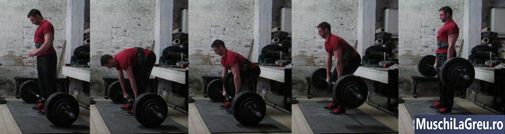
_Cum sa faci Indreptari in 5 pasi: mergeti la bar, apucati-l, indoiti genunchii, ridicati pieptul, trageti._

„Mortul” din Deadlift inseamna greutate moarta. Asadar, fiecare repetitie trebuie sa inceapa pe podea, de la un popas. Nu incepeti de sus in jos, ca la [Genoflexiuni cu haltera](/exercitii/genuflexiuni-cu-bara/)) sau [Impinsul cu haltera de la piept](/exercitii/impinsul-cu-haltera-de-la-piept/) . Incepi de jos, tragi greutatea in sus si apoi o intorci pe podea. Iata cei cinci pasi catre Deadlift(Indreptare) cu o forma corecta ...

- **Mergeti la bara**. Stai cu picioarele la mijloc sub bara. Tibia ta nu ar trebui sa o atinga inca. Puneti calcaiele la nivelul soldului, mai inguste decat pe [Genoflexiuni cu haltera](/exercitii/genuflexiuni-cu-bara/). Intoarce-ti degetele de la picioare cu 15 °.
- **Prinde bara**. Inclinati-va fara sa va aplecati picioarele. Strangeti bara, mainile sa fie in line cu umerii, ca in cazul Presei deasuprea capului. Bratele tale trebuie sa fie verticale cand privesti din fata.
- **Indoiti genunchii**. Pune-te in pozitie indoind genunchii pana cand tibia ta atinge bara. NU lasati bara sa se indeparteze de mijlocul piciorului. Daca se misca, incepeti de la zero cu primul pas.
- **Ridica-ti pieptul**. Indreptati-va spatele ridicandu-va pieptul. Nu va schimbati pozitia - tineti bara peste mijlocul piciorului, tibia impotriva barei si nu miscati soldurile.
- **Trage**. Respirati puternic, tineti aerul si ridicati-va cu greutatea. Tineti bara in contact cu picioarele in timp ce trageti. Nu ridicati din umeri si nu va aplecati inapoi. Inchideti(blocati) soldurile si genunchii.

Intoarceti greutatea pe podea, deblocand mai intai soldurile si genunchii. Apoi coborati bara miscand soldurile inapoi, mentinand picioarele aproape drepte. Odata ce bara este trecuta de genunchi, indoiti picioarele mai mult. Bara va ateriza peste mijlocul piciorului(talpii) tale, gata pentru urmatoarea ta repetare.

Odihneste-te o secunda intre repetari. Ramaneti in pozitia de pregatire cu mainile pe bara. Respirati puternic, incordati-va si trageti din nou. Fiecare repetare trebuie sa porneasca cu bara jos pe podea. Nu loviti greutatea de pe podea sau veti trage cu o forma proasta. Faceti deadlift de cinci repetari la fiecare antrenament B pe [Antrenamente 5x5](/program/5x5/) .

## Principalele actiuni la deadlift(indreptari)

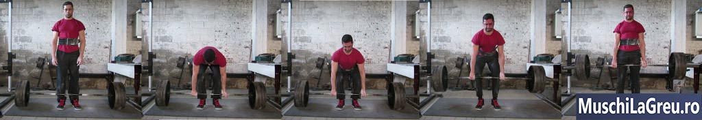
_Forma corespunzatoare Deadlift: pozitie cu latimea soldului, prindere ingusta, brate verticale, bara impotriva luciului, solduri/genunchi incuiate in partea de sus._

Constructia corpului vostru influenteaza modul in care arata forma dvs. Daca aveti coapse scurte cu un trunchi lung, de obicei va veti seta cu soldurile mai jos decat cineva cu coapse lungi si un trunchi scurt ca mine. Prin urmare, nu imitati pozitia de Deadlift al altcuiva (nici macar a mea) decat daca aveti aceeasi constructie fizica.

Utilizati aceste indicii in schimb si veti face Indreptari(Deadlift) cu o forma corespunzatoare. Functioneaza indiferent daca esti tanar sau batran, incepator sau avansat, scurt sau inalt, slab sau gras, slab sau puternic, barbat sau femeie. Incercati-le.

- **Traiectoria barei**: linie verticala peste mijlocul piciorul atunci cand privesti din lateral
- **Bara(haltera)**: la podea, peste mijlocul piciorului tau, la inceputul fiecarei repetari
- **Pozitie**: calcaiele in line cu soldul, mai inguste decat pe [Genoflexiuni cu haltera](/exercitii/genuflexiuni-cu-bara/)
- **Picioare**: piciorul intreg plat pe podea, degetele de la picioare indreotate la aproximativ 15 °
- **Latimea de prindere**: ingusta, cu mainile in linie cu umerii
- **Priza**: degetele in jurul barei, bara aproape de degete, ambele palme orientate spre tine
- **Bratele**: verticale cand privesti din fata, inclinati usor din lateral
- **Coate**: blocate inainte si in timpul tragerii, pana la ridicare. Niciodata nu le indoiti.
- **Piept**: tinut sus pentru a evita rotunjirea spatelui, NU strangeti omoplatii
- **Partea inferioara a spatelui**: neutru - curba interioara normala. Fara rotunjire sau arc in exces
- **Umerii**: in fata barei din vedere laterala, relaxati-va umerii si trapezul
- **Omoplati**: peste mijlocul piciorului cand privesti din lateral
- **Cap**: aliniat cu restul coloanei vertebrale, nu va uitati in sus, nici nu va uitati la picioare
- **Solduri**: pozitia arata ca o jumatate [Genoflexiuni cu haltera](/exercitii/genuflexiuni-cu-bara/), soldurile mai largi decat paralele. Nu-ti faceti genuflexiuni nu este aceeasi pozitie
  !
- **Pozita de inceput**: bara peste mijlocul piciorului, omoplati peste bara, linie dreapta de la cap pana jos in spate
- **Respiratie**: respirati in partea de jos, tineti-o in partea de sus, expirati in partea de jos, repetati
- **Ridicati-va**: nu aruncati bara de pe podea, trageti incet in timp ce trageti bara peste picioare
- **In jos**: soldurile inapoi mai intai, indoiti picioarele mai ales odata ce bara ajunge la genunchi
- **Intre repetari**: nu loviti bara, incepeti controlat din nou, nu va odihniti nicio secunda, ridicati pieptul, respirati, trageti din nou
- **Trapezul**: lasa-l sa atarne, relaxat. Nu ridicati din umeri si nu va rotiti umerii in pozitia de sus
- **Genunghii**: impingeti-tii in spate cand ridicati greutatea si indreptatii cand ajungeti in partea de sus
- **Tibia**: atingeti bara cu tibia in timpul pozitiei de inceput
- **Lockout: blocati soldurile si genunchii**. Nu lasati greutatea in jos cand ajungeti in varf daca nu ati blocat genunchii si soldurile.

## Muschii lucrati

Deadlifts(Indreptarile) iti lucreaza intregul corp. Picioarele tale sunt principalele parti miscatoare. Muschii spatelui iti mentin coloana vertebrala neutra. Iar bratele tale tin haltera in maini. Dar, deoarece greutatea este mai grea decat la orice alt exercitiu, toti ceilalti muschi trebuie sa functioneze si ei. In caz contrar, nu poti Indrepti(Deadlift) greutatea.

Indreptarea este mai mult pentru spate decat picioarele in comparatie cu [Genoflexiuni cu haltera](/exercitii/genuflexiuni-cu-bara/) . Dar fiecare muschi functioneaza atunci cand ridici la Indreptari(Deadlift). De aceea, Indreptarile sunt exercitii pentru tot corpul, un exercitiu compus - lucreaza mai multi muschi in acelasi timp. Iata principalii muschi folositi in timpul Indreptarilor(deadlifts) functioneaza ...

- **Picioare**. Tendoanele si coapsele iti indreapta soldurile. Muschii de superiori ai picioarelor iti indreapta genunchii. Gambele iti indreapta gleznele. Intervalul de miscare este mai mic decat pe [Genoflexiuni cu haltera](/exercitii/genuflexiuni-cu-bara/) deoarece porniti in jumatate de [Genoflexiuni cu haltera](/exercitii/genuflexiuni-cu-bara/). Dar greutatea este mai grea si porneste de la un stop mort mai greu.
- **Spate**. Muschii spatelui se contracta pentru a va mentine coloana vertebrala neutra in timp ce gravitatia incearca sa o indoaie. Dorsalul(lats) tau mentine greutatea aproape de corp. Deadlifts sunt cel mai bun exercitiu pentru spate(back-builder), deoarece iti lucreaza intregul spate cu greutati mai grele decat orice alt exercitiu.
- **Trapezul**. Muschii trapezului se contracta pentru a va mentine umerii la locul lor si a transfera forta in bara. Chiar si muschii umerilor si pieptului se contracta pentru a adauga sprijin. Cu cat ridici mai mult la Indreptari(Deadlift), cu cat trapezul este mai contractat, si asfel cu atat devine mai mari. Nu este nevoie sa dai umeri pe sapte.
- **Abdomenul**. Muschii abdominali si oblicii se contracta pentru a va sprijini partea inferioara a spatelui. Cu cat Indreptarile(Deadlifts) sunt mai grele, cu atat devin mai puternice si mai musculare. Mancati corect si ii puteti vedea.
- **Bratele**. Mainile tale tin bara. Acest lucru va consolideaza priza si antebratele. Dar toata parea de sus se contracta, in timpul Indreptarilor cu greutate mare, inclusiv bicepsul si tricepsul tau. Nu se indoaie, ci functioneaza izometric, ca si spatele tau, pentru a-ti mentine corpul in pozitie.

Indreptarile sunt cel mai bun exercitiu pentru spatele tau. Adaugati Barbell [Ramat cu haltera(Barbell Row)](/exercitii/ramat-cu-bara/) si poate Tractiuni si nu aveti nevoie de mai mult pentru a construi un spate in forma de V . Ridicati multa greutate si puteti avea un fizic excelent facand doar doua-trei exercitii pe antrenament. Acesta este motivul pentru care [Antrenamente 5x5](/program/5x5/) este atat de eficient.

## Probleme de siguranta

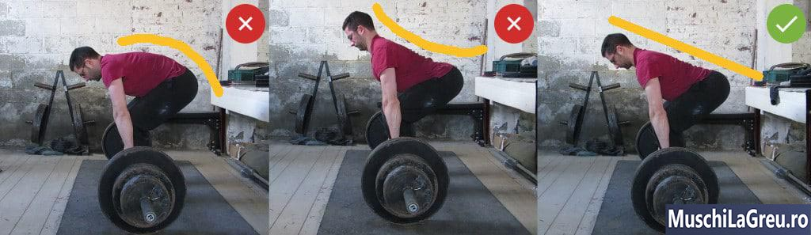
_Rotunjirea spatelui inferior (stanga) si arcuirea in exces (mijlocul) sunt rele. Pastrati-va spatele inferior neutru (dreapta)._

Toate exercitiile iti pot rani spatele daca folosesti o pozitie gresita. Cea mai periculoasa greseala de pentru Indreptari este sa tragi cu spatele indoit. Acest lucru pune presiune inegala asupra discurilor coloanei vertebrale si poate provoca discuri bombate, nervi ciupiti si alte leziuni la spate. **Nu faceti Deadlift cu greutate mare daca aveti spatele rotunjit**.

Cel mai sigur mod de a Deadlift este cu coloana vertebrala neutra. Pozitia de start trebuie sa fie cu curba normala in interiorul spatelui inferior. Mentineti aceasta pozitie in timp ce trageti greutatea de pe podea pana la indreptarea corpului. Presiunea asupra discurilor coloanei vertebrale va fi uniforma. Acest lucru scade sansa de a va rani spatele inferior.

Multi oameni si-au imbunatatit spatele cu Deadlifts. Dr. Stuart McGill Phd spune ca coloana vertebrala este ca si catargul unei nave - echipamentul il tine ferm, astfel incat nu se poate redirectiona. Muschii trunchiului in jurul coloanei vertebrale sunt ca un invelis. Iti tin coloana vertebrala ferma, astfel incat sa suporte incarcaturi grele in siguranta si fara durere.

Indreptarile poat transforma un spate slab, consolidandu-ti muschii trunchiului. De asemenea, creste rezistenta spatelui si creeaza obiceiuri de miscare sigure . Iata cum face acest lucru:

- **Gravitatea trage bara in jos cand faci Indreptari(Deadlifts)**. Muschii trunchiului se contracta pentru a lupta impotriva acestei forte, astfel incat coloana vertebrala nu se indoaie. Cu cat ridici mai multa greutate cu o coloana vertebrala neutra, cu atat muschii trunchiului devin mai puternici. Cu cat sunt mai puternici, cu atat iti sustin coloana vertebrala mai bine.
- **Muschii mai puternici tin mai mult**. Aceeasi miscare solicita mai putin efort din partea muschilor trunchiului ce sunt mai puternici. Dureaza mai mult sa iti obosesti spatele. Prin urmare, poti ridica mai mult cu o coloana vertebrala neutra. Si din moment ce spatele tau este intr-o pozitie mai sigura mai des, esti mai putin probabil sa te acidentezi.
- **Deadlifts(indreptarile) sunt bune ca practica pentru ridicarea greutatii prin indoirea picioarelor cu o coloana vertebrala neutra**. Repetarea acestui lucru in sala construieste obiceiuri de miscare sigure, care se transfera la viata de zi cu zi. Este mai putin probabil sa te doare spatele atunci cand ridici ceva la serviciu, de exemplu.

Deadlift-urile au un risc de ranire ca orice alta activitate fizica. Cel mai bun mod de a creste siguranta este prin a folosi o forma adecvata. Incepeti cu greutati usoare, folositi o forma adecvata si adaugati cate putin greutate. Muschii trunchiului vor fi mai puternici pe masura ce greutatea creste. Acest lucru va construi un spate mai puternic, care este mai greu de ranit.

## Videoclipuri

Iata un videoclip cu mine Deadlifting 210kg/451lb. In pozitia de inceput, bara este peste mijlocul piciorului, cu omoplatii peste bara. Trag bara peste picioare pana in varf. Spatele meu inferior ramane destul de neutru. Nu folosesc manerul si centura mixta pe seturile mai usoare. Le pastrez pentru seturile mai grele.

Iata un al doilea videoclip in care fac Deadlifts ca parte a antrenamentului [Antrenamente 5x5](/program/5x5/) B. Raspund si la intrebari comune despre Deadlift. Urmariti de la 20:59 inainte ...  
Si iata un videoclip al lui Mike Tuchscherer Deadlifting de aproximativ 300 kg la seminarul Antrenamente London 2014. Mike este un campion la powerlifting si face Indreptare(Deadlifts) exact asa cum este scris in acest ghid: bara peste mijlocul piciorului, omoplati peste bara, spatele neutru. Priveste si invata…

## Tehnica Deadlift

## Pozitie

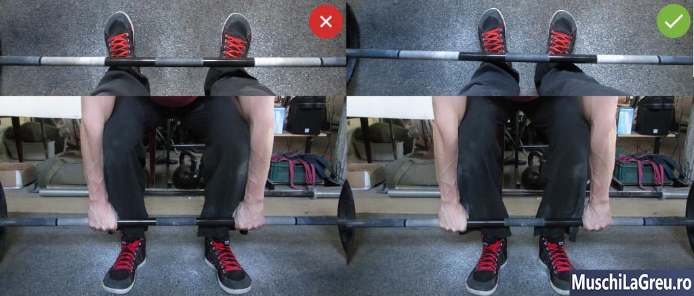
_Stanga: pozitia larga impinge picioarele impotriva bratelor. Dreapta: pozitia ingusta creeaza spatiu pentru picioare si brate._

Pozitia de inceput a calcaielor trebuie sa fie in linie cu soldul atunci cand faceti Indreptari/Deadlifts. Distanta dintre calcaie trebuie sa se potriveasca cu latimea soldurilor. Deci, mai mari/mai inguste soldurile, mai larga /ingusta trebuie sa fie pozitia ta. Scopul este de a crea spatiu pentru bratele tale, astfel incat sa nu fie blocate de picioarele tale in timpul pozitiei de inceput.

Nu faceti Deadlift la fel ca pozitia de [Genoflexiuni cu haltera](/exercitii/genuflexiuni-cu-bara/). Stand cu picoarele in linie cu umari, este prea larg pentru Indreptari/Deadlifts. Picioarele va vor lovi bratele in pozitia de start, deoarece nu vor avea spatiu. Te vor face sa tragi cu bratele indoite, ceea ce este periculos pentru biceps si coatele tale.

Puteti rezolva acest lucru tinand bara mai larga. Dar acest lucru mareste distanta pe care trebuie sa o parcurga bara pentru a ajunge in varf. Ingreuneaza greutatea pana la finalul repetaitiei. Bratele tale trebuie sa fie verticale atunci cand estu cy fata la bara. Ai nevoie de o pozitie ingusta pentru asta. Fa Indreptari cu talpile in line cu soldurile tale.

## Picioare

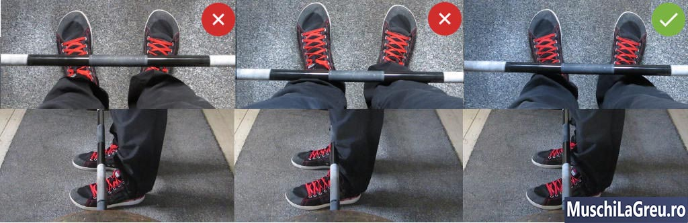
_Stanga: bara peste picior, prea departe. Mijloc: bara impotriva tibierilor, prea aproape. Dreapta: bara peste mijlocul piciorului, corect._

Pentru pozitia de start bara trebuie sa fie peste mijlocul talpii. Mijlocul talpii este punctul tau de echilibru. Daca trageti bara peste mijlocul talpii, veti avea un echilibru mai bun. Acest lucru face ca greutatea sa se simta mai usoara.

Majoritatea oamenilor se incep cu bara aproape peste degetele de la picioare pentru a evita lovirea tibiei. Dar acest lucru pune bara in fata punctului tau de echilibru si mai departe de centrul tau de greutate. Greutatea te va trage in fata atunci cand bara paraseste podeaua. Te va face sa pierzi echilibrul si sa te simti mai greu pe spatele inferior.

Greutatea mare este imposibil de tras din degetele de la picioare. Bara se va muta la mijlocul piciorului dvs. dupa ce va parasi podeaua, deoarece aceasta este pozitia mai puternica. Iti va lovi tibiile in acest proces. Mai bine este sa incepeti cu bara peste mijlocul piciorului(talpii), astfel incat sa nu pierdeti energia deplasand bara acolo in timpul unui Deadlift greu.

Unii incep cu bara prea aproape. Tibia ta trebuie sa atinga bara doar in timpul pozitiei de inceput. Daca te atinge cand te ridici, tibia va impiedica bara sa se ridici inainte sa incepeti. Va trebui sa ramana aproape vertical, ceea ce provoaca un echilibru neplacut si este ineficient.

Tibia ta va impinge de obicei bara pana la mijlocul piciorului daca este prea aproape. Acest lucru va pune intr-o pozitie mai puternica de a trage. Dar, din nou, este mai bine sa incepeti cu piciorul(talpa) la mijloc sub bara, decat sa mutati bara acolo mai tarziu. Cu cat pozitia de inceput este mai consistenta, cu atat forma ta este mai consistenta.
Mijlocul talpii este mijlocul intregului tau picior. Cand stai in fata barei si privesti in jos, nu vei vedea partea picioarelor sub picioare. Prin urmare, majoritatea oamenilor vor pune sub bara mijlocul partii vizibile a piciorului. Dar acest lucru pune bara prea departe.

Trucul simplu este sa-ti verifici talpa de incaltaminte. Gasiti-i centrul si amintiti-va de gaura de la siret de deasupra ei. Pentru mine este de obicei gaura cinci, dar acest lucru depinde de marca si marimea pantofilor tai (eu am 43). Pune gaura sub bara cand stai in fata ei. Poate arata prea aproape, dar nu va fi cazul daca ai facut-o bine.

Incepeti cu varful degetelor cu inclinate spre 15 °. Acest lucru face mai usor sa-ti impingi genunchii in spate atunci cand ridici bara. Genunchi ajuta la antrenarea muschilor din zona inghinala la Deadlift(Indreptari). Genunchii de asemenea tin linia lunga a coapselor inapoi si in afara barei, astfel incat sa nu te lovesti de genunchi in drum.

Tine-ti picioarele pe podea. Daca vreo parte a piciorului dvs. este ridicata atunci cand faceti Deadlift, veti pierde echilibrul. Vrei sa ai cea mai mare suprafata in contact cu podeaua. Tine-ti tocurile, talpa de la mijloc si degetele de jos. Va poate ajuta sa incercati sa apucati podeaua cu picioarele, cum ar fi sa apucati o minge de basket cu picioarele.

## Prindere

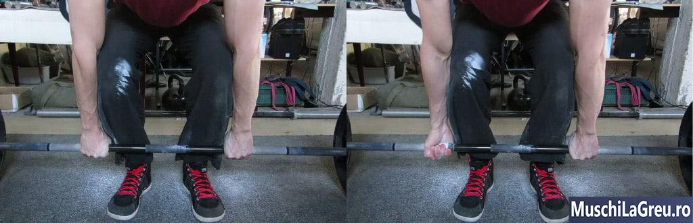
_Aderenta normala vs mixta. Folositi mai intai o prindere normala. ambele palme orientate spre tine (stanga)._

Strangeti bara, in line cu umarii. Acest lucru pune bratele verticale pe podea cand privesti din fata. Bara va atarna in cea mai joasa pozitie posibila, ceea ce scade distanta pe care trebuie sa o parcurga pentru a ajunge in in pozitia de sus. Veti putea face Indreptari(Deadlift) cu mai multa greutate cu o strangerea ingusta.

Creati spatiu pentru bratele si picioarele dvs., punandu-va calcaiele in line cu soldul. Nu va lasati prea mult sau picioarele va vor impinge bratele. Nu incercati sa remediati acest lucru prin strangerea barei cu o priza mai larga – acest lucru va creste distanta parcursa. Folositi o priza mai ingusta si stati cu calcaiele in line cu soldul.

Apucati bara cu ambele palme indreptate spre tine. Aceasta este o prindere normala sau dubla. Puteti utiliza priza mixta mai tarziu cand nu o puteti tine cu o prindere normala. Dar nu-o folositi pe fiecare set sau nu veti mai putea schimba technica pe alta priza atunci cand nu mai ai forta in brate. Faceti majoritatea Indreptarilor(Deadlifts) cu o prindere normala.

Infasurati degetele mari in jurul barului. Priza fara degetul mare nu are nici un sens pe Indreptari(Deadlifts) deoarece face haltera mai greu de tinut(prins). Utilizati o priza completa pentru a putea Deadlift(Indrepta) mai multa greutate. Daca „nu simtiti muschii” la fel de bine cu strangerea completa, adaugati greutate pe bara. Vei simti asta odata ce greutatea va creste.

Majoritatea oamenilor fac greseala de a strange bara in mijlocul palmelor. Gravity trage bara in jos cand faci Deadlift. Bara iti va aluneca in palma si va plia pielea sub ea. Acesta va pune apoi presiune pe acele pliuri ale pielii. Acest lucru provoaca dureri si calusuri/bataturi mari care se sfasie usor.

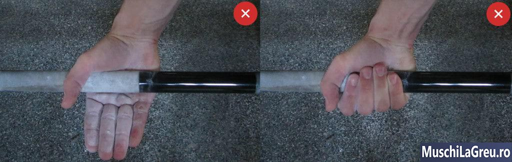
_Pielea se pliaza sub bara daca o apucati de mijlocul palmei. Acest lucru provoaca dureri._

Modul corect de a prinde bara pe Deadlifts este mana joasa. Tineti bara mai jos, aproape de degete. Puneti-l in partea de sus a calusului principal, nu deasupra lor. Acest lucru impiedica bara sa se plieze si sa-si stranga pielea. Mainile tale nu se vor mai rani si vei renunta la formarea unui calus mare care se sfasie usor.

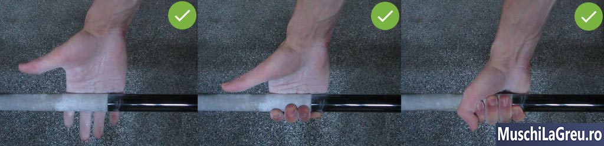
_Strangeti bara jos, aproape de degete, pentru a evita durerea de mana si calusurile._

Aceasta prindere a mainii nu este mai slaba. Aveti aceeasi cantitate de degetele in jurul barei. Este mai sigur, deoarece nu prinzi pielea si calusurile care te fac sa-ti relaxezi priza la mijloc Indreptarii(Deadlift-ului). Daca se simte priza slaba sau ciudata, este pentru ca nu esti obisnuit. Utilizati aceasta priza mereu pentru a va obisnui.

Mainile tale s-ar putea rani atunci cand incepi Deadlifts(Indreptarile). Acest lucru se datoreaza faptului ca nu aveti inca calusuri/bataturi. Nu folositi manusi, ci continuati. Pielea ta va forma calusuri pentru a va proteja impotriva presiunii barei. Durerea va disparea odata ce aveti calusuri. Este nevoie doar de cateva antrenamente.

## Brate

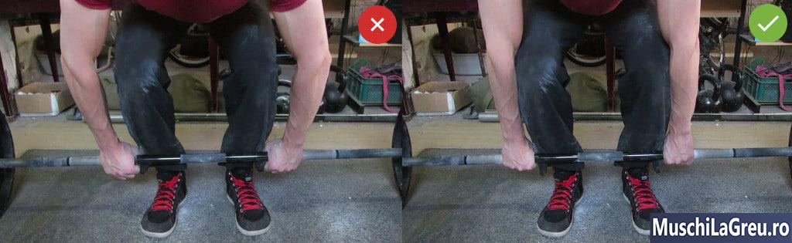
_Stanga: coatele indoite, risc ridicat de ranire a cotului. Dreapta: coatele blocate cu bratele verticale. Sigur si eficient._

Bratele tale trebuie sa fie verticale cand privesti din fata. Aceasta pozitie scade distanta pe care o parcurge bara, deoarece bara atarna mai jos in partea de sus. Puteti face Indreptari(Deadlift) cu mai multa greutate daca strangeti bara la o priza mai ingusta, cam la distanta de umar. Calcaiele tale ar trebui sa fie in line cu soldul pentru a crea spatiu pentru picioarele tale.

Din lateral, bratele trebuie sa fie inclinate in timpul pozitiei de start. Bratele verticale nu functioneaza, deoarece va pune soldurile prea jos. Genunchii iti vor veni prea inainte si in calea barei. Soldurile trebuie sa fie mai ridicate, astfel incat omoplatii sa fie peste bara. Acest lucru pune bratele inclinate din lateral.

Indreapta coatele. Indreptati-va bratele inainte de a trage greutatea de pe podea. Pastrati-le drept pe toata durata miscarii pana la blocare. Nu trageti niciodata cu bratele indoite sau riscati sa va raniti coatele si bicepsul. Tine-le drept. Asta ajuta la contractarea tricepsului dvs. in timpul pozitiei de inceput.

Amintiti-va ca greutatea pe care o folositi la Deadlift(Indreptari) este usor de cinci ori mai grea decat ceea pe care o ridicati la un exercitiu de izolare a bratului. Nu incercati sa trageti cu bratele. Nu sunt suficient de puternice. Lasa-ti picioarele si muschii spatelui ce sunt mai puternici sa ridice greutatea.

## Bara(Haltera)

bara trebuie sa paraseasca podeaua de la mijlocul piciorului pe fiecare repetare, deoarece acesta este punctul tau de echilibru. Apoi, trebuie sa se deplaseze in sus pe o linie verticala, deoarece aceasta este cea mai scurta distanta pentru a ajunge la blocare. Nu ar trebui sa existe nicio miscare orizontala a halterei, deoarece aceasta face ca traiectorie halterei sa fie mai lunga.

Incepeti intotdeauna punand piciorul la mijloc sub bara. Nu va lasati in pozitie si apoi incercati sa rotiti bara peste mijlocul piciorului. Este mai greu sa iei haltera in pozitie corecta in acest fel. Miscati-va mijlocul piciorului sub bara inainte de pozitia de inceput, decat sa mutati bara peste mijlocul piciorului.

Bara trebuie sa fie nemiscata inainte de pozitia de inceput, astfel incat sa aveti o pozitie de pornire consistenta la fiecare repetitie. Prin urmare, podeaua ta trebuie sa fie dreapta. Daca nu este, opriti bara de la rulare inainte de pozitia de inceput. Este posibil sa fiti nevoit sa mutati bara pana cand veti gasi o pozitie in care va sta dreapta. Nu incepeti sa Deadlift(Indreptati) daca bara nu este stabila.

Daca bara se indeparteaza de la mijlocul piciorului in timpul pozitiei de start sau intre repetari, cel mai bine este sa resetati. Ridica-te, ridica bara si pune-ti din nou piciorul la mijloc. Apoi intrati in pozitia de start si trageti. Din nou, nu incercati sa mutati bara peste mijlocul piciorului, este putin probabil sa ajungeti in pozitia corecta. Resetati in schimb.

De asemenea, bara trebuie sa se deplaseze pe o linie verticala. Si ar trebui sa aterizeze chiar peste mijlocul piciorului dvs., gata pentru urmatoarea repetare. Daca bara se misca in sus si in jos pe o linie verticala, peste mijlocul piciorului, asta inseamna ca folositi o forma adecvata.

## Soldul

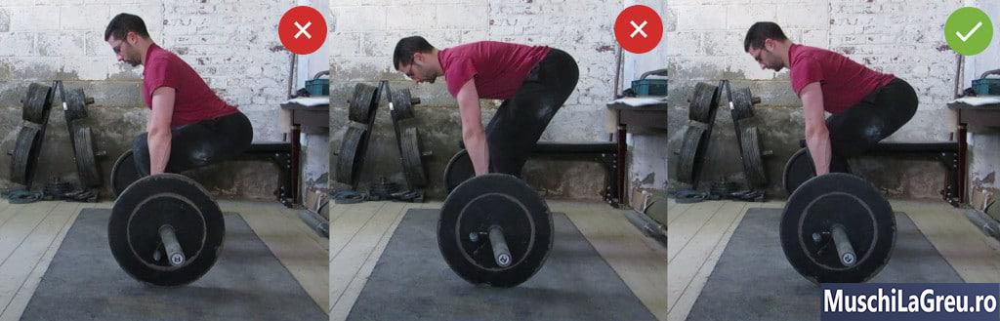
_De la stanga la dreapta: soldurile prea scazute fata de prea mare in raport cu pozitia corecta a soldului._

Pozitia soldului dvs. pentru Deadlifts(Indreptari) depinde de fizicul dvs. Daca aveti coapse lungi ca mine, soldurile dvs. vor fi mai mari decat daca aveti coapse scurte. Dar soldurile dvs. vor fi in pozitie corecta daca va puneti in pozitia de start corecta asta indiferent de fizicul pe care-l aveti. Asa ca uitati de pozitia soldului si concentrati-va pe pozitia de start.

Deadlift-urile(Indreptarile) nu sunt [Genoflexiuni cu haltera](/exercitii/genuflexiuni-cu-bara/). Nu functioneaza pentru a incepe cu soldurile pozitionate foarte jos, precum in partea de jos a [Genoflexiuni cu haltera](/exercitii/genuflexiuni-cu-bara/). Acest lucru iti muta genunchii prea departe. Tibiile o sa fie in calea barei, astfel incat le vei lovi. In plus, bara trebuie sa se miste in jurul genunghilor in loc sa fie ridicata drept in sus. O traiectorie mai lunga a barei ineficienta.

De aceea, nu poti ridica multa greutate pe Deadlift cu solduri joase. Se vor ridica inainte ca greutatea sa paraseasca podeaua pentru a va pune intr-o pozitie mai puternica pentru a aplica forta. Este mai eficient sa incepeti cu soldurile pozitionate mai sus decat sa le mutati la mijloc. Acest lucru face ca pozitia soldului sa fie mai consistenta si imbunatateste forma.

Dar soldurile nu ar trebui sa fie prea sus. Picioarele nu se pot indrepta pentru a ridica greutatea daca incepeti cu soldurile inalte. Acest lucru iti scoate genunchii din miscare. Spatele si soldurile trebuie sa faca toata munca. Mai putini muschi folositi inseamna inseamna ca vei ridica mai putin la Indreptari(Deadlifts).

Deadlift-urile cu solduri ridicate prea sus sunt Deadlifts cu picioare fixe. Sunt bune ca exercitiu de asistenta pentru Indreptari(Deadlifts), dar nu le inlocuiesc. Vrei sa ridici cat mai greu pentru a castiga forta si masa musculara . Puteti ridica mai greu daca in pozitia de start picioarele sunt indoite si folositi genunchii. Nu trageti cu soldurile inalte.

Cel mai bun mod de a gasi pozitia potrivita a soldului este sa uitati de soldurile voastre. Incepeti cu bara peste mijlocul piciorului. Acum apucati bara si indoiti-va genunchii pana cand tibia atinge bara. Tineti bara peste mijlocul piciorului si ridicati pieptul. Soldurile tale vor fi exact acolo unde ar trebui sa fie.

Nu copiati pozitia altcuiva decat daca aveti aceeasi constructie fizica. Coapsele mele lungi imi pun soldurile mai sus. Cineva cu picioarele scurte care incearca sa faca Deadlift(Indreptari) in acelasi mod va avea probleme. Picioarele lui vor fi prea drepte deoarece corpul lui este diferit. Copiaza modul in care am setat bara peste mijlocul piciorului, nu pozitia soldului.

Aveti grija cu persoanele care va revizuiesc Deadlift-ul ca [Genoflexiuni cu haltera](/exercitii/genuflexiuni-cu-bara/). Nu exista nicio pozitie paralela pentru a ajunge sau porni de aici. Soldurile nu trebuie sa fie sub nivelul genunchilor. Pur si simplu incepeti cu bara si omoplatii peste mijlocul piciorului si cu tibia impotriva barei. Pozitia soldului nu conteaza.

## Omoplati

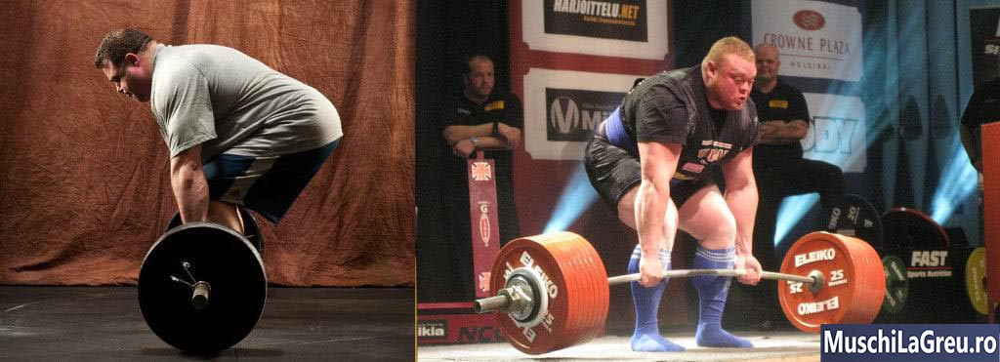
_Fiecare Deadlifter puternic are omoplatii peste bara cand bara iese pe podea._
Omoplatii trebuie sa fie deasupra talpilor in pozitia de inceput. Fiecare Deadlifter puternic de la Andy Bolton la Benedikt Magnusson pana la Mike Tuchscherer are omoplatii deasupra barei cand greutatea paraseste podeaua. Este cel mai eficient mod de a ridica multa greutate la Indreptarti(Deadlift).

Iata de ce: omoplatii transfera forta generata de picioarele tale in spatele asfel tragand bara. Ridici bara intr - o linie verticala deasupra punctului tau de echilibru – mijlocul piciorului(talpii). Gravitatea trage bara in jos pe o linie verticala. Deci, omoplatii trebuie sa fie deasupra barei pentru a trage impotriva gravitatii.

Acest lucru inseamna ca omoplatii, mijlocul piciorului si bara trebuie sa fie aliniate la pozitia de inceput. Trebuie sa existe o linie perpendiculara care sa treaca prin ele, deoarece acesta este cel mai eficient mod de a trage greutatea grea de pe podea - si aceasta este indiferent de constructie, inaltime, dimensiune, sex etc.

Nu va strangeti omoplatii pe Indreptari(Deadlifts), precum pe [Genoflexiuni cu haltera](/exercitii/genuflexiuni-cu-bara/) sau [[Bench Press(Impinsul cu haltera de la piept)](/exercitii/impinsul-cu-haltera-de-la-piept/). Aceasta creste distanta pe care o parcurge barul. Pastrati-le inapoi (retras) ridicand pieptul atunci cand incepeti. Blocati pozitia contractand muschiul lat dorsal al spatelui(lats) . Dar nu incercati sa va atingeti omoplatii.

## Umerii

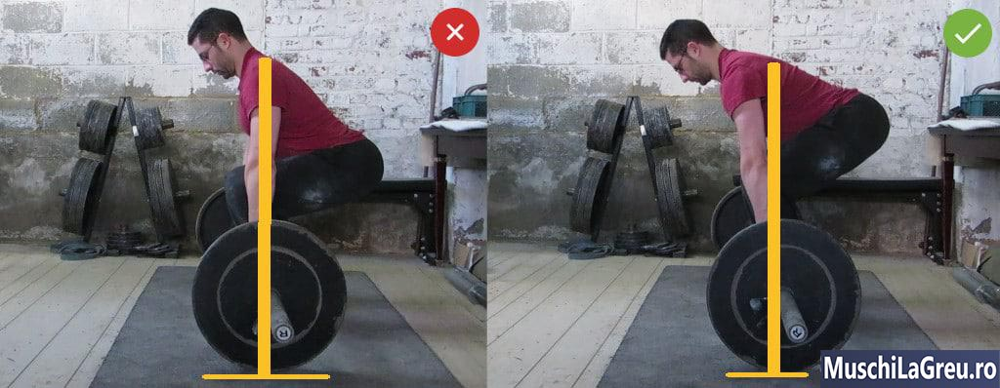
_Stanga: umerii deasupra barei iti pun soldurile prea jos. Dreapta: incepeti cu omoplatii peste bara._

Umerii trebuie sa fie in fata barei atunci cand incepeti Indreptarile. Acest lucru pune omoplatii deasupra barei si este cel mai eficient mod de a dace Indreptari asa cum am discutat mai sus.

Umerii deasupra barei nu functioneaza. Iti pune soldurile prea jos. Genunchii si tibia vor veni prea mult inainte. Ii vei lovi pe traseul barei, pentru ca vor fi in calea halterei. Va trebui sa se miste in jurul lor in loc sa se indrepte in sus, ceea ce este ineficient. Tineti umerii in fata barei.

Mentineti umerii relaxati. Nu trebuie sa ridici din umeri sau sa-i dai in spate in partea de sus a Indreptarilor. Trapezul deja munceste din greu pentru a-ti mentine umerii in loc. Ridicarea sau miscarea in spate a umerilor este inutila si rea pentru articulatiile umarului. Lasa-ti umerii sa atarne in timp ce picioarele ridica greutatea de pe podea.

## Unghiul spatelui

Unghiul spatelui corespunzator pentru Deadlifts depinde de construirea dvs. Daca aveti coapse lungi cu un trunchi scurt, unghiul din spate va fi mai orizontal cu podeaua. La fel daca ai bratele scurte. Dar unghiul din spate va fi mai vertical daca aveti coapse scurte sau brate lungi.

Prin urmare, nu ar trebui sa va concentrati asupra unghiului din spate (la fel cum nu ar trebui sa va concentrati asupra pozitiei soldului). Concentrati-va sa incepeti in mod corespunzator - barati peste mijlocul piciorului, omoplati deasupra barei si tibia impotriva barei. Daca sunt aliniate, unghiul din spate va fi perfect, indiferent de constructia ta.

Pastrati unghiul spatelui constant in timpul Indreptarilor. Nu lasati soldurile sa se ridice mai repede decat pieptul. Acest lucru iti scoate coapsele(muschiul cvadriceps) din miscare, indreptandu-ti picioarele prea curand. Ridicati-va soldurile si pieptul in acelasi timp, impingand picioarele prin podea.

## Tibia

Unghiul tibiei depinde si de constructia ta. Dar ar trebui sa fie inclinata atunci cand privesti din lateral. Tibiile verticale nu functioneaza pentru ca te pune prea departe in spatele barei. Vei pierde echilibrul si vei lovi tibia cu bara. Pur si simplu incepeti si uitati de unghiul tibiee.

Tibiile tale nu pot atinge bara cand stai cu piciorul la mijloc. Daca o fac, bara este prea aproape si va va lovi tibiile cand trageti. Tibia ta trebuie sa atinga bara doar atunci cand incepeti apucand bara si aplecandu-va. Nu lasa tibiile sa indeparteze bara de mijlocul piciorului.

Bara trebuie sa ramana in contact cu picioarele atunci cand faceti Deadlift pentru a va salva spatele inferior. Trecand bara pe tibie pana in varf, va puteti simti incomod la inceput si pot provoca durere. Protejati-va tibia purtand pantaloni lungi sau sosete. Sau puneti banda atletica peste tibie.

Tibia ta nu ar trebui sa sangereze cand faceti Indreptari(Deadlift). De asemenea, nu ar trebui sa se invarta. Bara ar trebui sa inceapa impotriva tibiei dvs. in timpul pozitiei de inceput, apoi trageti peste ele in partea de sus. Dar, daca tibiile tale sunt lovite, pozitia ta este probabil gresita. Asigurati - va ca nu sunteti prea aproape de haltera si solduri prea joase.

## Genunchii

Impinge-ti genunchii in momentul in care ai Deadlift. Incepeti cu varfurile degetelor in inclinate spre afara cu 15 °. Apoi impingeti genunchii in aceeasi directie ca degetele de la picioare in timpul pozitiei de incepit si in timp ce trageti de greutate. Acest lucru va va angaja muschii inghinali. Cu cat mai multi muschi lucreaza cu atat greutatea va fi mai mare la Deadlift(Indreptari).

Inclinandu-ti genunchii in afara, de asemenea, ii tine inapoi si in afara traiectoriei pe care o sa o aiba bara. Esti mai putin probabil sa-i lovesti in timp ce ridici. Bara se poate ridica intr-o linie verticala, mai eficient.

Blocati(Indreptati) genunchii in partea de sus a fiecarei repetari, astfel incat sa aveti o pozitie puternica pentru a mentine greutatea. Indreptati-va picioarele prin intreaga gama de miscare pana cand articulatiile genunchiului sunt blocate. Repetarea nu conteaza daca nu reusiti sa va terminati Indreptarea/Deadlifts cu genunchii inchisi.

## Partea inferioara a spatelui

_Stanga: rotunjirea spatelui inferior, rau. Mijloc: arc in exces, rau. Corect: coloana vertebrala neutra, buna._

Faceti Indreptari cu colana neutra. Incepeti cu curba normala interioara a coloanei vertebrale inferioare. Acest lucru mentine presiunea pe discurile coloanei vertebrale egala atunci cand faci Deadlift. Prin urmare, este cel mai sigur mod de a trage greutatea foarte grea de pe podea fara a va rani spatele.

Nu trageti cu spatele rotunjit. Acest lucru pune presiune pe partea din fata a discurilor spinale pe partea stomacului. Iti intinde spatele discurilor. Poti sa ti intinzi un nerv sau poate cauza dureri ce le resimti la nivelul picioarelos. Asa se intampla de obicei leziuni inferioare de spate la Deadlifts.

De asemenea nu arcuiti prea mult spatele(cooloana). Pune presiune inegala asupra discurilor spinarii, dar prin presiune asupta partii din spate. Coloana vertebrala inferioara trebuie sa aiba o curba naturala, nu exagerata. Daca ai tendinta sa iti arcuti spatele inferior, contracteaza- ti abdomenul pentru a indrepta coloana vertebrala.

Incepti cu spatele neutru inainte de a trage de greutate. Nu incercati sa faceti acest lucru dupa ce greutatea a parasit podeaua - nu va functiona. Incepeti cu bara peste mijlocul piciorului, apucati-o si indoiti-va picioarele pana cand tibia atinge bara. Ridicati pieptul si coloana vertebrala inferioara va fi neutra.**Nu miscati coloana spatele in timpul ridicarii!!!**

Daca va chinuiti sa va puneti spatele neutru, incercati sa-l arcuiti. Trageti soldurile in tavan in timp ce ridicati pieptul. Puteti exagera acest unghi pana cand partea inferioara a spatelui nu se mai rotunjeste. Dar amintiti-va ca forma Deadlift corespunzatoare nu este hiper-arcuita, ci un arc natural in coloana vertebrala inferioara.

Dupa ce spatele inferior este neutru, blocati-l in pozitie inainte de a trage. Ridicati-va pieptul, contractati-va abdomenul-ul si inspirati. Tineti aerul si apoi trageti. Cel mai bine este sa va contractati trunchiul intre fiecare repetare inainte de a trage din nou greutatea. In caz contrar, spatele tau se va obosi si riscati sa l rotunjiti.

Nu incercati sa trageti de greutate cu spatele inferior. Spatele nu Indreapta greutatea - nu se misca. Pur si simplu iti mentine coloana vertebrala neutra in timp ce transfera forta generata de picioarele tale. Picioarele si soldurile ridica greutatea incepand sa se aplece si sa se indrepte. Lasa-i sa faca treaba.

## Partea superioara a spatelui

Partea superioara a spatelui ar trebui sa ramana neutra si la Deadlift. Este mai usor sa va mentineti spatele inferior neutru daca partea superioara a spatelui este de asemenea neutra. Faceti acest lucru ridicand pieptul inainte de a trage de greutate. Pastrati piept in sus inspirand o gura mare de aer si contractati muschiul lat dorsal(lats) .

Coloana vertebrala superioara are o curba exterioara normala . Va arata usor rotunjit atunci cand ridicati pieptul. Acest lucru este bine, atata timp cat umerii nu sunt in fata. Nu incercati sa obtineti un arc in partea superioara a spatelui ca in partea inferioara a spatelui - aceasta nu este pozitia naturala a coloanei vertebrale superioare.

## Cap

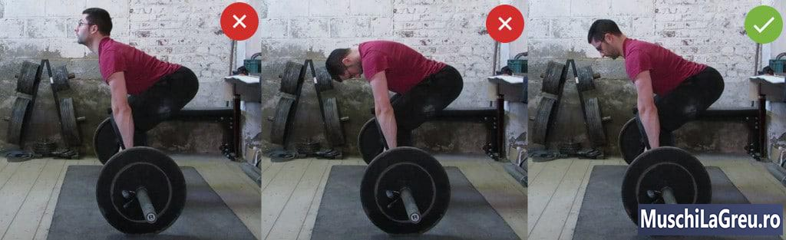
_Nu te uita in sus sau la picioarele tale. Priveste usor inainte pentru a-ti mentine capul neutru._

Faceti Indreptari(Deadlift) cu gatul neutru. Intreaga coloana vertebrala trebuie sa fie neutra, astfel incat sa aveti presiune egala asupra discurilor coloanei vertebrale. Pozitioneaza-ti capul astfel incat sa ai acea curba naturala in interiorul coloanei vertebrale cervicale.

Acest lucru inseamna ca nu ar trebui sa va uitati in sus atunci cand incepeti Deadlifts. Acest lucru contractata discurile coloanei vertebrale, ceea ce nu este bine, asa cum am discutat anterior. De asemenea, cauzeaza o forma gresita a Deadlift - puteti incerca sa scutiti presiunea din gat de la privirea ridicandu-va mai mult soldurile. Dar nici asta nu functioneaza.

Este tentant sa te uiti in sus sau inainte intr-o sala de sport plina de oglinzi. Veti incerca sa le utilizati pentru a verifica pozitia ta. Dar te vor incurca si iti vor afecta pozitia gatului cat si forma. Evitati oglinzile daca puteti. Daca nu puteti, ignorati-le. In loc sa va uitati in oglinzi incercati sa inregistrati un video pentru a verifica pozitia ta Deadlift.

Cealalta greseala este sa te uiti la picioarele tale sau la bara. Acest lucru va relaxeaza partea superioara a spatelui si face mai probabil rotunjirea. Partea inferioara a spatelui este mai probabil sa se rotunjeasca, ceea ce este rau, asa cum a fost deja explicat. Pieptul trebuie sa stea sus si acest lucru functioneaza cel mai bine atunci cand va mentineti partea superioara a spatelui si gatul.

Uita-te la un punct de pe podea in fata ta. Daca faceti acest lucru corect, veti avea o linie dreapta din partea de sus a capului pana la solduri atunci cand incepeti Indreptarile. Gatul tau va fi neutru. Acest lucru se poate simti ciudat daca esti obisnuit sa privesti in jur. Tineti-va de acest obicei si va veti obisnui cu el.

## Pozitia de inceput

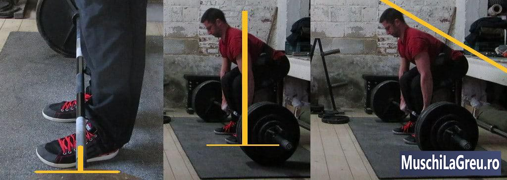
_Pozitia de inceput corespunzatoare Deadlift: bara de la mijlocul piciorului, omoplati peste bara, tibia impotriva barei si coloana vertebrala neutra._

Setarea Deadlift corespunzatoare arata ca o jumatate de [Genoflexiuni cu haltera](/exercitii/genuflexiuni-cu-bara/). Constructia dvs. determina inaltimea soldului si unghiul spatelui. Dar vor fi acolo unde ar trebui sa stea daca incepeti in urmatoarea pozitie:

- **Bare peste mijlocul piciorului** - mijlocul intregului picior nu doar partea vizibila
- **Tibia impotriva barei** - apuca bara si apleaca-te pana cand tibia ta atinge bara
- **Umerii deasupra barei** - umeri in fata barei, bratele usor inclinate
- **Coloana vertebrala neutra** - arcul natural al spatelui inferior, pieptul sus, capul aliniat cu coloana vertebrala

Incepeti pozitia de inceput atunci cand mergi spre bara. Pune-ti mijlocul piciorului sub ea. Apucati bara in timp ce va mentineti soldurile sus. Apoi indoaie-ti picioarele pana cand tibia ta atinge bara. Acum indreptati coloana vertebrala ridicand pieptul. Daca bara a ramas peste mijlocul piciorului tau tot timpul, esti gata sa tragi.

Te descurci corect daca talpile mijlocii si umarul sunt aliniate cu bara. Ar trebui sa poti trasa o perpendiculara prin ele atunci cand privesti din lateral. De asemenea, ar trebui sa poti trasa o linie dreapta de la cap la solduri. Aceasta este cea mai eficienta pozitie de la care sa tragi.

Fiecare repetare trebuie sa porneasca de la aceasta pozitie. Cheia este sa coborati bara intr-o linie verticala, astfel incat sa aterizeze deasupra piciorului tau. Spatele tau va obosi si va dori sa se rotunjeasca pe masura ce repetarile vor trece. Blocati-l in pozitie neutra ridicand pieptul si respirand inainte de a trage urmatoarea repetare.

Degetele de la picioare ar trebui sa fie usor in afara, aproximativ 15 grade. Impingeti-va si genunchii in afara - va pastreaza tibiile inapoi si in afara directiei barei. Spatiul este limitat, dar incercati sa le impingeti in aceeasi directie cu degetele de la picioare. Acest lucru va va contarcta zona inghinala si va va ajuta sa faceti Indreptari(Deadlift) cu mai multa in greutate.

## Miscarea de ridicare

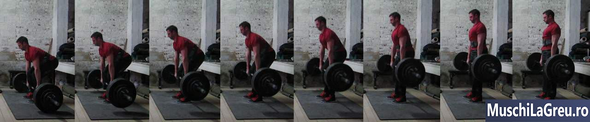
_Trageti bara intr-o linie verticala in sus. Trageti-l peste picioare, pastrandu-va spatele neutru._

Forma corespunzatoare pentru Indreptari(Deadlift) este sa ridici bara intr-o linie verticala. Acesta este cel mai eficient mod de a trage, deoarece este cea mai scurta distanta intre podea si indreptarea corpului(blocare). Si din moment ce ai cel mai bun echilibru atunci cand bara se deplaseaza peste mijlocul piciorului, ar trebui sa se ridice de pe podea din aceasta pozitie.

Trageti greutatea incet de pe podea. Nu te grabi sa tragi de haltera. Evitati sa ridicati cu bratele. Trageti cu bratele drepte. Pastrati tensiunea, respirati si apoi ridicati greutatea de pe podea. Ridicarea de jos ar trebui sa fie lenta.

Trageti bara peste picioare. Daca incepeti corect, tibia a inceput impotriva barei. Pastrati bara aproape de centrul de masa tragand bara peste tibie, genunchi si coapse pana in pozitia de final. Nu schimba traiectoria barei sau iti va fi mai greu pentru spate.

Impingeti genunchii in timp ce ridicati greutatea. Acest lucru ii tine inapoi si in afara drumului halterei. De asemenea, iti implica mai mult muschii inghinali. Cu cat sunt mai multi muschi implicati, cu atat greutatea poate fi mai grea . Asigurati-va ca incepeti cu degetele de la picioare cu 15 ° afara, astfel incat sa va puteti impinge genunchii in afara.

Ridicati-va soldurile si pieptul in acelasi timp. Nu lasati soldurile mai intai sau picioarele se vor indrepta prea repede. Acest lucru iti scoate coapsele din miscare si ingreuneaza greutatea. Asteptati pana cand bara a parasit podeaua pentru a va ridica soldurile si pieptul in acelasi timp.

Incercati sa impingeti picioarele prin podea in loc sa trageti greutatea inapoi. Imagineaza-ti ca iti apesi piciorul pe podea - ridica bara impingand podeaua cu picioarele. Podeaua nu se va misca, evident. Dar acest obicei opreste soldurile sa creasca prea curand. Ajuta la implicarea corecta a picioarelor.

Nu trebuie sa existe nicio miscare orizontala a barelor atunci cand faceti Deadlift. Una, aceasta mareste distanta pe care trebuie sa o parcurga bara pentru a ajunge la pozitia finala. Doi, ingreuneaza greutatea pe partea inferioara a spatelui. Daca bara se misca pe orizontala (ca intr-o curba J), nu a inceput deasupra mijlocului picioarelor. Remediati pozitia de pozitia de inceput.

In cazul in care bara nu doreste sa paraseasca podeaua, forta antebratelor tale ar putea fi prea slaba(priza). Puneti creta si incercati din nou cu o prindere mixta. Vei avea o prindere mai buna si ar trebui sa poti ridica greutatea acum. Nu renunta prea repede, continua sa tragi. Daca bara inca nu se misca, este doar prea grea.

## Pana jos

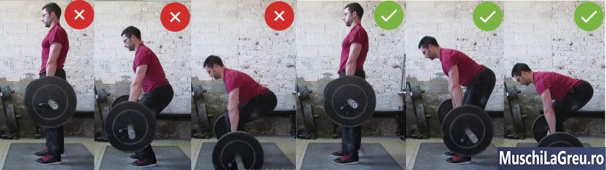
_Miscati-va soldurile inapoi, astfel incat sa nu va loviti de genunchi in jos._

Drumul de jos trebuie sa fie o oglinda a urcarii. Bara trebuie sa se deplaseze in jos pe o linie verticala, deoarece aceasta este cea mai scurta distanta pana la podea. Trebuie sa ramana in contact cu picioarele pentru a reduce stresul pe spate . Si trebuie sa aterizeze peste mijlocul picioarelort gata pentru urmatoarea repetare. Coloana vertebrala trebuie sa ramana neutra.

Din pozitia de sus deblocheaza(indoaie) soldurile si genunchii. Apoi coborati greutatea miscand soldurile inapoi. Mentineti picioarele aproape drepte in timp ce va deplasati mai ales din solduri. Obiectivul este sa va mentineti genunchii inapoi si sa iesiti din calea halterei. In acest fel o puteti cobori intr-o linie verticala pana la mijlocul piciorului.

Nu coborati greutatea doar prin indoirea genunchilor. Vor veni prea departe inainte si vor bloca bara. Vei lovi apoi genunchii, ceea ce doare . Bara va trebui sa se miste loveasca genunchii pentru a ajunge pe podea. Va ateriza deasupra piciorului tau, care este o pozitie ineficienta din care sa-ti tragi urmatoarea repetitie.

Asteptati pana cand bara a trecut de genunchi pentru a le indoi. Reduceti greutatea miscand soldurile inapoi, mentinand picioarele aproape drepte. Mentineti bara aproape de picioare pana la mijlocul talpii. Pastrati-va spatele inferior neutru - nu il lasati rotund sau hiper-extinns. Curba interioara sa fie normala.

Coborati bara sub control, dar nu lent. Ar trebui sa fie mai rapid decat drumul in sus. Dar nu ii dati drumul halterei. Poate lovi podeaua, discurile si haltera. De asemenea controlul halteriei la coborare iti sporeste forta si masa musculara. Tineti bara in maini si coborati-o sub control inapoi pe podea.

Coborati corect bara daca se deplaseaza intr-o linie verticala si lasati-o peste mijlocul piciorului. Bara nu ar trebui sa-ti loveasca niciodata genunchii, iar spatele inferior nu ar trebui sa doara.

## Indreptarea(Lockout)

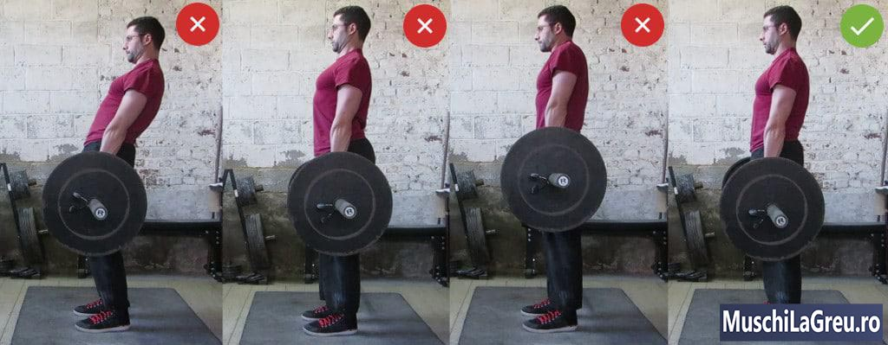
_Nu va lasati pe spate sau ridicati din umeri in partea de sus. Doar blocheaza soldurile si genunchii si mentine-ti spatele inferior neutru._

Finalizeaza Indreptarea(Deadlift-ul) indreptandu-ti soldurile si genunchii. Stai inalt cu pieptul in sus si umerii in spate. Pastreaza-ti spatele neutru, astfel incat sa ai acea curba interioara normala . Tineti greutatea o secunda in varf, peste mijlocul piciorul. Apoi coborati bara inapoi pe podea sub control.

Nu te lasa inapoi. Unii powerlifters fac acest lucru pentru a evita luminile rosii in competitii. Vor ca judecatorii sa vada ca si-au tras umerii in spatele soldurilor. Dar aplecarea inapoi iti incarca discurile vertebrale inegal. Nu o face.

Doar ridicati bara si blocati-va soldurile. Amintiti-va ca spatele nu ridica greutatea - va mentine coloana vertebrala neutra. Asadar, nu incerca sa tragi greutatea inapoi si apoi stai acolo cu fundul afara. Blocati soldurile astfel incat spatele inferior sa se incheie intr-o pozitie neutra stabila si sigura.

Indreapta si genunchii. Acest lucru nu este rau pentru articulatiile tale, pentru ca nu le treci peste miscarea lor – nu e hiper-extindere. Folosesti o gama normala de miscare, indreptand picioarele pana cand genunchii sunt blocati. Greutatea grea este mai usor de tinut cu genunchii indreptati si blocati decat inclinati.

Ridicarea sau rularea umerilor in varf nu este necesara. Trapezul tau deja munceste din greu pentru a-ti mentine umerii in pozitie atunci cand faci Deadlift(Indreptari). Nu este nevoie sa adaugati o contractie in partea de sus, si sa o faceti oricum este rau pentru umeri. Lasa-ti umerii sa fie relaxati in varf.

## Respiratie

Inhalati inainte de a trage bara de pe podea. Tine respiratia in timp ce tragi de greutate. Continuati sa va mentineti respiratia in varf. Coborati greutatea inapoi pe podea si apoi expirati. Acesta este modul adecvat de a respira pe Deadlifts, deoarece creste siguranta si rezistenta la nivelul spatelui.

Iata cum functioneaza acest lucru: inhalarea iti umple plamanii cu aer. Iti extinde pieptul si abdomenul. Mentinerea acestui aer creste presiunea in trunchi, ceea ce pune forta pe coloana vertebrala. Acest lucru creeaza o „centura naturala” care sprijina spatele - il mentine in pozitie corecta, astfel incat sa nu se indoaie.

Tensiunea arteriala va creste atunci cand va tineti respiratia. Dar va reveni la normal dupa setul tau. Deadlifts scade de fapt tensiunea arteriala prin cresterea fortei musculare. Muschii mai puternici pun mai putina cerere asupra inimii tale, deoarece face mai putin efort pentru a face ceea ce faci.

Ignorati oamenii care va spun sa expirati pe drumul de urcare si inhalati pe drumul de coborare. Exhalarea iti goleste plamanii. Scade presiunea in trunchi. Prin urmare, scade, de asemenea, sprijinul inferior al spatelui. Este mai probabil sa va raniti coloana vertebrala daca expirati pe drum. Nu face asta.

Expiratia in pozitia de final este rea din acelasi motiv. Repetitiile sunt scurte, astfel incat sa va puteti tine respiratia pana cand bara este din nou pe podea. Daca nu, asteptati prea mult sa trageti dupa ce inhalati in partea de jos. Asteptati sa inhalati pana cand sunteti gata sa trageti. Dupa ce ai respirat, ridica bara imediat.

Expirati odata ce bara este din nou pe podea. Apoi pregatiti-va pentru urmatoarea repetare prin strangerea barei, ridicand pieptul si regasindu-va spatele neutru. Respirati si trageti. Tineti-va respiratia in partea de sus, in timp ce tineti greutatea pentru o secunda. Apoi coborati inapoi pe podea. Expirati, incepeti, inspirati, repetati.

## Intre Repetari

Fiecare repetari trebuie sa porneasca de la un stop DEAD(punct mort), deoarece acesta este un DEADlift . Greutatea trebuie sa fie nemiscata inainte sa iti tragi urmatoarea repetare. Opriti bara pe podea pentru o secunda intre repetari. Folositi aceasta pauza pentru a respira si asezati-va inapoi intr-o pozitie puternica inainte de a trage din nou.

Nu sari. Puteti sa faceti Indreptari pentru mai multe repetari daca loviti greutatea de podea si trageti-l inapoi folosindu-va de aceasta inertie. Dar acest lucru ia munca de la muschi. Nu ridici greutatea de la podea la genunchi - reculul de la discuri cand lovesc podea o fac. Deci, daca lovesti podeaua iti usurezi munca.

Ridicarea dintr un punct mort este mai dificila. Dar si acesta este motivul pentru care construieste mai multa forta si muschi. In plus, pauza va ofera timp pentru a intra in pozitia de inceput cu forma corespunzatoare pentru urmatoarea repetare. Lovirea greutatilor de podea nu va ofera timp pentru acest lucru, motiv pentru care provoaca o forma proasta (de obicei se termina intr-o pozitie a spatelui rotunjita cu picioare dure).

Tine bara pe podea un timp scurt intre repetari pentru a putea folosi reflexul de intindere. Hamstringul si muschii feselor tale se intind pe drumul in jos. Acest lucru le face sa se contracte mai greu pe drum si creste rezistenta. Pierdeti reflexul de intindere daca asteptati prea mult intre repetari. Timpul ar trebui sa fie doar de o secunda.

Deci nu va ridicati intre repetari. Iti ingreuneaza urmatoarea repetare pentru ca pierdeti reflexul de intindere. Daca coborati corect bara, aceasta va ateriza peste mijlocul piciorului. Soldurile si umerii vor fi in pozitie corecta. Singurul lucru ramas este sa respirati, sa stati cu coloana vertebrala neutra si sa va contractatii muschii.

Evitati sa da ti drumu la bara din acelasi motiv. Daca trebuie sa reincercati, atunci nu ati apucat corect la inceput - poate ca ati folosit o prindere normala, in timp ce la aceasta greutate este nevoie de o prindere mixta. Sau ai strans cu mijlocul palmei si ar trebuit sa te relaxezi din cauza durerilor de mana. Prindeti corect inainte de a incepe setul de Deadlift(Indreptari).

Munciti din greu pentru a va incorda corpul intre repetari pentru a va bloca coloana vertebrala intr-o pozitie neutra. Strangeti bara tare si plantati-va picioarele in pamant. Incercati sa va intelegeti trunchiul intreg contractandu-va pieptul, abdomenul. Faceti acest lucru inainte sa inspirati o gura mara de aer dar si inainte de a trage greutatea de pe podea.

## Cazuri speciale

## Barbati inalti

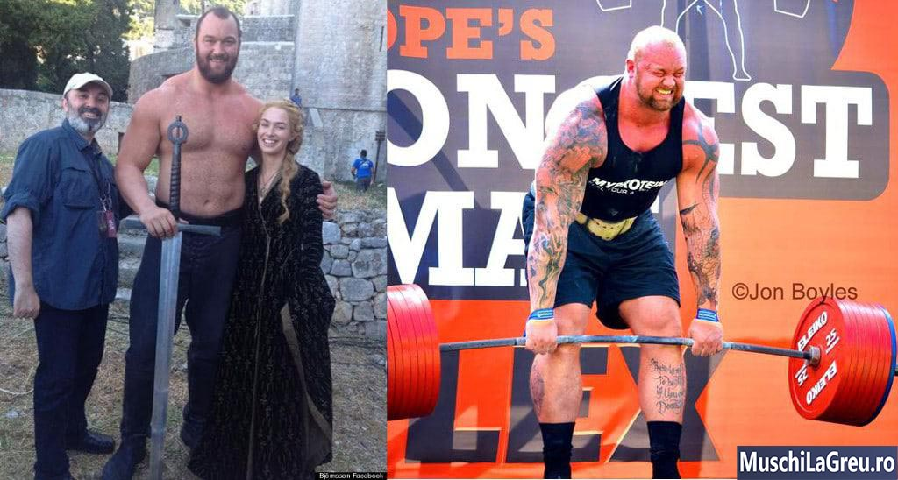
_„The Mountain” este de 2,06m (6’9 ″) si Deadlifts 501 kg. El face indreptari, asa cum este prevazut in acest ghid._

Multi Deadlifters puternici sunt inalti: Brian Shaw are 1,98m, Terry Hollands este 1,94m, Zydrunas Savickas este1,90m ″, Hafþór Július Björnsson are 2,06m inaltime. Si totusi, toti pot sa faca Indreptari(Deadlift) cu peste 400 kg.

Se datoreaza faptului ca inaltimea ta nu conteaza. Uita-te la The Montain din imaginea de sus: trage cu capul neutru, cu umerii in fata barei, bara se trage peste picioare, etc. Urmeaza toate sfaturile pentru un Deadlift corect ca in acest ghid, deoarece Deadlifting pentru tipii inalti este acelasi ca pentru baieti de inaltime medie.

Este importanta lungimea membrelor tale. Daca ai coapsele lungi, genunchii iti vor veni mai mult inainte. Asadar, ai mai multe sanse sa iti lovesti tibiile in timpul Deadlifts. Baietii inalti cu coapse lungi cred ca doar ei au astfel de probleme. Asta nu este adevarat.

Nu lasa inaltimea ta sa fie o scuza. Urmati aceste sfaturi pentru Indreptari si antrenati-va.

## Baietii mari(„grasi”)

_Andy Bolton si Benedikt Magnusson au facut Indreptari(Deadlifted) de 400kg cantarind + 350lb. Ei Deadlift ca in acest ghid._

Andy Bolton a fost primul tip la Deadlift 457.5 kg. El cantareste 350lb. Benedikt Magnusson a inregistrat recordul mondial al lui Andy cu Deadlifting 460kg. El cantareste 379lb. Fiind mari nu i-a impiedicat sa foloseasca o forma adecvata in Deadlifts. Ei deadlift exact ca acest ghid stabileste afara.

Uita-te la imaginea de mai sus. Amandoi se instaleaza cu bara peste piciorul mijlociu, cu omoplatii peste bara, cu umerii in fata, cu capul neutru, cu partea inferioara a spatelui, etc. Asa ca functioneaza chiar daca esti mare.

Provocarea obisnuita pentru baietii mai mari este ca burta lor sa intre in cale. Extindeti-va pozitia. Mergeti mai ingust decat pe [Genoflexiuni cu haltera](/exercitii/genuflexiuni-cu-bara/), dar mai lat pe distanta de sold. Puteti crea un spatiu suplimentar pentru burta, indreptandu-va degetele de la picioare si impingeti genunchii in lateral. Cel mai important, nu iti crea scuze.

## Maini mici

Palmele mici si/sau degetele scurte ingreuneaza mentinerea barei in timpul Indreptarilor. O suprafata mai mica a degetului mare se suprapune pe degete. Priza ta este mai putin sigura in comparatie cu cei cu maini mai mari, ca mine.

Dar dimensiunea mainilo nu conteaza pana cand nu atingeti un nivel avansat in Indreptari(Deadlifts). Femeile sunt o dovada in acest sens: au maini mai mici si cantaresc mai putin. Si totusi, in mod obisnuit, fac Indreptari(Deadlift ) cu180kg. Puteti face si voi, indiferent de dimensiunea mainilor daca va antrenati destul si urmati acest ghid.

Cheia este sa strangeti bara, si sa folositi priza mixta. Finalizati fiecare set Deadlift cu priza statice pentru a creste si mai mult rezistenta la prindere. Fiti consecventi, aveti rabdare si nu iti crea scuze. Puterea ta de prindere va creste, la fel si Deadlift-ul tau.

Palmele mici pot duce la calusuri mai mari. Te forteaza sa strangi bara din mijlocul palmei, deoarece ai prea putin loc cu care sa te apuci. Nu purta manusi - acestea fac bara si mai groasa, si este ultimul lucru pe care ti-l doresti. Doar aveti grija sa nu prindeti piele sub bara.

## Femei

Indreptarile cu haltera pentru femei este la fel ca si pentru barbati. Acest lucru se datoreaza faptului ca corpul unei femei este similar cu cel al unui barbat, daca uitati de sanii si organele genitale pentru un minut. De asemenea, au doua brate, doua picioare, doua maini, un trunchi si un cap. De obicei sunt doar mai mici.

Asta inseamna ca fac Indreptari(Deadlift ) la fel ca si barbatii. Incepeti-o cu bara peste mijlocu piciorul, apucati bara, aplecata si apoi indoiti genunchii pana cand tibia atinge bara. Faceti- o corect si omoplatii se vor fi peste bara. Trageti de aici, tragand bara peste picioare.

Nu hiper-extindeti partea inferioara a spatelui. Femeile tind sa faca acest lucru datorita anatomiei. Hiper extensia a spatelui inferior contractata discurile - nu o faceti. Pastrati un arc natural si contractatati abdomenul. Purtarea unei curele va poate ajuta sa va contractati abdomenul mai usor.

Exista barele mai usoare pentru femei care cantaresc doar 15kg. De obicei sunt mai scurte, iar unele au doar 25 mm grosime pentru a face fata mainilor mai mici ale femeilor. Cu toate acestea, femeile folosesc aceleasi bare de 28 mm in competitii ca si barbatii. Deci, daca o bara goala nu este prea grea, folositi-o.

Purtati sosete lungi daca nu doriti sa va zgariati tibia.

## Forta pentru mentinerea prizei

O priza puternica este cruciala pentru Deadlifts, deoarece nu puteti ridica o greutate pe care nu o puteti tine. Consolidarea prizei va ajuta sa mentineti greutatea mai mult timp. Drept urmare, progresezi mai bine, iti cresti Indreptarile si creezi muschii mai mari ai antebratelor.

Cel mai bun mod de a-ti creste rezistenta la prindere pentru Indreptari este sa folosesti prinderea alba, creta si priza mixta. Strangeti bara pana cand varfurile pumnului(knuckles) vor deveni albe. Folositi daca transpirati foarte mult. Prindeti bara cu o mana orientata in sus, cu una in jos. Pentru ati lucra priza, faceti priza statice.

Ceea ce nu functioneaza sunt curelele, manusile si aparat flexor pentru antebrat. Curelele acopera o prindere slaba in loc sa o intareasca. Manusile fac bara mai groasa si mai greu de tinut. Aparatul flexor creeaza rezistenta la prindere care nu este echivalenta pentruDeadlifts. Antrenativa cu priza alba, creta si priza mixta.

## Priza alba

Strangeti bara pana cand varfurile pumnului(knuckles) vor devini albe. Cu cat strangeti mai tare, cu atat mai putin se poate misca bara in maini. Gravitatea va trage bara in jos si din mainile voastre in timpul Indreptarilor(Deadlifts). Daca strangeti bara prea putin, aceasta va aluneca in jos, va deschide mainile si veti pierde bara. Asa ca contractata tare palma in jurul halterei.

Prinza alba creste, de asemenea, rezistenta generala la Deadlift. Cand faceti un pumn strans, toti muschii in amonte (bicepsul, umerii, etc ) se contracta mai puternic. Aceasta este „hiper radiatie” – folosesti mai multi muschi, strangand bara cat poti de tare, pana cand varfurile pumnilor(knuckles) tai vor deveni albe.

Priza normala functioneaza cel mai bine pentru priza alba, deoarece puteti strange mai tare. Asta inseamna ca ar trebui sa va infasurati degetele in jurul barei, astfel incat sa se suprapuna cu degetul mare. Nu nu folosi priza fara degetul mare pentru a „simti mai mult” greutatea. Vei simti mai mult cand Deadlift-urile tale sunt mai grele. Priza normala functioneaza mai bine pentru asta.

De asemenea, puteti mentine mainile inchise mai mult timp cu priza normala. Gravitatea va trage greutatea in jos. Bara va deschide mainile si se va rostogoli in jos. Fara ca degetele mari sa se suprapuna cu degetele, ai pierde rapid bara. Deci faceti Indreptari cu o priza completa si strangeti bara cat puteti de tare.

## Priza mixta

_Faceti Indreptari/Deadlift cu priza mixta atunci cand nu puteti tine bara cu prinderea normala. O mana in sus, una in jos._

Priza mixta tine bara cu o mana in sus, cu una in jos (ca o bata de baseball). Acest lucru mareste rezistenta la prindere punand degetele de o parte si de alta a barei. Prinderea normala pune degetele doar pe o parte.

Priza mixta anuleaza de asemenea rotirea barei. Gravitatea trage bara in jos, care iti deschide mainile. Bara se rostogoleste spre tine si iti deschide mai mult mainile, deoarece ambele palme se indreapta spre tine. Dar nu se mai poate rostogoli daca intorci o mana in directia opusa. In felul acesta, aderenta mixta poate adauga 20kg la Deadlift.

Priza mixta nu inseamna ca trisezi. Inca ridicati greutatea singur(spre deosebire de curele ajutatoare pentru priza). Muschii tai de strangere trebuie sa lupte forta gravitationala. Mai trebuie sa tina mainile inchise, astfel incat sa nu pierdeti bara. Doar nu mai exista rotatie. Dar priza ta functioneaza - cu greutati mult mai grele acum.

Nu evitati priza mixta pentru a va imbuntatati puterea. Aceasta priza evita limitarea greutatilor la Indreptari. Priza ta nu va fi slaba daca te fixezi normal pe majoritatea seturilor, si mixt pe seturi grele. Puterea antebratelor va creste, deoarece iti vei mari Deadlift-urile odata cu priza mixta. Deci iti vei lucra priza cu greutati mai mari.

Majoritatea oamenilor isi pun mana dominanta in sus. Sunt dreptati si ma tin mana dreapta in sus de ani de zile. In 2017 am schimbat dupa o accidentare mica. Priza a fost mai slaba la inceput, dar acum este la fel de puternica. Nu pare sa conteze ce maini folosest, atata timp cat esti consecvent.

Unele persoane recomanda schimbarea mainii cu fata in sus pe fiecare set, pentru a evita dezechilibrele coloanei vertebrale si ale umerilor. Dar nu veti folosi aderenta mixta pe fiecare set - doar pe cele grele. Plus [Antrenamente 5x5](/program/5x5/) a inclus o multime de lucru echilibrat al picioarelor si spatelui cu [Genoflexiuni cu haltera](/exercitii/genuflexiuni-cu-bara/)/[Ramat cu haltera(Barbell Row)](/exercitii/ramat-cu-bara/) pentru a evita dezechilibrele.

Daca sunteti sceptici, campion mondial Mike Tuchscherer nu schimba niciodata mana cu fata in sus, deoarece asta ii ofera bratului jumatate din practica. El doreste o practica completa pentru a creste rezistenta la prindere, a-si intareste bratul in acea pozitie si l protejaza impotriva ranilor.

Cea mai buna modalitate de a evita rupturi ale ligamentelor in biceps la priza mixta este sa va mentineti bratele drepte. Nu faceti indreptari cu coatele indoite. Nu aruncati bara pe podea si nu incercati sa o ridicati cu bratele. Strangeti bara cu coatele drepte, dar bratele relaxate. Lasa-ti picioarele si muschii spatelui sa ridice bara, folositi bratele doar sa o tineti.

Nu aveti nevoie de prindere mixta in primele saptamani de [Antrenamente 5x5](/program/5x5/) - greutatea este inca usoara. Nu folositi priza mixta atunci cand puteti tine bara cu o prindere normala. In caz contrar, nu aveti la ce sa comutati in ziua in care greutatea este prea grea pentru a o tine. Folositi priza normala cat puteti.

Odata ce va apropiati de Deadlift de 140kg, veti observa ca va fi mai greu sa tineti bara. Iata cum se foloseste aderenta mixta atunci ...

- **Prindere normala pentru incalzire**. Intariti- va cu strangerea barei, utilizand prinderea normala a seturilor mai usoare . Apucati bara cu ambele palme indreptate spre tine pentru cat mai multe seturi de incalzire. Tineti greutatea in partea de sus pentru a va consolida si mai mult (mentinere statica).
- **Priza mixata pentru seturi grele**. Dupa ce nu mai puteti tine greutatea cu prinderea normala, folositi priza mixta. Asadar, daca nu puteti termina setul cu o priza normala, treceti la priza mixta si continuati. Nu lasati niciodata prinderea normala sa va opreasca sa puneti mai multe kg la Indreptarile voastre.

La inceput, priza mixta se va simti ciudat. Poate fi mai greu de pozitionat corect, ca si cum v-ar lipsi din spatiu. Dar este doar o chestiune de obisnuinta. Continua sa exersezi si te vei obisnui. Cea mai rapida cale este sa te folosesti aceeasi mana de fiecare data . Astfel obtii dubla practica cu aceasta strangere.

Bara va avea tendinta sa ruleze in fata, in cand bratele sunt orientate in fata. Nu lasati bara sa se abata sau va fi mai greu de ridicat. Trageti uniform.

Daca aveti o rana la umar sau aveti dureri de umar din priza mixta, schimbati mana indreptata in sus. Daca se simte mai confortabil in acest fel, ramaneti cu ea acolo. Din nou, nu pare sa conteze ce mana faceti in sus pentru o priza mai puternica. Foloseste ceea ce poti folosi si fii consecvent.

## Priza statica

_Faceti Indreptarile cu greutatea normala, apoi la ultima repetare, tineti bara in partea de sus a miscarii. Acest lucru va creste rezistenta prizei pentru Deadlfits(Indreptari)._

Priza statica inseamna sa tii greutatea fara sa faci miscare. Pe Deadlift faceti acest lucru tinand greutatea in partea de sus timp de cateva secunde inainte de a o intoarce la podea.

Priza statica creste rezistenta la prindere pentru Deadlifts prin cresterea timpului sub tensiune. Sa zicem ca setul tau dureaza zece secunde. Daca tineti bara inca zece secunde la sfarsit, v-ati antrenat priza pentru a mentine aceasta greutate timp de 20 de secunde. Faceti acest lucru suficient si mentinerea a 10 secunde devine mult mai usoara.

Pentru a face o priza statica, tineti greutatea la sfarsitul setului. Stai doar cu greutatea dupa ultima tar epetare. Mentineti soldurile si genunchii inchisi, dar lasati umerii si bratele sa atarne. Tineti-l timp de zece secunde (mai putin daca nu puteti), apoi coborati bara inapoi pe podea. Simplu, dar super-eficient.

Efectueaza priza statica in ultimul set al Indreptarilor(Deadlift) al zilei . O fac pe fiecare set si nu ma oboseste pentru seturile mele principale. Dar fac asta de ceva vreme si am o priza destul de puternica. Daca acest lucru iti slabeste aderenta, faceti priza statica doar pe ultimul set superior pana cand rezistenta la prindere creste.

## Aparatul flexor pentru antebrat

Grippers nu sunt atat de eficenti pentru a creste rezistenta la prindere pentru Deadlifts. Construiesc un tip de prindere diferit,ce nu este transferabil la Indreptari(Deadlifts).

- **Deadlifts/Indreptarile au nevoie de suport de prindere** - puterea de a pastra mana inchisa astfel incat sa nu pierzi bara (gravitatea trage greutatea in jos, care deschid mainile)
- **Aparat flexor pentru antebrat iti intareste priza la zdrobire** - puterea de a inchide mana impotriva unei rezistente externe (inchiderea capitanului Crush GrippersProdus, dand forta la strangeri de mana, etc )

Acesta este motivul pentru care priza statica functioneaza mai bine decat aparatul flexor. Acestea iti antreneaza priza exact asa cum o folosesti la Deadlifts. In plus, dureaza doar 10 secunde la sfarsitul fiecarui set. Si nu trebuie sa cumparati echipamente suplimentare - aveti deja haltera. Va puteti economisi banii si puteti cumpara fripturi in schimb.

Daca doriti oricum sa utilizati aparatul flexor, atunci nu faceti inchideri si dechideri rapide pentru repetitii. Pastrati priza inchisa pentru timp. Acesta va incerca sa deschida mana ca gravitatea in timpul Indreptarilor cu greutati mari. Tineti-va mana inchisa pentru a construi rezistenta de sprijin de care aveti nevoie pentru Deadlifts(Indreptari) grele.

Tineti minte ca deja antrenati priza destul de dess. Fiecare exercitiu din [Antrenamente 5x5](/program/5x5/) , viata de zi cu zi, etc. Folosirea aparatului flexor poate provoca dureri la nivelul cotului care va pot impiedica din a face exercitii. Ia-o incet. Daca doare, opreste-te.

## Echipament

 

## Creta

Creta creste rezistenta la prindere prin absobria transpiratiei. Impiedica bara sa se miste in maini atunci cand ai maini transpirate din cauza vremii calduroase sau a unei sedinte dure. Mi-am crescut Deadlift-ul cu 20 kg aproape peste noapte folosind creta. Daca nu folositi creta nu puteti la fel de multe kg pe bara.

Creta reduce, de asemenea, calusurile de la Indreptari/Deadlifting. Obtineti calusuri, deoarece bara se strecoara pe pliurile pielii. Creta iti umple pliurile pielii, ceea ce iti face palmele mai fine. Mai putin din pielea ta este prinsa sub bara. Aceasta inseamna calusuri mai mici si mai mici decat daca ai ridica fara creta.

Unele sali de gimnastica interzic creta. Puteti rezolva asta cu creta lichida, nu lasa urme. Babypowder nu functioneaza - scade frecarea si iti va slabi priza. Creta de gimnastica pe care o cauti este carbonatul de magneziu. Este ceea ce folosesc alpinistii si gimnastele.

Pielea ta poate suferii de la creta, mai ales iarna. Creta functioneaza prin uscarea mainilor. Am pielea sensibila si sunt predispusa la eczeme. Asa ca trebuie sa ma asigur ca scap de creta imediat dupa antrenament sa nu am probleme de piele. Spalati-va mainile cand ati terminat, hidratati-va daca este nevoie.

## Pantofi

Cei mai buni pantofi pentru Deadlifts au talpile subtiri, plate, dure. Talpile subtiri scurteaza distanta pe care o parcurge haltera pentru ca esti mai aproape de podea. Talpile plate va permit sa va asezati mai bine pentru a va angaja mai mult muschii. Talpile dure nu se comprima, ceea ce imbunatateste echilibrul si transferul de putere.

Indreptarile facute descult te pune cel mai aproape de podea. Dar multe sali de gimnastica nu permit acest lucru, deoarece este nesigur si necurat. In plus, ai tractiune zero atunci cand Deadlifting este descult. Desi este mai greu pentru picioarele tale sa alunece in timpul Deadlifts decat [Genoflexiuni cu haltera](/exercitii/genuflexiuni-cu-bara/), deoarece exista o rotatie mai mica a soldului, pantofii sunt mai stabili.

Pantofii Deadlift rezolva problema ridicarii fara pantofi. Sunt sosete cu talpa subtire de cauciuc (arata ca papuci de balet). Acest lucru va ofera tractiune in timp ce va tineti aproape de podea. Campionul mondial Deadlifter Andy Bolton foloseste papuci Deadlift . Eu nu le-am folosit niciodata.

Nu faceti Indreptari in pantofi de alergare. Talpile lor au umplutura de aer sau gel care comprima pentru a absorbi impactul. Acestea comprima diferit pe fiecare repetari, ceea ce face imposibil sa va controlati forma. Pantofii de alergare provoaca o forma proasta, ceea ce creste riscul de ranire. Nu le purtati pentru Indreptari(Deadlifts).

Deadlift cu acesti pantofi in schimb ...

- **Chuck Taylor**. Am ridicat in acestea timp de 3 ani. Talpa plata, tractiune buna, ieftini. Dar talpa este din cauciuc, astfel incat comprima putin. De asemenea, sunt inguste, ceea ce poate fi incomod daca aveti picioare late ca mine (motivul pentru care am incetat sa le folosesc pana la urma).
- **Reebok Lite TR**. Asemanator lui Chuck, dar mai larg si cu un suport mai bun pentru glezna. Suntmai scumpe si se pot incalzi. Am ridicat in acestea 1 ani.
- **Reebok Nano**. Pantoful meu actual pentru ridicarea greutatilor - versiunea 6. Talpa dura, destul de plata, panza Kevlar puternica. Usori si ocupati putin spatiu pentru calatorie. Arata foarte bine.

## Curea culturism

Curelele iti maresc Deadlift-ul oferindu-i abdomenul-ului ceva in care sa se impinga. Abdomenul-ul tau se contracta mai tare, ceea ce creste presiunea in trunchiul tau. Acest lucru ofera un sprijin suplimentar in partea inferioara a spatelui si imbunatateste transferul de putere. Puteti creste cu usurinta Deadlift cu 15kg folosind o centura.

Deadlifting/Indreptarile cu o centura nu inseamna ca trisezi. Federatia Internationala de Powerlifting (IPF) permite centurile. Ii interzic curelele pentru priza(chingi), deoarece iti fac muschii antebratului sa lucreze mai putin. Dar abdomenul nu functioneaza mai putin atunci cand porti o centura. Lucreaza MAI MULT pentru ca au ceva de impins.

Acest lucru este similar cu modul in care creta permite muschilor antebratului sa lucreze mai mult. Creta creste frecarea si va ajuta sa va mentineti mai bine pe bara. Deci, muschii tai de prindere sunt expusi la greutati mai mari decat daca nu ati folosi creta. La fel si cu centura: abdomenul se pote contracta mai tare si pot ridica mai multa greutate.

Centura nu iti slabeste abdomenul. Va fi mai puternic pentru ca ii veti munci mai mult si cu greutati mai mari. Deadlift-ul meu fara centura a crescut pe masura ce creste si Deadlift-ul meu cu curea. Am imbunatatit Indreptarile si pot ridica mai mult fara centura decand am inceput sa ridic folosind o centura. Abdomenul tau va fi mai puternic.

In plus, nu trebuie sa purtati centura in timpul intregului antrenamentului. Purtati-o doar pe ultimul set de incalzire si seturi de lucru si indepartati-o intre seturi. Acest lucru va antreneaza abdomenul in ambele sensuri: fara centura si cu centura.

Cenutura nu va protejeaza impotriva acidentarilor de la Deadlifting cu o forma proasta. Ridicarea cu spatele inferior rotunjit va poate face rau, in ciuda faptului ca purtati o centura. Leziunea ar putea fi si mai grava daca credeti ca centura va face invincibila. Intotdeauna faceti Indreptarile cu o forma adecvata, in special atunci cand folositi o centura.

Iti recomand sa faci Indreptari primele 12 saptamani de [Antrenamente 5x5](/program/5x5/) fara centura. In acest fel va puteti concentra mai intai pe forma corecta. Dupa ce va apropiati de 140 kg pe Deadlift, incepeti sa purtati o centura pentru a ridica mai mult. La inceput se va simti ciudat. Doar este o chestiune de practica ca orice altceva.  
Centura trebuie sa aiba aceeasi latime, pentru a oferi abdomenului o suprafata mare impotriva careia sa impinga. Acest lucru face ca centurile de culturism sa fie ineficiente pentru Deadlifts. Obtine unul dintre acestea in loc ...

- **Curea Ader Powerlifting**. 10mm grosime, 4 ″ latime, o singura prong. Pret bun.
- **Flexz curea de ridicare**. 10mm grosime, 4 ″ latime, o singura prong
- **Cureaua sportivului Bestbelt**. Multe persoane le plac aceste curele, de calitate.
- **Inzer Forever Belt**. 10mm, 4 ″ latime, o singura prong.

Am Inzer - 10mm si prong single (mai usor de pus decat 13mm/double prong). Are 4 ″ latime si se potriveste bine in ciuda trunchiului meu scurt. Niciodata nu doare, dar am purta mai mare pe Deadlfits decat Genuflexiuni .

Nu purtati centura stransa sau va raniti coastele. Curelele nu sunt corsete. Purtati-o peste buric, mai sus decat pe [Genoflexiuni cu haltera](/exercitii/genuflexiuni-cu-bara/), astfel incat sa nu iti apese in solduri cand incepeti Indreptarile. Daca sunteti scurt cu un trunchi mic, o centura lata de 3 "sau 2,5" s-ar putea potrivi mai bine pentru Deadlifts.

## Chingi(curele pentru priza)

Chingile fac bara sa fie mai usor de tinut infasurandu-le la incheieturi. Ele pot ajuta sa faceti Indreptari cu greutati mai mari in cazul in care priderea este factorul limitativ. Insa fac acest lucru prin a lua presiunea de pe maini si de pe muschii antebratului. Puteti slabi priza daca va bazati excesiv pe chingi.

Am facut aceasta greseala. Priza m-a retinut pe Indreptari asa ca am inceput sa folosesc chingi. Apoi le-am folosit pe [Ramat cu haltera(Barbell Row)](/exercitii/ramat-cu-bara/) si Tractiuni. Apoi le-am folosit la fiecare set si exercitiu. Aceasta mi-a slabit priza - nu am putut sa stau agatat pe bara tragere timp de 10 secunde. Asa ca am renuntat sa folosesc chingi si sa-mi las priza sa creasca de la sine.

Multi oameni utilizeaza gresit chingi pentru a-si acoperi prinderea slaba in loc sa o fixeze. Este tentant sa porti chingi pe fiecare set si sa faci exercitiu fizic asa cum am facut-o eu. Dar cu cat eviti sa folosesti muschii anterbatului pentru a tine bara, cu atat devin mai slabi. Asa ca foloseste chingi doar atunci cand nu mai ai destula putere in priza ta.

Unora nu le pasa. Vor doar sa faca muschi. Dar Indreptarile fara chingi creeaza antebrate mai mari. Mainile, incheieturile si muschii antebratului trebuie sa munceasca mai mult pentru a mentine bara in maini. Acest lucru ii face mai puternici si astfel mai musculos - mai multa forta inseamna mai multi muschi .

Nu exista o modalitate mai buna de a construi antebrate mari si musculare decat Deadlifting (Indreptarile) fara chingi. Greutatea pe care o ridici atunci cand faci Indreptari este usor de 5 ori mai mare decat la orice alt exercitiu de izolare. Din nou, mai multa greutate inseamna mai multa forta ce inseamna mai multi muschi . Nu aveti nevoie de exercitii pentru antebrat daca faceti repetari cu greutati mari fara chingi. Acest lucru economiseste timp.

De asemenea, obtineti statisfactia sa faci Indreptari cu greutatea ta, fara o pereche de chingi care sa tina bara pentru voi. Si pastrezi lucrurile simple, neavand nevoie de alta echipament pentru a te antrena.

Retineti ca in competitiile Powerlifting nu sunt permise chingi. Curelele sunt bune, deoarece nu ridica greutatea pentru tine. Ele ofera doar asistenta abdomenului tau prin a avea ceva impotriva caruia se se contracta. Dar chingile(bretele pentru priza) tin bara pentru tine. Acestea fac ca muschii tai sa actioneze mai putin, nu mai mult. Prin urmare, nu sunt interzise.

Nu mai fac Deadlift cu curele si am tras 200kg fara. Priza meu este suficient de puternica pentru a nu ma retine niciodata.

Daca doriti oricum sa Deadlift cu chingi, asigurati-va ca le folositi doar pe setul cel mai greu. Trageti cele mai multe seturi fara ca astfel antebratele sa fie antrenate. In acest fel nu o sa ramanteti cu o priza slaba.

## Manusi

Manusile adauga un strat intre palmele si bara. Ideea este sa va protejati mainile impotriva presiunii greutatii. Insa manusile nu sunt eficiente in ciuda a ceea ce sustin vanzatorii.

Greutatea mare pune presiune pe maini cu sau fara manusi. Este greutate. Gravitatea o trage in jos. Pielea ta se poate plia sub bara daca o tii gresit (acest lucru provoaca dureri de mana si calus mare). Este mai probabil sa strangeti bara gresit cu manusile, deoarece nu puteti simti bara.

Manusile ingreuneaza, de asemenea, bara. Stratul suplimentar dintre maini si bara creste diametrul suprafetei pe care o apucati. Este ca si cum ai transforma o bara de 28 mm in 30 mm. Mai putin din degetul mare se suprapune pe degete. Veti obtine mai putine repetari si veti avea nevoie mai rapid de priza mixta.

Manusile adauga si o cheltuiala inutila. Bara le va uza repede. Va trage de ele pana cand cusaturile se vor desface. Manusile tale se vor destrama si va trebui sa cumperi altele noi tot timpul. Creta costa mai putin, dureaza mai mult si limiteaza mai bine formarea calusului.

Multi oameni cumpara manusi atunci cand incep sa ridice, deoarece mainile lor doar. Dor pentru ca inca nu ai calus. Nu folositi manusi si pielea ta se va intari. Acesta va forma calus pentru a proteja impotriva presiunii barei. Mainile tale nu mai fi afecate daca nu mai folosesti manusi si continuui sa te antrenezi. Nu va dura mult aceasta durere.

Manusile au sens numai daca este frig in sala de sport, pana cand haltera s-a incalzit. De asemenea, puteti purta manusi pana cand acel calus rupt s-a vindecat. Intotdeauna am preferat sa-l acoper cu un bandaj. In acest fel, nu am un strat suplimentar pe toata mana mea, ceea ce afecteaza forma corespunzatoare si rezistenta la prindere.

Daca insisti sa faci Indreptari(Deadlifting ) cu manusi, fii avertizat ca vei fi judecat de catre cei ce merg la sala de mult timp. Succesul in sala necesita depasirea disconfortului. Manusile trimit un semnal ca nu puteti face fata presiunii barei de pe maini. Te vor considera un incepator pana cand incepie sa ridici cu mainile goale.

## Indreptari Greseli

## Indreptarile(Deadlifting ) de sus in jos

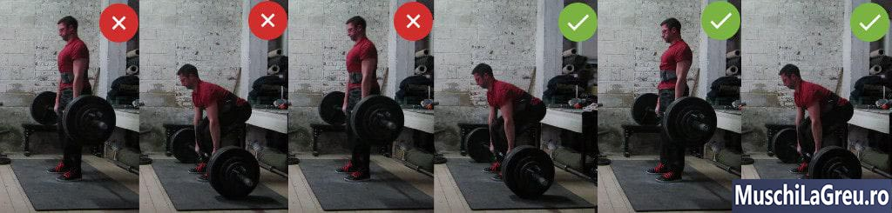
_Nu faceti Indreptari de sus in jos. Trageti greutatea de pe podea._

Deadlift-urile nu sunt [Genoflexiuni cu haltera](/exercitii/genuflexiuni-cu-bara/) . Nu iesiti cu greutatea din raft, coborati-o si apoi o puneti inapoi. Incepi fiecare repetari cu greutatea pe podea. Apoi INCEPETI aceasta greutate DEAD(din punctul mort) de la oprirea DEAD (din punctul mort) pana cand genunchii si soldurile sunt blocate. Aceasta este calea potrivita pentru Indreptari.

Rdicarea de sus in jos, de obicei, te forteaza sa bati greutatea de podea. Incerci sa scapi rapid bara si sa o tragi inapoi folosind reculul placilor de pe podea. Acest lucru creeaza o rezistenta falsa in partea de jos. De asemenea, este mai greu sa controlezi o bara pe care ai lasat-o sa cada in gol in jos. Obtineti un drum al halterei imprevizibil si astfel o forma proasta.

Exista o varianta Deadlift in care trageti de sus in jos – Indreptari romanesti(Romanian Deadlift). Aici va mentineti picioarele aproape drepte in timp ce va deplasati din solduri. Acest lucru accentueaza mai mult lantul posterior, dar limiteaza cat de greu puteti ridica. Indreptari romanesti(Romanian Deadlift)sunt asistenta pentru Indreptari(Deadlifts), nu un inlocuitor.

Trageti intotdeauna greutatea de la podea in sus.

## Folosind reculul placilor de pe podea

Apararea inseamna caderea rapida a barei si utilizarea reculului placilor pe podea pentru a trage greutatea inapoi. Este tentant sa faci Indreptari in acest fel, deoarece obtineti mai multe repetari. Dar este o forma proasta.

Folosirea reculului placilor de pe podea te face sa crezi ca ridici mai mult. Nu tragi greutatea de pe podea pana la genunchi. Recul o face. Deci nu intariti muschii care ar trebui sa faca asta. Ii slabesti.

Acest lucru devine clar atunci cand testati repetitia maxima pe Deadlifts(One rep max). Nu poti folosesti reculul la acea repetare, deoarece greutatea este (Dead)moarta pe podea(punct mort). Nu fiti surprinsi daca abia puteti face o Indreptare pentru o repetare, desi puteti face aceeasi greutate pentru cinci. Este pentru ca nu ai tras niciodata cinci repetari. Ai tras unul. Celelalte patru erau partiale.

Folosindu-va de recul creste, de asemenea, riscul de ranire. Lasati bara prea repede ca sa o controlati. Va sari in mod imprevizibil de pe podea. Acesta poate sari in fata si departe de picioare, ceea ce va va stresa mai mult spatele inferior. Sau poate sari inapoi in tibia ta, ceea ce va poate acidenta.

Mai rau, sariturile se intampla atat de repede incat puteti neglija sa va folositi picioarele. Greseala obisnuita este sa tii picioarele drepte si sa tragi doar cu soldurile si spatele. Acest lucru va streseaza mai mult spatele, deoarece picioarele nu il pot ajuta sa ridice greutatile. Este si mai periculos daca lasati spatele inferior sa ridice.

Calea potrivita pentru Deadlift este de la un punct mort greutatea pe podea nemiscaa. Asteptati o secunda pe podea intre repetari. Folositi aceasta pauza pentru a va incorda si pentru a inspira puternic inainte de a trage urmatoarea ta repetitie. Veti avea o forma mai buna, aveti mai putine sanse sa va raniti si veti construi rezistenta reala de pe podea.

## Sa nu atingi podeaua

Deadlifts nu sunt Yates Row . Nu retineti greutatea in aer intre repetitii. O pui pe podea.  
Pastrarea greutatii in aer in timpul intregului set este rau pentru spatele inferior.Il obosesti. Cand va obosi, primul lucru pe care va dori sa il faca este sa se rotunjeasca. Rotunjirea spatelui inferior in timpul Indreptarilor cu greutati mariiti contractata discurile coloanei vertebrale. Asa poti face hernie de disc. Nu face aceasta prostie!

Da-i spatelelui o pauza intre repetari, punand greutatea inapoi pe podea. Apoi, folositi pauza pentru a va pozitiona cu o forma puternica pentru urmatoarea repetare. Tineti coloana vertebrala neutra, blocati-o in pozitie, incordati-va. Acum respirati si trageti. Astfel vei fi mai puternic si spatele tau va fi mai sigur.

Unii oameni mentin greutatea in aer pentru a „mentine tensiunea asupra muschilor”. Din nou, \*_daca doriti tensiune, puneti mai multa greutate pe bara._ \*O sa ai destula tensiune in muschi atunci cand ridici 100+ kg. Si asezarea barei pe podea intre repetari functioneaza mai bine pentru asta. Spatele nu se oboseste inainte de orice altceva.

Unii oameni fac asta pentru ca sala de sport ii obliga sa faca acest lucru. Tipareste acest ghid pentru managerul tau de sala. Spune-i sa obtina covorase de cauciuc sau sa construiasca o platforma pentru a proteja podeaua. Si aminteste-i ca este o sala de gimnastica, nu o biblioteca. Greutatile fac zgomot – de asta sunt greutati!.

## Facand Genuflexiuni in loc de Indreptari

)](./assets/indreptari-shoulders.jpg)
_Pozitia corecta a setarii Deadlift arata ca o jumatate de genuflexiune, nu ca o Genuflexiune normala._

Deadlift-urile nu sunt [Genoflexiuni cu haltera](/exercitii/genuflexiuni-cu-bara/) . Nu functioneaza pentru a configura cu soldurile joase, precum in partea de jos a genulfexiunilor. Acest lucru iti pune genunchii mai inainte si tibia iti inclina mai mult. Le vei lovi cu bara cand tragi. Asa sfarsesti cu genunchii zgariati si cu tibii insangerate de la Indreptari.

Pozitia corecta a setarii Deadlift arata ca o jumatate de [Genoflexiuni cu haltera](/exercitii/genuflexiuni-cu-bara/). Pozitia exacta a soldului depinde de lungimea membrelor. Daca aveti coapse lungi cu un trunchi scurt ca mine, acestea vor fi mai mari decat daca aveti coapse scurte cu un trunchi lung (deci nu ma copiati decat daca aveti aceeasi constructie).

Cel mai simplu mod de a gasi pozitia corecta a soldului pentru Deadlift este sa setati cu bara peste mijlocul piciorului. Aplecati-va cu picioarele drepte si apucati bara. Acum indoaie genunchii fara a misca bara pana cand tibia ta atinge bara. Opriti-va si ridicati pieptul. Soldurile tale sunt in pozitie corecta. Asta e tot.

Unii oameni va vor spune sa va lasati mai mult soldurile. Poate ca nu le place spatele mai orizontal pe care il provoaca. Vor sa te vada tragand cu un trunchi mai vertical pentru a evita „forta de forfecare”. Gandirea lor este ca forta de forfecare poate face ca discurile ale coloanei vertebrale sa "alunece". Oricine a facut Indreptari suficient de mult stie ca este o prostie. O coloana vertebrala care nu poate ramane neutra se va rotunji. Nimic nu aluneca. In plus, muschii trunchiului sunt acolo pentru a va impiedica coloana vertebrala de la rotunjire in primul rand.

Nu incepeti ca pe [Genoflexiuni cu haltera](/exercitii/genuflexiuni-cu-bara/) si veti inceta sa va zgariati tibiile si genunchii.

## Inclinarea pe spate in pozitia de sus

_Nu este nevoie sa te lasi inapoi sau sa ridici din umeri in partea de sus. Stai drept, si ai terminat._

Nu trebuie sa va aplecati in partea de sus a Deadlifts. Stai drept cu greutatea. Terminat.

Unii powerlifters se apleaca in competitii. Isi incheie Deadlift-urile tragandu-si umerii pe langa soldurile lor. Aceasta este o exagerare a blocajului in acest sens. Scopul este de a le arata judecatorilor secundari ca au blocat greutatea. Vor sa se asigure ca nu se aprind liniile rosii.

Insa aplecarea iti contractata discurile coloanei vertebrale. Face acest lucru, cum ar face rotunjirea spatelui, dar din directia opusa. Contractatia coloanei vertebrale sub sarcina poate provoca hernii de discuri. Poate fi un risc care sa merite atunci cand incercati sa castigati o competitie sau sa dobori un record. Dar nu este pentru Indreptari normale.

Nu te lasa inapoi. Doar stai cu greutatea. Ai terminat cand soldurile si genunchii sunt blocare(drepte). Umerii tai vor fi deasupra soldurilor, cu un arc natural in partea inferioara a spatelui.

## Ridicarea umerilor in pozitia de sus

Ridicarea umerilor in varful Indreptarilor nu este necesara. Trapezul tau functioneaza deja pentru a mentine umerii in loc atunci cand faci Indreptarile. Ei raman stransi in timp ce gravitatia trage bara in jos. Aceasta contractie izometrica impotriva greutatilor mari este o munca suficienta pentru a stimula cresterea. Nu e nevoie sa ridici din umeri.
Rularea umerilor nu este necesara din acelasi motiv. De asemenea, este periculos, deoarece va poate rani coafa rotativa. Nu o face. Lasa-ti umerii sa atarne in pozitia de sus a Indreptarilor.
Mai multa forta inseamna mai multi muschi . Urmareste ca sa ajungi la patru discuri la Indreptari(Deadlift) de 180kg si vei primi trapezul pe care ti-l doresti fara sa ti dai umerii pe spate. Puteti face acest lucru cu [Antrenamente 5x5](/program/5x5/) .

## Forma necontrolata(smulgi bara de pe podea)

<iframe width="1100" height="825" src="https://www.youtube.com/embed/J9TVFxPUZ6E?feature=oembed" frameborder="0" allowfullscreen=""></iframe>

Tipul din videoclipul de mai sus isi arunca Deadlift-ul. Incearca sa smulga bara de pe podea si sa o ridice folosind bratele. Dar soldurile sale sfarsesc prea sus, astfel incat nu-si poate folosi muschii picioarelor. Mai rau, spatele lui se invarte ca un taco. Sa faci indreptari ca acest individ nu este doar ineficient, dar este, de asemenea, periculos.

Bratele tale nu vor fi niciodata suficient de puternice pentru a ridica ceea ce poti la Indreptari(Deadlifts). Majoritatea oamenilor pot trage 100 kg fara prea multa munca. Incercati insa sa ridici la biceps atat de mult. Bratele tale sunt muschi mici comparativ cu picioarele. Nu pot ridica niciodata aceeasi cantitate de greutate. Este o pierdere de efort sa incerci Indreptari cu bratele.

Daca oricum te tragi repede de bara si iti indoiti bratele chiar inainte de a trage, greutatea te va indrepta. Cel mai bun caz ai doar dureri de cot. Cel mai rau caz iti rupe bicepsul.

_Nu Deadlift cu coatele indoite. Tine-ti bratele drept._

Calea potrivita pentru Deadlift este cu bratele drepte. Prindeti bara cu coatele incuiate. Incordati-va tricepsul daca va ajuta. Puneti calcaiele in line cu soldul, astfel incat genunchii sa nu va impinga cu coatele.

Acum trage INCET. Ridicati bara pana cand simtiti ca bara atinge partea superioara a gaurilor din discuri. Stai strans in timp ce respiri. Acum trage bara de pe podea impingand din picioare. Odata ce greutatea este trecuta de genunchi, puteti accelera. Dar partea de jos ar trebui sa fie lenta.

## Lasarea greutatii din pozitia de sus

Multi tipi, in special cei din crossfitt se pare ca ar vrea sa lase greutatea din varful Indreptarilor. Se pare ca exista trei motive pentru care fac acest lucru:

1. Le este frica sa nu-i doara spatele. Usor: drumul in jos este exact opusul drumului sus - bara aproape, spatele neutru. Daca nu va puteti descurca la ridicare, nu ar trebui sa va descurcati la coborare.
2. Se lovesc in genunchi. Usor de asemenea: incetati sa va aplecati doar genunchii si indoiti si soldurile. Miscati-va soldurile inapoi si mentineti genunchii inapoi. Acest lucru creeaza spatiu pentru haltera.
3. Vor sa atraga atentia. Atunci cand te plangi sau tipete nu sunt suficient, trebuie doar sa dai cu greutatea de podea. Nu pacalesc pe nimeni, cand se pare ca greutate este doar 100 kg...

Prima problema cu lasarea greutatii este ca rupe bara, discuri si podeaua. Halterele de gimnastica si barele de protectie pot face fata. Dar barele electrice si placile de fier nu pot. Se vor uza, se vor indoi si vor crapa. Pardoseala nu va fi la fel nici daca nu aveti covorase groase de cauciuc sau o platforma.

Multi oameni se plang de interzicerea Indreptarilor in salile de fitness. Dar multe persoane, uneori la fel, nu se preocupa de respectarea echipamentului. As fi si eu suparat daca ar trebui sa cumpar o haltera noua. Chestiile astea sunt scumpe. Nu dati drumul la greutate, nu facute sa fie aruncate. Nu-l arunca pe o podea care nu poate face fata cu o asemenea greutate.

A doua problema este ca nu puteti controla unde aterizeaza bara daca nu o controlati pe coborare. Vrei ca bara sa aterizeze peste mijlocul piciorului. In acest fel puteti trage rapid urmatoarea repetare folosind reflexul de intindere. Dar nu poti face asta daca bara a aterizat gresit si trebuie sa te resetezi mai intai.

Desigur, poate sa nu ti pese si sa tragi bara dintr-o pozitie care nu este peste mijlocul piciorului. Dar asta nu este eficent. Bara va fi fie prea departe de picioare, ceea ce este mai stresant pentru spate ... sau va fi prea aproape si va va lovi tibia. Daca doriti sa faceti Indrepteri(Deadlift) puternice, trebuie sa folositi o forma adecvata.

In al treilea rand, coborarea greutatii conteaza si pentru a castiga forta si muschi. Este greu sa sari peste coborare la [Genoflexiuni cu haltera](/exercitii/genuflexiuni-cu-bara/) sau [Bench Press(Impinsul cu haltera de la piept)](/exercitii/impinsul-cu-haltera-de-la-piept/) . Insa puteti face cu usurinta asta pe Deadlifts, dand drumul la greutate sau sa nu opui rezistanta la coborare. Acest lucru inseamna ca ai pus doar jumatate din munca si asta iti va reduce din forta si castigurile musculare .

Coborati greutate sub control. Nu le arunca.

## Folosind oglinzi

Oglinzile nu sunt o modalitate eficienta de a verifica pozitia ta. Puteti sa va vedeti pozitia si priza doar atunci cand sunteti foarte aproape de o oglinda. Nu puteti vedea daca spatele inferior este neutru, daca soldurile sunt in pozitie corecta, daca bara se misca intr-o linie verticala, etc.

Nu stai nici pe o parete si sa te uiti in oglinda. Singura modalitate de a vedea ceea ce faci este sa iti intorci capul in timp ce faci Indreptarile(Deadlift). Aceasta este o modalitate excelenta de a-ti acidenta gatul. O sa doara zile intregi.

Cel mai bun mod de a va verifica pozitia ta este sa te filmezi. Obtineti un trepied, astfel incat sa puteti atasa telefonul oriunde. Filmati din lateral si din fata pentru a vedea fiecare unghi. Urmariti videoclipurile intre seturile voastre, imbunatatiti-le si corectati-le la urmatorul set. Continuati sa va antrenati si forma se va imbunatati.

## Probleme cu Indreptarile

 

## Dureri ale spatelui inferior

_Faceti Indreptari cu o coloana vertebrala neutra pentru a evita durerile inferioare de spate_

Indreptarile va pot rani spatele daca nu va mentineti coloana vertebrala neutra. Trageti intotdeauna cu un arc natural in partea inferioara a spatelui. Mentine arcul pe care il ai cand stai drept. Spatele inferior nu ar trebui sa se rotunjeasca atunci cand faci Indreptari. Dar, de asemenea, nu ar trebui sa aiba un arc in exces (aka hiper-lordoza ).

Daca aveti dureri de spate mai ales in parte inferioara dupa Deadlifts, sau o parte a spatelui doare, este de obicei pentru ca faceti una dintre aceste greseli ...

- **Rotunjirea**. Indreptarile cu spatele inferior indoit va contracta discurile spinale din fata. Acest lucru doare si poate provoca hernii de discuri. Remediati acest lucru prin a corecta pozitia de inceput inainte de a trage. Ridica-ti pieptul si arcuie-ti partea inferioara a spatelui pana cand este neutru.

- **Hyper-extensie**. Indreptarile cu indoirea excesiva a arcul inferior al spatelui strange discurile coloanei vertebrale, dar din spate. Remediati acest lucru contractand abdomenul. Purtarea unei centuri va poate ajuta sa faceti acest lucru. De asemenea, nu va lasati pe spate cand ajungeti in pozitia de sus. Stai drept cu soldurile si genunchii drepti.
- **Rasucirea**. Indreptarile cu soldurile sau umerii aplecati mai mult intr-o parte iti va rasuci coloana vertebrala. Mentineti-le neutre prin apasarea uniforma a barei. Verificati de doua ori daca aveti talpile in totalitate pe podea. Si nu te apleca sau trage mai mult cu o parte atunci cand faci Indreptari.

Daca suferiti de dureri de spate mai scazute, in ciuda Indreptarilor cu o coloana vertebrala neutra, verificati de doua ori ca trageti de greutate cu o forma adecvata. Verifica acest lucru:

- **Pastrati Haltera aproape**. Bara trebuie sa sta langa picioarele de la inceput pana la sfarsit. Incepeti corect si protejati-va tibiile cu sosete lungi/pantaloni/banda. Apoi trageti bara peste tibie, genunchi si coapse pana in varf. Nu-l lasati sa se abata sau va veti stresa mai mult spatele.
- **Foloseste-ti picioarele**. Nu incercati sa ridicati greutatea folosind doar spatele jos. Implicati-va picioarele. Faceti acest lucru printr o pozitie de inceput corecta cu soldurile la inaltimea potrivita. Apoi trageti de greutate impingand picioarele prin podea. Imaginati-va ca faceti Leg Press - impingeti, nu trageti.

Toate acestea se aplica si la coborarea. Tine-ti partea inferioara a spatelui neutru cand cobori bara. Pastrati-l aproape si in contact cu picioarele. Apoi coborati greutatea apasand soldurile inapoi, in timp ce indoiti picioarele. Nu lasati greutatea cu spatele indoit si cu soldurile inalte.

Multi medici va vor oferi calmante pentru a va alina durerile de spate de la Indreptari. Va vor spune sa va odihniti cateva zile si sa evitati Indreptarile cand reluati antrenamentul. Presupunerea de aici este ca Indreptarile sunt gresite sau rele. Rareori se intreaba daca ai folosit o forma corecta. Nu este domeniul lor de expertiza.

Agentii de calmare va vor scuti durerile de spate de la Deadlifts(Indrepari). Dar ei trateaza doar simptomele, nu si cauza. Durerea este corpul tau care iti spune ca faci ceva gresit. Fara durere ai fi continuat sa faci cu o pozitie gresitasi te-ai rani mai mult. Deci este o idee proasta sa maschezi durerea care te ghideaza.

Cel mai bun lucru pe care il puteti face pentru a va alina durerile de spate de la Indreptari sunt decompresiile coloanei vertebrale. Aceasta este cea mai buna intindere din partea inferioara a spatelui pe care o veti gasi. O faci agatat pe bara de tractiune pentru ceva timp. Elevii chinezi si rusi fac asta mult. Le fac de fiecare data cand merg la sala.

Decompresiile coloanei vertebrale va intind coloana vertebrala vertical folosind gravitatia. Spre deosebire de intinderea de la varful degetelor, acestea nu va comprima discurile - nu exista indoire. Deci nu iritati o umflatura discala care va poate provoca dureri de spate. In schimb, il reduci si creezi spatiu pentru nervii prinsi care provoaca durerea.

Daca faceti deprimari ale coloanei vertebrale de mai multe ori pe zi, veti constata ca durerea de spate se va usura rapid, fara a lua calmante. Doar atarna cat fara sa atingi podeaua. Relaxati-va si lasati gravitatia sa va intinda coloana vertebrala. De obicei poti atarna un minut, dar tine de tine cat timp iti poate tine priza.

Evitati intinderea in care va aplecati si atingeti degetele de la picioare. Se pot simti bine. Dar daca durerile de spate sunt cauzate de o respingere a discului de la o forma proasta, aceste dureri vor creste. In schimb, doriti sa reduceti volumul discului, iar cea mai buna intindere inferioara a spatelui este sa stai intins prins de bara de tractiuni.

De asemenea, nu purtati o centura pentru a compensa forma slabaa Indreptarilor. Purtati-o pentru sprijin suplimentar in partea inferioara a spatelui. Va ajuta sa va blocati abdomenul pentru a se contracta. Dar nu purta unul si apoi faci Indreptari cu spatele indoit.

## Rotunjirea spatelui inferior

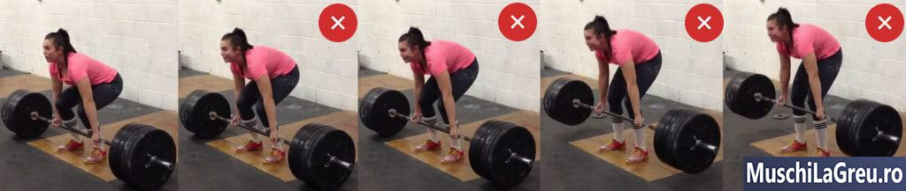

Cel mai obisnuit mod de a-ti face rau in partea inferioara a spatelui cand faci Indreptari este daca tragi cu spatele inferior indoit. Acest lucru contracta partea din fata a discurilor coloanei vertebrale. Daca un nerv este prins, vei suferi dureri ascutite pana la picior. Continuand sa trageti indoit inapoi, iar discul vertebral poate sa se umfle si sa hernieze.

Solutia este o Indreptare cu un spate inferior neutru. Incepeti cu acel arc natural pe care il aveti cand stati drept. Partea inferioara a spatelui nu trebuie sa fie plana, ci sa aiba o usoara curba (aka lordoza). Mentineti acest arc in partea inferioara a spatelui de la inceputul Deadlift(Indreptarilor), pana la blocare si pe drumul de intoarcere.

- **Pozitia de inceput**. Stai cu bara peste mijlocul piciorului. Aplecati-va si apucati-o. Indoaie genunchii pana cand tibia ta atinge bara. Acum ridica-ti pieptul. Daca acest lucru nu iti pune spatele intr-o pozite neutra, arcuieste-l - trageti soldurile pana la tavan. Blocati pozitia prin extinderea muschiului lat dorsal si inspirati.
- **Ridicarea**. Nu lasati soldurile sa se ridice prea repede ca in imaginea de sus sau va veti rotunji. Mentineti unghiul din spate, impingand podeaua ca si cum ai face Leg press. Tine-ti pieptul sus, arcuirea inferioara a spatelui si bara aproape de picioare. Continuati sa impingeti pana cand bara se misca.
- **Coborarea**. Coborati greutatea miscand soldurile inapoi. Indoaie usor picioarele, dar tine-ti genunchii inapoi, astfel incat bara sa nu-i loveasca pe drumul in jos. Mentineti pieptul sus si partea inferioara a spatelui neutru. Coborati bara in timp ce o tineti aproape de picioarele tale.

Resetati coloana vertebrala intre repetari. Spatele tau va obosi si va dori sa se rotunjeasca. Puteti evita acest lucru setandu-va intr-o pozitie puternica de fiecare data. Asta inseamna ca iti ridici pieptul din nou, iti pui din nou coloana vertebrala in pozitie neutra, contractatati-va din nou si respirati din nou. Abia acum tragi.

Nu incepeti cu spatele indoit si incercati sa il obtineti neutru in timpul ridicarii. In primul rand, asta functioneaza rar. Doi, dr. Stuart McGill Phd spune ca acest lucru este si mai rau pentru coloana vertebrala decat ridicarea cu spatele indoit. NU MISCATI SPATELE IN TIMPUL RIDICARII.

Intinzandu-va hamstrings rareori rezolva rotunjirea spatelui inferior pe Indreptari(Deadlifts). Problema nu este ca hamstrings-ul tau este incordat. Problema este ca partea inferioara a spatelui nu este suficient de incordat. E slabit. Tine l strans inainte de tragere. Daca nu puteti obtine acel arc natural, ridicati soldurile la tavan in timpul pozitiei de start.

## Va arcuiti prea mult

Partea inferioara a spatelui ar trebui sa aiba un arc natural atunci cand faci Indreptarile. Aceeasi curba ca si cand stai. Nu ar trebui sa aiba un arc in exces sau o hiper-lordoza . Acest lucru este inutil si rau pentru spatele tau.

Problema cu arcuirea prea mare in timpul Deadliftului este similara cu tragerea cu spatele inferior indoit. Iti compresezi discurile coloanei vertebrale. Diferenta este ca o faci din spate, in loc de fata. Insa rezultatul este acelasi: nervii prinsi, aparitia discurilor si poate hernie.

M-a durut mult spatele cand am inceput Indreptarile, deoarece oamenii continuau sa spuna „arcuie-ti spatele”. Vrei un arc natural in partea inferioara a spatelui, astfel incat sa nu se rotunjeasca. Dar nu vrei sa exagerezi.

- **Arcul natural**. Pozitia de inceput cu un arc natural in partea inferioara a spatelui. Ar trebui sa aiba aceeasi curba ca atunci cand stai. Nu va arcuiti spatele mai mult decat atat. Ar trebui sa se simta confortabil si sa nu-ti stranga discurile. De asemenea, nu finalizati Indreptarile aplecandu-va inapoi. Stai inalt.
- **Incordati-va abdomenul**. Daca nu puteti sa tineti spatele inferior in pozitie naturala, incordati-va mai tare abdomenul-ul. Contracteaza-ti abdominalii ca si cum cineva ar fi pe cale sa te loveasca in stomac. Luati in considerare sa purtati o centura pentru a va bloca abdomenul-ul pentru a va contracta atunci cand faceti Indreptari.

## Soldurile se ridica prea repede

Soldurile se ridica mai repede decat pieptul daca faci Indreptarile fara sa-ti folosesti picioarele sau daca te asezi cu soldurile prea jos in primul rand. Asta este rau, deoarece inseamna ca spatele tau va trebui sa lucreze mai mult decat ar trebui. Este rau si pentru ca de obicei bara iti va zgaria tibia.

In imaginea de sus puteti vedea soldurile ei pornind in pozitia corecta. Dar se ridica in timp ce barul ramane pe podea. Aceasta indreapta picioarele inainte de a putea ajuta sa Indrepti greutatea. Soldurile si spatele trebuie sa traga singure de greutate, ca si cum ar face o Indreptare fara sa folositi picioarele. Mai rau, rotunjirea spatelui ei inferior.

- **Pozitia de inceput corecta**. Evitati soldurile sa inceapa prea jos, prin pozitia de inceputa corecta. Stai cu bara peste mijlocul piciorului, apleaca-te si apuca-o, apoi indoieste-ti genunchii pana cand tibia ta atinge bara. Ridicati- va pieptul si soldurile vor fi in pozitia corecta - nu prea sus sau prea jos.
- **Incordati-va**. Scopul este sa va mentineti unghiul din spate in timp ce ridicati bara de pe podea. Faceti acest lucru prin incordare. Strangeti bara si muchiul lat ar dorsalului (lats – ul). Inchideti soldurile in pozitie contractandu-va coapsele si hamstrings-ul. Ridicati-va pieptul, inspirati si apoi trageti.
- **Nu trageti - impingeti**. Indreptarea este o tragere. Insa ajuta sa il gandesti ca pe o impingere, astfel incat sa iti poti angaja picioarele in loc sa incerci sa-l tragi doar cu spatele. Ridica bara de pe podea impingand picioarele in podea. Imaginati-va ca faceti leg press- impingeti podeaua.

Nu lasati soldurile sa se miste inainte ca bara sa paraseasca podeaua. Soldurile si pieptul trebuie sa se ridice in acelasi timp. Pastreaza-ti soldurile unde le-ai asezat in timpul repetarilor. Impingeti picioarele prin podea cat de tare puteti. Doar cand bara paraseste podeaua iti poate ridica soldurile cu pieptul.

## Lovindu-ti genunchii

_Coborati bara mutand soldurile inapoi. Nu doar indoaie genunchii._

Lovirea genunchilor pe Indreptari doare. De asemenea, este ineficient: bara nu poate sa cada pe o linie verticala, deoarece genunchii sunt in cale. In schimb, trebuie sa se rostogoleasca. Asa ca aterizeaza peste piciorul tau in loc de mijlocul piciorului. Trageti de aici si bara va urca intr-o curba J, lovindu-ti tibiile in acest proces.

Lovirea genunchilor este de asemenea rea pentru spatele inferior. Cu cat tii greutatea mai aproape, cu atat este mai putin stresant, deoarece este mai aproape de centrul tau de masa. Dar nu poti tine bara aproape daca o sa se loveasca de genunchi si asfel o sa o obligati sa se indeparteze de corpul tau pe drumul in jos. Asa ca iti afecteaza si spatele pe langa genunchi.

Solutia este sa iti scoti genunchii din calea barei. Tine-tii inapoi pe drumul in jos. Faceti acest lucru miscandu-va de pe solduri. Coborati bara apasand soldurile inapoi. Indoiti si picioarele, dar tineti-va genunchii inapoi. Acest lucru creeaza spatiu pentru ca bara sa coboare intr-o linie verticala fara sa le loveasca.

Odata ce bara ajunge la genunchi, atunci puteti indoi picioarele mai mult pentru a reduce greutatea pana la podea. Daca faceti acest lucru corect, bara va ateriza peste mijlocul piciorului fara a va lovi de genunchi. Va fi exact unde ar trebui sa fie pentru urmatoarea repetitie, in linie verticala.

Nu dati drumul greutatilor de sus pentru a nu va lovi de genunchi. Invata doar sa o faci corect.

## Tibiile invinetite

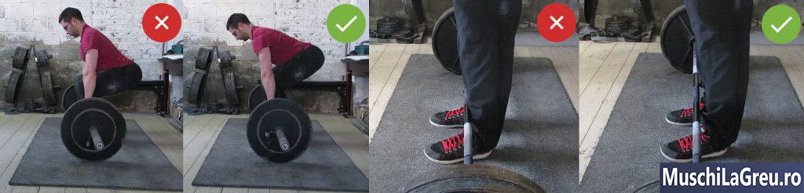
Deadlift-urile iti zgarie tibia si le fac sa sangereze cand tragi cu o forma proasta. Daca incepeti cu soldurile prea jos sau cu bara prea aproape de tibie, le veti lovi si le veti rani pe drum. Este si mai usor sa obtii tibii sangeroase daca ai Deadlift in pantaloni scurti sau folosind o bara proasta.

Doare atunci cand iti lovesti tibia. Continuati sa-i loviti si vor sangera. Ranile se transforma in cicatrici. Bara va smulge acele cicatrici data viitoare. Vor fi accidentate, sangerati din nou si veti avea cicatrici mai mari. Cu exceptia cazului in care va remediati pozitia, tibia, nu se poate vindeca niciodata.

Cel mai rau, se pot infecta. Mi s-a intamplat o data in Thailanda. O bara mi-a razuit tibia dreapta. S-a inrosit si am uitat sa-l dezinfectez. A doua zi dimineata, m-a durut piciorul - rana era neagra. Am ajuns in spital pentru a-l curata si pentru a obtine anti- infectioase, plus o lovitura de tetanos.

Dar mai enervant a fost ca nu am putut face Indreptari corecte timp de doua saptamani. Doar atingandu-mi rana de tibie. A trebuit sa trag cu bara departe de picioare pentru a nu mai atinge rana. Acesta este un mod ineficient de a trage am simtit mai multa tensiune in spatele meu, si nu intr-un mod bun. Si totusi, multi oameni fac Indreptari asfel.

Pare normal sa faci Indreptari cu bara departe de tibia ta, astfel incat sa nu-i poti acidenta. Dar este rau pentru coloana vertebrala. Cu cat bara este mai departe de corp, cu atat este mai stresant pe partea inferioara a spatelui. Trebuie sa tii haltera aproape de centrul tau de greutare. Cel mai apropiat este cand trageti bara peste tibie.

Prin urmare, zgarierea de tibie este aproape inevitabila. Am semne verticale pe tibia mea de la indreptari. Pielea s-a ingrasat pentru a se proteja impotriva barei (la fel ca mainile mele adaptate prin formarea de caluse). Dar tibia mea nu este lovita atunci cand fac Indreptari si nu sangereaza. Cheia este sa folositi o forma corecta ...

- **Bara peste mijlocul piciorului**. Bara deasupra piciorului este prea departe. Mutati o inapoi la mijlocul piciorului cand ridicati, deoarece acesta este punctul de echilibru. Vei trage o curba J si te vei lovi de tibie. Dar bara nu poate fi prea aproape sau tibiile iti vor fi in cale. Incepeti cu bara peste mijlocul piciorului.
- **Pozitia calcaielor la nivelul latimii soldului**. Incepeti-va cu calcaiele alineate cu de soldul, astfel incat tibia sa atinga partea neteda a barei.
- **Picioare indreptate in afara cu 15 °**. Coapsele lungi iti pun tibia mai mult inainte, mai mult in calea barei. Daca aveti coapsele lungi ca mine, incepeti cu picioarele indreptate cu 15 ° afara. Impingeti genunchii in timp ce trageti de greutate. Acest lucru va va mentine tibia inapoi, astfel incat sa nu le loviti pe drum.
- **Nu ridica ca la Genuflexiuni**. Cu cat sunt mai mici soldurile, cu atat inclinati mai mult tibia si cu atat mai mult blocati bara. Pastreaza-ti tibia inapoi si in afara drumului ridicandu-ti soldurile. Inaltimea exacta depinde de constructia fizica. Dar vor fi acolo unde ar trebui daca va setati corect - cu bara peste mijlocul piciorului si cu omoplatii peste bara.

Faceti Indreptari pe o podea plata. Bara nu se poate misca inainte de a trage sau intre repetari. Ar trebui sa stea nemiscata peste mijlocul piciorului. Daca bara se rostogoleste spre tibia ta, le va lovi pe drum.

Sosetele Deadlift sunt, de asemenea, bune, daca este prea cald pentru pantaloni. Iti protejeaza tibiile punand un strat intre ele si bara. Sunt ca sosetele jucatorilor de fotbal si ale schiorilor. Nu le-am purtat niciodata.

Aparatoarele sunt excesive. Ei sunt pentru Crossfitters care fac repetitii multe in scurt timp. Este greu sa pastrezi forma corecta cand tragi repede. Asa ca tibia ta se poate zgaria. Dar nu atunci cand faceti seturi simple de cinci pe [Antrenamente 5x5](/program/5x5/) . Puteti controla greutatea si nu aveti nevoie de protectie in exces.

Folositi o forma adecvata pentru a va proteja tibiile.

## Callusurile rupte

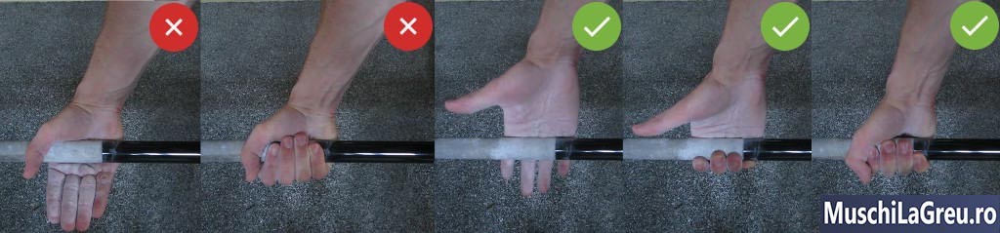
_Apucarea barei la mijlocul palmei (stanga) va provoca desprinderea de calusuri. Strangeti bara jos, aproape de degete._

Indreptarile rup calusurile atunci cand apucati bara gresit. Greseala obisnuita este de a tine bara la mijlocul palmei. Pielea ta se va plia sub bara cand gravitatia o trage in jos. Va forma calusuri pentru a proteja impotriva presiunii. Unele calusuri vor deveni prea mari, vor fi trase de bara si, in cele din urma, vor fi rupte.

Callusurile desprinse nu sunt ok. Pur si simplu iti iau timp din Indreptari. Este nevoie de o saptamana buna pentru ca un calus rupt sa se vindece. Puteti rupe cu usurinta pielea slabita din nou intr o saptamana dupa niste Indreptari grele. Lucrul inteligent este sa evitati in primul rand rupturile de calus, astfel incat sa nu incetiniti progresul.

- **Tineti bara mai de jos**. Faceti Indreptari cu bara jos in palma, in varful calusurilor mari, aproape de degete. Pielea ta nu se va plia sub bara, deoarece te prind de sub pliurile tale principale. Aceasta priza se poate simti ciudata la inceput. Tinetiva de aceasta priza si va veti obisnui.
- **Folositi creta**. Obtineti creta de gimnastica - carbonat de magneziu. Pune-l pe maini cand faci Indreptari. Acesta va preveni calusurile rupte prin umplerea pliurilor pielii tale.Pilea mai putine va ramane prinsa sub bara, deoarece palmele tale sunt netede. Folositi creta lichida daca sala de sport nu permite creta.
- **Rasul tau Callus**. Nu lasa bataturile sa devina imense sau vor fi prinse sub bara. Obtineti o piatra ponce si radeti-va calusurile o data pe saptamana. Nu fi agresiv, nu vrei sa-ti slabesti pielea. Doar niveleaza-ti calusele cu restul mainilor.  
  Daca spargi un calus in timpul Deadlifts, iata ce sa faci:
- **Pune un bandaj peste**. Opriti sangerarea acoperind rana cu banda atletica sau bandaj. Ar trebui sa va puteti incheia antrenamentul, in ciuda calusului sfasiat (de obicei fac). Mai ales daca rupeti un calus pe degete - inveliti-l doar cu banda atletica si veti fi bine. Curatati bara cand ati terminat.
- **Taietura**. Dezinfectati rana apoi taiati marginile. Nivelandu-l cu restul mainilor. Nu taiati adanc sau veti slabi pielea din jurul sau(nu doriti ca aceasta sa sfasie mai tarziu). Pur si simplu curatati pielea moarta, astfel incat tesutul nou sa poata creste. Doar taiati pielea moarta.
- **Inmuiati**. Obtineti apa calda sarata si inmuiati-va mainile timp de 10 minute. Doare, dar este cel mai rapid mod de a va vindeca calusul rupt . Faceti acest lucru de doua ori pe zi timp de doua-trei zile pentru a accelera recuperarea. Asteptati cinci zile inainte de a face Indreptari din nou.

Protejati-va calusul cu banda atletica atunci cand reluati Indreptarile. Trageti mai usor pentru o perioada pentru a evita ruperea calusului. Atata timp cat pastrezi Deadlifting, nu ar trebui sa pierzi prea multa forta. Dar folositi acest lucru ca o lectie pentru a evita rupturi ale calusului in viitor: prinderea corespunzatoare, creta si ingrijirea calusului.

## Variatii ale Indreptarilor(Deadlifts)

## Sumo Deadlift(Indreptari sumo)

Sumo Deadlift este un Deadlift folosind o pozitie larga aka sumo. Tehnica este similara unei Indreptari(Deadlift) conventional - bara peste mijlocul piciorului, omoplatii peste bara si spate neutru. Dar pozitia sumo iti pune trunchiul mai vertical si soldurile mai jos decat Deadlift-ul conventional .

Acest lucru afecteaza muschii lucrati. Sumo Deadlifts iti lucreaza mai putin muschii spatelui, deoarece trunchiul tau este mai vertical. Este mai greu sa pastrezi un spate orizontal neutru decat unul vertical. Deadlift-urile conventionale sunt, prin urmare, mai eficiente pentru construirea unui spate puternic inferior.

Pozitia de sumo iti functioneaza mai mult zona anghiala, deoarece incepe sa fie intinsa. De asemenea, iti functioneaza mai mult coapsele, deoarece soldurile incep mai jos - genunchii sunt mai indoiti. Dar [Genoflexiuni cu haltera](/exercitii/genuflexiuni-cu-bara/) iti lucreaza coapsle si mai mult. De asemenea, iti lucreaza inghinalul. Deci nu este un motiv pentru a alege sumo.

Rar trag sumo pentru ca soldurile mele nu par a fi comode cu asta. Cand o fac, merg semi-sumo asa ca nu ma dor soldurile. Am tras intotdeauna in stil conventional si am tras mai mult in acest fel decat in stilul sumo.

Exista Deadlifters foarte puternici care trag sumo. Te pot influenta sa tragi si sumo. Asteptati pana cand puteti Deadlift 180kg cu o forma corespunzatoare. Construiti forta de baza mai intai inainte de a experimenta cu sumo. Si nu treceti pentru ca nu puteti sa ridicati mult in stilul conventional.

Exista o minoritate de oameni care nu pot face Indreptari cu o forma adecvata datorita construirii lor. Au coapsele lungi, cu bratele foarte scurte. Acest lucru face imposibila trecerea omoplatelor peste bara in stil conventional. Sumo-ul este singura cale pentru ei. Este putin probabil sa aveti aceasta problema.

## Indreptari la Trap bar

Trap bar sau bara hexagonala este o bara in forma hexagonala realizata pentru umeri. Va permite sa faceti ridicari din umeri cu o greutate mare. Dar nu exista nicio frictiune a barei impotriva picioarelor din cauza formei hexagonale a barei hexagonale. Unii oameni prefera Indreptarile cu un bare hexagonala decat cu o bara obisnuita.

Dar trap bar Deadlifts nu sunt Deadlifts. Bara nu va blocheaza tibia pentru a veni prea departe inainte de pozitia de inceput. Puteti trage cu un trunchi vertical, ca atunci cand faceti Genuflexiuni. Trap bar Deadlifts seamana mai mult cu jumatate de [Genoflexiuni cu haltera](/exercitii/genuflexiuni-cu-bara/), cu bara in maini, iar greutatea atarnata din lateral in loc de fata.

Bara hexagonala a devenit populara deoarece va permite sa scapati de o forma proasta. Nu va puteti zgaria tibia, deoarece bara este mai departe. Spatele inferior nu se poate rotunji, deoarece trunchiul poate fi mai vertical. Aceasta pozitie a trunchiului face ca greutatea sa fie mai putin stresanta pe spatele inferior.

Dar acesta este si motivul pentru care bara hexagonala este mai putin eficienta pentru a construi un spate puternic. Nu te invata sa ridici o greutate grea din fata, aplecandu-ti picioarele cu spatele neutru. Nu te invata sa iei o cutie grea. Miscarea este mai aproape de a ridica o roata.

Bara hexagonala este de obicei o solutie de ajutor pentru persoanele care nu au rabdare sa invete o forma corespunzatoare pentru Indreptari(Deadlift). Dar este mai putin eficienta decat Indreptarile cu o bara si, prin urmare, nu este un inlocuitor.

## Indreptari cu picioare rigide

Stilul cu picioarele rigide este un Deadlift realizat cu picioare drepte. Greutatea incepe, de asemenea, si revine la podea pe fiecare repetare. Dar coapsele tale nu pot impinge greutatea de pe podea, indreptandu-ti picioarele - sunt deja drepte. Asa ca hamstringsul si fexle tale trebuie sa faca toata munca.

Deadlift-urile cu rigiditate sunt o asistenta excelenta pentru Deadlifters avansati . Dar nu le inlocuiesc. Puteti merge ridica mai mult cu Deadlifts, deoarece folosesc mai multi muschi – coapsele pot ajuta la ridicarea greutatii. Deadlift-urile sunt deci mai eficiente pentru a castiga forta si muschi.

## Indreptari romanesti(romanian dedlifts)

Indreptari romanesti este un tip de Indreptari realizat de sus in jos cu picioarele drepte. Iei bara din raft la inaltimea coapsei . Apoi cobori la genunchi cu picioarele drepte si repede repede in sus. Acest lucru iti functioneaza hamstrings-ul si fesele mai mult in timp ce iti scoti genunchii din miscare.

Indreptari romanesti (Romanian Deadlifts) sunt, de asemenea, un excelent exercitiu de asistenta pentru Indreptari. Dar, de asemenea, nu le inlocuiesc, deoarece scoaterea coapselor limiteaza cat de multa greutate puteti adauga. Sunt o intindere minunata pentru hamstrings-ul tau, daca iti mentii picioarele drepte.

## Intrebari populare legate de Indreptari

## Mi-e teama de Indreptari. Ce ar trebuii sa fac?

Ar trebui sa faci Indreptari. Cu cat mai repede cu atat mai bine. Pentru ca este normal sa fii intimidat de Deadlifts sau teama de accidentare. Greutatea este intimidanta si exista un risc real de acidentare. Dar nu vei rezolva asta evitandu-le. Singura modalitate de a depasi teama de Indreptari este de fapt sa faci Indrepari.

Iata cum functioneaza: fiecare repetitie fara a va rani va sporeste increderea. Crezi ca vei fi bine pentru ca ai fost bine data trecuta. Asa ca adaugati greutate si daca sunteti din nou in regula, obtineti un alt impuls in incredere. Acest lucru creeaza o bucla de feedback pozitiv care invinge frica.

Frica in sine nu dispare niciodata. Inca am frica uneori cand ma apropii de greutati maxime, iar asta in ciuda ridicarii de aproape 6 ani. Diferenta este ca experienta m-a invatat cum sa fac fata fricii. Este destul de simplu: trebuie sa devii confortabil, fiind incomod.

Ceea ce nu functioneaza este sa inlocuim Deadlifts cu masini sau alte exercitii care arata similar. Acest lucru nu va va face mai confortabil la Indreptari(Deadlifts). Nu este o pregatire specifica. Trebuie sa faci Indreptari pentru a devenii mai bun la ele. Iata cum:

- **Incepeti usor**. Greutatile usoare sunt mai putin intimidante si fac mai putine daune daca nu puteti ridica inca cu o forma adecvata. Nu iti face griji ce cred oamenii. Inghititi ego - ul si incepeti cu 40 kg pe [Antrenamente 5x5](/program/5x5/) . Mergeti si mai usor daca este nevoie.
- **Concentrati-va pe Forma**. Forma corecta creeaza incredere. Cititi acest ghid pentru Indreptari iar si iar si aplicati totul. Incepeti la fel in fiecare set. Trageti fiecare repetare la fel. Fiecare repetare pe care o faceti cu succes va va creste increderea si va va ajuta sa depasiti frica.
- **Adaugati greutate**. Mariti incetul cu incetul, cu 2,5 kg fiecare antrenament. Poate ca nu suna mult, dar se adauga. Ati putea face Indreptari de 180kg in 12 luni facand acest lucru.

Daca puteti gasi un antrenor care sa va arate cum sa faceti Indreptari, este minunat. Daca nu, filmati-va pentru a vedea ce faceti. Comparati cu sfaturile din acest ghid. Nu folositi oglinzi, nu ofera o vedere completa. Filmati-va din lateral, priviti-l intre seturi, imbunatatiti setul urmator. Aveti rabdare si continuati sa exersati.

## Pot sa fac Indreptari in Aparat Smith ?

Nu. Utilizarea unei bare atasate la sine nu face acest exercitiu mai sigur. Aceasta nu este o [Genoflexiuni cu haltera](/exercitii/genuflexiuni-cu-bara/) sau [Bench Press(Impinsul cu haltera de la piept)](/exercitii/impinsul-cu-haltera-de-la-piept/) in care va puteti bloca sub greutate. Daca nu reusiti sa Indreptati greutatea, trebuie doar sa o returnati pe podea. Daca se pare ca este prea greu de ridicat, atunci greutatea nu paraseste niciodata podeaua in primul rand. Este sigur.

Singurul lucru pe care il obtine la aparatul smith este transformarea Indreptarilor intr-o versiune bastardizata mai putin eficienta . Nu puteti echilibra bara, deoarece este atasat la sine. Acest lucru scoate munca departe de muschi. Face exercitiul mai putin eficient pentru obtinerea fortei si a muschilor.

De asemenea, nu puteti controla unde merge bara, deoarece este fixata pe sine. Esti blocat sa faci miscari nefiresti. Placile pot atinge foarte rar podeaua, deoarece pozitia cea mai joasa a barei este prea sus. Asta inseamna ca nu poti ridica greutatea din punctul mort de la podea, ci faci Rack Pulls in schimb.

Folositi un adevarat barbell. Daca sala de sport nu are, nu este o sala de sport. Mutati-va la o sala reala, astfel incat sa puteti face Indreptari reale si sa obtineti rezultate reale. Poate puteti construi o sala acasa. Sau puteti continua sa faceti exercitii inferioare si sa obtineti rezultate inferioare. Prioritatile tale vor determina alegerile si rezultatele tale .

Oare ar trebui sa fac Deadlifts(Indreptari) in Power Rack?

Nu. Asa cum s-a explicat mai sus, daca nu reusiti la mijlocul repetarii, intoarceti greutatea pe podea. Daca este prea greu pentru a trage, nu plecati niciodata de pe podea in primul rand. Nu va puteti bloca sub greutate cand faceti Indreptari. Si fiecare repetare incepe de pe podea. Deci nu aveti nevoie de ace de siguranta sau de carligele J ale Power Rack.

Este in regula Deadlift in Power Rack daca exista spatiu limitat in sala de sport. In caz contrar, lasati-o pentru cei ce fac genuflexiuni. Nu am facut niciodata Indreptari in Power Rack.

## Cum pot preveni calusurile de la Deadlifts?

Nu poti. Mainile tale construiesc caluse pentru a te proteja de presiunea halterei. Acesta este un produs secundar de ridicare, asa cum este muschiul construit . Daca pielea ta nu s-ar intari, mainile tale s-ar durea. Vrei sa se formeze calusuri, astfel incat sa poti face Indreptari cu greutati mari, fara a avea dureri de mana sau a avea nevoie de manusi.

Ce poti si trebuie sa faci este sa impiedici formarea de calusuri mari. Haltera ii trage si ii sfasie mai usor, deoarece iti ies din maini. Acest lucru doare si va poate provoca sa sariti peste Indreptari. Calusurile mari iti fac mainile sa para murdare. Vrei ca calusurile tale sa ramana mici.

Pentru a preveni formarea de calusuri mari, apucati bara corect. Nici palma mijlocie, nici pielea ta nu se va plia sub bara. Tine-l jos in palma, aproape de degete. Apoi, folositi creta pe seturile grele pentru a umple mai mult pliurile pielii si pentru a crea o suprafata neteda pentru bara. Acest lucru limiteaza plierea pielii.

## De ce ma dor bratele dupa Indreptari?

Inca nu aveti calusuri. Nu folositi manusi, continuati asa pentru cateva antrenamente. Durerea va disparea odata ce calusurile se vor forma pe mainile tale. Asigurati-va ca strangeti corect bara pentru a evita plierea excesiva a pielii, ceea ce poate provoca dureri inutile la maini. Tine bara joasa, aproape de degete.

Nu ar trebui sa suferiti dureri de mana daca ati inceput [Antrenamente 5x5](/program/5x5/) cu greutatile de pornire recomandate. Greutatile mai usoare ofera timp mainilor tale pentru a te adapta la presiunea barei si a forma calusuri. Daca ati inceput mai greu, luati in considerare scaderea greutatii pana la formarea calusurilor.

Retineti ca va pierdeti calusurile atunci cand incetati ridicarea. Le pierzi ca si cum ai pierde muschi. S-ar putea sa aveti in continuare puterea sa ridicati mult la Indreptari, dar nu si calusurile pentru a va proteja mainile. Asa ca da-ti mainilor cateva antrenamente pentru a forma din nou calusuri inainte de a te ridica foarte greu.

Calusurile dureroase de pe degete sunt mai greu de remediat. Am unul pe mijlocul degetului drept. Bara pare sa prinda calusul, oricat de tare il prind si in ciuda folosirii cretei. Singurul lucru care functioneaza este sa infasor banda atletica in jurul mijlocului degetului pentru a acoperi calusul. Incearca si tu asta
!

## Cum pot elimina calusurile de pe mainile mele?

Nu doriti sa va eliminati calusele. Ai nevoie de ele pentru a-ti proteja mainile atunci cand faci Indreptari(Deadlifts). Daca va indepartati calusurile, mainile va vor rani. Nu veti putea tine bara si Deadlift grele. Acest lucru va limiteaza forta si castigurile musculare . Nu incercati sa eliminati calusele!

Limitati-le cresterea in schimb. Pastrati-le mici. Cel mai bun mod de a face acest lucru este de a le rade in fiecare saptamana. Acest lucru impiedica calusurile sa creasca. Le impiedica sa se prinda sub bara. Te impiedica sa te joci cu ei atunci cand te plictisesti. Si va pastreaza mainile curate.

Utilizati o piatra ponce pentru a nivela calusurile cu restul mainilor. Nu doriti sa plece, deoarece va protejeaza mainile impotriva presiunii halterei. Vrei doar ca acestea sa inceteze sa-ti iasa din maini. Ideea este ca ei nu sunt prinsi sub bara atunci cand faci Indreptari.

Scoateti pielea moarta, lucrand mai intai pe intreaga mana. Apoi, radeti calusele mari - una in alta, in sus si in jos si in cercuri. Daca sunteti bland, nimic nu va rani, rupe sau sangera. Callusurile vor fi nivelate si abia observabile. Mainile tale vor arata curate.

Nu fi agresiv. Nu vrei sa ti slabesti pielea mai moale din jurul caluselor tale. Bara va trage pe acea piele data viitoare la Indreptari. Daca o slabim se va rupe. Va veni tot calusul. Acest lucru doare, dureaza o saptamana pentru a va recupera si este un mod bun de a va incetini progresul. Fii delicat.

Asta inseamna ca nu trebuie sa foloziti razatoare de branza sau de ras - sunt prea agresive. Nu folosi foarfece si cleme de unghii . Si nu va muscati si nu va indepartati calusele cu unghiile atunci cand va plictisiti. Nu vrei sa tai in pielea vie, sa te smulgi prea mult si sa creezi ruperi. Este o modalitate stupida de a va deteriora mainile pentru Indreptari.

Folositi piatra ponce. Pune-l in dus. Rasul umed pare sa functioneze mai bine. Calusele devin albe si se umfla cand va inmuiati mainile in apa calda. Acest lucru le face mai usor sa se cada. Rupeti pielea moarta la sfarsit cand mainile sunt moi si umede. Dureaza doar cinci minute.

Cel mai bine este sa va radeti calusele dupa ultima sesiune Deadlift a saptamanii. In acest fel, mainile tale au mai multe zile de recuperat inainte de urmatoarea sesiune Deadlift. In cazul in care ai fost agresiv, pielea ta are cateva zile de refacere si de intarire. Acest lucru previne rupturi.

Ce se intampla daca strangerea mea nu reuseste in timpul Deadlifts?
Evitati-l in primul rand. Folositi creta, priza mixta si batutul alb. Si tineti bara jos, aproape de degete. In acest fel nu suferiti dureri de mana care va obliga sa va relaxati mana la mijloc.

Daca strangerea nu reuseste la mijloc, puteti incerca sa reaprindeti bara. Dar acest lucru va ingreuna urmatoarea rep, deoarece veti pierde unele reflexe de intindere. Se poate simti chiar mai greu decat primul repetari, de vreme ce esti deja obosit de repetarile anterioare. Ai risca sa nu se deplaseze bara de la toate in ciuda regripping bar.

Puteti incerca priza maimutei. Nu regriptati, dar tineti-va de bar. Nu-ti ignora degetele care nu reusesc - tineti bara cu degetele, deasupra oaselor din mijloc. Degetele trebuie doar sa fie suficient de puternice pentru a tine bara inca cateva secunde pana cand setul tau se termina.

Folosesc mult priza maimutelor, deoarece degetul mare drept nu reuseste intotdeauna in primul rand in seturile de Deadlift. Am rupt degetul mare in timp ce schiau acum cativa ani. De atunci a fost mai slab decat degetul stang. Asa ca de multe ori trebuie sa ma bazez pe priza maimutei din partea dreapta pentru a tine bara in mainile mele.

Dar prinderea maimutei este mai putin sigura. Puteti pierde bara si deteriora echipamentul. Bara iti poate lovi capacele genunchiului pe parcursul procesului. Acest lucru nu mi s-a intamplat niciodata, dar este posibil. Daca stiti ce faceti, incercati priza maimutei. In caz contrar, doar regripti .  
Ar trebui sa agat de prindere sau de maner mixta?

Pastrati-l simplu si folositi aderenta mixta pentru Deadlifts. Este la fel de sigura ca aderenta carligului, dar nu pune presiune pe degetul mare. Prin urmare, creste rezistenta la prindere instantaneu, fara a provoca dureri de degetul mare.

Prinderea carligului iti pune degetele intre bara si degete. Degetele tale se sprijina de degetele in loc de sub el. Acest lucru mareste rezistenta la prindere, dar fara a fi nevoie sa tineti bara cu o mana in sus si cu una in jos. In schimb, palmele te infrunta, ca in cazul prinderii normale.

Elevatorii olimpici folosesc prinderea carligului pentru Snatch si Clean & Jerk. Nu pot utiliza aderenta mixta, deoarece nu functioneaza pentru aceste ascensoare. De asemenea, nu se pot folosi chingi - sa va legati de bara este periculos daca nu reusiti sa ridicati greutatea deasupra. Priza carligului este singura lor optiune.

A devenit popular sa folosesti si prinderea carligului pentru Deadlift. Beneficiul este ca nu iti incarca umerii in mod inegal, deoarece ambele palme se confrunta cu tine. Unii spun ca acest lucru face ca prinderea carligului sa fie mai sigura decat cea stransa - previne dezechilibrele musculare si rupturi bicepsului. In orice caz:

1. Dezechilibrele musculare sunt o problema care a fost deja discutata. Esti Deadlifting cu prinderea normala a majoritatii seturilor. Si faci o multime de exercitii echilibrate pentru umeri, spate si picioare. Deci, daca umerii nu pot asimetria, aderenta mixta este bine.

2. Rupturi de biceps din priza mixta nu sunt atat de comune. Mergeti la o competitie de powerlifting - majoritatea Deadlift cu o prindere mixta si totusi rupturi de biceps sunt rare. Cand se intampla, este de obicei din cauza unei forme proaste - tragerea cu bratele indoite sau lovirea. Consumul de steroizi pare, de asemenea, sa fie un factor.

Priza carligului este cu siguranta mai sigur pentru persoanele care si-au rupt bicepsul in trecut si care nu vor sa riste sa-l rupa din nou. Dar asta nu inseamna ca aderenta mixta provoaca lacrimi de biceps. O forma proasta face. Tine-ti bratele drept atunci cand ai Deadlift. Nu trageti cu coatele indoite.

Motivul principal pentru a utiliza priza mixta in loc de prinderea carligului este faptul ca nu strange si nu raneste degetele mari. Nu trebuie sa va ridicati mai usor pana cand degetele mari nu se vor adapta la presiune. Puteti utiliza aderenta mixta astazi pe cel mai greu set si pentru a obtine o intensificare imediata a rezistentei la prindere.

Retineti ca stresul de degetele mari este mai mare atunci cand utilizati prinderea carligului pe Deadlifts decat pe ascensoarele olimpice. Setul dureaza mai mult - greutatea se misca mai incet, o tineti in partea de sus si o controlati pe coborare. De asemenea, utilizati greutati mult mai grele. Va doare mai mult degetele mari.

COntinuati cu priza mixta. Mai ales daca aveti palmele mici sau degetele scurte. Daca va simtiti inconfortabil pe umeri, incercati sa-ti schimbati priza, cu fata spre cealalta mana.

## Cum fac Deadlift cu placi hexagonale?

Rau. Bara va ateriza pe colturile placilor tale hex. Se va muta din aliniere. Acest lucru te obliga sa tragi bara dintr-o pozitie proasta - prea departe care provoaca dureri de spate sau prea aproape, care iti zguduie tibia. Singura solutie este resetarea intre repetitii. Dar acest lucru ingreuneaza setul.

Placile hexagonale sunt facute pentru masinile incarcate cu placi, nu pentru Deadlifts sau [Ramat cu haltera(Barbell Row)](/exercitii/ramat-cu-bara/) . O parte va ateriza pe partea plana. celalalt pe colt. Bara va trebui sa se inclina inainte sau inapoi pentru a se echilibra de la colt la partea plata. Dar acest lucru indeparteaza bara din aliniament si departe de mijlocul piciorului.
Problema este cea mai grava cand Deadlift are doua-trei placi pe o parte (100-140 kg/220-300lb). Dincolo de patru farfurii, problema se rezolva singura, deoarece colturile sunt in medie. Acest lucru ofera greutatii mai multe colturi pentru a se echilibra. Dar trebuie sa fii capabil sa Deadlift 180kg/400lb mai intai ...

Coborarea barei incet nu o rezolva. Placile hexagonale vor ateriza pe colturi indiferent de. Pastrarea greutatii in aer nu functioneaza, de asemenea, nu este un Deadlift decat daca fiecare repetari incepe de la un stop mort pe podea. Tragerea dintre pinii cei mai mici din Power Rack nu functioneaza din acelasi motiv.

Cea mai buna solutie este sa obtineti placi rotunde. Se comporta predictibil ceea ce va permite sa controlati modul in care bara aterizeaza. Puteti trage fiecare repetari de la mijlocul piciorului dvs. in mod constant. Acest lucru te scuteste de durerile inferioare de spate si de tibia vanatai pe care altfel o primesti cu placi hexagonice.

Doua farfurii rotunde sunt adesea suficiente. Placile hexagonale sunt de obicei mai mici decat placile olimpice. Puneti o placa de 20kg/45lb pe fiecare parte a barei, iar placile hexagonale nu vor mai atinge podeaua. Daca sala de sport nu are farfurii rotunde, poate il puteti convinge pe managerul dvs. de gimnastica sa obtina o pereche.

Daca nu, atunci resetati intre repetari. Coborati bara pana la podea, eliberati-va priza si ridicati-va in picioare. Apoi mutati-va din nou pe picior de mijloc sub bara. Cu toate acestea, veti pierde reflexul de intindere. Setul tau de cinci repetari se va transforma in cinci single-uri mai dure din cauza odihnei mai lungi. Dar este asta sau trecerea la o sala de sport adevarata.

## Ar trebui sa-mi fie durere spatele dupa Deadlifts?

Sanatatea nu conteaza. Nu inseamna ca cresti mai multa forta si muschi. Ceea ce conteaza este greutatea. Daca cresti cat ai Deadlift cu o coloana vertebrala neutra, atunci spatele tau a devenit mai puternic - indiferent daca te-ai napustit sau nu. Altfel nu ai putea ridica greutatea cu o coloana vertebrala neutra.

De obicei, durerea se intampla daca faci ceva nou. Daca deodata faceti cinci seturi in loc de unul. Sau daca faci 20 de repetari in loc de cinci. Sau daca renunti la Deadlifting si reincepi acum cu o greutate mai grea decat ceea ce ar trebui sa folosesti dupa o pauza. Toate acestea pot provoca dureri.

De obicei, spatele meu inferior nu ma doare de la Deadlifts. Ultima data a fost cand m-am antrenat intr-o sala de sport cu placi cu diametrul mai mic. M-au fortat sa trag dintr-o pozitie mai mica decat eram obisnuita (ca si cum as face termene cu deficit). Spatele inferior a fost pompat si a fost usor dureros a doua zi.

Dar, in afara de asta, partea inferioara a spatelui nu primeste atata durere de la Deadlifts. Daca ma doare, de obicei este in partea superioara a spatelui. Zona dintre omoplaturile mele poate fi indoliata pentru o zi. Acest lucru este cel mai probabil de la contractarea cu partea superioara a spatelui inainte de a trage de greutate, astfel incat coloana vertebrala nu se rotunjeste.

Daca spatele te doare dupa scurgeri, probabil ca faci ceva gresit. Verificati pozitia ta. Asigurati-va ca spatele inferior nu se rotunjeste si asigurati-va ca ridicati greutatea cu picioarele nu cu spatele. Doar ridica-te cu greutatea pana cand soldurile si genunchii sunt blocate. Nu este nevoie sa trageti inapoi.

## Ce se intampla daca imi doare spatele Deadlifting?

Cel mai bun lucru este sa te misti. Reveniti la sala imediat ce puteti, dar ridicati greutati usoare. Cel putin de mers pe jos. Nu face altceva decat sa stai toata ziua, iti va dura spatele mai mult pentru a te recupera.

Majoritatea medicilor va vor spune sa incetati ridicarea si sa va prescrieti calmante. Dar daca esti ca mine, nu vrei sa renunti la ridicare si sa te intorci la a fi slab, gras si slab. Iar calmantele nu mascheaza decat durerea. Ei nu remediaza cauza (de obicei, forma proasta), astfel incat sa nu o faceti din nou.

Odihna neplacuta nu functioneaza, dar lucrurile se agraveaza. Ceea ce nu folosesti, pierzi. Daca nu folositi muschii toracelui, acestia devin mai slabi. Odihna la pat iti slabeste muschii trunchiului, deoarece ii imobilizeaza. Vrei muschi puternici ai trunchiului care sa-ti protejeze coloana vertebrala, nici macar cei mai slabi.

Evitati sa va aplecati spatele. Nu faceti intinderi sau depistari . Acestea creeaza aparitia discurilor care v-ar putea provoca durerea de spate mai mare, punand o presiune inegala asupra lor. Doriti sa scadeati volumul discului, sa nu-l iritati in continuare. Intindeti cu decompresii ale coloanei vertebrale (vezi mai jos).

Durerea de spate va fi de obicei severa cateva zile, dar apoi scade. Du-te inapoi la sala si incearca din nou la Deadlift. Dar pastreaza-l usor, poate 40kg/90lb (folositi placi cu diametrul mare). Fii super-strict pe forma ta - mentine-ti coloana vertebrala neutra si pelvisul egal. Spatele ar trebui sa se simta mai bine dupa aceea.

Daca durerea trage pe un picior, un nerv este probabil prins de un disc. Verificati-l cu un RMN (razele X sunt pentru oase rupte). Dar tineti minte si discurile vindecate. Multe persoane au ridicat greutati mari in ciuda ranilor discului. Am un disc de amurg si inca Deadlift greoi. Nu este sfarsitul.

Durerea in partea superioara a spatelui este mai putin frecventa, dar se poate intampla si ea. Deadlift-urile iti pot zdrobi coastele daca porti centura prea stransa sau prea inalta. Daca acesta este cazul, slabiti-l si purtati-l mai jos.

Teama de rejudecare este frecventa. Cel mai bun mod de a depasi este sa pornesti usor, sa folosesti o forma adecvata si sa iti creezi incet drumul. Fiecare repetari complet complet fara durere iti va crea increderea.

## Care este o intindere buna a spatelui jos?

Decompresiile coloanei vertebrale. Agatati timp de bara de tractiune si lasati gravitatia sa va intinda coloana vertebrala. Aceasta este ca terapia de masa inversata, cu exceptia faptului ca o puteti face in Power Rack fara alte echipamente.

Decompresiile coloanei vertebrale sunt mai bune decat intinderile de la nivelul piciorului. Nu exista indoire sau arcuire a coloanei vertebrale inferioare. Deci nu exista o presiune inegala asupra discurilor dvs. care ar putea irita volumul discurilor. Iti intinzi coloana vertebrala si creezi spatiu in schimb. Acest lucru reduce volumul discului si amelioreaza durerile de spate mai mici.

Tehnica este simpla. Strangeti bara de extragere cu ambele palme orientate spre dvs., la o latime de umar. In mod ideal, bara este suficient de inalta pentru a va agata cu picioarele drepte, fara ca picioarele sa atinga podeaua. Acest lucru impiedica arcuirea inferioara a spatelui si il mentine neutru.

Atarnati pe bara de tractiune cat puteti. De obicei fac seturi de pana la un minut intre seturi, de mai multe ori in timpul antrenamentului meu. Nu folosesc bretele, deoarece prinderea mea este suficient de puternica pentru a tine bara. Insa nu ezitati sa folositi curele daca priza dvs. se da prea repede.

## Ar trebui sa fiu in pozitia de Genuflexiuni pt Deadlift-urile?

Nu. Termenele nu sunt [Genoflexiuni cu haltera](/exercitii/genuflexiuni-cu-bara/). Sunt Deadlifts. Daca incerci sa golesti greutatea, vei incepe cu soldurile prea mici. Se vor termina mai departe de bara, ceea ce face ca greutatea sa fie mai greu de tras. Tibiile tale vor deveni si mai multe, astfel incat le vei lovi pe drum. Nu merge.

Exista unele lifters puternice de pozitia de inceput, care intr - o pozitie Genuflexiuni scazuta inainte de deadlifting greutatea. Elevul olimpic rus Mikhael Koklyaev face acest lucru, de exemplu. Verificati imaginea de mai jos ..

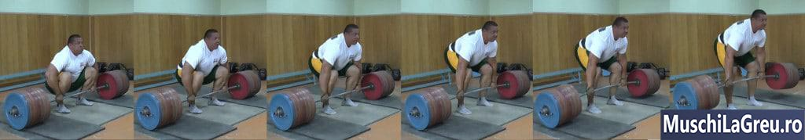
_Mikhael Koklyaev porneste intr-o pozitie joasa. Dar soldurile lui se ridica inainte ca greutatea sa paraseasca podeaua._

Observati ca incepe intr-o pozitie proasta, cu soldurile prea jos, umerii deasupra barei si bratele indoite. Dar isi ridica soldurile inainte de a trage de greutate. Cand bara paraseste podeaua, se afla in pozitia de pozitia de inceput corespunzatoare Deadlift - bara peste mijlocul piciorului, omoplati deasupra barei si bara impotriva tibiaui.

Cred ca acesta este un obicei pe care l-a construit din ridicarea olimpica. Se pun in pozitie pt Genuflexiuni inainte de a prinde si a smulge bara. Acest lucru ii incarca muschii picioarelor si creeaza un reflex de intindere. Creste viteza de la podea, astfel incat acestea sa poata cantari mai grele. Dar tu nu esti ridicare olimpica . Esti mortal.

Daca incercati sa starniti mai intai si apoi sa va ridicati soldurile, probabil ca veti face greseli. Veti impinge bara de la mijlocul piciorului cu tibia. Iti vei ridica soldurile prea mult sau nu suficient. Deci, orice beneficiu ati obtine de la [Genoflexiuni cu haltera](/exercitii/genuflexiuni-cu-bara/)ting low, pierdeti din cauza formei proaste care urmeaza.

Nu te complica. Incepeti cu bara peste piciorul mijlociu, omoplati peste bara si tibia impotriva barei. Cand puteti Deadlift patru discuri, atunci puteti incerca sa fiti in postura pentru Genuflexiuni mai intai. EU nu o fac.

## Daca Deadlift-urile cu spatele rotunjit sunt rele, de ce o fac unii powerlifters?

Powerlifters competitivi fac Indreptari rotunjite pentru a castiga. Ei folosesc tehnica care ii ajuta la Indreptari la cea mai mare greutate posibila. Este posibil ca aceasta tehnica sa nu fie sanatoasa pentru partea inferioara a spatelui. Dar sportivii prioritizeaza adesea castigarea asupra sanatatii pe termen lung. Abuzul de droguri ilustreaza acest lucru cel mai bine.

In plus, recordurile mondiale nu reflecta intotdeauna modul in care sunt Indreptarile(Deadlift) de cele mai multe ori. Incercare Max sa para urat. Este mai greu sa mentineti o forma adecvata. S-ar putea sa se intoarca cu spatele mai mult atunci cand incearca PR-uri in competitii. Poate ca trag cu un spate mai neutru restul anului in antrenamente.

Si s-ar putea sa se rotunjeasca mai putin decat credeti. Deadlifters puternici pot avea muschi uriasi ai spatelui care se revarsa. Acest lucru poate crea un aspect mai rotunjit al coloanei vertebrale superioare. Partea inferioara a spatelui poate parea mai uniforma, daca muschii spatelui mai mari umplu curba interioara normala a coloanei vertebrale.

Acestea fiind spuse, multi Deadlifters de succes au tras stilul rotunjit. Konstantins Konstantinovs (426 kg/939lb fara centura in 2009), Bob People (329 kg/725lb cantarind doar 82,5 kg/181lb in 1949), Vince Anello (373 kg/821lb care a fost de 4 ori mai mare decat corpul sau), etc.

Avantajul tragerii cu spatele rotunjit este ca iti coboara umerii si iti apropie soldurile de bara. Umerii inferiori scad intervalul de miscare. Bara mai aproape de solduri iti scurteaza artificial coapsele (mai ales daca sunt lungi ca ale mele). Eficienta creste si astfel puteti ridica greutatea mai grea.

Principalul dezavantaj este ca rotunjirea spatelui pune presiune inegala asupra discurilor coloanei vertebrale. Va puteti rani coloana vertebrala, herniaza un disc si dezvolta dureri de spate cronice. Acesta este un risc pe care pot fi dispusi sa-si asume alegatorii care incearca sa castige o competitie sau sa stabileasca noi recorduri. Dar tu esti? Daca da, pentru ce?

Rotunjirea ingreuneaza si blocarea. Greutatea lasa podeaua mai usor. Dar odata ce ajunge la genunchi, spatele este obligat sa termine greutatea. Picioarele nu va pot ajuta, deoarece sunt deja drepte. Veti fi tentat sa va inselati si sa va indoiti din nou bratele. Si veti esua in partea de sus mai des.

Retineti ca rotunjita-spate Deadlifters ca Konstantinovs nu fac pe deplin rotunjiri partii inferioare a spatelui. Dr Stuart McGill Phd spune ca ultimele trei grade de flexie lombara sunt cele mai periculoase. Deadlifters cu spatele rotund in sala rotunjesc complet spatele, ca un tac. Powerlifters precum Konstantinovs nu.

Observati si modul in care Konstanstinovs mentine curba vertebrala cu care se stabileste. Wannabele Deadlifters cu spatele rotunjit incep de obicei neutre, dar apoi rotunde. Sau incep sa se rotunjeasca si sa se rotunde mai mult in timp ce trag. Miscarea coloanei vertebrale in timp ce ridici greoi este extrem de periculoasa.

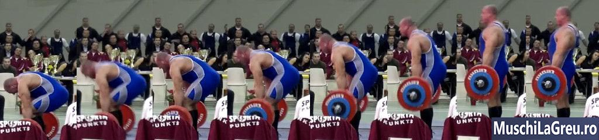
_Konstantinovs nu se rotunjeste complet si mentine curba in coloana vertebrala_

Cel mai important, Konstantinovs este Deadlifting de ani buni. Spatele si abdomenulul lui sunt mai puternice. Ii protejeaza coloana vertebrala mai mult impotriva ranilor. De asemenea, el a perfectat sale tehnica prin ani de practica. Rotunjite-spate Deadlifters incearca sa imite l aiba muschii slabi si forma rea.

Este un lucru sa rotunjiti usor atunci cand incercati un PR o data pe an. Este un alt lucru sa o faci de fiecare data cand ai Deadlift. Dar unii oameni cauta modalitati de a-si rationaliza forma proasta - „ Konstantinovs o face, asa ca de ce nu pot?” Pentru ca nu esti el! Iti lipseste experienta si forta.

Dar este coloana vertebrala, astfel incat sa puteti Deadlift oricat doriti. Mi-am facut targul de Deadlifts cu spatele rotunjit incercand sa imi atinga obiectivele cu orice pret. Durerea de spate m-a invatat sa ma opresc si sa trag neutru.

## Cum imi pot creste Deadlift-ul?

Faceti Indreptari(Deadlift) mai mult. Acesta este cel mai bun mod de a ajunge la patru discuri (180 kg/400lb). Acest lucru functioneaza pentru ca cu cat Indreptarile sunt mai mari, cu atat puteti exersa o forma adecvata. Acest lucru rafineaza si iti perfectioneaza tehnica in timp. Eficienta de ridicare se imbunatateste, ceea ce creste cat de mult poti Deadlift.

Acest lucru nu inseamna ca ar trebui sa Deadlift zilnic. Inseamna ca cresterea Deadlift-urilor fara Deadlifting nu functioneaza. Tragerea de sumo in schimb nu functioneaza nici ea. Vrei sa te perfectionezi la pian, trebuie sa canti la pian - nu la chitara. Acelasi lucru este aici: trebuie sa Deadlift pentru a va mari Deadlift.

Cel mai simplu, cel mai eficient program pentru a creste Indreptare dvs. la 180 kg/400lb este [Antrenamente 5x5](/program/5x5/) . Poate dubla cu usurinta Deadlift-ul in 12 moths daca incepeti lumina, folositi forma corecta si adaugati 5lb/2,5 kg fiecare antrenament. Cititi ghidul, urmariti videoclipurile si folositi aplicatiile pentru a va ajuta.

Cresterea Deadlift de la 0 la 100-120 kg/220-265lb este usor. Trebuie doar sa Deadlift in mod constant si sa adaugati greutate in timp. Detaliile conteaza mai mult pe masura ce devii mai puternic si ajungi la cele trei si apoi patru placi Deadlift. Iata cateva sfaturi care sa te ajute sa ajungi acolo ...

- **Incalzire corect**. Incepeti lumina si pregatiti-va drumul. Exersati o forma adecvata pe greutatile usoare. Ridicati-le ca si cum ar fi grele - depuneti acelasi efort si concentrati-va in ele. Utilizati calculatorul de incalzire din aplicatiile mele pentru seturi exacte, repetari si greutati.
- **Odihneste-te mai mult**. ATP este sursa ta de energie primara pentru ridicare. Fiecare set pe care il faceti il epuizeaza. Insa 95% se intoarce dupa ce te odihnesti timp de cinci minute. Deci, odihneste-te cu cel putin cinci minute inainte de cel mai greu set si vei trage mai mult. Utilizati cronometrul incorporat in aplicatiile mele pentru a va ghida.
- **Imbunatateste-ti aderenta**. Strangeti bara in jos pe maini, aproape de degete, nu in mijlocul palmei. Folositi creta sau creta lichida. Comutati pe priza mixta al seturilor dvs. grele. Faceti priza statice la sfarsitul fiecarui set pentru a va creste rezistenta la prindere. Daca faci toate acestea, nu vei avea nevoie de curele.
- **Purtati o centura**. Obtineti o centura cu latimea egala peste tot. Purtati-l pe ultimele seturi de incalzire si seturi grele. Centura va oferi abdomenul-ului tau o suprafata de impingere, ceea ce ii ajuta sa se contracte mai greu. Acest lucru sporeste suportul pentru coloana vertebrala si va ajuta Deadlift mai mult.
- **Mancati si dormiti Corpul tau are nevoie de mancare si somn pentru a se recupera din antrenamentele tale**. Lipsa somnului omoara motivatia de a te antrena din greu. Lipsa de mancare te face slabit. Incercati sa dormi opt ore pe noapte. Mananca cel putin trei mese pe zi. Obtineti o masa buna cu o ora inainte de ridicare.

Cel mai important, ciocneste-te pe tehnica ta. Fiecare campion mortal se ridica cu o tehnica solida, deoarece creste eficienta. Este nevoie de munca, dar este crucial sa va mariti Deadlift-ul.

## Cum imi pot imbunatati forma?

Cel mai bun mod este sa obtineti feedback de la un antrenor care stie cum sa Deadlift cu o forma adecvata. Cineva care poate Deadlift de cel putin 400lb. Cineva care nu s-a nascut puternic, dar a trebuit sa munceasca din greu pentru a-si creste Deadlifts. Cineva, prin urmare, intelege ce trebuie. Cineva care nu consuma droguri.  
Poate nu gasesti un antrenor unde locuiesti. Nu puteam in Romania. Asa ca am rezolvat asta prin inregistrarea video a lifturilor pentru a primi feedback. Filmeaza-te din lateral pentru a putea vedea ce faci. Examinati videoclipurile dintre seturi si post-antrenament. Apoi incearca sa imbunatatesti data viitoare cand ai Deadlift.
Iata care sunt principalele lucruri de cautat. Ia - astea dreapta, si tu esti deja 80% acolo.

- **Pozitia de inceput corecta** - bara peste mijlocul piciorului, omoplati peste bara, tibia impotriva barei
- **Coloanei vertebrale neutre** - cap neutru, piept in sus, arcul normal al spatelui inferior
- **Calea verticala a barelor** - repetare, coborare si coborare

  Daca observati ca pozitia ta Deadlift este oprit, nu incercati sa remediati totul simultan. Veti fi coplesit daca trebuie sa va ganditi la prea multe lucruri in timp ce trageti. In schimb, alege un lucru pe care sa te concentrezi in setul urmator. Daca o intelegeti corect, atunci alegeti urmatorul lucru de rezolvat pe setul urmator.

  Stapanirea formei corecte va va duce prin cele patru etape ale competentei . La inceput nu stii ca tragi gresit. Dar va inregistrati si observati erorile. Asa ca va concentrati sa faceti acest lucru chiar atunci cand faceti Deadlift. Pana la urma te opresti sa te gandesti la asta - devine doar firesc.  
  Dar vei continua sa parcurgi aceste patru etape, oricat de avansate ai fi. Intotdeauna vor exista aspecte ale formei pe care le puteti imbunatati. Toti marii Deadlifters continua sa-si perfectioneze tehnica in ciuda anilor lor de experienta. Fac si eu. Este unul dintre lucrurile de care ma bucur cel mai mult despre ridicare.

  Tehnica dvs. va fi mai consecventa daca ceea ce faceti inainte de dvs. Deadlift greutatea este consecventa. Asa ca incepeti-va in acelasi mod de fiecare data . Mergeti la bar in acelasi fel, puneti acelasi picior sub el in primul rand, apucati-l mai intai cu aceeasi mana etc.

## Cat ar trebui sa pot sa fac Indreptari?

Tipul obisnuit care cantareste 75 kg/165lb ar trebui sa poata Deadlift 60 kg/135lb fara antrenament. Cu o pregatire adecvata, ar trebui sa poti sa Deadlift acest ...
• 140 kg/300lb dupa 3-9 luni (incepator)
• 180 kg/400lb dupa 9 luni pana la 2 ani (intermediar)
• 225kg/500lb dupa +2 ani de pregatire (avansat)
Daca nu puteti Deadlift asta, ceva nu este in regula cu programul dvs. de antrenament, tehnica Deadlift, nutritia sau consecventa.

## Indreptarile sunt bune pentru tine?

Indreptarile sunt bune pentru dvs. daca utilizati o forma corecta. Iti vor intari spatele, picioarele si bratele. Iti vor creste masa musculara si nivelul de testosteron. Cu toate acestea, daca ai Deadlift cu o forma proasta, te poti rani. Incepeti lumina, concentrati-va pe o forma adecvata, iar Deadlifts va fi bine pentru dvs.

## De cate ori pe saptamana trebuie sa fac Deadlifts?

Cel putin o data pe saptamana pentru forta de baza si castigurile musculare. Daca sunteti nou la Deadlifts, puteti Deadlift de doua ori pe saptamana pentru o perioada. Pozitia ta dvs. se va imbunatati mai rapid, deoarece veti obtine mai multe practici Deadlift.

## Cate repetari ale Deadlifts ar trebui sa fac?

Cinci repetari este cel mai bun pentru majoritatea oamenilor. Daca faceti repetari mai mari, veti avea mai greu timp pentru a mentine o forma buna pe masura ce oboseala devine. Daca faceti repetari mai mici, puteti merge mai greu, dar acest lucru creste riscul de ranire. Lipiti seturi de cinci repetari, astfel incat sa puteti utiliza o forma adecvata si sa nu va raniti.
