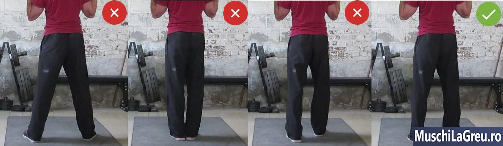
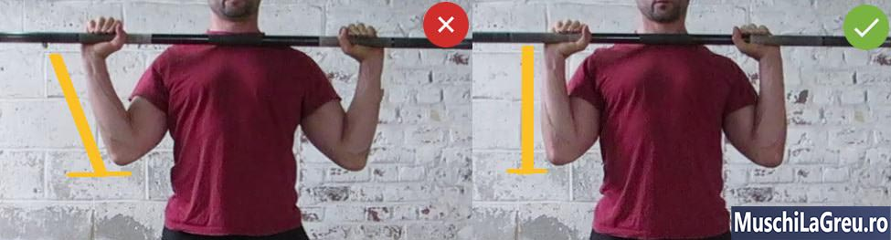
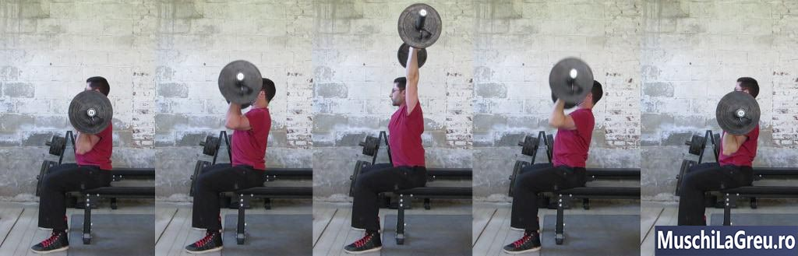

## Cum sa faceti Presa deasupra capului (Overhead Press) cu forma corecta: Ghidul complet

_Cum sa faceti Presa deasupra capului (Overhead Press): impingeti bara de pe umeri peste cap, tinand picioarele drepte._

Iata cum sa faceti Presa deasupra capului (Overhead Press) cu forma corecta...

1. Stai cu bara pe umerii din fata si cu mainile langa umeri
2. Impingeti bara deasupra capului, pana cand este in echilibru peste umeri si pe directia oaselor metatarsiene
3. Blocheaza-ti coatele in varf si ridica din umeri spre tavan.

Tineti bara o secunda in varf. Apoi coborati-o inapoi pe umerii din fata si repetati. Nu-ti folosi picioarele, tine-le drepte. Faceti Presa deasupra capului (Overhead Press) cinci seturi de cate cinci la fiecare [Antrenamente 5x5](/5x5/) antrenament B.

Presa deasupra capului (Overhead Press) lucreaza tot corpul, fiind un exercitiu compus. Umerii si bratele imping greutatea peste cap, in timp ce picioarele, partea inferioara a spatelui si abdomenul asigura echilibrul. Presa deasupra capului (Overhead Press) este unul dintre cele mai bune exercitii pentru a construi umeri puternici, musculosi si sanatosi cu brate mai mari.

Pentru a evita durerile de umar, faceti Presa deasupra capului (Overhead Press) cu o prindere ingusta, astfel incat sa nu va lasati coatele. Apoi ridica din umeri in varf. Impingeti bara peste cap, blocati coatele si ridicati din umeri spre tavan. Acest lucru va lucreaza si muschiul trapez si previne afectarea umarului.

Presa deasupra capului este cel mai greu exercitiu de pe [Antrenamente 5x5](/5x5/) . Vei lucra cu o greutate mai mica decat la alte exercitii, deoarece foloseste muschi mici. Va veti lupta sa adaugati greutate inainte de a face alte exercitii. Cu cat forma ta este mai rea, cu atat vei lupta mai mult. Prin urmare, o forma corecta este cruciala.

Acesta este ghidul complet pentru forma corecta a exercitiului Presa deasupra capului.

Cuprins

   <ul class="contents-ul">
      <li style="list-style:none;">
         <a style="font-size:18px;" href="#introducere"> 1 Introducere</a>
         <ul style="list-style:none; margin-top:0; margin-bottom:0;">
           <li style="list-style:none; margin-bottom:0;"><a style="font-size:18px;" href="#cum-sa-faci-overhead-press">1.1. Cum sa faci Overhead Press</a></li>
           <li style="list-style:none; margin-bottom:0;"><a style="font-size:18px;" href="#presa-deasuprea-capului-forma-corecta"> 1.2. Presa deasuprea capului forma corecta</a></li>
           <li style="list-style:none; margin-bottom:0;"><a style="font-size:18px;" href="#muschii-lucrati"> 1.3. Muschii lucrati</a></li>
           <li style="list-style:none; margin-bottom:0;"><a style="font-size:18px;" href="#repetari-esuate"> 1.4. Repetari esuate</a></li>
           <li style="list-style:none; margin-bottom:0;"><a style="font-size:18px;" href="#siguranta-umerilor"> 1.5. Siguranta umerilor</a></li>
           <!-- <li style="list-style:none; margin-bottom:0;"><a style="font-size:18px;" href="#videoclipuri"> 1.6. Videoclipuri</a></li> -->
         </ul>
      </li>
      <li style="list-style:none;">
         <a style="font-size:18px;" href="#tehnica-presa-deasupra-capului-  (Overhead-Press)"> 2. Tehnica</a>
         <ul style="list-style:none; margin-top:0; margin-bottom:0;">
           <li style="list-style:none; margin-bottom:0;"><a style="font-size:18px;" href="#postura">2.1. Postura</a></li>
           <li style="list-style:none; margin-bottom:0;"><a style="font-size:18px;" href="#picioare"> 2.2. Picioare</a></li>
           <li style="list-style:none; margin-bottom:0;"><a style="font-size:18px;" href="#priza"> 2.3. Priza</a></li>
           <li style="list-style:none; margin-bottom:0;"><a style="font-size:18px;" href="#latimea-de-prindere"> 2.4. Latimea de prindere</a></li>
           <li style="list-style:none; margin-bottom:0;"><a style="font-size:18px;" href="#incheieturile"> 2.5. Incheieturile</a></li>
           <li style="list-style:none; margin-bottom:0;"><a style="font-size:18px;" href="#coate"> 2.6. Coate</a></li>
           <li style="list-style:none; margin-bottom:0;"><a style="font-size:18px;" href="#antebrate"> 2.7. Antebrate</a></li>
           <li style="list-style:none; margin-bottom:0;"><a style="font-size:18px;" href="#partea-superioara-a-bratelor"> 2.8. Partea superioara bratelor</a></li>
           <li style="list-style:none; margin-bottom:0;"><a style="font-size:18px;" href="#umeri"> 2.9. Umeri</a></li>
           <li style="list-style:none; margin-bottom:0;"><a style="font-size:18px;" href="#piept"> 2.10. Piept</a></li>
           <li style="list-style:none; margin-bottom:0;"><a style="font-size:18px;" href="#partea-superioara-a-spatelui"> 2.11. Partea superioara a spatelui</a></li>
           <li style="list-style:none; margin-bottom:0;"><a style="font-size:18px;" href="#muschiul-trapez-(traps)"> 2.12. Muschii trapezului</a></li>
           <li style="list-style:none; margin-bottom:0;"><a style="font-size:18px;" href="#cap"> 2.13. Cap</a></li>
           <li style="list-style:none; margin-bottom:0;"><a style="font-size:18px;" href="#partea-inferioara-a-spatelui"> 2.14. Partea inferioara a spatelui</a></li>
           <li style="list-style:none; margin-bottom:0;"><a style="font-size:18px;" href="#trunchiul"> 2.15. Trunchiul</a></li>
           <li style="list-style:none; margin-bottom:0;"><a style="font-size:18px;" href="#ridicarea"> 2.16. Ridicarea</a></li>
           <li style="list-style:none; margin-bottom:0;"><a style="font-size:18px;" href="#lockout"> 2.17. Blocare</a></li>
           <li style="list-style:none; margin-bottom:0;"><a style="font-size:18px;" href="#coborarea"> 2.18. Coborarea</a></li>
           <li style="list-style:none; margin-bottom:0;"><a style="font-size:18px;" href="#respiratia"> 2.19. Respiratia</a></li>
           <li style="list-style:none; margin-bottom:0;"><a style="font-size:18px;" href="#traiectoria-barei"> 2.20. Traiectoria barei</a></li>
           <li style="list-style:none; margin-bottom:0;"><a style="font-size:18px;" href="#intre-repetari"> 2.21. Intre repetari</a></li>
         </ul>
      </li>
      <li style="list-style:none;">
         <a style="font-size:18px;" href="#dureri-comune"> 3 Dureri comune</a>
         <ul style="list-style:none; margin-top:0; margin-bottom:0;">
            <li style="list-style:none; margin-bottom:0;"><a style="font-size:18px;" href="#durere-ale-spatelui-inferior">3.1. Dureri de spate</a></li>
            <li style="list-style:none; margin-bottom:0;"><a style="font-size:18px;" href="#dureri-de-umar"> 3.2. Durere de umar</a></li>
            <li style="list-style:none; margin-bottom:0;"><a style="font-size:18px;" href="#durere-la-incheietura-mainii"> 3.3. Durere la incheietura mainii</a></li>
            <li style="list-style:none; margin-bottom:0;"><a style="font-size:18px;" href="#dureri-de-gat"> 3.4. Dureri de gat</a></li>
         </ul>
      </li>
      <li style="list-style:none;">
         <a style="font-size:18px;" href="#greseli">4. Greseli comune</a>
         <ul style="list-style:none; margin-top:0; margin-bottom:0;">
           <li style="list-style:none; margin-bottom:0;"><a style="font-size:18px;" href="#cand-trisezi">4.1. Cand trisezi</a></li>
           <li style="list-style:none; margin-bottom:0;"><a style="font-size:18px;" href="#arcuirea-in-exces"> 4.2. Arcuirea in exces</a></li>
           <li style="list-style:none; margin-bottom:0;"><a style="font-size:18px;" href="#incheieturile-indoite"> 4.3. Incheieturile indoite</a></li>
           <li style="list-style:none; margin-bottom:0;"><a style="font-size:18px;" href="#coatele-inapoi"> 4.4. Coatele inapoi</a></li>
         </ul>
      </li>
      <li style="list-style:none;">
         <a style="font-size:18px;" href="#variatii-presa-deasupra-capului">5. Variatii</a>
         <ul style="list-style:none; margin-top:0; margin-bottom:0;">
            <li style="list-style:none; margin-bottom:0;"><a style="font-size:18px;" href="#push-press">5.1. Push Press</a></li>
            <li style="list-style:none; margin-bottom:0;"><a style="font-size:18px;" href="#military-press"> 5.2. Military Press</a></li>
            <li style="list-style:none; margin-bottom:0;"><a style="font-size:18px;" href="#clean-&-press"> 5.3. Clean & Press</a></li>
            <li style="list-style:none; margin-bottom:0;"><a style="font-size:18px;" href="#overhead-press-stand-pe-scaun-(seated-press)"> 5.4. Overhead Press stand pe scaun (Seated Press)</a></li>
            <li style="list-style:none; margin-bottom:0;"><a style="font-size:18px;" href="#overhead-in-spatele-gatului-(behind-the-neck-press)"> 5.5. Overhead in spatele gatului (Behind-the-Neck Press)</a></li>
            <li style="list-style:none; margin-bottom:0;"><a style="font-size:18px;" href="#overhead-press-cu-gantere-(dumbbell-overhead-press)"> 5.6. Overhead Press cu gantere (Dumbbell Overhead Press)</a></li>
         </ul>
      </li>
   </ul>

## Introducere

## Cum sa faceti Presa deasupra capului (Overhead Press)

_Cum sa faceti Presa deasupra capului (Overhead Press) cu o forma adecvata. Impingeti bara intr-o linie verticala de pe umeri pana cand coatele sunt blocate. Ridica din umeri deasupra capului._

Faceti Overhead Press (Presa deasupra capului) in Power Rack, daca este suficient de inalt. Daca este prea mic, setati bara in montantii (uprights) exteriori ai Power Rack-ului dvs. si deblocati-o (unrack). Daca Power Rack-ul dvs. nu are montanti (uprights) exteriori sau nu aveti Power Rack, trageti bara de la podea pe umeri (Power Clean). Dupa ce bara este pe umerii dvs. din fata, urmati acesti cinci pasi simpli pentru a face Overhead Press cu o forma corecta...

- **Pregatirea (Setup)**.Stai cu bara pe umerii din fata. Prindere ingusta, incheieturi drepte, antebrate verticale. Cu genunchii si soldurile fixate.
- **Ridica-ti pieptul**.Ridicati-va pieptul spre tavan arcuindu-va partea superioara a spatelui. Incercati sa va atingeti barbia cu pieptul superior.
- **Impingeti (Press)**.Respirati puternic, tineti-va respiratia si impinfeti bara intr-o linie verticala. Nu o impingeti in fata sau in spatele capului. Impingeti-o peste cap.
- **Miscati-va inainte**.Stai aproape de bara in timp ce impingi greutatea. Miscati-va trunchiul inainte, dupa ce bara iti trece de frunte.
- **Lockout**.Tineti bara peste umeri si mijlocul piciorului pentru un echilibru corect. Blocati-va coatele. Ridica umerii spre tavan.

Intoarceti bara inapoi pe umeri dupa fiecare repetare. Expirati, ridicati-va pieptul si fixati-va antebrate vertical. Respirati puternic si incepeti urmatoarea repetare. Nu va indoiti picioarele. Acest lucru micsoreaza efortul supus de muschii umarului, folosind muschii picioarelor mai puternice. Mentineti soldurile si genunchii fixati de la inceput pana la sfarsit. Daca nu puteti, greutatea este prea mare. Micsorati-o, astfel incat umerii sa faca cea mai mare parte a muncii cand faceti Overhead Press.

## Overhead Press (Presa deasupra capului) forma corecta

_Prindeti bara cu o priza ingusta pentru a pastra, in partea de jos a Overhead Press-ului,antebratele verticale . Blocati coatele si ridicati-va muschiul trapez, in varf._

Conformatia dvs. determina forma dvs. ideal pentru Presa deasupra capului. Daca ai umeri mai lati decat ai mei, ar trebui sa strangi bara mai larg decat mine. Daca aveti antebrate lungi ca mine, incheieturile se pot indoi daca incercati sa va sprijiniti bara pe umeri. Nu copiati forma de Presa deasupra capului a cuiva, cu exceptia cazului in care aveti aceeasi conformatie. Urmati aceste instructiuni generale pentru Overhead Press (Presa deasupra capului) si schimbati-va forma pe masura ce obtineti experienta.

- **Pozitia**.Calcaiele departate cu o distanta egala cu latimea soldului. Picioarele plate pe podea. Indreptate usor in exterior.
- **Picioare**.Mentineti-va genunchii si soldurile blocate de la inceput pana la sfarsit. Indoirea este considerate trisare.
- **Prindere**.Prinderea/ priza completa. Bara la baza palmei, aproape de incheieturi. Strangeti bara.
- **Latime de prindere**.Prindere ingusta chiar in afara umerilor. Nu folositi o prindere larga la Overhead Press.
- **Incheieturi**.Se va forma o linie dreapta de la bara la incheietura mainii pana la cot. Nu lasati incheieturile sa se indoaie sau o sa va doara.
- **Coate**.Aproape sub bara din vedere laterala. In jur de 45 ° din fata. Fara flaring.
- **Antebratelor**.Perpendiculare pe podea din toate unghiurile: perpendiculare din lateral si din fata.
- **Partea superioara a bratelor**.Nu paralele cu podeaua. Acesta nu este o genuflexiune (Squats) frontala. Antebratele tale trebuie sa fie verticale.
- **Umerii**.Tineti bara pe muschii umerilor din fata. Ridica umerii spre tavan.
- **Piept**.Ridicati pieptul arcuindu-va partea superioara a spatelui. Incercati sa va atingeti barbia cu pieptul superior.
- **Partea superioara a spatelui**.Arcuti partea superioara a spatelui pentru a ridica pieptul in sus. Nu va incordati omoplatele.
- **Muschiul trapez**.Ridicati-va muschiul trapez, in varf. Fixati (lockout) bara ridicand umerii spre tavan.
- **Cap**.Tine-ti capul neutru. Priviti inainte. Nu priviti tavanul sau bara in timp ce va antrenati.
- **Partea inferioara a spatelui**.Mentineti-va spatele inferior neutru. Nu exagerati si nu extindeti regiunea lombara.
- **Trunchi**.Inclinati-va usor inapoi in partea de jos. Deplasati-va in partea de sus. Nu va arcuiti partea inferioara a spatelui.
- **Impingerea**.Impingeti bara intr-o linie verticala. Stai aproape de bara miscand trunchiul inainte in partea de sus a Overhead Press-ului.
- **Lockout**.Tineti bara peste umeri. Ridica umerii spre tavan. Blocati coatele.
- **Coborarea**.Coborati bara pana la umeri. Coborati-o controlat, dar nu lent. Fara coate “flared”.
- **Respiratie**.Inspirati in partea de jos inainte de a impinge. Tineti-va respiratia in varf. Expirati in partea de jos.
- **Traiectoria barei**.Impingeti bara intr-o linie verticala de la umeri peste cap, deasupra umerilor.
- **Intre Repetari**.Expirati, ridica-ti pieptul, pozitionati-va antebratele vertical, respira, impinge din nou.

## Muschii lucrati

Presa deasupra capului iti lucreaza intregul corp. Umerii si bratele dvs. sunt primele motoare pentru a impinge greutatea peste cap. Dar totul dintre podea si umeri trebuie sa ramana incordat pentru a fi in echilibru. Acest lucru face ca Presa deasupra capului sa fie un exercitiu pentru tot corpului, care lucreaza mai multi muschi in acelasi timp, cu greutati mari. Iata toti muschii pe care Overhead Press (Presa deasupra capului) ii lucreaza:

- **Umerii**.Trebuie sa ridicati bratele superioare pentru a ridica bara atunci cand impingeti deasupra capului (Overhead Press). Acest lucru lucreaza muschii umarului: deltoidul din fata, lateral si spate. Acesta antreneaza aceste trei capete musculare uniform cu greutati mari, astfel incat sa construiti umeri mari care sa va “umple camasile”.
- **Arme**.Trebuie sa va indreptati coatele pentru a impinge greutatea deasupra capului. Acest lucru lucreaza muschii din spatele bratelor si tricepsul. Masa lor musculara este mult mai mare decat cea a bicepsul. Tricepsii mai mari construiesc brate mai mari. Muschii . antebratului dvs lucreaza de asemenea pentru a tine bara.
- **Coafa rotatorilor**.Echilibraand bara deasupra capului lucreaza muschii mici care va acopera omoplatii: surpraspinatus, infraspinatus, teres minor si subscapularis. Acesti muschi rotunzi stabilizeaza umerii si previn luxatiile. Consolidarea protejeaza umerii.
- **Muschiul trapez (traps)**.Trebuie sa ridicati din umeri in partea de sus a fiecarei repetari pentru a evita afectarea umerilor. Aceasta inclina omoplatul in lateral. Creeaza spatiu pentru coafa rotatorilor. Ridicarea din umeri (Shrugging) iti lucreaza muschii trapezilor pe partea gatului. Construieste ski-slope traps.
- **Abdomen**.Muschii de baza iti stabilizeaza corpul in timp ce umerii si bratele imping greutatea deasupra capului (Overhead Press). Te impiedica sa te prabusesti sub bara. Acest lucru va consolideaza muschii abdominali, oblicii si partea inferioara a spatelui. Abdomenul mai puternic este mai musculos. Mananca corect pentru a fi vizibil.
- **Picioare**.Picioarele iti echilibreaza corpul in timp ce umerii si bratele sustin greutatea. Acest lucru iti lucreaza soldurile, coapsele, gambele si gleznele. Overhead Press nu ii va supune unui efort ca atunci cand faci genuflexiuni (Squats), deoarece picioarele nu se misca. Ele stau drepte. Dar trebuie sa faca o munca izometrica.

Nu trebuie sa faci tone de exercitii de izolare pentru umeri. Presa deasupra capului iti antreneaza intregul umar. Lucreaza uniform si cu greutati mai mari. Majoritatea baietilor isi pot creste cu usurinta Overhead Press-ul pana la 50 kg / 110lb. Incercati sa ridicati atat. Acesta este motivul pentru care Presa deasupra capului (Overhead Press) este mai eficient pentru a construi umeri mai puternici si mai mari. De asemenea, economiseste timp muncind cele trei capete ale umerilor in acelasi timp.

Overhead Press este, de asemenea, eficienta pentru a preveni si repara ranile la umar. Iti intareste coafele rotatorilor. Ii consolideaza cu mai multa greutate decat exercitiile de rotatie interna si externa cu gantere roz. Si spre deosebire de Bench Press, intareste spatele umerilor. Nu doar partea din fata. Cheia este sa va antrenati cu o forma corespunzatoare. Ridicati-va umerii in varf. Si asigurati-va ca incepeti usor.

## Repetari nereusite

_A esua la Presa deasupra capului (Overhead Press) este usor: coborati bara inapoi pe umeri. Nu va poate cadea pe cap, deoarece trebuie sa treaca mai intai deasupra lui._

Overhead Press pare un exercitiu periculos, deoarece impinge greutatea peste cap. Insa este mai sigur decat genuflexiuni (Squat) sau Bench press. Nu puteti ramane niciodata blocat sub bara cand faceti Bench Press. Daca nu reusiti sa impingeti greutatea, puteti sa o coborati pe umeri pur si simplu. Apoi pe Power Rack-ul sau inapoi pe podea. Puteti renunta chiar la bara daca folositi placi de protectie. Dar niciodata nu ramai blocat sub bara.

Teama de a impinge bara peste cap este comuna daca nu ati mai facut niciodata Overhead Press. Dar este nefondat. Greutatea prea mare pentru a fi impinsa si controlata nu va va trece de umeri. De obicei, veti esua in partea de jos, deoarece este mai greu de impins decat in partea de sus. Prin urmare, nu puteti scapa bara pe cap, deoarece greutatea prea grea pentru a fi controla nu ajunge niciodata atat de departe. Daca puteti impinge bara deasupra capului, puteti termina si o puteti controla.

Exista doar doua moduri de a va scapa bara pe cap. In primul rand, faceti Presa deasupra capului cu o prindere de tip thumbless (degetul mare se afla sub bara). Bara iti poate aluneca din maini daca nu iti pozitionezi degetele mari in jurul barei. Impigeti cu o priza/ prindere completa. In al doilea rand, nu va blocati coatele in partea de sus. Acest lucru forteaza muschii sa sustina greutatea deasupra capului. Daca sunt obositi, puteti pierde bara si va puteti rani. Blocati coatele in partea de sus, astfel incat scheletul dvs. sa poata tine greutatea.

Nu este necesar sa faceti Overhead Press (Presa deasupra capului) in interiorul Power rack-ului, pentru siguranta,. Pur si simplu puteti cobori bara pana la umeri atunci cand nu reusiti o repetare. Daca va simtiti mai increzator facand in Power Rack cu carlige de siguranta (safety pins) fixate, faceti-o. Intotdeauna fac Overhead Press inafara Power Rack-ului, deoarece este prea mic/ scund pentru a ma antrena in interior. Ma antrenez astfel de mai bine de 10 ani si niciodata nu mi-a picat bara pe cap. Este putin probabil sa se intample vreodata.

## Siguranta umerilor

_In varf, ridicati-va muschiul trapezului (traps). Acest lucru creeaza spatiu intre bratul superior si articulatia AC pentru coafa rotatorilor._

Presa deasupra capului este sigur pentru umeri daca utilizati o forma adecvata. Construieste umeri mai puternici, mai musculosi si mai sanatosi. Iti intareste muschii coafei rotatori care te tine de umar si previne luxatiile. De asemenea, previne dezechilibrele musculare de la Bench Press prin intarirea musculaturii spatelui. Insa, daca faceti Overhead Press cu o forma proasta, va puteti rani umerii.

Ridicati trapezul in partea de sus a fiecarei repetari. Nu tineti bara deasupra. Incepeti sa stati cu bara pe umeri. Utilizati o prindere ingusta cu coatele la 45° in interior. Nu folositi o prindere mai larga, cum ar fi cea de pe Bench Press sau coatele vor fi prea in exterior/ flared. Impingeti bara intr-o linie verticala in sus. Indreptati-va bratele in partea de sus, blocand coatele. Echilibrati bara peste articulatia umarului. Finalizati repetare ridicand umerii spre tavan.

Indreptarea, in varf, este cruciala. Acest lucru iti activeaza muschii trapezului. Roteste omoplatul si pune procesul osos mai vertical. Acest lucru creeaza spatiu intre partea superioara a osului bratului superior (humerus) si acromionul tau. Creeaza spatiu pentru tesuturile rotatorilor ale coafelor rotatorilor. Daca nu va ridicati umerii, tesuturile nu au spatiu. Ei sunt zdrobiti la fiecare repetare. Aceasta provoaca inflamatie si durere (afectarea umarului).

Nu este vina ciocanului daca iti lovesti degetul mare in loc de unghie. Dar este mai usor sa invinovati un exercitiu decat o forma proasta. Presa deasupra capului (Overhead Press) va va ucide umerii daca o faceti gresit. La fel cum jumatate de repetare de genuflexiune (Squats) iti distruge genunchii, Deadlifting cu spatele rotunjit iti afecteaza coloana vertebrala si Benching-ul cu coatele prea mult in exterior iti afecteaza umerii. Forma corecta conteaza. Ridica umerii in partea de sus a Overhead Press si vei fi in siguranta.

<!-- ## Videoclipuri

Iata un videoclip in care ma puteti vedea facand Presa deasupra capului  (Overhead Press), cu o forma corespunzatoare, ca parte a antrenamentului [Antrenamente 5x5](/5x5/) B. In acelasi timp, de asemenea, raspund la cele mai comune intrebari despre Overhead Press. Urmariti de la 18:34 pentru sfaturi pentru Overhead Press. -->

## Tehnica - Presa deasupra capului (Overhead Press)

## Postura

_Stai cu calcaiele la nivelul soldurilor. Pozitia pe care o folosesti la genuflexiuni (Squats) este prea larga. Va fi mai greu sa iti pastrezi echilibrul daca calcaiele sunt prea apropiate, lipite. Pozitia staggered (un picior este mai in fata, si unu mai in spate) este daunatoare pentru spatele tau._

- **Latimea soldului**.Faceti Presa deasupra capului (Overhead Press) cu calcaiele la acelasi nivel cu solduri. Cu cat soldurile sunt mai inguste, cu atat mai ingusta ar trebui sa fie pozitia ta. Dar calcaiele tale nu ar trebui sa se atinga. Aceasta este Military Press si este mai dificil sa iti menti echilibrul si sa impinfi bara grea. Calcaiele tale nu ar trebui sa fie la acelasi nivel de umeri ca la genuflexiuni (Squats). Nici nu se simte corect. Trebuie sa ai o pozitie mai ingusta fata de atunci cand faci genuflexiuni (Squats), similar cu modul in care faci Deadlift.
- **Picioarele plate pe podea**.Ai un echilibru mai bun atunci cand piciorul tau este plat pe podea. Creste suprafata de contact cu podeaua. Un echilibru mai bun este egal cu mai multa siguranta, un control mai mare al barelor si o forma mai buna. Acest lucru creste capacitatea ta de a face Presa deasupra capului (Overhead Press). Nu va ridicati degetele de la picioare. Nu va ridicati calcaiele si varful degetelor. Aceasta este considerate trisare. Tineti-va degetele de la picioare, picioarele anteriore si calcaiele pe podea cand faceti Presa deasupra capului.
- **Picioare paralele**.Nu folositi o pozitie staggered punand un picior in fata. Acest lucru va poate oferi un echilibru si o stabilitate mai bune atunci cand faceti Overhead Press. Dar pune o presiune inegala asupra coloanei vertebrale inferioare si a soldurilor. Poate provoca dureri de spate inferioare. Faceti Presa deasupra capului (Overhead Press) cu picioarele paralele. Le puteti intoarce cu 15 °. Dar ar trebui sa fie aliniate orizontal atunci cand priviti in jos. Nu lasati niciun picior sa fie mai inainte decat celalalt.

## Picioare

_Tineti-va picioarele drepte cand faceti Presa deasupra capului (Overhead Press). Nu va indoiti genunchii, acesta este un Push Press._

- **Genunchi blocati**.Muschii umerilor si bratului imping greutatea deasupra capului, nu picioarele. Orice indoire a genunchiului este considerata trisare. Acest lucru iti miscorea efortul la care sunt supusi muschii umerilor. Pastreaza-ti picioarele drepte blocandu-ti genunchii si incordati-va cvadripcesul. Daca te dor genunchii, iti treci articulatiile peste limita normala de miscare. Nu hiper-extinde. Blocati usor. Daca nu puteti tine genunchii blocati, greutatea este prea grea.
- **Solduri blocate**.Indoirea soldurilor este un Push Press. Acesta este un exercitiu diferit care va foloseste muschii mai puternici ai soldului pentru a impinge bara de pe umeri. Acest lucru va permite sa lucrati cu greutati mai mari. Dar nu iti lucraza umerii asa cum o face un Overhead - Press strict. Indoirea soldurilor cand faci Presa deasupra capului (Overhead Press) este considerata cu trisare/ inseleciune. Tineti-va soldurile blocate.Incordati-va fesele daca este nevoie. Picioarele tale ar trebui sa te echilibreze, dar sa nu se miste.

## Prinderea/ Priza

_Tineti bara la baza mainii, aproape de incheieturi. Aceasta mentine incheieturile drepte, impiedica aparitia durerilor si face greutatea mai usoara la sustinut atunci cand faci Overhead Press._

- **Priza completa**.Pozitionati-va degetele mari in jurul barei. Acest lucru face ca Presa deasupra capului sa fie mai sigur. Bara nu va poate aluneca din maini si nu va va cadea pe cap. De asemenea, te face mai puternic, deoarece poti strange mai tare bara. Aceasta implica mai mult bratele, umerii si muschii pieptului. Bara nu se poate misca in maini si nu poate cauza o forma proasta. Puteti face Presa deasupra capului cu mai multa greutate, mult mai in siguranta, cu o prindere completa decat cu prinderea thumbless.
- **Priza cu bara la baza palmei**.Bara trebuie sa se sprijine pe regiunea palmara, aproape de incheietura mainii. Acest lucru permite antebratelor tale sa impinga direct in bara folosind forta pe care o genereaza umerii, bratele si muschii pieptului. Nu pozitionati bara la mijlocul palmei deoarece incheieturile se vor indoi. Acest lucru pune bara in spatele oaselor antebratului in loc de deasupra lor. Ingreuneaza greutatea la Overhead Press (Presa deasupra capului) si te vor durea incheieturile mainilor. Pozitionati bara la baza palmei.
- **Priza Bulldog**.Prinde bara asa cum un Bulldog isi pozitioneaza labele. Pune mainile pe bara chiar in spatele umerilor. Apoi rotiti-va mainile pentru a pune bara la baza palmelor. Inchideti mainile si strangeti bara, astfel incat sa nu se poata misca. Acesta prindere/ priza se va simti ciudat la inceput. Se poate simti mai putin in siguranta. Dar degetele dvs. sunt in jurul barului, asa ca esti in siguranta. Si bara este mai jos in palma, astfel incat sa fie mai eficient. Exersati, o sa va obisnuiti cu ea.

## Latimea de prindere

_Nu folositi aceeasi prindere pe care o folositi la Bench Press atunci cand faceti Overhead Press. Prindeti bara, in afara umerilor. Antebratele tale trebuie sa fie verticale._

- **Priza ingusta**.Tineti bara chiar in afara umerilor. Latimea exacta a prizai depinde de cat de largi sunt. Cu cat umerii sunt mai largi, cu atat priza este mai larga. Cu cat sunt mai ingusti, cu atat priza va fi mai ingusta. Priza dvs. este optima atunci cand, in partea de jos, antebratele dvs. sunt perpendiculare cu podeaua. Daca sunt inclinati, priza dvs. este prea larga, iar greutatea va fi mai dificila de sustinut. Folositi o priza ingusta pentru a avea antebratele verticale.
- **Antebrate verticale**.Fiecare repetare de Overhead Press trebuie sa inceapa cu antebratele vertical, in partea de jos. Daca sunt inclinate, greutatea va fi mai greu de impins. Nu poti prinde bara prea ingust, deoarece umerii iti stau in cale. Dar o poti prinde prea larg. Faceti-va cateva poze din fata in timp ce faceti Overhead Press. Daca aveti antebratele inclinate in partea de jos, prinderea dvs. este prea larga.

Ingusteaza astfel incat antebratele tale sa fie verticale.

Nu folositi aceeasi priza ca la Bench Press. O priza mai larga pe care o utilizati pe Bench Press nu functioneaza si la Overhead Press (Presa deasupra capului). In primul rand, iti pune antebratele inclinate in partea de jos. Acest lucru face ca greutatea sa fie mai greu de sustinut pentru Overhead Press. In al doilea rand, face ca ale tale coate sa fie prea in exterior, evazate (flared). Acest lucru este este rau pentru umeri. Ingustati-va priza, astfel incat antebratele tale sa fie verticale. Coatele ar trebui sa fie de 45° in partea de jos. Acest lucru este mai sigur pentru umeri si face greutatea mai usor de sustinut.

## Incheieturile

_Nu faceti Overhead Press cu incheieturile indoite. Dar nici nu iti mentii incheieturile perfect drepte. Pastreaza-le aproape drept, la un unghi de aproximativ 75° in spate._

- **Incheieturi drepte**.Faceti Overhead Press cu incheieturile mainiilor aproape drepte. Articulatiile tale nu ar trebui sa fie verticale sau bara va cadea. Ar trebui sa fie la aproximativ 75 ° inapoi, cu incheieturile usor indoite. Acest lucru pune bara peste oasele antebratului. Il impiedica sa iti indoaie incheieturile inapoi. Face greutatea mai usor de sustinut atunci cand faci Overhead Press si previne durerile la incheietura mainii. Nu va antrenati cu incheieturile indoite. E ineficient si va face rau.
- **Priza cu bara la baza palmei**.Tineti-va incheieturile drepte folosind priza Bulldog. Prinde bara cu mainile deschise chiar in afara umerilor. Rotiti-va mainile la fel cum bulldog isi pozitioneaza labele. Acest lucru pune bara pe regiunea palmara. Inchideti mainile si strangeti bara, astfel incat sa nu se poata misca. Rotiti coatele in jos si bara se va sprijini peste oasele antebratului. Incheietura nu se va indoi si nu va va durea. Greutatea va fi mai usoara de sustinut.

## Coate

_Antebratele tale trebuie sa fie verticale in partea de jos a Overhead Press-ului. Coatele nu pot fi prea inapoi sau inainte. Ar trebui sa fie aproape sub bara._

- **Sub bara**.Cea mai eficienta modalitate de a face Overhead Press (Presa deasupra capului) este cu antebratele verticale. Majoritatea oamenilor imping cu coatele inapoi in partea de jos. Acest lucru iti pune antebratele inclinate si omoara puterea. Mutati coatele inainte, inainte de a impinge. Miscati-le sub bara, astfel incat antebratele dvs. sa fie verticale privind din lateral. Incepeti sa impingeti si bara se va muta intr-o linie verticala in sus in loc sa se indeparteze de fata. Te vei antrena o greutate mai mare.
- **Coatele la 45°**.Tine coatele aproape de trunchi. Nu trebuie lasate prea mult in partea laterala, dar nici nu ar trebui sa se indrepte inainte. Pozitionati-le la 45°, astfel incat sa va atingeti muschiul dorsal mare, in partea de jos. Ai nevoie de o prindere ingusta pentru a face acest lucru. Nu prindeti bara ca la Bench Press deoarece coatele vor fi prea in exterior. Prinde ingust, chiar in afara umerilor. Tineti coatele in timp ce impingeti greutatea. Acest lucru este mai sigur pentru umeri si mai eficient.

- **Blocati in partea de sus**.Repetarea nu conteaza daca nu blocati coatele, in partea de sus. Mai rau, daca muschii dvs. sunt obositi, puteti pierde bara si sa o scapati pe cap. Blocati coatele in partea de sus. Finalizati fiecare repetare prin indreptarea bratelor si ridicandu-va umerii. Puteti tine bara mai mult timp si mai in siguranta cu coatele blocate. Si atata timp cat va blocati usor si nu va extindeti bratul, articulatia cotului va fi in siguranta.

## Antebrate

_Antebratele trebuie sa fie verticale din fiecare unghi, in partea de jos a Overhead Press. Blocati-va si puneti coatele aproape sub bara._

Verticale/ perpendiculare, din lateral. Puneti-va antebratele perpendiculare pe podea la inceputul fiecarei repetari. De obicei, acestea vor fi inclinate, deoarece coatele sunt prea in spate. Inainte de a incepe sa impingi bara, mutati-le inainte. Tineti-va incheieturile drepte tinand bara la baza palmei folosind priza Bulldog. Toate acestea vor imbunatati transferul de putere de pe umeri si triceps in antebratele catre bara. Creste capacitatea ta de a face Overhead Press.

Verticale/ perpendiculare, din fata. Antebratele trebuie sa fie, de asemenea, perpendiculare pe podea atunci cand privesti din fata sau din spate. Nu impingeti cu o priza mai larga, cea pe care o utilizati la Bench Press. Apucand bara lat iti inclinati antebratele in partea de jos, ceea ce este ineficient. Ingustati-va priza, astfel incat mainile sa fie chiar in afara umerilor. Latimea exacta depinde de latimea umarului. Dar antebratele tale ar trebui sa fie vertical/ perpendiculare.

## Partea superioara a bratelor

Fara genuflexiuni frontale (Front Squats)! Presa deasupra capului nu este o genuflexiune frontala (Front Squats). Partile superioare ale bratelor trebuie sa fie orizontale pe genuflexiunile frontale (Front Squats) pentru a mentine greutatea grea pe umeri si nu pe incheieturi. Bratele tale nu se misca. Acestea fac Overhead Press-ul. Iar partile superioare ale bratelor orizontale transforma partea de jos a exercitiului intr-o extensie triceps. Acest lucru este greu si ineficient. Tineti partile superioare ale bratelor in jos, astfel incat sa impingeti cu ajutorul antebratelor verticale.

## Umerii

Bara pe umeri. Incepeti cu bara pe umeri. Tine-o pe muschi, in fata gatului. Ridica-ti pieptul arcuindu-ti partea superioara a spatelui. Ridicati usor de umeri, dar nu atingeti urechile. Incordati-va axile, impingandu-va muschiul dorsal mare impotriva tricepsului. Puneti-va antebratele verticale cu incheieturile aproape drepte. Corpul tau va fi incordat. Acest lucru ofera barei o platforma mai buna pentru Overhead Press.

Ridica-ti umerii. In varf, ridica umerii spre tavanul. Aceasta implica muschii trapezului (traps) si previne afectarea umarului. Repetarea nu conteaza daca nu ati terminat-o ridicand din umeri. Impingeti bara pana cand coatele sunt blocate. Apoi continuati sa impingeti, ridicand umerii, in sus. Veti obtine o pozitie de blocare mai puternica, va veti mari muschiul trapezului si veti evita afectarea umarului din cauza Overhead Press-ului.

## Piept

Ridica-ti pieptul. Ridicati pieptul inainte de a impinge bara de pe umeri. Aceasta creeaza o suprafata mai mica, mai stransa. Faceti un piept mai mare si incercati sa va atingeti barbia cu pieptul superior. Faceti acest lucru arcuindu-va partea superioara a spatelui. Pastrati-va partea inferioara a spatelui neutru, nu va depasiti. Incordati-va axile si inspirati puternic pentru a va bloca pieptul in pozitie. Nu uitati sa va ridicati pieptul intre repetari inainte de a incepe sa impingeti bara din nou.

## Partea superioara a spatelui

Arcuiti-va partea superioara a spatelui. Antrenarea cu partea superioara a spatelui rotunjita este ineficient. Umerii si bara iti vor cadea. Creste raza de miscare si iti inclina antebratele. Ingreuneaza greutatea pentru Overhead Press. Arcuiti-va partea superioara a spatelui inainte de a impinge bara. Nu va incordati omoplatele. Nu va arcuiti partea inferioara a spatelui. Ridicati-va pieptul pentru a oferi barei o suprafata mai mare de sustinere.

## Muschiul trapez (traps)

_Ridica umerii spre tavanul din varf. Acest lucru creeaza spatiu in articulatia umarului si previne leziunile umarului._

Ridica din umeri. Finalizeaza fiecare repetare ridicandu-ti muschiul trapez. Impingeti bara de pe umeri peste cap. Continuati sa impingeti pana cand bratele sunt drepte. Dupa ce coatele sunt blocate, ridica umerii spre tavan. Tineti o secunda inainte de a cobori bara. Blocandu-ti muschiul trapez in varf, bara este mai usor de tinut deasupra capului. Angajeaza mai multi muschi. De asemenea, previne afectarea umarului.

## Cap

_Nu va uitati in sus sau in lateral. Nu va inclinati capul. Priveste inainte cand faci Presa deasupra capului._

Fix. Fixeaza un punct pe peretele din fata ta. Daca va confruntati cu o oglinda, priviti „prin” aceasta. Nu te uita la tavan sau la bara in timp ce te antrenezi. Acest lucru poate provoca excesul de aplecare in spate. Nu va uitati deoparte si nu va inclinati capul. Acest lucru va poate rasuci si va poate afecta gatul. Mentineti-va capul neutru in timp ce faceti Presa deasupra capului. Priveste la un punct din fata ta, la nivelul ochilor tai. Continuati sa priviti pana cand setul dvs. se termina.

## Partea inferioara a spatelui

Ramane neutru. Pastrati arcul partii inferioare a coloanei vertebrale natural cand faceti Presa deasupra capului (Overhead Press). Partea inferioara a spatelui nu trebuie sa fie plata, ci sa aiba o curba naturala ca atunci cand stai in picioare. Nu-i permite spatelui inferior sa se hiper-extinda, aplecandu-te excesiv atunci cand te chinui sa impingi greutatea. Aceasta va va perfora discurile coloanei vertebrale si va poate rani spatele. Mentineti-va spatele inferior neutru. Respirati puternic inainte de a incepe si incordati-va abdomenul puternic.

## Trunchiul

Mergi inainte. Inclinati-va usor inapoi inainte de a impinge greutatea de pe umeri. Faceti acest lucru impingand soldurile inainte, fara sa va arcuti excesiv spatele sau sa va indoiti genunchii. Acest lucru va tine capul inapoi si in afara barei. Impingeti acum greutatea intr-o linie verticala in timp ce mutati trunchiul inainte. Nu va lasati inapoi sau greutatea va fi mai greu de impins. Apropiati-va miscand trunchiul inainte in timp ce bara se ridica.

## Ridicarea/traiectoria bare deasupra capului

- **Impingeti in linie verticala**. Puteti face Overhead Press cu mai multa greutate daca impingeti in linie dreapta, mai degraba decat curbata. La o distanta mai scurta. Dar capul tau este in calea barei, in partea de jos. Trebuie sa creati spatiu pentru ca bara sa se deplaseze intr-o linie verticala. Inclinati-va inapoi in partea de jos inainte de a impinge greutatea. Mentineti-va partea inferioara a spatelui neutru in timp ce miscati soldurile inainte. Acest lucru va va tine capul inapoi si in afara drumului.
- **Stai strans**.Tineti bara aproape de fata pe drum. Cu cat se indeparteaza mai mult de fata si umeri, cu atat este mai greu sa o impingeti. Este ca si cum ai face front raises. Impingeti bara intr-o linie verticala in sus, nu trebuie sa aiba o traiectorie curbata. Inclinati-va inapoi, in partea de jos, pentru a va da capul din drum. Dupa ce bara iti trece de cap, misca-ti trunchiul inainte pentru a tine bara aproape. Miscarea se va simti mai scurta si greutatea mai usoara. Veti face Overhead Press (Presa deasupra capului) cu mai multa greutate.
- **Picioare drepte**.Nu-ti lasa genunchii sau soldurile sa se aplece, pe drum. Impingeti greutatea numai cu umerii si muschii bratelor. Faceti acest lucru tinand picioarele drepte. Strangeti-va fundul (fesele) si partea din fata a coapselor. Orice indoire a picioarelor este echivalentul unei trisari. Iti micsoreaza efortul suportat de muschii umarului. Daca nu puteti mentine picioarele drepte atunci cand faceti Overhead Press, greutatea este prea grea. Micsorati greutatea.
- **Coate 45°**.In urcare, nu tineti coatele prea in exterior (flare). Tine-le aproape de trnchiul dvs. Incepeti cu o priza ingusta, chiar in afara umerilor. Ridicati-va pieptul arcuindu-va partea superioara a spatelui. Tineti-va antebratele vertical. Odihneste-ti tricepsul pe muschiul dorsal mare. Coatele tale vor fi la aproximativ 45°, in partea de jos. Acum impingeti greutatea, tinand coatele aproape. Ele nu ar trebui sa fie inainte. Dar nici nu ar trebui sa fie prea in exterior, in lateral.

## Lockout

_In varf, echilibrati bara peste umeri. Nu o tine in fata sau in spatele umerilor. Este mai greu si va veti pierde echilibrul._

- **Bara peste umeri**.Bara este echilibrata cand o blochezi peste umeri in partea de sus. Tinerea in fata sau in spatele lor este ineficienta. Bara te va trage inainte sau inapoi. Umerii tai vor risipi energie incercand sa te impiedice sa pierzi bara. Este posibil sa fiti nevoit sa va dati un pas inainte sau inapoi pentru a evita pierderea echilibrului. Blocati bara peste umeri. Acest lucru face mai usor de tinut si de facut Overhead Press (Presa deasupra capului).
- **Blocheaza-ti coatele**.Nu va mentine coatele indoite in varf. In primul rand, repetarea nu este contorizata. In al doilea rand, ai putea pierde bara si ai scapa-o pe cap. Blocati coatele in partea de sus a fiecarei repetari, astfel incat scheletul dvs. sa poata tine greutatea. Acest lucru este sigur pentru articulatiile cotului, atata timp cat nu va extindeti prea mult bratele. Blocati usor coatele fara sa treceti peste intervalul lor normal de miscare. Nu vizati mai multa tensiune. Obtineti mai multa greutate.

- **Ridicare din umeri!** Trebuie sa ridici din umeri. Daca nu va ridicati umerii, oasele bratului superior va vor strange tesuturile cu coafele rotatorilor impotriva articulatiei AC la fiecare repetare. Acest lucru va va rani si iti vei afecta umerii. Finalizati fiecare repetare ridicand umerii spre tavan. Impingeti bara peste cap, blocati coatele si apoi ridicati umerii. Bara va fi mai usor de sustinut, deoarece utilizati mai multi muschi. Si umerii tai vor fi in siguranta.

## Coborarea

- **La fel ca ridicarea.** Coborarea trebuie sa fie o oglinda a urcarii/ ridicare. Coborati bara intr-o linie vertical, dreapta, pana la umeri. Inclinati-va usor inapoi, miscand soldurile inainte, pentru ca bara sa nu va loveasca capul. Pastrati-va partea inferioara a spatelui neutru, nu depasiti. Tineti-va coatele la 45° in interior, fara sa fie prea in exterior (flare). Tineti bara aproape de fata, astfel incat sa nu pierdeti energia in coborare. Si tine-ti antebratele vertical, cu coatele aproape sub bara.

- **Controlat, nu lent**. Coborati bara prea lent si veti pierde puterea pentru urcare. Coborati-o prea repede si veti lupta pentru a mentine o forma adecvata. Ritmul optim de ridicare este unul in care puteti mentine o forma adecvata si impingeti cea mai mare greutate. Incetiniti daca sunteti incepatori, mergeti mai repede daca aveti mai multa experienta. Nu mergeti mai lent pentru a simti muschii mai mult, adaugati in schimb greutate.

## Respiratia

- **Inspirati in partea de jos**. Incepeti cu bara pe umeri. Ridicati-va pieptul arcuindu-va partea superioara a spatelui. Pastrati-va partea inferioara a spatelui neutru, fara suprasolicitare. Tineti-va antebratele verticale si odihneste-ti tricepsul pe muschiul dorsal. Acum respirati, tineti-va respiratia si impingeti. Respiratia creste presiunea in trunchi. Acesta blocheaza pieptul in pozitie si creeaza o suprafata mai stransa din care sa impingi bara. Acest lucru creste puterea.

- **Tineti-va respiratia, in varf/ parte de sus**. Tine-ti respiratia pe drum. Nu expirati sau pieptul se va dezumfla ca un balon si va ceda. Partea superioara a spatelui se va rotunji, iar bara va fi mai greu de ridicat. Nu expirati nici in partea de sus. Vei pierde din nou etanseitatea, ceea ce face ca urmatoarea repetare sa fie mai greu de dus la final. Respirati in partea de jos, tineti-o in varf si inpingeti. Expirati odata ce bara este din nou pe umeri.

- **Expirati in partea de jos**. Expirati odata ce bara este din nou pe umeri. Incordati-va ridicand pieptul si arcuindu-va partea superioara a spatelui. Apoi inspirati puternic, tineti-va respiratia si faceti urmatoarea repetare. Daca greutatea este grea si se misca incet, puteti expira pe drum. Dar nu-ti goli plamanii. Expirati impotriva glotei inchise (sau mormaitului) pentru a elibera o anumita presiune. La majoritatea repetarilor, puteti astepta sa expirati pana cand bara este pe umeri.

## Traiectoria barei

- **Linie verticala**. Impingeti bara intr-o linie verticala. O traiectorie perpendiculara a barei determina cea mai scurta distanta intre umeri si blocare. Deplasarea barei pe o distanta scurta este mai usoara decat una lunga. Creste cat de mult poti face Overhead Press. Inregistrati-va din lateral pentru a va verifica traiectoria barei. Daca nu este verticala, lasati kg / lb in bara. Impingeti mai drept si veti putea face Overhead Press cu o greutate mai mare.

- **Fara o traiectorie curbata**. Nu impingeti bara in J-curba, departe de fata ta. Aceasta creste raza de miscare si face ca greutatea sa fie mai greu de sustinut. Acesta indeparteaza bara mai departe de umeri si pierdeti energie. Impingeti pe o linie verticala. Tineti bara aproape de fata. Tineti-o peste umeri, in partea de sus a Overhead Press-ului. Nu blocati bara in spatele umerilor deoarece veti mari din nou distanta. Mergeti scurt si va veti antrena cu o greutate mai mare.

- **Misca-ti trunchiul**. Capul dvs. blocheaza/ impiedica bara cand faceti Overhead Press. Nu o poti impinge de pe umeri drept deasupra capului, fara sa-ti lovesti barbia si nasul. Trebuie sa creati spatiu pentru bara, aplecandu-va usor inapoi, in partea de jos a Overhead Press-ului. Miscati-va soldurile inainte, pastrandu-va partea inferioara a spatelui neutru. Acest lucru iti tine capul in exterior. Acum impingeti. Odata ce bara iti trece de cap, misca-ti trunchiul inainte pentru a ramane aproape de el.

## Intre Repetari

- **Stai incordat**. Odihneste-te in partea de jos o secunda inainte de a incepe urmatoare repetare. Folositi aceasta pauza pentru a incorda totul. Ridicati-va pieptul arcuindu-va partea superioara a spatelui. Puneti-va antebratele perpendicular cu podeaua. Respirati puternic, tineti-va respiratia si apoi faceti urmatoarea repetare. Veti avea o forma mai buna care va creste cantitatea de greutate cu care va puteti antrena. Vei castiga mai multa forta si muschi in timp ce vei reduce riscul de accidentare.

- **Controleaza greutatea**. Puteti face mai multe repetari de Overhead Press (Presa deasupra capului) daca controlati greutati intre repetari. Coborarea barei iti intinde muschii. Acestea se pot contracta mai greu daca ridicati rapid bara de pe umeri pentru a face urmatoarea ta repetare. Dar trebuie sa mentineti o forma adecvata pentru ca acest lucru sa functioneze. Daca pieptul tau se prabuseste sau impingeti bara intr-o curba sub forma literei J, pierdeti avantajul pe care acesta il aduce. Mai bine este sa intrerupeti o secunda in partea de jos intre repetari.

## Dureri comune

## Durere in partea inferioara a spatelui

Forma necorespunzatoare va provoca dureri ale spatelui inferior atunci cand faci Overhead Press (Presa deasupra capului). Partea inferioara a spatelui trebuie sa ramana neutra atunci cand faceti Overhead Press. Rotunjirea nu va avea loc decat doar daca curatati bara la inceputul fiecarui set. Dar arcuirea in exces a parti inferioare a spatelui se poate intampla cu usurinta. Hiper-extinderea spatelui inferior perforeaza discurile coloanei vertebrale. Mai ales atunci cand este incarcat in timpul unui Overhead Press. Acest lucru poate provoca dureri de spate, sau mai rau, leziuni precum hernie de disc.

NU va inclinati inapoi atunci cand va luptati prin arcuirea spatelui inferior. S-ar putea sa obtineti repetarea, dar riscati sa va raniti.

Mentineti-va spatele inferior neutru. Mentine un arc natural ca atunci cand stai. Partea inferioara a spatelui nu ar trebui sa fie plana, dar nici nu ar trebui sa arcuiesti prea mult. Daca nu va puteti mentine spatele neutru, greutatea este prea mare grea. Luati in considerare un esec in loc sa va aplecati pentru a obtine repetarea dvs. cu orice pret. Acest lucru este mai sigur pentru partea inferioara a spatelui.

Va puteti apleca inapoi in partea de jos a fiecarei repetare pentru a tine bara intr-o pozitie mai buna si a impinge intr-o linie verticala. Dar acesta inclinare inapoi trebuie sa vina din soldurile tale. Te apleci inapoi, miscand soldurile inainte, nu arcuindu-ti spatele inferior.

Incordati-va fesele, abdomenul si cvadricepsul pentru a evita arcuirea inferioara a spatelui. Daca sunteti incepator la Overhead Press, va fi dificil. Nu va miscati deloc soldurile pentru a evita miscarea inferioara a spatelui. Incercati mai tarziu.

Curelele nu vor impiedica durerile inferioare de spate de la o forma proasta. Acestea te pot ajuta sa depasesti Presiunea mai multa greutate, oferindu-ti abs-ului ceva cu care sa te impiedici. Muschii tai ab se pot contracta mai greu, ceea ce ofera sprijinul inferior al spatelui. Insa excesul de arcuire a spatelui inferior se poate intampla si este periculos cu sau fara centura. Nu purtati cureaua pentru a compensa o forma proasta. Deasupra capului Apasati cu partea inferioara a spatelui.

## Dureri de umar

_Ridicati muschiul trapez in varf. Acest lucru creeaza spatiu intre bratul superior si articulatia AC pentru coafele rotatorilor. Fara umflarea nu exista spatiu care afecteaza umarul._

Leziunile umarului se intampla atunci cand nu reusiti sa ridicati din umeri in partea de sus. Partea superioara a osului bratului superior va zdrobi coafele rotatorilor impotriva articulatiei AC daca nu va ridicati din umeri. Aceste tesuturi se vor inflama si te vor durea. Fixarea usoara este pentru a crea spatiu pentru coafele rotatorilor. Rotiti omoplatele spre a face procesul osos mai vertical. Faceti acest lucru prin angajarea muschiului trapezului. Ridicati umerii in partea de sus a fiecarei repetari. Durerile la umar vor disparea.

Nu faceti Overhead Press cu o priza larga pe care o utilizati pe Bench Press. Coatele se vor departa prea mult si umerii te vor durea. Faceti Overhead Press (Presa deasupra capului) utilizand prinderea ingusta. Mainile tale ar trebui sa fie chiar in afara umerilor, cu antebratele verticale spre podea, in partea de jos. Impingeti bara intr-o linie verticala in sus si echilibrati-o peste umeri, in partea de sus. Nu o tineti in fata sau in spatele umerilor, in varf, deoarece te vor durea.

## Durere la incheietura mainii

_Priza Bulldog. Nu pozitionati bara la mijlocul palmei sau incheieturile se vor indoi. Pozitionati-o la baza palmei si aproape de incheieturile mainii, folosind prinderea bulldog._

Apucarea gresita a barei provoaca dureri la incheietura mainii pe Overhead Press, asa cum se intampla pe Bench Press. Nu tineti bara cu mijlocul palmei. Greutatea va va impinge mainile in jos si va va indoi incheieturile inapoi. Greutatea puternica va va intinde incheieturile in spatele gamei normale de miscare. Acest lucru va va durea. De asemenea, face greutatea mai grea la Overhead Press, deoarece bara se sprijina in spatele incheieturilor. Antebratele dvs. nu pot aplica forta direct in bara.

Durerea la incheietura mainii nu inseamna ca incheieturile sunt slabe. Nu trebuie sa va intariti incheieturile, facand exercitii pentru incheietura mainii sau purtand benzi pentru incheieturi. Trebuie sa prindeti corect bara. Tineti-o in baza palmei, aproape de incheieturi. Folositi priza Bulldog pentru a tine bara deasupra oaselor antebratului. Acest lucru va mentine incheieturile aproape drepte atunci cand impingeti. Inceteaza durerile la incheietura mainii si usureaza greutatea la Overhead Press.

## Dureri de gat

_Mentineti-va capul neutru cand faceti Presa deasupra capului. Nu va uitati in sus sau in lateral. Nu va inclinati capul._

Durerea gatului se poate intampla daca faceti Presa deasupra capului (Overhead Press )cu o forma proasta. Atentie cu pocnirea oaselor acestuia. Nu incercati sa impingeti cu orice pret greutatea folosind o forma proasta. Durerea va poate trage in gat sau pe muschiul trapez la mijloc. O sa doara 2-3 zile de fiecare data cand intoarceti capul sau il inclinati inapoi. Acest lucru va poate forta sa treceti peste Overhead Press, pana cand gatul se vindeca. Durerea gatului iti incetineste progresul. Mai rau, va reveni daca nu incetati sa faceti acest lucru.

Faceti Overhead Press cu capul neutru. Pastrati-o pe linie cu restul coloanei vertebrale. Priveste inainte. Fixeaza un punct pe peretele din fata ta. Daca va confruntati cu o oglinda, priviti „prin”. Nu te uita la tavan sau la bara. Nu va inclinati capul intr-o parte pentru a face loc barei. In schimb, aplecati-va usor in partea de jos miscand soldurile inainte, fara sa va arcuiti inapoi. Acest lucru va pastreaza capul in afara traiectoriei barei, neutru si echilibrat.

Tine-ti capul sub bara in partea de sus a Overhead Press-ului. Nu va blocati miscand capul inainte ca un pui. Trunchiul dvs. ar trebui sa inainteze pentru a ramane aproape de bara. Dar capul tau trebuie sa ramana aliniat cu restul coloanei vertebrale. Daca o faceti bine, bara va ajunge peste umeri si urechi atunci cand blocati greutatea. Daca bara se afla in spatele urechilor, impingeti capul prea in spate sau prea departe. Ambele pot provoca dureri de gat.

Incalzirea corecta. Nu sari direct la greutati. Daca trebuie sa faceti Overhead Press 5 × 5 50kg / 110lb, faceti mai intai doua seturi cu bara goala. Adaugati 20kg / 45lb si faceti trei repetari. Apoi, faceti 5 × 5. Este mai putin probabil sa te doare, deoarece muschii si articulatiile tale sunt calde si ai practicat o forma corecta. Greutatea va fi si mai usor de impins.

Dormitul si antrenarea cu o pozitie proasta poate provoca, de asemenea, dureri de gat atunci cand faceti Overhead Press. A dormi pe burta cu capul rasucit intr-o parte este daunator.Dormi pe o parte. Obtineti o perna buna pentru a sprijini arcul gatului. Lucrul cu laptopul pe picioare este, de asemenea, daunator. Vei aluneca si iti vei indoi gatul. Ecranul trebuie sa fie la nivelul ochilor. Puneti o punga sau o perna pentru a o ridica. La fel daca utilizati un desktop.

Masajul poate accelera recuperarea de la durerile de gat. Un kinetoterapeut poate face acest lucru pentru tine sau poti incerca singur. Stai cu spatele la perete. Puneti o minge de tenis sau lacrosse intre muschiul trapez (traps) si perete. Impingeti-va pe minge si perete pentru a aplica presiune. Faceti acest lucru inapoi pe podea pentru mai multa presiune. Rotiti-va pentru a masa toata zona. Gatul se va descarca daca faci acest lucru de 2-3 ori pe zi. Dar eliminate si cauza durerii.

## Greseli comune

## Trisarea

_Indoirea picioarelor este echivalentul unui Push Press si egal cu o inselaciune. Tineti picioarele drepte cand faceti Overhead Press._

Cel mai simplu mod de a trisa la Overhead Press (Presa deasupra capului) este sa-ti folosesti picioarele. Incepi [Antrenamente 5x5](/5x5/) facand Overhead Press. Genunchii si soldurile raman blocate. Doar bratele se misca pentru a impinge bara peste cap. Dupa cateva saptamani, veti face Overhead Press cu dublu fata de ceea ce ati inceput. Dar va luptati sa va faceti repetarile cu greutatile mai grele. Deci folosesti un pic de picioare. Si iti vei duce la bun sfarsit repetarile. Dar este considerata trisare.

Folosirea picioarelor la Overhead Press este Push Press. Push Press nu este un exercitiu prost. Este un exercitiu minunat. Dar nu este solutia atunci cand te chinui sa-ti completezi repetarile pe [Antrenamente 5x5](/5x5/) . Trebuie sa folositi o tehnica consecventa pentru fiecare exercitiu. Deoarece, daca tehnica dvs. este consecventa, dar greutatea pe bara creste, stiti ca veti castiga forta si masa musculara. A adauga limbaj corporal sau a face jumatate de repetare este inselaciune/ trisare.

Push Press implica mai multi muschi prin utilizarea picioarelor. Micsoreaza efortul facut de muschii umarului, in pozitia de jos. Bara ajunge de la umeri la nas sau frunte folosind impulsul pe care il creati cu picioarele. Acest lucru nu inseamna ca umerii dvs. nu lucreaza. Dar lucreaza mai putin decat atunci cand facetu Overhead Press cu picioarele drepte. Si umerii nu pot fi mai puternici daca folositi intotdeauna picioarele pentru a impinge.

Tineti picioarele drepte cand faceti Overhead Press. Nu-i lasati sa se indoaie. Daca nu puteti tine picioarele drepte, greutatea este prea grea. Nu incercati sa va faceti repetarile facand un Push Press, astfel incat sa puteti continua sa adaugati greutate. Nu va transformati genuflexiunea (Squats) in jumatate de genuflexiune (Squats) atunci cand greutatea devine mai grea. Nici nu va ridicati trunchiul mai mult la Barbell Rows. Luati in considerare o forma proasta si un esec. Repetati greutatea data viitoare si micsorati-o daca trebuie.

## Arcuirea in exces

Partea inferioara a spatelui trebuie sa ramana neutra atunci cand faceti Overhead Press. Pastrand un arc natural ca atunci cand stai. Nu va lasati in spate atunci cand va chinuiti sa impingeti greutatea. Arcuirea extrema a partii inferioare a coloanei vertebrale (hiper-extensie) perforeaza discurile coloanei vertebrale din spate. Adaugati greutate pe bara si puteti suferi o ranire inferioara a spatelui ca o hernie de disc. Nu permiteti arcuirea extrema a spatelui inferior. Ramaneti neutru.

Retineti ca ar trebui sa va aplecati inapoi cand faceti Overhead Press. Acest lucru iti muta capul din calea barei. Va permite sa impingeti intr-o linie verticala, acest lucru este mai eficient. Dar acesta inclinare inapoi trebuie sa porneasca din soldurile tale. Mentineti-va partea inferioara a spatelui neutru in timp ce miscati soldurile inainte. Faceti acest lucru inainte ca bara sa va paraseasca umerii, nu dupa sau in timpul. Dupa ce bara se misca, nu te mai apleca inapoi. Mutati-va trunchiul inainte pentru a ramane aproape de bara.

Daca nu va puteti opri de la arcuirea spatelui inferior, stati mai stans. Respirati mai mult inainte de a impinge greutatea. Incordati-va abdomenul ca atunci cand cineva vrea sa va loveasca in stomac. Purtarea unei centuri atunci cand faceti Overhead Press va poate aminti sa incordati abdomenul oferindu-le ceva impotriva carora sa impinga. Daca partea inferioara a spatelui continua sa se hiper-extinda, muschii abdomenului sunt slabe. Ai rabdare si vor deveni mai puternici. Sau adaugati exercitii izolate pentru abdomen.

## Incheieturile indoite

Overhead Press cu incheieturile indoite doare si este ineficienta pentru ridicarea greutatilor mari. Incheietura trebuie sa fie aproape dreapta cu unghiile la aproximativ 75° pe spate. Scopul este sa tineti bara aproape de incheieturile mainilor, deasupra oaselor antebratului. Acest lucru impiedica bara sa va afecteze incheieturile, indoindu-le dincolo de domeniul lor normal de miscare. De asemenea, face ca greutatea sa fie mai usor de impins, deoarece antebratele verticale pot impinge direct in bara.

## Coate inapoi

Majoritatea oamenilor fac Overhead Press cu coatele in spatele barei. Probabil vei face aceasta greseala. Coatele inapoi determina antebrate inclinate, in loc de verticale. Acest lucru creeaza probleme de traiectorie a barei atunci cand impingi bara departe de fata, in loc sa indrepti in sus. In plus, antebratele nu va pot impinge direct bara, deoarece sunt inclinate. Muta-ti coatele inainte. Ar trebui sa fie usor in fata barei, astfel incat antebratele tale sa fie verticale.

## Variatii ale Overhead Press-ului(Presei deasupra capului)

## Push Press

<iframe title="Push-press" width="1100" height="619" src="https://www.youtube.com/embed/jdN1Sg4j-Sk?feature=oembed" frameborder="0" allow="autoplay; encrypted-media" allowfullscreen=""></iframe>

Push Press este un Overhead Press utilizand picioarele. Stai cu bara pe umeri. Indoaie usor genunchii si soldurile ca si cum ai face un sfert de genuflexiune (Quarter Squat). Apoi indreptati-le rapid pentru a crea impuls. Odata ce sunt blocare, impingeti bara de pe umeri. Te vei antrena cu mai mult in greutate decat la Overhead Press, deoarece Push Press foloseste mai multi muschi. Iti foloseste picioarele si muschii soldului mai puternici pentru a impinge. Video de la Klokov...

Folosirea picioarelor atunci cand faci Presa deasupra capului este considerata trisare. Iti micsoreaza efortul suportat de catre umeri. Picioarele ridica bara pana la nas in timp ce bratele o blocheaza. Umerii tai nu trebuie sa munceasca la fel de tare, in partea de jos. Push Press nu dezvolta forta umarului si masa musculara construita de Presa deasupra capului. Nu conteaza daca puteti ridica mai multa greutate pe Push Press. Lucreaza in mare parte picioare si solduri.

Unii cred ca Push Press imbunatateste Overhead Press-ul. Da, greutatea este mai grea, iar bratele dvs. blocheaza greutati mai mari. Dar trebuie sa ridicati mai intai bara la nas. Aceasta este sarcina umerilor. Nu pot fi mai puternici daca va bazati intotdeauna pe picioare pentru a ridica bara in cea mai grea pozitie de jos. Muschii umerilor vor ramane slabi si Overhead Press-ul nu va crestedaca faceti doar Push Press.

Daca nu puteti sa faceti Overhead Press (Presa deasupra capului) fara a folosi picioarele, greutatea este prea mare. Nu faceti Push Press pentru a obtine repetari. Nu va transformati genuflexiunea (Squats) in jumatate de genuflexiune (Squats) sau Barbell Row in Deadlifts atunci cand greutatea este grea. Va mentineti tehnica consecventa, deoarece asa stiti ca mai multa greutate pe bara duce de fapt la mai multa forta si castig muscular. Tine picioarele drepte. Orice indoire este echivalentul unei repetari nereusite pe [Antrenamente 5x5](/5x5/) .

Push Press nu este un exercitiu prost. Este un exercitiu minunat de a ridica greutati mari deasupra capului. Este un exercitiu de asistenta/izolare excelent pentru Overhead Press (Presa deasupra capului) atunci cand il utilizati ca atare. Imi place mult Push Press. Dar nu este un exercitiu de inlocuire a exercitiului Overhead Press. Singura modalitate de a imbunatati Overhead Press-ul este de a face Overhead Press. Transformarea Overhead Press-ului intr-un Push Press atunci cand te chinui, te face mai slab, nu mai puternic.

## Military Press

Military Press este un Presa deasupra capului (Overhead Press) strict. Utilizeaza o pozitie militara mai ingusta. Stai in atentie cu calcaiele impreuna si cu degetele de la picioare inafara. Apoi impingeti bara de pe umeri peste cap. Dar nu va lasati inapoi mutand soldurile inainte. Veti ridica mai putina greutate cand faceti Military Press, deoarece este mai stricta decat Overhead Press. Multi oameni numesc Overhead Press-ul, Push Press, dar sunt exercitii diferite.

Singurul motiv pentru a face Military Press este daca doriti sa faceti Presa deasupra capului (Overhead Press) mai dificil, in mod intentionat. Dar putini oameni vor asta. Exercitiul de Overhead Press este suficient de greu. Foloseste muschi mici. Va veti chinui sa va faceti repetarile mai repede decat la alte exercitii. Military Press doar inrautateste acest lucru. Nu o face. Faceti Overhead Press cu calcaielela acelasi nivel cu soldurile si aplecati-va usor inapoi in partea de jos. Veti avea un echilibru mai bun si va veti antrena cu mai mult greutate.

## Clean & Press

Clean & Press este un Overhead Press unde ridicati mai intai bara de pe podea pana la umeri. Apoi impingeti greutatea de pe umeri peste cap. Este vorba de doua miscari intr-una: o curatare a puterii (Power Clean) urmata de un Overhead Press. Acest lucru lucreaza mai multi muschi decat daca ai scoate bara de pe Power Rack, si apoi ai face direct Overhead Press. Clean & Press a fost singura modalitate de a face Overhead Press inainte de a se inventa Power Rack-urile.

Clean & Press a facut parte din olimpiadele de ridicat greutati pana in 1972. Au eliminate acest exercitiu pentru ca era greu sa judeci o tehnica adecvata. A trebuit sa inpingeti cu genunchii blocati si fara sa va arcuiti spatele in exces. Dar acest lucru a fost greu de vazut, deoarece halterofili impingeau exploziv. Unii lifters au plecat facand un Bench Press aproape in picioare. Jurizarile erau neconsecvente. Astazi doar exercitiile Snatch si Clean & Jerk fac parte din aceste concursuri.

Iata un videoclip al olimpicul Lifter Serge Redding, care face Clean & Press. El ridica bara de pe podea pe umeri si apoi o impinge deasupra capului. Spre deosebire de Push Press, genunchii si soldurile nu se indoaie (greu de jurizat, vezi?). Dar se apleaca sa impinga bara deasupra capului. Redding este gras, dar lucrezi cu 228 kg / 502lb. A facut acest lucru la Campionatele Mondiale din Peru, in 1971 (cu un an inainte ridicarea a fost eliminata).

<iframe title="Clean and Press" width="1100" height="825" src="https://www.youtube.com/embed/3nJrYPVJ88M?feature=oembed" frameborder="0" allow="autoplay; encrypted-media" allowfullscreen=""></iframe>

Nu faceti Overhead Press, aplecandu-va cum face Redding in acest videoclip. Da, veti putea impinge greutati mai mari daca o faceti. Dar, de asemenea, va puteti rani spatele inferior. Aplecarea inapoi iti perforeaza discurile coloanei vertebrale. Este la fel de rau ca rotunjirea si poate duce la rani la nivelul spatelui, precum herniile de disc. Ai nevoie de abdomen puternic si muschii spatelui puternici si pentru a te indeparta de ea. Fac Overhead Press de 16 ani si nu o fac. Impingeti cu partea inferioara a spatelui neutra.

Clean & Press este singura modalitate de a face Overhead Press daca nu aveti un Power Rack (sau unul fara montanti). Trebuie sa ridicati (clean) bara de la podea pana la umeri la inceputul fiecarui set. Acest lucru lucreaza mai multi muschii. Unii lucreaza cu mai multa greutate daca “clean” mai intai. Altii imping mai putin din cauza efortului irosit de a ridica (clean) bara. Prefer sa fac Overhea Press intr-un Power Rack. Este mai usor sa tineti bara dreapta.

## Presa stand jos (Seated Press)

_Seated Press este in regula daca tavanul este prea jos pentru a face Presa deasupra capului. Dar lucreaza mai putin muschi si va puteti rani spatele mai usor._

Seated Press este un Overhead Prss stand pe o banca. Dai bara din Power Rack-ul de pe umeri si stai pe banca. Sau ridicati (clean) bara de pe podea pe umeri si stai. Pozitia ta ar trebui sa fie mai larga, cu o latime de umar, ca atunci cand faceti genuflexiuni (Squats). Faceti setul dvs. de cinci de Overhead Press pe [Antrenamente 5x5](/5x5/) . Odata terminat, ridicati-va cu bara pe umeri. Fixati-o (rack) pe suport sau coborati-o pe podea.
Seated Press lucreaza mai putin muschii decat Overhead Press (Presa deasupra capului). Picioarele, spatele jos si abdomenul nu trebuie sa munceasca la fel de tare pentru a va stabiliza bara. Acest lucru accentueaza umerii si bratele. Dar dezvolta mai putina rezistenta si muschi, in general, decat daca ai face Overhead Press. Cel mai bine este sa faceti Seated Press fara suport pentru spate, pe banca cu care faceti Bench Press. Acest lucru va obliga corpul sa se stabilizeze oarecum cand impingeti bara.

Durerile de spate inferioare sunt frecvente la Seated Press. Va puteti arcui in exces in timpul repetarilor dure. Hiper-extinderea spatelui inferior distruge discurile coloanei vertebrale si le poate rani. Partea inferioara a spatelui trebuie sa ramana neutra. Insa acest lucru este greu pe Seated Press, deoarece nu iti poti incorda fesele pentru a-ti bloca spatele. Fesele tale sunt intinse (stretched). De asemenea, nu te poti apleca miscand soldurile inainte, deoarece sunt blocate pe banca.

Seated Press este cel mai bun exercitiu de inlocuire a Overhead Press (Presa deasupra capului) daca tavanul este prea jos. Cea mai buna solutie este sa faceti Overhead Press (Presa deasupra capului) in aer liber, afara. Cea mai proasta solutie este sa faceti Overhead Press in genunchi (presiunea barei va va distruge genunchii, chiar si cu protectie pentru genunchi). Daca nu puteti sa faceti Overhead Press afara, faceti Seated Press. Dar nu va asteptati la aceleasi castiguri complete ale corpului ca si persoanele care fac presa in picioare. Si ai grija cu spatele inferior.

## Presa de pe spatele gatului (Behind-the-Neck Press)

Begind-the-Neck este o presa ce incepe de deasupra gatului in loc de umeri. Stai cu bara pe gat ca si cum ai face genuflexiuni (Squats). Impingeti bara de la gat peste cap pana cand coatele sunt blocate. Presa Klokov este o varianta cu prindere larga, numita dupa halterofilul rusesc Dmitry Klokov (video mai jos). Presa Bradford alterneaza pozitia de pornire pe fiecare repetare (gat, umeri, gat, umeri, etc).

<iframe width="1100" height="825" src="https://www.youtube.com/embed/RLPxwuGUZBY?feature=oembed" frameborder="0" allow="autoplay; encrypted-media" allowfullscreen=""></iframe>

Presa de pe spatele gatului (Behind-the-Neck Press) este periculoasa pentru umeri. Ii pozitioneaza la sfarsitul intervalului de miscare. Majoritatea oamenilor nu au flexibilitatea umarului atat de buna pentru a face fata acestei pozitii. Chiar daca poti, muschii mici ai umerilor sunt intr-o pozitie proasta pentru a-i mentine impreuna. Va puteti rani cu usurinta coafa rotatorilor. Unii lifters precum Klokov par sa fie in regula. Dar s-ar putea sa nu fii atat de norocos. Continuati cu Overhead Press-ul, este mai sigur.

## Presa cu gantere (Dumbbell Overhead Press)

Dumbbell Overhead Press (Presa deasupra capului cu ganterele) este o presa (Overhead Press) care foloseste gantere. Stai cu capatul fiecarei gantere pe umeri. Nu va extindeti coatele prea mult. Tineti-le la aproximativ 45° si tine-le sub gantere. Impingeti simultan cele doua gantere. Tineti-le cu coatele blocate peste articulatia umarului in partea de sus. Ridicati umerii spre tavan ca atunci cand faceti Overhead Press cu bara.

Capul tau nu iti sta in cale atunci cand faci Overhead Press cu gantere (Dumbbell). Nu este nevoie sa impingeti miscandu-va soldurile inainte, spre deosebire de atunci cand lucrezi cu bara (Barbell). Ganterele urca in linie verticala, fara sa-ti loveasca fata. Ganterele sunt insa mai greu de echilibrat. Trebuie sa le controlati independent si sa le impingeti in acelasi timp. Acest lucru lucreaza mai mult muschii dvs. stabilizatori. Dar, de asemenea, ingreuneaza ridicarea pe o linie verticala daca sunteti incepator la acest exercitiu.

Puteti face Overhead Press (Presa deasupra capului) cu mai multa greutate folosind o bara decat daca utilizati ganterele. Mai multa greutate inseamna mai multa forta si formarea muschilor. Corpul tau trebuie sa recruteze mai multi muschi si sa ii contracte mai intens pentru a ridica bara mai grea si pentru a infrange si gravitatia. Facerea Overhead Press-ului cu 60kg / 135lb cu o bara nu inseamna ca puteti impinge doua gantere de 30kg / 70lb. Greutatea este de obicei cu 25% mai mica cu ganterele, deoarece sunt mai greu de stabilizat decat o bara (Barbell).

Este mai greu sa devi mai puternic, de asemenea, cu ganterele. In majoritatea salilor de sport, acestea cresc cu 2kg / 5lb. Acest lucru va obliga sa adaugati 4 kg / 10lb la fiecare antrenament [Antrenamente 5x5](/5x5/) . Saltul de la ganterele de 16 kg la 18 kg este o crestere de 12%! Acest lucru este prea mult, prea rapid, pentru muschii mici pe care ii foloseste Overhead Press-ul. Repetarile nu iti vor iesi, rapid, si te vei plafona. Este mai usor sa castigi putere folosind bara, deoarece puteti utiliza cresteri mai mici de 1,25 kg / 2,5 lb sau mai putin prin microloading.

Overhead Press (Presa deasupra capului) cu bara este, de asemenea, mai sigur decat cu ganterele. Daca nu impingeti bara, pur si simplu o intoarceti pe umeri. Este putin probabil ca bara sa va cada pe cap, deoarece daca este prea grea nu va va trece niciodata de umeri. Ganterele sunt mai greu de controlat. Daca nu reusiti, ele pot cadea usor in lateral, pe podea si va pot lovi piciorul sau piciorul pe drumul in jos. Barele sunt mai sigure, mai ales daca faceti Overhead Press (Presa deasupra capului) intr-un Power Rack.

Ganterele nu sunt rele. Sunt excelente ca exercitiu de asistenta/ izolare odata ce sunteti suficient de puternici pentru a avea nevoie de asta. Dar nu sunt un inlocuitor pentru Overhead Press (Presa deasupra capului) cu o bara (Barbell). Faptul ca ganterele sunt mai greu de stabilizat nu conteaza. Puteti impinge/ presa intotdeauna mai multa greutate deasupra capului, daca utilizati o bara. Si cu cat impingeti/ presati mai multa greutate, cu atat vei obtine mai multa forta si muschi. Faceti Overhead Press cu o bara (Barbell).
