## Cum sa faceti tractiuni (pull-ups) cu o forma corecta: Ghidul definitiv

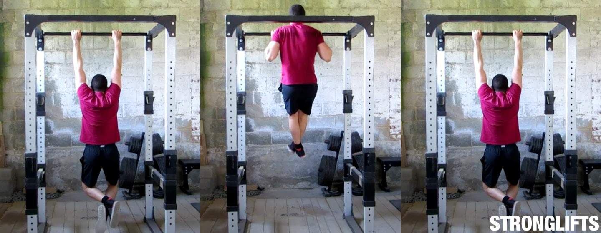
_Cum se face tractiuni: stati atarnati pe bara cu bratele drepte.Trageti pana cand barbia va trece de bara._

Iata cum puteti face tractiuni(pull-ups) cu o forma adecvata:

1.  Prindeti bara de tractiune cu palmele in jos (prindere la nivelul umerilor)
2.  Agatati-va de bara de tractiune cu bratele drepte si picioarele dezlipite de pe podea
3.  Trageti-va in sus tragand coatele in jos
4.  Trageti pana cand barbia trece de bara
5.  Coborati pana cand bratele sunt drepte

Tractiunile(pull-ups) sunt un exercitiu compus al corpului superior. Spatele si bratele iti trag corpul in sus, in timp ce abs-urile impiedica arcuirea spatelui inferior. Va puteti accentua bratele prinzand bara cu palmele orientate in sus. Acestea sunt Chinup-uri si sunt eficiente pentru dezvoltarea muschilor bratelor.
Daca nu puteti face nici macar o tractiune(Pullup), incercati Chinups. Prindeti bara cu palmele orientate in sus, acest lucru este mai usor. Daca nu puteti face niciun chinup, faceti repetari negative. Sari peste bara si coboara incet. Puteti utiliza, de asemenea, o banda de rezistenta sau un spotter pentru a va ajuta la urcare. Dar nu folositi aparate.

Tractiuni(pull-ups) nu fac parte din StrongLifts 5 × 5 in mod implicit. Nu aveti nevoie de ele pentru a obtine rezultate. Unii oameni doresc sa-si sublinieze bratele si au timp pentru o munca suplimentara. Daca da, adaugati Chinups la sfarsitul antrenamentului B. Dar ramai concentrat pe cresterea genuflexiunilor (Squats) tale. Conteaza cel mai mult pentru obtinerea unor rezultate.

Acesta este ghidul definitiv pentru o forma corecta a tractiunilor(pull-ups). De asemenea, prezinta variatii, precum Chinups.

Cuprins

   <ul class="contents-ul">
      <li style="list-style:none;">
         <a style="font-size:16px;" href="#introducere"> 1 Introducere</a>
         <ul style="list-style:none; margin-top:0; margin-bottom:0;">
            <li style="list-style:none; margin-bottom:0;"><a style="font-size:16px;" href="#cum-sa-faci-tractiuni">1.1 Cum se fac tractiunile (pull-ups)</a></li>
            <li style="list-style:none; margin-bottom:0;"><a style="font-size:16px;" href="#tractiuni-ghid"> 1.2 Tractiuni (pull-ups) 101</a></li>
            <li style="list-style:none; margin-bottom:0;"><a style="font-size:16px;" href="#muschii-lucrati"> 1.3 Muschii lucrati</a></li>
            <li style="list-style:none; margin-bottom:0;"><a style="font-size:16px;" href="#pullups-vs-chinups"> 1.4 Pullups vs Chinups 2. Tehnica de tragere</a></li>
         </ul>
      </li>
      <li style="list-style:none;">
         <a style="font-size:16px;" href="#technica-tractiuni"> 2 Tehnica tractiunii</a>
         <ul style="list-style:none; margin-top:0; margin-bottom:0;">
            <li style="list-style:none; margin-bottom:0;"><a style="font-size:16px;" href="#priza">2.1 Priza</a></li>
            <li style="list-style:none; margin-bottom:0;"><a style="font-size:16px;" href="#latimea-prizei"> 2.2 Latimea prizei</a></li>
            <li style="list-style:none; margin-bottom:0;"><a style="font-size:16px;" href="#coate"> 2.3 Cot</a></li>
            <li style="list-style:none; margin-bottom:0;"><a style="font-size:16px;" href="#piept"> 2.4 Piept</a></li>
            <li style="list-style:none; margin-bottom:0;"><a style="font-size:16px;" href="#umeri"> 2.5 Umeri</a></li>
            <li style="list-style:none; margin-bottom:0;"><a style="font-size:16px;" href="#cap"> 2.6 Cap</a></li>
            <li style="list-style:none; margin-bottom:0;"><a style="font-size:16px;" href="#partea-inferioara-a-spatelui"> 2.7 Partea inferioara a spatelui</a></li>
            <li style="list-style:none; margin-bottom:0;"><a style="font-size:16px;" href="#picioare"> 2.8 Picioare</a></li>
            <li style="list-style:none; margin-bottom:0;"><a style="font-size:16px;" href="#partea-de-jos"> 2.9 Partea de jos(Bottom)</a></li>
            <li style="list-style:none; margin-bottom:0;"><a style="font-size:16px;" href="#ridicarea"> 2.10 Tragerea</a></li>
            <li style="list-style:none; margin-bottom:0;"><a style="font-size:16px;" href="#varful(top)"> 2.11 Varful(Top)</a></li>
            <li style="list-style:none; margin-bottom:0;"><a style="font-size:16px;" href="#coborarea"> 2.12 Coborarea</a></li>
            <li style="list-style:none; margin-bottom:0;"><a style="font-size:16px;" href="#respiratia"> 2.13 Respiratia </a></li>
         </ul>
      </li>
      <li style="list-style:none;">
         <a style="font-size:16px;" href="#problume-comune"> 3 Probleme comune</a>
         <ul style="list-style:none; margin-top:0; margin-bottom:0;">
            <li style="list-style:none; margin-bottom:0;"><a style="font-size:16px;" href="#a-trisa">3.1 A trisa(Cheating)</a></li>
            <li style="list-style:none; margin-bottom:0;"><a style="font-size:16px;" href="#nu-pot-face-nicio-tractiune(pull-ups)"> 3.2 Nu pot face o singura tractiuni (pull-ups) </a></li>
            <li style="list-style:none; margin-bottom:0;"><a style="font-size:16px;" href="#prea-greu(gras)-pentru-tractiuni"> 3.3 Prea greu pentru tractiuni</a></li>
         </ul>
      </li>
      <li style="list-style:none;">
         <a style="font-size:16px;" href="#variatii-de-tractiuni(pull-ups)">4 Variatii</a>
         <ul style="list-style:none; margin-top:0; margin-bottom:0;">
            <li style="list-style:none; margin-bottom:0;"><a style="font-size:16px;" href="#chinups">4.1 Chinups</a></li>
            <li style="list-style:none; margin-bottom:0;"><a style="font-size:16px;" href="#pullups-chinups-cu-greutati"> 4.2 Pullups / Chinups cu greutati</a></li>
            <li style="list-style:none; margin-bottom:0;"><a style="font-size:16px;" href="#assisted-pullup-machine"> 4.3 Assisted Pullup Machine</a></li>
            <li style="list-style:none; margin-bottom:0;"><a style="font-size:16px;" href="#lat-pulldowns"> 4.4 Lat Pulldowns</a></li>
         </ul>
      </li>
   </ul>

## Introducere

## Cum sa faci tractiuni (pull-ups)

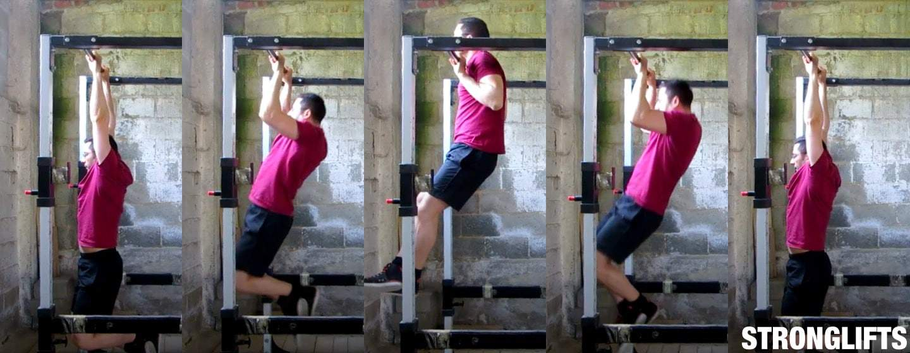
_Tineti-va de bara cu bratele drepte, trageti-va in sus pana cand barbia va va trece de bara._

Agatati-va de bara pentru tractiuni (pull-ups) a Power Rack-ului dvs. pentru a face tractiuni (pull-ups). Daca nu are acest tip de bara, ridicati pozitiile verticale ale Power Rack sau Squat Rack cat mai sus. Apoi puneti bara in montanti(uprights) si agatati-o pentru a face tractiuni (pull-ups). Daca nu aveti Power Rack, obtineti o bara tractiuni (pull-ups) pentru usi(doorway pullup bar). Dupa ce aveti o bara de care sa va agatati, urmati acesti cinci pasi simpli pentru a face tractiuni(pull-ups) cu o forma adecvata.

- **Prinde bara**. Priza trebuie sa fie egala cu latimea umerilor. Priza trebuie sa fie deplina cu palmele in jos.
- **Stai atarnat**. Ridicati-va picioarele de pe podea indoindu-va genunchii. Bratele trebuie sa fie drepte.
- **Trage**. Trageti-va in sus tragand coatele in jos. Tine-ti coatele aproape.
- **Treceti de bara**. Trageti-va pana la capat pana cand barbia va trece de bara. Nu faceti jumatate de repetare.
- **Repeta**. Coborati pana jos, pana cand bratele sunt drepte. Respira. Fa tractiuni(pull-ups) din nou.

Daca iti lipseste puterea pentru a face macar o tractiune, fa repetari negative. Vei ajunge cu barbia peste bara, stand pe banca sau pe carligele de siguranta(safety pins) ale Power Rack. Coborati incet si apoi sariti din nou pentru urmatoarea repetare. De asemenea, puteti pune o banda de rezistenta in jurul piciorului pentru a va ajuta. Sau puteti ruga pe cineva sa va ajute tinandu-va picioarele. Dar nu folositi aparate speciale(Pullup machines). Cel mai bun mod de a deveni mai bun la tractiuni este sa faci tractiuni (pull-ups).

## Tractiuni(pull-ups) 101

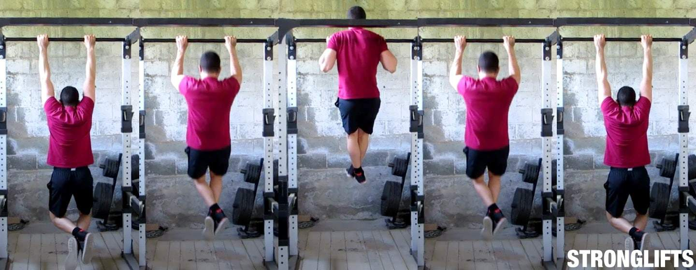
_Forma de tractiune corecta: bratele drepte in partea de jos(bottom), barbie peste bara in varf(top)._

Constructia dvs. determina distanta dintre maini(priza). Cu cat umerii sunt mai lati, cu atat priza ar trebui sa fie mai larga. Dar niciodata nu poate fi mai larga sau mai ingust decat latimea umerilor. Si fiecare repetare trebuie sa inceapa cu coatele blocate/fixate in partea de jos si sa se incheie cu barbia aflata peste bara, in partea de sus. Nu faceti jumatate din repetare, veti obtine jumatate din castiguri. Folositi o gama completa de miscare. Urmati aceste instructiuni pentru a face tractiuni(pull-ups) cu o forma corecta...

- **Prinderea**. Priza/prinderea completa. Palmele in jos. Tineti bara sus, aproape de degete.
- **Latime prinderii/prizei**. Mainile tale ar trebui sa fie la o distanta egala cu latimea umerilor.Nu prindeti prea larg(distanta dintre maine prea mare).
- **Coatele**. Pastrati-le la 45 ° ca atunci cand faceti [Presa deasuprea capului cu bara(Overhead Press)](/exercitii/umeri/presa-deasupra-capului). Nu va lasati coatele in afara.
- **Pieptul**. Ridica-ti pieptul. Conduce cu el in urcare. Incercati sa atingeti bara cu pieptul.
- **Umerii**. Tine-i in spate/inapoi. Nu ii tine inainte. Nu va incordati omoplatele.
- **Cap**. Pastrati-l neutru. Priviti inainte. Nu te uita la bara. Nu o atinge cu capul.
- **Partea inferioara a spatelui**. Aceasta ramane neutra. Trebuie sa se creeze o linie dreapta de la umeri pana la genunchi. Nu va arcuiti partea inferioara a spatelui.
- **Picioare**. Indoiti genunchii pentru a va ridica picioarele de podea. Incruciseaza-ti picioarele si contractati-va muschii fesieri.
- **Pozitia initiala, cea de jos**. Atarnati cu bratele drepte si coatele blocate/fixe. Ridica umerii spre tavan, in sus.
- **Ridicarea**. Trageti-va in sus, tragand coatele in jos si spre podea. Conduce cu pieptul.
- **Varful**. Trageti pana cand barbia este peste bara. Tine-ti capul neutru . Nu-l ridicati capul, pentru a trece de bara.
- **Coborarea**. Coborati pana jos, pana cand bratele sunt drepte.
- **Respiratia**. Respirati in partea de jos, tineti-va respiratia in partea de sus, expirati / inspirati in partea de jos.

## Muschii antrenati

Tractiunile(pull-ups) sunt in mare parte un exercitiu pentru partea superioara a spatelui si brate, precum [Ramat cu haltera(Barbell Row)](/exercitii/spate/ramat-cu-bara). Dar va antreneaza altfel spatele. Tractiunile(pull-ups) sunt o miscare verticala ca [Presa deasuprea capului cu bara(Overhead Press)](/exercitii/umeri/presa-deasupra-capului). Barbell Rows este o miscare orizontala precum [Bench Press(Impinsul cu haltera de la piept)](/exercitii/bench-press). Tractiunile(pull-ups) antreneaza mai putin muschi decat Barbell Rows, deoarece picioarele si soldurile nu fac altceva decat sa atarne.
Tractiunile (pull-ups) sunt, asadar, mai putin potrivite pentru tot corpul si mai mult focalizate pe partea superioara. Iata muschii pe care acestea ii lucreaza…

- **Spatele superior**. “Latissimus dorsi”, numiti si “Lats” sau dorsul mare, trage bratele superioare in jos pentru a se te ridica pe tine. Muschiul dorsal mare este cel mai mare muschi al spatelui care creeaza un aspect „in forma de v”. Tractiunile(pull-ups) iti lucreaza trapezul, umerii din spate si diversi muschi mici din partea superioara a spatelui.
- **Bratele**. Bicepsul iti indoaie coatele pentru a te ridica. Bicepsul tau lucreaza cel mai mult atunci cand faci Chinups cu palmele in sus. Muschii de la antebrate lucreaza, de asemenea, pentru a va indoi cotul si pentru a va tine de bara. Tricepsul iti trage coatele inapoi spre trunchi.
- **Abdomenul**. Muschii abdominal impiedica spatele inferior sa se arcuiasca in timp ce faci tractiuni. Ei mentin o linie dreapta: de la umeri pana la genunchi. Acest lucru lucreaza muschiul „6 pack” care iti trece peste burta, rectus abdominus. Mancati corect si vor aparea.

Puteti adauga tractiuni(pull-ups) ca exercitiu de izolare la StrongLifts 5 × 5. Pentru mai multe informatii, cititi aici.

## Tractiunile(pull-ups) vs Chinups

Tractiunile(pull-ups) vs Chinups: cu mainile in sus, lucreaza mai mult bicepsul.

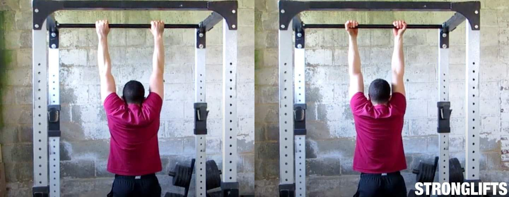
_Tractiunile(pull-ups) si Chinups lucreaza aceeasi muschi._

Insa diferenta de priza schimba propotia de “munca” a fiecarui muschi. Chinup-urile cu palmele in sus iti lucreaza mai mult bicepsul. Tractiunile (pull-ups) cu palmele in jos iti lucreaza mai mult spatele. Chinup-urile sunt mai usoare decat tractiunile (pull-ups), deoarece puteti utiliza mai multe bratele. Daca nu puteti face nici macar o repetare, incercati Chinups - este posibil sa puteti face o repetare. Daca doriti brate mai mari, faceti Chinups in loc de tractiuni (pull-ups).

Chinups este mai bun decat Biceps Curl pentru a construi brate mai mari. Chinup-urile te obliga sa ridici mai multa greutate. Te obliga sa-ti ridici propria greutate corporala. Un tip care cantareste 75 kg ca mine poate construi cu usurinta puterea daca face un Chinup. Pot face Chinup-uri cu o placa de 20 kg pentru multe repetari. In total 95 kg. Incercati sa faceti Biceps Curl cu 95 kg sau chiar 75 kg. Mai multa greutate este intotdeauna mai buna pentru a castiga muschi. Daca doriti brate mai mari, faceti Chinups in loc de Biceps Curl

Puteti adauga Chinups ca exercitiu de izolare la StrongLifts 5 × 5. Pentru mai multe informatii, cititi aici.

## Tehnica tractiuni

## Prinderea/Priza

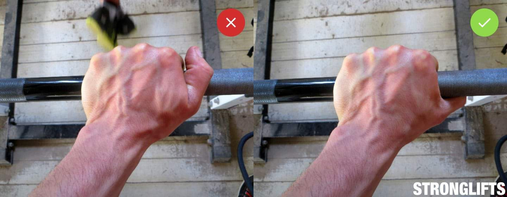
_Folositi o prindere completa pentru rezistenta maxima la tractiuni(pull-ups)._

Priza completa. Pune-ti degetele in jurul barei. Strangeti bara tare, astfel incat sa nu se poata misca si astfel nu puteti aluneca. Cu cat strangeti mai tare bara, cu atat bratele si umerile se contract mai mult. Cu cat se contracta mai tare, cu atat vei avea mai multa forta si cu atat mai usor devin tractiunile (pull-ups). Prinderea ce nu implica degetul mare va poate ajuta sa va simtiti mai bine exercitiul. Dar vei fi mai puternic cu prinderea completa, deoarece poti strange bara mai tare. Mergeti cu prindere deplina.

Grip The Bar Low. Tineti bara sus in maini, strangeti-va degetele. Bara trebuie sa se sprijine in topul calusurilor principale. Aceasta este aceeasi strangere pe care ar trebui sa o utilizati la [Indreptari(Deadlifts)](/exercitii/spate/indreptari)s. Bara va prinde mai putin din piele atunci cand o tineti aproape de degete. Acest lucru impiedica mainile sa se raneasca si reduce numarul de calusuri obtinute de la tractiuni(pull-ups). Nu strangeti bara cu mijlocul palmei. Tine-o mai sus, intre palma si degete.

Double Overhand. Tineti bara cu palmele orientate in sus pentru tractiuni (pull-ups). Aceasta este prinderea in jos care vizeaza partea superioara a spatelui si a dorsului mare. De asemenea, puteti strange bara cu palmele in jos si faceti Chinups. Aceasta priza cu palmele in sus iti lucreaza partea superioara a spatelui si ataca si muschii, dar iti foloseste mai mult bicepsul. Daca doriti sa va accentuati bratele sau nu puteti face o singura repetare, faceti Chinups. Sunt mai usoare. In caz contrar, continuati cu tractiunile(pull-ups).

## Latimea pizei

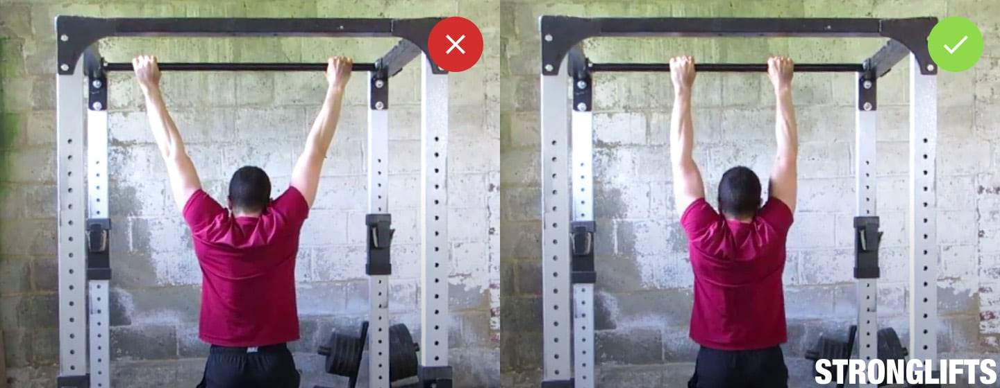
_Prindeti bara astfel incat distanta dintre maini sa fie egala cu latime cu umerii cand faceti tractiuni(pull-ups)._

- **Prindere ingusta**. Distanta dintre maine trebuie sa fie egala cu latimea umerilor cand faceti tractiuni (pull-ups) sau Chinups. Mainile tale ar trebui sa fie chiar in afara umerilor cand barbia trece de bara, in varf. Inseamna ca latimea dvs. de prindere pentru tractiuni(pull-ups) ar trebui sa fie aceeasi ca atunci cand faceti [Presa deasuprea capului cu bara(Overhead Press)](/exercitii/umeri/presa-deasupra-capului). Latimea exacta a prizei depinde de latimea umerilor. Dar bratele ar trebui sa fie aproape de verticala atunci cand stai agatat de bara.

- **Fara prize largi**. Prinderea larga scurteaza raza de miscare. Iti usureaza tractiunile (pull-ups) pentru ca te tragi pe o distanta mai scurta. Dar, de asemenea, va poate face sa va suprasolicitati coatele si sa va raniti umerii. In plus, vrei sa iti lucrezi muschii printr-o gama completa de miscare, nu pe jumatate. Acest lucru va consolideaza dorsul mare(lats) si creste dimensiunea spatelui. O priza larga este inutila si neproductiva. Lucrati cu o prindere/priza ingusta si grea.

## Coate

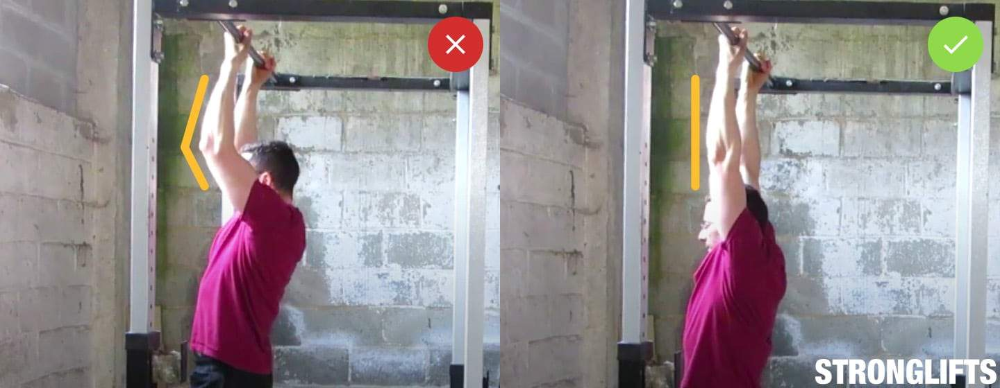
_Incepeti fiecare repetare cu coatele blocate pentru o dezvoltare maxima a bratului_

- **Blocati-va in partea de jos**. Incepeti fiecare repetare cu coatele blocate. Repetarea nu este valida daca bratele au inceput sa fie indoite in partea de jos. Bratele tale trebuie sa fie drepte inainte sa te ridici. Stati agatati pe bara cu coatele blocate/fixate. Coborati-va pana la capat intre repetari. Acest lucru va fi mai greu, deoarece drumul de miscare este mai lung. Dar nu este rau pentru articulatiile cotului, atat timp cat nu hiper-extindeti. Blocheaza usor coatele.

- **Coatele la 45 °**. Trageti-va in sus, impingand coatele in jos. Tine coatele aproape de trunchi. Coatele nu ar trebui sa fie flare si sa nu ajunga perpendicular pe trunchiul dvs. in partea de sus. Acestea ar trebui sa-ti atinga cutia toracica / muschiul dorsal mare, la aproximativ 45 °. Trebuie sa strangi bara ingusta, chiar in afara umerilor, pentru ca acest lucru sa functioneze. Daca o faceti corect, pozitia superioara a tractiunii(pull-ups) va arata ca pozitia de jos a [Presa deasuprea capului cu bara(Overhead Press)](/exercitii/umeri/presa-deasupra-capului).

## Pieptul

- **Condu cu pieptul**. Ridica-te, conducand cu pieptul. Incercati sa atingeti bara cu pieptul superior (clavicula). Nu va faceti griji daca nu puteti atinge bara cu pieptul. Atata timp cat barbia ta a trecut de bara, repetarea este buna. Scopul este de a evita umerii sa se duca inainte. Vrei sa ii tii inapoi pentru a nu-i rani. Trucul este de a duce cu tine pieptul pe drumul de urcare a tractiunii(pull-ups).

## Umerii

- **Tine-ti umerii in spate**. Nu lasati umerii sa se duca inainte in timpul tractiunii(pull-ups) sau Chinups. Rularea umerilor inainte poate duce la dureri de umar. Tine-ti umerii inapoi. Nu trebuie sa strangeti omoplatele pentru a face acest lucru. In schimb, trageti-va in sus, conducand cu pieptul. Acest lucru va va mentine umerii inapoi. Nu faceti tractiuni(pull-ups) cu o forma proasta doar pentru a obtine mai multe repetari. Fa bine, ca sa nu te doara.

## Cap

- **Uita-te in fata**. Nu te uita la tavan sau la bara. Nu priviti intr-o parte si nu va inclinati capul. Priveste in fata, in schimb. Mentineti-va capul pe linie cu trunchiul. In acest fel nu exista nicio perforare a discurilor spinale din gat. Este mai putin probabil sa faci dureri de gat din cauza tractiunilor (pull-ups). Uita-te la peretele din fata ta. Daca exista o oglinda, uita-te prin ea. Ar trebui sa ai o linie dreapta de la cap la sold atunci cand faci tractiuni (pull-ups) sau Chinups.

## Partea inferioara a spatelui

- **Arc natural**. Mentineti-va spatele inferior neutru. Nu ar trebui sa fie plat, dar nici arcuit. In schimb, ar trebui sa faci tractiuni (pull-ups) cu un arc natural in spatele inferior ca atunci cand stai. Nu-l lasati sa se arcuiasca sau o sa va perforati coloanele vertebrale si s-ar putea sa ai dureri de spate. Tineti-l neutru, tinandu-va cutia toracica in jos. Incordati-va abdomenul si indreptati-va picioarele pe drumul de urcare. Pastrati o linie dreapta de la umeri pana la genunchi.

## Picioare

Genunchii indoiti impotriva(vs) picioarelor drepte. Tractiunile(pull-ups)facute cu picioarele drepte sunt mai bune deoarece va puteti mentine spate neutru mai usor. Dar putine sali de sport au bare de ridicare inalte/ridicate. Cele mai multe Power Rack-uri sunt prea mici pentru a face Pullups cu picioarele drepte, fara ca picioarele sa atinga podeaua. Acesta este motivul pentru care fac tractiuni(pull-ups) cu genunchii indoiti. Cu toate acestea, las picioarele inferioare sa cada pe drum, pentru a-mi mentine spatele inferior neutru. Incearca.

## Partea de jos a tractiunii(Bottom)

_Bratele trebuie sa fie drepte in partea de jos a fiecarei tractiuni(pull-ups)._

- **Brate drepte**. Stati agatati cu bratele drepte si coatele blocare/fixe inainte de a va ridica pentru prima repriza. Lasa-ti spatele si muschiul dorsal sa se intinde(stretching). Ridicati din umeri catre tavan. Respirati puternic, mentineti-va respiratia si trageti-va in sus, conducand coatele in jos. Apoi coborati pana la capat pana cand bratele sunt din nou drepte si blocate. Lasa totul sa se intinda. Nu incepeti nici o repetare cu coatele indoite. Asa trisezi.

## Ridicarea

Coatele in jos. Trageti-va in sus, ducandu-va coatele in jos. Tine-ti coatele la 45 ° in interior, nu in exterior. Tine-ti trunchiul aproape de bara. Cu cat este mai scurta distanta dintre maini si umeri, cu atat este mai usor sa ridici. Conduceti cu pieptul, ridicarea. Incercati sa atingeti bara cu pieptul superior. Este in regula, daca nu poti, atata timp cat barbia iti trece de bara, repetarea este corecta.

## Varful(Top)

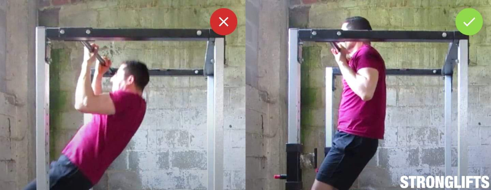
_Trageti barbia peste bara, in partea de sus a tractiunii(pull-ups). Jumatate de repetare nu conteaza._

- **Barbia peste bara**. Trageti-va pana la capat pana cand barbia va trece bara. Doar fruntea mai sus de bara nu conteaza. Nasul deasupra barei nu conteaza, de asemenea. Ambele scurteaza raza de miscare. Este ca si cum ai face o jumatate de genuflexiunie(Squat). Obtineti jumatate din rezultat, deoarece bratele nu au o contractie completa in partea de sus. Treci cu barbia peste bara, fara a-ti forta capul, sau fara sa-ti lungesti gatul. Daca nu o puteti face, utilizati o banda de rezistenta pentru a va ajuta.

## Coborarea

- **Blocheaza-ti coatele**. Coborati-va pana la capat, pana cand coatele sunt incuiate. Bratele tale trebuie sa fie drepte cand stai agatat intre repetari. Nu incepe niciodata urmatoarea repetare cu coatele indoite. Repetarea nu este corecta, validata, daca coatele nu au fost blocate, deoarece acest lucru scurteaza intervalul de miscare. Este ca si cum ai face o jumatate de genuflexiune(Squat). Mergeti pana la capat. Atata timp cat nu iti hiper-extindeti coatele, dar blocati usor, coatele vor fi in siguranta.

## Respiratie

- **Respirati in partea de jos**. Stati agatati de bara cu bratele drepte si picioarele dezlipite de pe podea. Respirati puternic, mentineti-o si trageti-va in sus. Du barbia peste bara. Apoi coborati pana jos, pana cand bratele sunt drepte. Expirati in partea de jos si lasati totul sa se intinda(stretch). Oferiti-va o secunda pentru a va aduna, apoi inspirati si trageti-va din nou in sus. Repetati pana cand setul dvs. s-a incheiat.

## Probleme comune

## Cheating(A trisa)

A trisa cand faci tractiuni(pull-ups) inseamna sa scurtezi intervalul de miscare facand jumatate de repetare. Fiecare repetare trebuie sa inceapa cu bratele drept, in partea de jos(bottom). Si fiecare repetare trebuie sa se termine cu barbia peste bara, in varf(top). Acest lucru lucreaza muschii spatelui si bratelor printr-o gama completa de miscare. Construieste cea mai mare cantitate de forta si muschi. Jumatatile de tractiuni(pull-ups) sunt mai usoare, asa cum sunt si jumatatile de genuflexiuni(Squats). Dar si de aceea sunt mai putin eficiente.

Primul mod de a face jumatate de repetare este pornind fiecare repetare cu coatele indoite. Acest lucru scurteaza intervalul de miscare. Iti micsoreaza efortul depus de muschii spatelui. Si construieste obiceiuri periculoase pentru [Indreptari(Deadlifts)](/exercitii/spate/indreptari), unde fiecare repetare trebuie sa inceapa cu coatele blocate pentru a evita ranile bicepsului. Coborati-va pana la capat:pana cand coatele sunt blocate/fixate. Lasa-ti spatele sa se intinda. Ridica din umeri. Apoi trageti-va in sus, de la o pozitie moarta.

Al doilea mod de a face jumatate de repetare este prin faptul ca nu reusesti sa-ti treci barbia peste bara. Fruntea sau nasul trecute de bara nu se pune. Ambele scurteaza intervalul de miscare in partea de sus. Scade din efortul muschilor bratului tau. Bicepsul dvs. nu se contracta complet. Nu va fi mai mare in acest fel. Ideal este sa iti iei pieptul superior (clavicula) in fata barei. Minimul este sa-ti treci barbia peste bara. Aceasta este forma de tractiune corespunzatoare.

Cealalta modalitate de a trisa la tractiuni(pull-ups) este folosirea soldurilor. Puteti crea impuls impulsionand soldurile si picioarele pe drumul de urcare. Aceste Kipping Pullup-uri va permit sa faceti mai multe repetari. Dar nu te vor face mai puternic decat tractiunile(pull-ups). Mai rau, lovitura poate distruge umerii slabi. Nu va balansati soldurile si nu trisati pentru a obtine mai multe repetari. Folositi o forma adecvata. Daca nu aveti puterea de a face tractiuni(pull-ups) cu o forma adecvata, urmati sfaturile de mai jos.

## Nu pot face nicio tractiune(pull-ups)

## Chinup negative

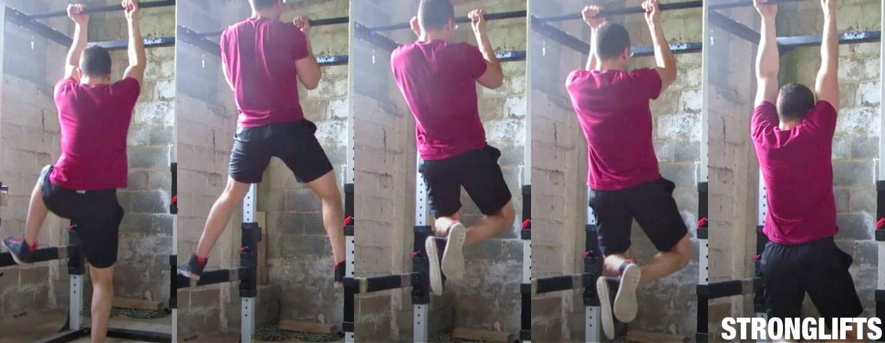
_Faceti exercitii negative daca nu puteti face nicio tractiune._

Tractiunile(pull-ups)sunt grele, deoarece te obliga sa-ti ridici greutatea corpului din prima zi. Exercitiile de tip Barbell precum genuflexiunile(Squats) sunt mai usor de urcat. Daca nu puteti face [Squat(Genuflexiuni cu haltera)](/exercitii/picioare/genuflexiuni-cu-haltera)) cu o greutate care sa fie egala cu greutatea corpului, eliminati pur si simplu placile din bara. In cel mai rau caz incepeti cu bara goala. Dar singura modalitate de a reduce rezistenta la exercitii de greutate corporala precum tractiunile(pull-ups) este sa slabesti. Acest lucru nu este practic. Deci, aveti nevoie de alte modalitati de a face tractiuni(pull-ups) mai usor.

Incercati mai intai Chinups daca nu puteti face nicio tractiune. Chinup-urile sunt mai usoare decat tractiunile(pull-ups), deoarece folosesc mai mult bratele. Prinde bara cu palmele indreptate spre tine si incearca sa te ridici. Daca nu o puteti face, este in regula, treceti la paragraful urmator. Daca o puteti face, ramaneti cu Chinups. Faceti trei seturi pentru cat mai multe repetari, cu o forma adecvata. Incercati sa faceti cu o repetare mai mult la fiecare antrenament. Cand puteti face cinci Chinup-uri, puteti face o singura tractiune( Pullup).

Daca nu puteti face un Chinup, faceti negative. Barbia trebuie sa fie peste bara, cand stai pe banca. Coborati-va incet pana cand bratele sunt drepte. Sari din nou pentru urmatoarea ta repetare. Toata lumea este mai puternica pe coborare (negativ), astfel incat sa puteti face acest lucru. Faceti trei seturi de repetari cat mai multe puteti, cu o forma adecvata. Dar nu exagerati sau veti face febra musculoasa. Cand puteti face 10 negative cu o forma buna, puteti face un singur Chinup.

Puteti utiliza, de asemenea, benzi pentru a va ridica. Cel mai simplu este sa rogi pe cineva sa-ti tina picioarele in timp ce faci tractiuni(pull-ups). Am facut acest lucru cand m-am inscris la sala in 1999, nu puteam sa fac nicio tractiune(Pullup). Partenerul meu de antrenament mi-a tinut picioarele in timp ce trageam. Pana la urma ma puteam trage in sus fara ajutorul lui. Trucul este sa faci singur cea mai mare parte a exercitiului. Nu te trage in sus impingandu-ti picioarele in mainile lui. Folositi-va muschii spatelui si bratului.

Daca nu ai pe nimeni sa te ajute, foloseste o banda de rezistenta. Buclati-o in jurul unui picior si a barei. Banda se va intinde cand te stati agatat de bara. Va va ajuta sa va trageti din partea de jos, cea mai grea pozitie. Spre deosebire de aparat(Assisted Pullup machine), banda nu va ajuta in partea de sus. Ajuta doar in partea de jos. Bratele tale trebuie sa faca cea mai mare parte a muncii pentru a-ti trece barbia peste bara. Si trebuie sa va echilibrati singuri, spre deosebire de o masina.

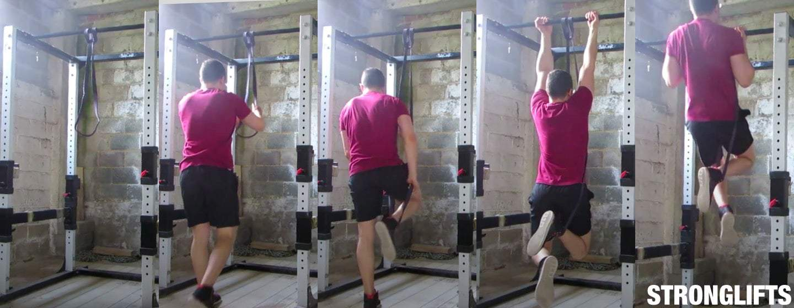
_Folositi o banda de rezistenta pentru a va ajuta pe urcare._

Benzile de rezistenta de care aveti nevoie pentru tractiuni(pull-ups) sunt de 1m / 41 ″ lungime si 4.5mm grosime. Latimea lor variaza, dar cu cat sunt mai largi, cu atat vei primi mai multa sustinere. Oamenii de dimensiuni medii ca mine (am 75 kg) au nevoie de mai putin ajutor. De obicei, suntem bine cu o banda de rezistenta medie. Baietii mai mari au nevoie de mai mult ajutor. Daca cantariti + 100kg / 220lb, aveti nevoie de o banda de rezistenta mare (sau una medie + mica). Iata cateva benzi de rezistenta pe care le recomand...

- **Benzi serioase de otel - albastru # 3 daca aveti o dimensiune medie, adaugati rosu # 2 daca sunteti mmai greu**
- **Benzi lemnoase de fier**
- **Draper’s Strength**
- **WODFitters**

Cel mai rapid mod de a deveni mai puternic cu tractiuni(pull-ups) este de a face tractiuni(pull-ups) zilnic. Cumparati-va doorway pullup bar pentru acasa. Am unul langa biroul unde lucrez. Fa o singura tractiune de fiecare data cand treci pe langa bara. Folositi o forma adecvata si stati departe de esec. Dupa cateva saptamani, veti putea face mai multe tractiuni(pull-ups) la rand. Pavel Tsatsouline numeste acest „Greasing The Groove”. Practica frecventa si specifica este cea mai rapida modalitate de a deveni mai buni la tractiuni(pull-ups).

## Prea greu(gras) pentru tractiuni(pull-ups)

Cu cat sunteti mai greu(aveti o greutate mai mare), cu atat va trebui sa ridicati mai multa greutate si cu atat mai greu va fi tractiunea(pull-ups). Acesta este motivul pentru care gimnastele sunt aproape intotdeauna mici. Mai mic inseamna de obicei o greutate mai mica a corpului. Acest lucru va ofera un avantaj in ceea ce priveste exercitiile de greutate corporala precum tractiunile, in care greutatea dvs. actioneaza ca rezistenta. Dar nu inseamna ca nu vei putea niciodata sa faci o tractiune(Pullup) daca esti mare. Va fi mai greu, sigur. Dar veti deveni mai puternici daca continuati antrenamentele.

Iata un videoclip al voinicului Jesse Marunde care face 21 de tractiuni(pull-ups) la o greutate corporala de 140 kg / 310lb. Forma lui nu este cea mai buna. Barbia lui nu trece de bara. El foloseste o prindere larga care reduce si mai mult raza de miscare. Si isi leagana soldurile pe drum. Dar vi-l arat, oricum, pentru ca baietii mari isi folosesc adesea greutatea ca scuza. Acest videoclip demonstreaza ca este posibil sa faceti tractiuni(pull-ups) chiar daca aveti o greutate mare.

Primul pas pentru a deveni mai puternic la tractiuni(pull-ups) este, prin urmare, sa incetati sa folositi greutatea dvs. o scuza. Urmatorul pas este sa nu mai evitati tractiunile(pull-ups). Nu asteptati pana cand ati pierdut in greutate. Nu faceti Lat Pulldowns si nu folositi Assisted Pullup Machine. Faceti tractiuni (pull-ups). Pentru ca cel mai rapid mod de a deveni mai puternic la tractiuni (pull-ups) este sa faci le faci. Daca nu puteti face niciuna, faceti negative sau utilizati o banda de rezistenta grea. Si obtineti o bara de tractiuni pentru usa (doorway pullup bar), astfel incat sa puteti face tractiuni(pull-ups) zilnic.

## Variatii de tractiuni(pull-ups)

## Chinups

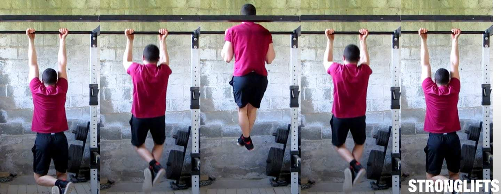
_Chinup-urile sunt trageri cu mainile orientate in sus, in loc de jos._

Chinup-urile sunt tractiunile(Pullups )care folosesc o prindere supinata(supineted grip). Strangeti bara cu palmele orientate in sus. Te tragi apoi in sus. Chinup-urile sunt mai usoare decat tractiunile(Pullus), deoarece folosesc mai mult bicepsul tau. Ei utilizeaza mai multi muschi. Daca nu puteti face nici macar o tractiune, incercati Chinups in schimb. Daca vrei brate mai mari, fa Chinups. Retineti ca chinupii iti lucreaza si muschii din spate. Foloseste doar mai mult biceps-ul.

Tehnica pe Chinups este aceeasi ca si pe tractiuni(pull-ups). Mainile tale trebuie sa fie la acelasi nivel cu umerii. O prindere mai larga scurteaza raza de miscare. De asemenea, va roteste bratele mai mult in afara. Acest lucru va streseaza incheieturile, coatele si umerii. Poate provoca dureri. Strangeti bara. Mainile tale ar trebui sa fie chiar in afara umerilor cand barbia iti trece de bara, in varf(top). Daca Chinups se simt inconfortabili pentru ca sunteti inflexibili, ramaneti cu tractiunile(pull-ups).

## Tractiuni(pull-ups) / Chinups cu greutati(Weighted Pullups/Chinups)

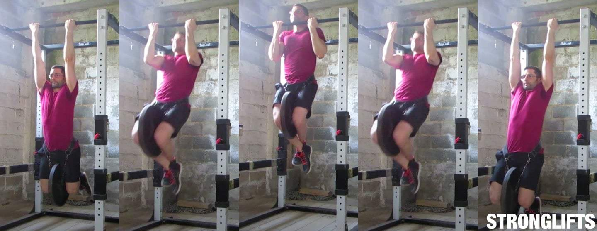
_Chinup-uri ponderate cu o placa de 20kg / 45lb._

Tractiunile ponderate sunt tractiuni(pull-ups) cu greutate suplimentara. Porti o centura cu un disc atarnat cu un lant, de talie. Te tragi apoi in sus. Odata ce puteti face mai multe 10 repetari cu o forma buna, greutatea suplimentara mentine provocarea de a face tractiuni. Facand tractiuni pentru mai multe repetari, iti cresti rezistenta, nu forta si muschi. Nu construiti picioare mari facand 50 de repetari de Air Squats. Adaugati greutate. La fel si pentru tractiuni(pull-ups): treceti la tractiuni ponderate (Weighted pull-ups).

Cea mai usoara modalitate de a adauga greutate pentru tractiuni(pull-ups) este folosirea unei curele. Aceasta este o centura cu un lant. Centura este prinsa in jurul taliei. Lantul intra in gaurile placilor/discurilor. Lantul este atasat de centura din jurul taliei, si atarna intre picioarele tale.

**Curea pentru Chinups**

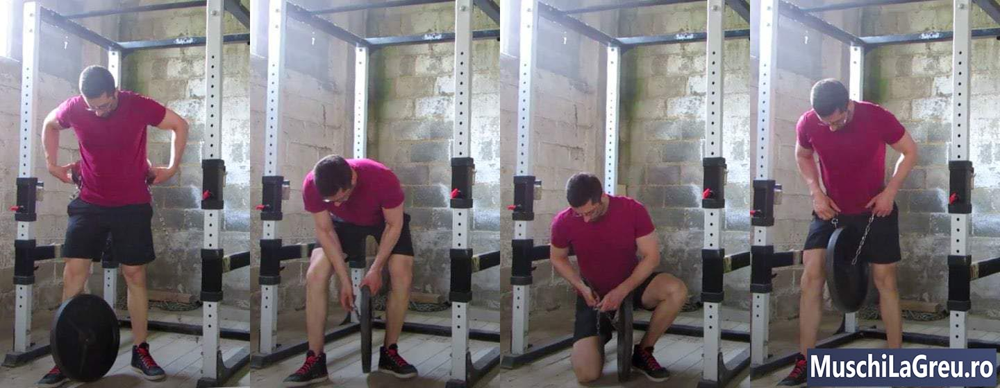
_Utilizati o curea speciala pentru a adauga greutate pe Chinups si Pullups._

Curele pentru tractiuni de calitate pot sustine cu usurinta 80kg / 150lb si mai mult. Nu recomand sa puneti un lant pe centura pe care o utilizati pentru [Squat(Genuflexiuni cu haltera)](/exercitii/picioare/genuflexiuni-cu-haltera) and [Indreptari(Deadlifts)](/exercitii/spate/indreptari)s, aceasta o va deteriora. Obtineti in schimb o curea speciala pentru tractiuni. Sugestii:

- **Curea Dip Polypro**
- **Curea Brute**
- **Curea Rogue Dip**

De asemenea, nu recomand sa tii o gantera intre picioare. Acest lucru functioneaza numai cu greutati usoare. Greutatea grea iti va cadea dintre picioare. Chiar daca o puteti tine, functioneaza doar daca bara de tractiune este ridicata, astfel incat picioarele dvs. nu ating podeaua. Nu puteti tine gantera intre picioare cu genunchii indoiti. Si nu puteti indrepta picioarele daca faceti tractiuni(pull-ups) intr-un Power Rack redus ca al meu. Acesta este motivul pentru care folosesc o curea speciala pentru tractiuni.

Treceti la tractiuni(pull-ups) ponderate odata ce puteti face 10 repetari cu o forma buna. Incepeti usor si adaugati greutate la fiecare antrenament. Tractiunile(pull-ups) folosesc muschi mici, asa cum o fac [Bench Press(Impinsul cu haltera de la piept)](/exercitii/bench-press) si Overhead. Adaugand 1kg / 2lb la fiecare antrenament lucreaza, prin urmare, mai mult decat 2,5 kg / 5lb. Imi place sa fac doua seturi de cinci Chinups ponderati la sfarsitul antrenamentului meu. Apoi, imi place sa continui cu un set de Chinups fara greutati pentru cat mai multe repetari.

## Assisted Pullup Machine

Aparatul pentru tractiuni este un aparat care va ajuta sa faceti tractiuni(pull-ups). Va pregatiti prinzand manerele asa cum prindeti bara la tractiuni(pull-ups). Va sprijiniti pe genunchi. Va trageti apoi in timp ce aparatul va ridica suportul pe care stau genunchi. Aparatul va ajuta sa va ridicati utilizand o greutate de contrabalansare. Cu cat veti seta greutatea mai mare, cu atat va ajuta sa va trageti mai sus.

Aparatul (Assisted Pullup Machine) nu este eficient pentru a deveni mai puternici la tractiuni(pull-ups). Pare o idee grozava, arata la fel, dar nu este. Problema principala este ca va aflati pe o platforma. Nu trebuie sa va echilibrati. Ca urmare, mai putini muschi lucreaza - abdomenul si spatele inferior nu fac nimic. Muschii care lucreaza, ca spatele si bratele, nu depun efort la fel de mult pentru ca stai pe o platforma. Nu aveti o intindere completa.

Nu va mirati daca progresia dvs. este o la tractiuni(pull-ups), in ciuda faptului ca voi continuati cu aparatul (Assisted Pullup Machine). Daca o faceti, va dura mai mult decat daca faceati tractiuni(pull-ups) din prima zi. Pentru ca cel mai rapid mod de a deveni mai puternic la tractiuni(pull-ups) este sa faci tractiuni (pull-ups). Nu te pricepi sa canti la chitara cantand la vioara. Exersezi la chitara. Nu conteaza daca sunt ambele instrumente cu coarde. Nu este la fel. Specificitatea conteaza.

Stai departe de aparate(Assisted Pullup Machine). Daca puteti face cel putin o tractiune(Pullup), “grease the groove”, si continuati. Obtineti o bara de tractiune pentru usa(doorway pullup bar) pentru acasa si faceti o tractiune de fiecare data cand treceti pe langa aceasta. Daca nu puteti face nicio repetare, faceti negative sau utilizati o banda de rezistenta. Banda de rezistenta va va ajuta doar in partea de jos, nu in partea de sus. Si te va forta sa te echilibrezi. Acest lucru va va face mai buni la tractiuni(pull-ups) mai repede decat folosind utilaje(Assisted Pullup Machine).

## Lat pulldown

Lat Pulldown este un exercitiu de aparat ca o tractiune(Pullup). Apucati bara de cablu ca si cum tineti bara la tractiune(pull-ups). Stai pe banca cu coapsele blocate sub suport. Apoi trageti bara de cablu catre partea superioara a pieptului indoind bratele. Lat Pulldown-urile sunt mai usoare decat tractiunile (pull-ups),deoarece puteti pune mai putina greutate decat greutatea dumneavoastra. Tractiunile(pull-ups) va obliga sa va ridicati greutatea corpului, care este adesea prea grea la inceput.

Dar Lat Pulldowns nu sunt la fel ca tractiunile(pull-ups). Corpul tau nu se misca. Doar bratele si greutatea o fac. Nu trebuie sa va echilibrati, stai pe o banca. Abdomenul si muschii de la nivelul spatelui inferior nu trebuie sa lucreze la fel de greu pentru a va mentine trunchiul neutru.Lat Pulldown-urile lucreaza bratele si muschii spatelui. Dar lucreaza mai putin muschii in general decat tractiunile(pull-ups), cu o greutate mai mica si fara a te obliga sa te echilibrezi.

Prin urmare, Lat Pulldown-urile sunt ineficiente pentru a ajunge mai puternici la Pullups. Arata la fel, dar nu sunt. Lat Pulldowns va va consolida musculatura spatelui si bratului. Dar nu te invata sa te echilibrezi pastrandu-ti trunchiul neutru. Tragand 75 kg pe un aparat Pulldown nu garanteaza ca puteti face o tractiune cu o greutate, tot de 75 kg. Trebuie sa faceti tractiuni(pull-ups) pentru a va imbunatati la acestea. Acesta este cel mai rapid mod.

Lat Pulldowns sunt, de asemenea, usor de inselat. Multi oameni se apleaca inapoi, in timp ce trageti bara de cablu in jos. Acest lucru va pune trunchiul intr-o pozitie mai orizontala. Modifica Lat Pulldowns de la o tractiune verticala la o tractiune mai orizontala, similara cu [Barbell Row(ramat cu haltera)](/exercitii/spate/ramat-cu-bara). Puteti trage mai multa greutate daca va sprijiniti in jos. Dar acest lucru va construi puteri false care nu se aplica si la tractiuni (pull-ups). Trunchiul trebuie sa ramana aproape de verticala atunci cand efectuati Lat Pulldowns.

Daca nu puteti face nicio tractiune(Pullup), incercati Chinups, faceti negative sau folositi o banda de rezistenta. Nu folositi aparatul Lat Pulldown. Daca o faci oricum, foloseste versiunea prin cablu. Nu folositi aparate cu parghie care echilibreaza rezistenta pentru dvs. si controleaza locul in care il trageti. Faceti acest lucru singuri, folosind aparatul in care bara era atarnata de un cablu. Si asigurati-va ca nu trisati si ca nu va inclinati inapoi, in partea de jos a fiecarei repetari. Pastreazati-va trunchiul vertical.
